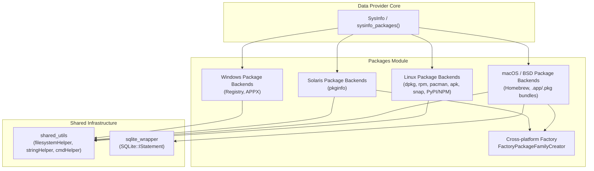
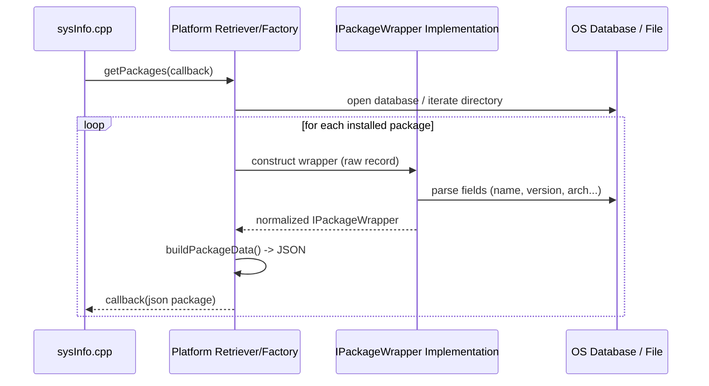

# Data Provider – Packages Module

## 1. Introduction & Purpose

The **Packages** module is a sub-component of the [System Information Data Provider (C++)](System_Information_Data_Provider_(C++).md) library used by Wazuh agents (via `sysinfo`/`SysInfo` and the Syscollector wodle) to enumerate every software package installed on a monitored host.

Its sole responsibility is: **given the underlying operating system, discover the list of installed packages and normalize their metadata (name, version, architecture, vendor, size, install time, etc.) into a common JSON schema** that is consumed by the rest of the data-provider (`sysInfo.cpp::sysinfo_packages`) and ultimately forwarded to the manager for inventory/vulnerability-detection purposes.

Because every operating system stores package metadata differently (Debian `dpkg` status files, RPM Berkeley/SQLite/rpmlib databases, Alpine `apk` flat files, Arch `pacman` libalpm databases, macOS `.app`/`.pkg` bundles and Homebrew cellars, Solaris `pkginfo` files, Windows Registry/APPX manifests, and language-specific package managers such as PyPI/NPM), this module is organized as a **set of platform-specific backends unified behind small factory/creator templates**, so that the calling code (`packageLinuxDataRetriever`, `packageFamilyDataAFactory`, etc.) can request packages without knowing which underlying format is being parsed.

## 2. Architecture Overview

## 3. Data Flow

## 4. Sub-modules

| Sub-module | Platforms Covered | Documentation |
|---|---|---|
| **Linux Package Backends** | dpkg (Debian/Ubuntu), rpm (legacy Berkeley DB & modern librpm), pacman (Arch), apk (Alpine), snap, plus language package managers (PyPI, NPM) | [data_provider_packages_linux.md](data_provider_packages_linux.md) |
| **macOS / BSD Package Backends** | Homebrew, native `.app`/`.pkg`/receipts bundles, cross-platform `FactoryPackageFamilyCreator` dispatch | [data_provider_packages_macos_bsd.md](data_provider_packages_macos_bsd.md) |
| **Windows Package Backends** | Classic installed programs (registry) and modern APPX/Store packages | [data_provider_packages_windows.md](data_provider_packages_windows.md) |
| **Solaris Package Backends** | SVR4 `pkginfo`-based packages | [data_provider_packages_solaris.md](data_provider_packages_solaris.md) |

## 5. Relationship to Other Modules

- **[data_provider_sysinfo_core](data_provider_sysinfo_core.md)** – The `sysInfo.cpp` translation unit invokes the platform-specific `getPackages()` entry points documented here and serializes the resulting JSON to the `sysinfo_packages` C API.
- **[data_provider_osinfo](data_provider_osinfo.md)** – Provides OS/distribution detection (`FactorySysOsParser`) that indirectly determines which Linux package backend(s) are relevant (e.g., detecting Debian vs. RHEL family).
- **[data_provider_network](data_provider_network.md)**, **[data_provider_hardware](data_provider_hardware.md)**, **[data_provider_ports](data_provider_ports.md)**, **[data_provider_groups](data_provider_groups.md)**, **[data_provider_users](data_provider_users.md)** – Sibling data-provider modules that follow the same factory/wrapper design pattern for other inventory categories (network interfaces, hardware, ports, groups, users).
- **[data_provider_wrappers_unix](data_provider_wrappers_unix.md)** / **[data_provider_wrappers_windows](data_provider_wrappers_windows.md)** – Low-level OS API wrappers (registry, passwd/group, utmpx) that some package backends reuse for filesystem and OS interaction.
- **[Shared_Modules_Infrastructure_(C++)](Shared_Modules_Infrastructure_(C++).md)** – Supplies generic C++ utilities (`shared_utils`, `sqlite_wrapper`) used across all package backends for string manipulation, filesystem access, and SQLite querying.
- **[inventory_harvester_module](inventory_harvester_module.md)** – Downstream consumer (via `PackageElement`) that ingests the normalized package JSON produced by this module for indexing into the Wazuh Indexer.

## 6. Common Design Pattern

All platform backends in this module share the same conceptual shape:

1. **`IPackageWrapper` implementation** — a small class that knows how to read *one* package record from a specific data source (Berkeley DB row, plist file, registry key, `pkginfo` file, etc.) and expose it through a uniform interface (`name()`, `version()`, `architecture()`, `vendor()`, `size()`, `install_time()`, ...).
2. **Retriever / Parser function** — a free function (e.g., `getDpkgInfo`, `getRpmInfo`, `getPacmanInfo`, `getApkInfo`) or class (`RpmPackageManager`, `BerkeleyRpmDBReader`) that iterates over the OS package database and, for each record found, instantiates the appropriate wrapper and invokes a `std::function<void(nlohmann::json&)>` callback with the normalized JSON.
3. **Factory template** — a compile-time or template-specialized factory (`FactoryPackageFamilyCreator<OSPlatformType>`, `FactoryPackagesCreator<LinuxType>`, `FactoryBSDPackage`, `FactorySolarisPackage`, `FactoryWindowsPackage`) that selects the correct retriever/wrapper combination for the running OS at compile time, throwing a runtime error for unsupported combinations.

This pattern keeps the OS-specific parsing logic isolated while presenting a single, predictable JSON package schema to `sysInfo.cpp` regardless of platform.
