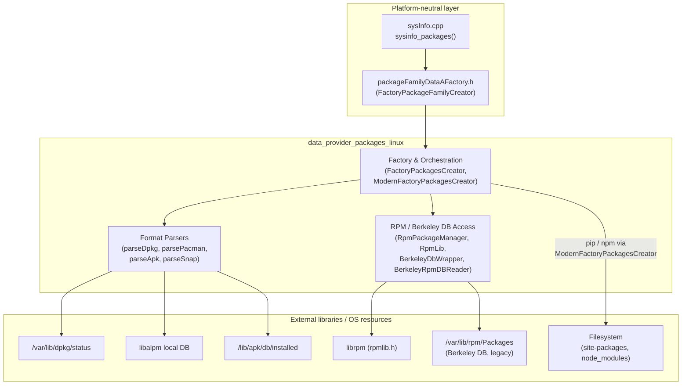
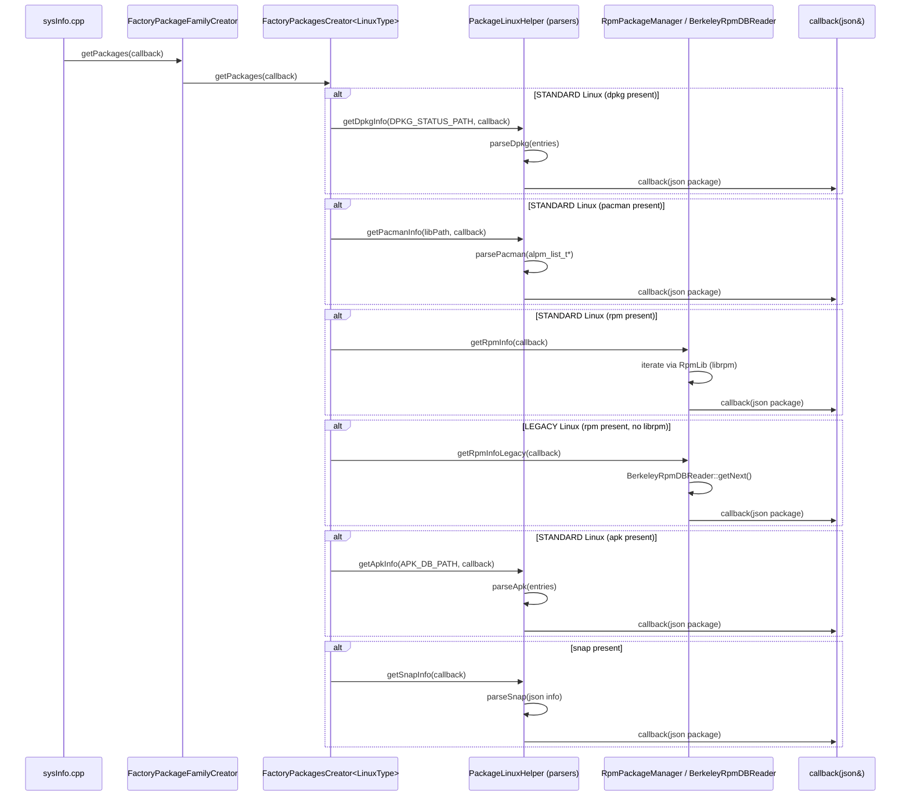

# Data Provider – Linux Packages Module

## 1. Purpose

The `data_provider_packages_linux` module is the Linux-specific implementation of Wazuh's **System Information Data
Provider** (`sysinfo`) package inventory subsystem. It is responsible for discovering every software package
installed on a Linux host — regardless of the underlying packaging technology — and normalizing the result into a
single, consistent JSON schema that the rest of Wazuh (FIM/Syscollector, the Vulnerability Scanner, and the
Inventory Harvester) can consume.

It supports the packaging ecosystems commonly found across Linux distributions:

| Ecosystem | Distros (typical) | Access mechanism |
|-----------|--------------------|-------------------|
| **dpkg**  | Debian, Ubuntu     | Plain-text `status` file parsing |
| **rpm**   | RHEL, CentOS, Fedora, SUSE | Modern: `librpm` C API. Legacy: raw Berkeley DB `Packages` file |
| **pacman**| Arch Linux         | `libalpm` C API |
| **apk**   | Alpine Linux       | Plain-text database file parsing |
| **snap**  | Universal (snapd)  | `snap` CLI / JSON output |
| **pip / npm** | Any distro (language package managers) | Filesystem scan of site-packages / node_modules (delegated to the "modern" cross-platform retriever) |

This module is a leaf component of the broader C++ **System Information Data Provider** and is invoked from the
platform-neutral package factory (`packageFamilyDataAFactory.h`) and ultimately from
`sysInfo.cpp::sysinfo_packages`, part of [data_provider_sysinfo_core](data_provider_sysinfo_core.md).

## 2. Architecture Overview

The module follows a **Strategy / Factory** pattern: a templated factory class selects, at compile time, which
concrete package-retrieval strategy to use based on whether the running Linux system is "standard" (fully
compatible, uses modern libraries) or "legacy" (older systems where only raw database access is reliable). Each
strategy, in turn, delegates to format-specific parser helpers to transform raw package-manager data into the
common `nlohmann::json` package representation used across all Wazuh data providers.

### Component/Sub-module Breakdown

| Sub-module | Responsibility | Documentation |
|------------|-----------------|----------------|
| **Factory & Orchestration** | Decides which package managers are present on the host and dispatches to the appropriate parser/reader; also handles cross-platform (pip/npm) discovery. | [data_provider_packages_linux_factory.md](data_provider_packages_linux_factory.md) |
| **Format Parsers** | Pure parsing logic that converts raw package-manager output (dpkg status blocks, pacman `alpm_pkg_t`, apk key/value records, snap JSON) into the unified JSON package schema. | [data_provider_packages_linux_parsers.md](data_provider_packages_linux_parsers.md) |
| **RPM / Berkeley DB Access** | Two alternative strategies for reading RPM package metadata: the modern `librpm` C API wrapper, and a hand-rolled Berkeley DB binary reader for legacy systems where `librpm` linkage is not viable. | [data_provider_packages_linux_rpmdb.md](data_provider_packages_linux_rpmdb.md) |

## 3. High-Level Data Flow

## 4. Key Design Points

- **Compile-time strategy selection (`LinuxType` template parameter).** `FactoryPackagesCreator<LinuxType::STANDARD>`
  and `FactoryPackagesCreator<LinuxType::LEGACY>` are template specializations chosen at build time depending on
  target compatibility, avoiding runtime branching overhead and allowing an explicit compile error
  (`throw std::runtime_error`) for any unspecialized/unsupported type.
- **Directory-existence probing.** Before invoking any specific parser, the factory checks
  (`Utils::existsDir(...)`) whether the corresponding package manager's directory (`DPKG_PATH`, `PACMAN_PATH`,
  `RPM_PATH`, `APK_PATH`, `SNAP_PATH`) is present on the filesystem — enabling multiple package managers to coexist
  on the same host (e.g., a Debian-based container with snap installed).
- **Streaming callback interface.** All retrieval functions accept a `std::function<void(nlohmann::json&)>`
  callback rather than returning a full container, letting callers stream/process packages one at a time and keeping
  memory usage bounded even on hosts with tens of thousands of packages.
- **Unified JSON package schema.** Regardless of source format, every parser fills a common set of fields: `name`,
  `version`, `architecture`, `size`, `vendor`, `description`, `source`, `type`, `path`, `category`,
  `multiarch`/`priority` (where applicable), and `installed` timestamp, using `UNKNOWN_VALUE` for unsupported fields.
- **Legacy RPM support without `librpm`.** For very old/minimal Linux systems, the module implements a **manual
  Berkeley DB reader** (`BerkeleyDbWrapper`, `BerkeleyRpmDBReader`) that parses the RPM header binary tag/value
  format directly from `/var/lib/rpm/Packages`, avoiding a hard dependency on `librpm` being available/linkable.
- **Python package deduplication.** Both dpkg and rpm sit in front of Python's own package metadata; this module
  additionally exposes `getRpmPythonPackages` / `getDpkgPythonPackages` (used by the "modern" pip/npm retriever) to
  avoid double-reporting Python packages found both by the OS package manager and by scanning `site-packages`.

## 5. Relationship to Other Modules

- **Parent/sibling packaging modules** — this module is one of several OS-specific implementations under the
  broader packages data-provider area, alongside macOS/BSD
  ([data_provider_packages_macos_bsd](data_provider_packages_macos_bsd.md)), Windows
  ([data_provider_packages_windows](data_provider_packages_windows.md)), and Solaris
  ([data_provider_packages_solaris](data_provider_packages_solaris.md)) equivalents. All are selected through the
  common `FactoryPackageFamilyCreator` (`packageFamilyDataAFactory.h`).
- **Core sysinfo entry point** — package data collected here flows into `sysInfo.cpp::sysinfo_packages`, part of
  [data_provider_sysinfo_core](data_provider_sysinfo_core.md), which is the public C API surface (`sysInfo.hpp`)
  consumed by the Syscollector Wazuh module and the `testtool` CLI
  ([data_provider_testtool](data_provider_testtool.md)).
- **Downstream consumers** — the normalized package JSON eventually reaches the **Inventory Harvester**
  (`PackageElement`, `InventoryPackageHarvester`) and the **Vulnerability Scanner**
  (`PackageData`, package/version matchers), which rely on the `name`, `version`, `architecture`, and `source`
  fields produced by this module.
- **Shared utilities** — parsing helpers rely on generic string/byte utilities (`stringHelper.h`,
  `byteArrayHelper.h`, `timeHelper.h`) documented under the Shared Modules Infrastructure (C++) wiki area
  (`shared_utils` / `common_helpers` sub-modules).

## 6. Sub-module Documentation

| File | Description |
|------|--------------|
| [data_provider_packages_linux_factory.md](data_provider_packages_linux_factory.md) | Factory/orchestration classes that detect installed package managers and dispatch retrieval, including the cross-platform pip/npm ("modern") retriever. |
| [data_provider_packages_linux_parsers.md](data_provider_packages_linux_parsers.md) | Parsing logic for dpkg, pacman, apk, and snap package metadata into the unified JSON schema. |
| [data_provider_packages_linux_rpmdb.md](data_provider_packages_linux_rpmdb.md) | RPM package retrieval via `librpm` (modern) and direct Berkeley DB parsing (legacy). |
