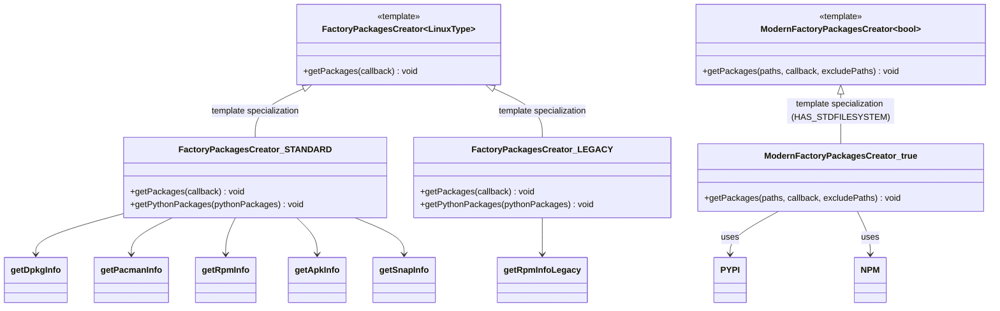
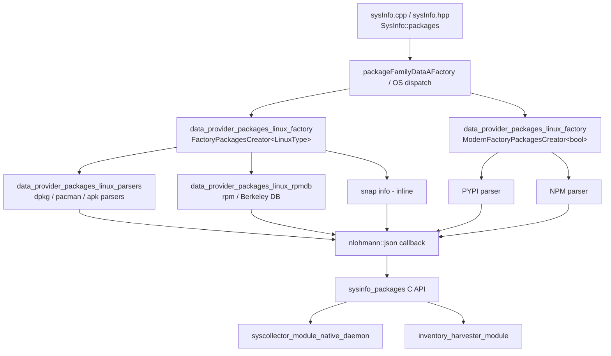
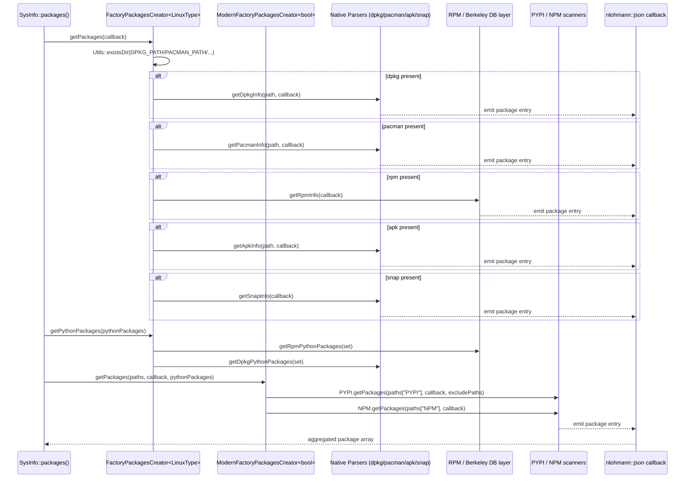
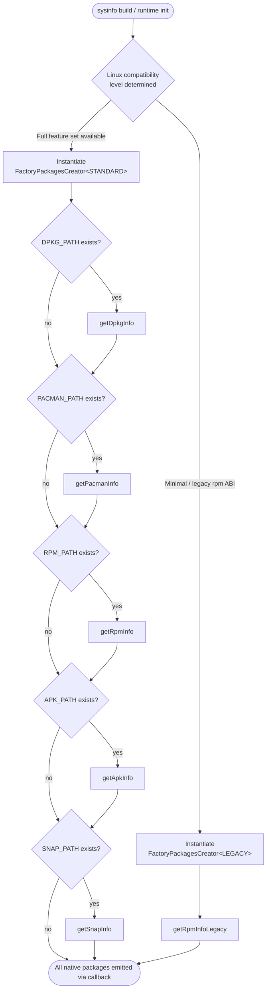

# Data Provider – Linux Package Factory

## Introduction

The **Linux Package Factory** module is the entry point used by Wazuh's System Information Data Provider (`sysinfo`) to discover every software package installed on a Linux host. It does **not** parse any package-manager format itself; instead it acts as a *compile-time dispatcher* that selects, at build time, which combination of package-manager back-ends (`dpkg`, `rpm`, `pacman`, `apk`, `snap`) and language-level package managers (`pip`/PyPI, `npm`) must be queried for a given Linux flavor, and forwards the aggregated results to the caller through a JSON-producing callback.

Two complementary factories live in this module:

| Factory | Header | Purpose |
|---|---|---|
| `FactoryPackagesCreator<LinuxType>` | `packageLinuxDataRetriever.h` | Selects OS-native package managers (dpkg/rpm/pacman/apk/snap) based on Linux compatibility level (`STANDARD` vs `LEGACY`). |
| `ModernFactoryPackagesCreator<bool>` | `modernPackageDataRetriever.hpp` | Selects language-ecosystem package managers (PyPI, NPM) when the build toolchain supports `std::filesystem`. |

Both factories use **C++ template specialization** rather than runtime virtual dispatch: the correct implementation is chosen by the compiler based on a template parameter, producing zero-overhead, compile-time-safe package retrieval logic tailored to the target platform.

This module is a child of [data_provider_packages_linux.md](data_provider_packages_linux.md) and works together with its sibling modules [data_provider_packages_linux_parsers.md](data_provider_packages_linux_parsers.md) (format-specific parsers: dpkg, pacman, apk) and [data_provider_packages_linux_rpmdb.md](data_provider_packages_linux_rpmdb.md) (RPM Berkeley-DB/rpmlib access). It is invoked by the platform-agnostic [data_provider_sysinfo_core.md](data_provider_sysinfo_core.md) layer, which is the C entry point (`sysinfo_packages`) exposed to the rest of Wazuh (e.g. the `syscollector` module, see [syscollector_module_native_daemon.md](syscollector_module_native_daemon.md) and [inventory_harvester_module.md](inventory_harvester_module.md)).

---

## Purpose and Core Functionality

* Provide a single, uniform call (`getPackages(...)`) that the rest of the data provider can invoke without knowing which package managers exist on the running system.
* Support two categories of Linux systems:
  * **STANDARD** – modern distributions where multiple native package managers may coexist (Debian/Ubuntu = dpkg, RHEL/Fedora/SUSE = rpm, Arch = pacman, Alpine = apk, plus universal **snap** packages).
  * **LEGACY** – older/minimal Linux systems where only a reduced RPM query path is guaranteed to work (`getRpmInfoLegacy`).
* Detect the presence of each package manager's database directory (`Utils::existsDir`) before attempting to query it, avoiding errors on systems where a given manager is not installed.
* Optionally enumerate **Python (PyPI)** and **Node.js (NPM)** packages discovered under arbitrary filesystem paths, independent of the OS-level package manager, via the "modern" factory.
* Aggregate results into a single JSON array through a `std::function<void(nlohmann::json&)>` callback pattern, decoupling package discovery from serialization/storage.

---

## Architecture

### Class / Template Relationship

Notes:
* `getDpkgInfo`, `getPacmanInfo`, `getApkInfo` are implemented in the sibling [data_provider_packages_linux_parsers.md](data_provider_packages_linux_parsers.md) module.
* `getRpmInfo` / `getRpmInfoLegacy` rely on the [data_provider_packages_linux_rpmdb.md](data_provider_packages_linux_rpmdb.md) module (Berkeley DB wrapper + `rpmlib`/`RpmPackageManager`).
* `PYPI` and `NPM` classes come from `packages/packagesPYPI.hpp` / `packages/packagesNPM.hpp` (compiled only when `HAS_STDFILESYSTEM` is true); a no-op stub is provided otherwise so the factory compiles uniformly on all toolchains.

### Module Position in the Data Provider

---

## Component Details

### `FactoryPackagesCreator<LinuxType>` (packageLinuxDataRetriever.h)

* **Primary (unspecialized) template**: throws `std::runtime_error` – acts as a compile-time guard preventing use of an undefined `LinuxType` value.
* **`FactoryPackagesCreator<LinuxType::STANDARD>`**:
  * `getPackages(callback)`: checks for the existence of `DPKG_PATH`, `PACMAN_PATH`, `RPM_PATH`, `APK_PATH`, `SNAP_PATH` directories and, for each one found, calls the corresponding parser (`getDpkgInfo`, `getPacmanInfo`, `getRpmInfo`, `getApkInfo`, `getSnapInfo`). Multiple package managers can be queried in the same run (e.g., a system with both Flatpak-style layouts and dpkg).
  * `getPythonPackages(pythonPackages)`: aggregates Python packages known to be installed via **dpkg** or **rpm** package databases (used to avoid double-counting packages during PyPI directory scanning; see `excludePaths` on the modern factory).
* **`FactoryPackagesCreator<LinuxType::LEGACY>`**:
  * `getPackages(callback)`: only queries RPM via the legacy code path (`getRpmInfoLegacy`), for systems where the full-featured RPM query would fail (e.g., older rpm library ABI).
  * `getPythonPackages(...)`: no-op (legacy systems are not expected to support Python package discovery through this path).

### `ModernFactoryPackagesCreator<bool>` (modernPackageDataRetriever.hpp)

* Template parameter is a compile-time boolean derived from `HAS_STDFILESYSTEM`.
* **Primary template (`false`)**: no-op — used when the compiler/standard library lacks `std::filesystem` support required by the PYPI/NPM scanners.
* **Specialization (`true`)**:
  * `getPackages(paths, callback, excludePaths)`: iterates over a `std::map<std::string, std::set<std::string>>` of scan roots keyed by ecosystem name (`"PYPI"`, `"NPM"`), delegating to `PYPI::getPackages()` and `NPM::getPackages()` respectively.
  * `excludePaths` allows the caller to skip directories already accounted for by native package managers (e.g., system Python packages already reported via `getRpmPythonPackages`/`getDpkgPythonPackages`), preventing duplicate inventory entries.
  * When `HAS_STDFILESYSTEM` is not defined, lightweight stub classes `PYPI`/`NPM` (declared inline in the header) satisfy the interface with empty implementations, so downstream code compiles unchanged.

---

## Data Flow

---

## Process Flow: LinuxType Selection

---

## Dependencies

| Dependency | Relationship |
|---|---|
| [data_provider_packages_linux_parsers.md](data_provider_packages_linux_parsers.md) | Provides the concrete `getDpkgInfo`, `getPacmanInfo`, `getApkInfo` (and APK helper `parseApk`) implementations invoked by `FactoryPackagesCreator<STANDARD>`. |
| [data_provider_packages_linux_rpmdb.md](data_provider_packages_linux_rpmdb.md) | Provides `getRpmInfo` / `getRpmInfoLegacy` / `getRpmPythonPackages`, backed by `BerkeleyDbWrapper`, `RpmPackageManager`, and `RpmLib`. |
| [data_provider_packages.md](data_provider_packages.md) (parent) | Cross-platform package factory abstraction (`FactoryPackageFamilyCreator`) that ultimately selects between Linux, macOS/BSD, Windows, and Solaris package factories. |
| [data_provider_sysinfo_core.md](data_provider_sysinfo_core.md) | Consumes this module's output through the platform-neutral `sysinfo_packages` C API (`sysInfo.cpp`). |
| `filesystemHelper.h` / `utilsWrapperLinux.hpp` (from [data_provider_wrappers_unix_linux.md](data_provider_wrappers_unix_linux.md), if documented) | Supplies `Utils::existsDir` used for package-manager presence detection. |
| `packagesPYPI.hpp` / `packagesNPM.hpp` | External (in-tree) scanners for language-level package ecosystems, gated by the `HAS_STDFILESYSTEM` build flag. |
| [syscollector_module_native_daemon.md](syscollector_module_native_daemon.md) / [inventory_harvester_module.md](inventory_harvester_module.md) | Downstream consumers that ingest the JSON package inventory produced through this factory chain for agent/manager inventory reporting. |

---

## Design Rationale

* **Compile-time dispatch over runtime polymorphism**: Because the set of package managers relevant to a given Linux build is typically known at compile/packaging time (or can be safely probed via filesystem checks), template specialization avoids virtual-call overhead and enables the compiler to eliminate code paths that can never execute on a given target (e.g., `LEGACY` builds never link `pacman`/`apk`/`snap` parsing code).
* **Defensive existence checks**: Rather than trying to open each package database directly and handling failures, the factory first verifies the presence of each package manager's known directory (`Utils::existsDir`), keeping the control flow simple and avoiding noisy error handling for package managers that are simply not installed.
* **Callback-based aggregation**: Using `std::function<void(nlohmann::json&)>` decouples this module from how the resulting JSON is stored, batched, or streamed — the same callback is reused across dpkg, rpm, pacman, apk, snap, PyPI, and NPM scanners.
* **Exclusion sets for de-duplication**: `getPythonPackages` (native) feeds into `excludePaths` for the modern PyPI scanner so that Python packages installed system-wide through `dpkg`/`rpm` are not reported twice (once as an OS package, once as a `pip`-discovered package).
