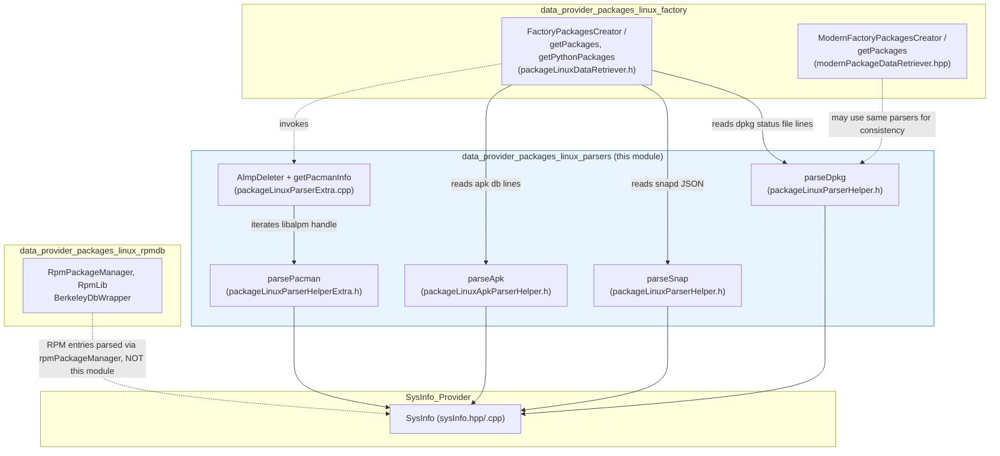
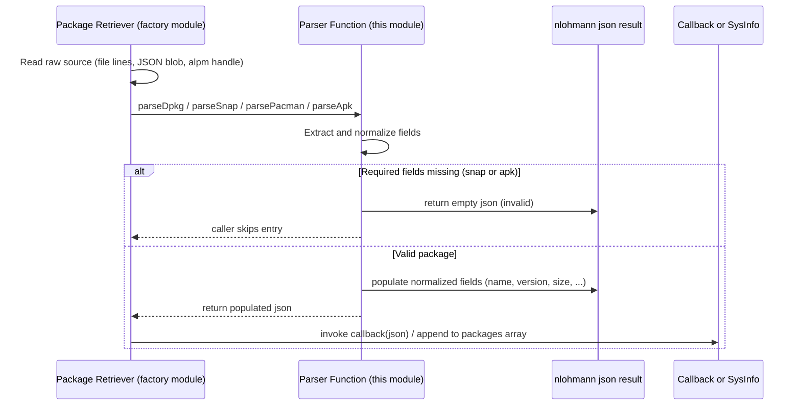
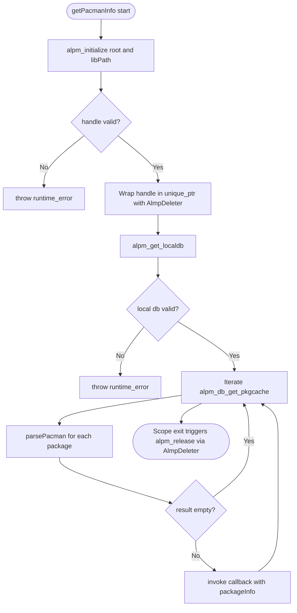

# Data Provider — Linux Package Parsers

## Introduction

The **`data_provider_packages_linux_parsers`** module is a focused collection of stateless, header-only (and one small `.cpp`) C++ helpers responsible for **parsing raw package-manager metadata on Linux systems into a normalized JSON representation**. It is a leaf component inside the broader [System_Information_Data_Provider_(C++)](System_Information_Data_Provider_(C++).md) subsystem, specifically nested under [data_provider_packages](data_provider_packages.md) → `data_provider_packages_linux`.

This module does **not** perform any file I/O, database access, or process execution itself. Instead, it receives already-extracted raw data (lines of text, key/value pairs, or native library structures) from the sibling modules [data_provider_packages_linux_factory](data_provider_packages_linux_factory.md) (which orchestrates package enumeration) and [data_provider_packages_linux_rpmdb](data_provider_packages_linux_rpmdb.md) (which reads the RPM Berkeley DB), and converts that raw data into a common `nlohmann::json` package object consumed by the rest of the [SysInfo_Provider](SysInfo_Provider.md) pipeline (`sysInfo.cpp` / `sysInfo.hpp`).

Because each Linux distribution family uses a different packaging format, this module provides one parser function per format:

| Packaging system | Distros | Parser function |
|---|---|---|
| Debian `dpkg`/`.deb` | Debian, Ubuntu, and derivatives | `parseDpkg` |
| Snap | Universal (snapd) | `parseSnap` |
| Arch `pacman`/`libalpm` | Arch Linux, Manjaro | `parsePacman` |
| Alpine `apk` | Alpine Linux | `parseApk` |

## Objectives & Responsibilities

1. **Normalize heterogeneous package metadata** from different Linux package managers into a single, consistent JSON schema (name, version, architecture, size, vendor, description, etc.) that the rest of the data provider (and ultimately Syscollector/Inventory Harvester) can consume uniformly.
2. **Isolate format-specific parsing logic** so that the retrieval/orchestration code (`packageLinuxDataRetriever.h`, `modernPackageDataRetriever.hpp`) stays agnostic of the on-disk/on-wire format details.
3. **Provide safe defaults** (`UNKNOWN_VALUE`) for fields that a given package manager does not expose, guaranteeing a stable output contract regardless of the source format.
4. **Manage native library resource lifetime** for `libalpm` (Arch Linux) via RAII (`AlmpDeleter`), preventing handle leaks when scanning the local package database.

## Core Components

### `parseDpkg` — `packageLinuxParserHelper.h`
Parses the plain-text stanza format used by `dpkg` (as read from `/var/lib/dpkg/status` or per-package `.list`/control files). Input is a vector of raw `"Key: Value"` lines belonging to a single package entry.

Key behavior:
- Splits each line on the first `:` and trims key/value into a `std::map<std::string, std::string>`.
- Filters packages by dpkg's tri-field `Status` line (`SELECTION_STATE FLAG PACKAGE_STATE`), only accepting entries whose flag/state indicate `ok installed`.
- Extracts and normalizes: `Package`→name, `Priority`, `Section`→category, `Installed-Size` (converted from KB to bytes), `Multi-Arch`, `Architecture`, `Source`, `Version`, `Maintainer` (split into vendor/email via `Utils::splitMaintainerField`), and `Description` (first line only).
- Emits `type: "deb"` and fills any missing field with `UNKNOWN_VALUE`.

### `parseSnap` — `packageLinuxParserHelper.h`
Parses the JSON output produced by querying the Snapd REST API/CLI for installed snaps.

Key behavior:
- Requires both `name` and `version` fields to be present and non-empty; otherwise returns an empty (invalid) JSON object, signaling the caller to skip the entry.
- Extracts publisher display name and splits it into vendor/email.
- Parses ISO-8601 `install-date` into the provider's canonical timestamp format (`YYYY/MM/DD HH:MM:SS`).
- Accepts `installed-size` as either a JSON number or numeric string, defaulting to `0` on parse failure.
- Emits `type: "snap"`, `source: "snapcraft"`, and a synthetic path of `/snap/<name>`.

### `parsePacman` — `packageLinuxParserHelperExtra.h`
Parses a native `alpm_pkg_t*` structure (from `libalpm`, the Arch Linux Package Manager library) linked via `alpm_list_t` iteration.

Key behavior:
- Uses direct `libalpm` C API calls (`alpm_pkg_get_name`, `_get_isize`, `_get_installdate`, `_get_groups`, `_get_version`, `_get_arch`, `_get_desc`) wrapped in a null-safety lambda (`alpmWrapper`).
- Concatenates multiple package groups into a single hyphen-joined `category` string.
- Converts the install timestamp using `Utils::getTimestamp`.
- Emits `type: "pacman"`, `vendor: "Arch Linux"`.

### `AlmpDeleter` — `packageLinuxParserExtra.cpp`
A small RAII functor (custom deleter) used with `std::unique_ptr<alpm_handle_t, AlmpDeleter>` to guarantee `alpm_release()` is always called on the ALPM library handle, even if an exception is thrown while iterating the local package database. This is used inside `getPacmanInfo()` (in the same `.cpp` file), which:
1. Initializes the ALPM handle rooted at `/`.
2. Retrieves the local package database (`alpm_get_localdb`).
3. Iterates every cached package (`alpm_db_get_pkgcache`) and invokes `PackageLinuxHelper::parsePacman` per entry, forwarding non-empty results to a caller-supplied callback.

### `parseApk` — `packageLinuxApkParserHelper.h`
Parses Alpine's `apk` package database format, which stores each package as a sequence of single-letter-prefixed lines (`P:name`, `V:version`, `A:arch`, `I:size`, `T:description`, etc.).

Key behavior:
- Uses a static field map `s_mapAlpineFields` associating each single-character APK field code with its expected C++ type (`std::string` or `int64_t`) and its target JSON key name.
- A local `loadData` lambda performs type-safe assignment, catching numeric conversion exceptions and defaulting to `0`.
- **Mandatory fields**: if `name` or `version` end up missing after processing all entries, the entire result is cleared (returns an empty/invalid object) — mirroring `parseSnap`'s validation contract.
- Emits `type: "apk"`, `vendor: "Alpine Linux"`.

## Architecture & Component Relationships

Note: RPM-based distros (`data_provider_packages_linux_rpmdb`) do **not** use these parser functions — RPM header fields are read and mapped directly via `BerkeleyHeaderEntry`/`RpmPackageManager`/`RpmLib`, producing JSON in their own module. This parsers module strictly covers dpkg, snap, pacman, and apk formats.

## Data Flow

## Process Flow: Pacman-specific Resource Management

## Output JSON Schema (Common Contract)

All parsers converge on producing a subset of the following normalized fields (values default to `UNKNOWN_VALUE` or `0` when not applicable to a given format):

| Field | Type | Description |
|---|---|---|
| `name` | string | Package name (required) |
| `version` | string | Package version (required for snap/apk) |
| `architecture` | string | Target architecture |
| `size` | int64 | Installed size in bytes |
| `vendor` | string | Vendor/publisher name |
| `description` | string | Short description |
| `category` | string | Section/group classification |
| `priority` | string | Package priority (dpkg-specific concept) |
| `multiarch` | string | Multi-arch qualifier (dpkg-specific) |
| `source` | string | Source package name / origin |
| `installed` | string | Installation timestamp |
| `path` | string | Install path or synthetic path (snap) |
| `type` | string | One of `"deb"`, `"snap"`, `"pacman"`, `"apk"` |

This shared schema allows downstream consumers — notably `sysinfo_packages` in [SysInfo_Provider](SysInfo_Provider.md) and the [inventory_harvester_module](inventory_harvester_module.md)'s `PackageElement`/`InventoryPackageHarvester` — to treat packages uniformly regardless of originating Linux distribution.

## Dependencies

- **Upstream (callers)**: [data_provider_packages_linux_factory](data_provider_packages_linux_factory.md) — `FactoryPackagesCreator::getPackages`/`getPythonPackages` and `ModernFactoryPackagesCreator::getPackages` invoke these parsers after reading raw package metadata (files, snapd API, apk db).
- **Sibling module**: [data_provider_packages_linux_rpmdb](data_provider_packages_linux_rpmdb.md) — handles RPM-based systems independently via Berkeley DB (`BerkeleyDbWrapper`, `RpmPackageManager`, `RpmLib`); does not depend on or share code with this module.
- **Shared utilities**: Relies on generic helpers from [data_provider_packages](data_provider_packages.md)'s shared headers (`sharedDefs.h` for `UNKNOWN_VALUE`), and cross-cutting utility headers such as `stringHelper.h` and `timeHelper.h` (also used broadly across [Shared_Modules_Infrastructure_(C++)](Shared_Modules_Infrastructure_(C++).md)'s `shared_utils`).
- **Downstream (consumers)**: [SysInfo_Provider](SysInfo_Provider.md) (`sysInfo.cpp::sysinfo_packages`) aggregates the JSON produced here into the final syscollector package inventory, which is eventually consumed by the [syscollector_module](syscollector_module.md) and [inventory_harvester_module](inventory_harvester_module.md).
- **External native libraries**: `libalpm` (Arch Linux package management library) for `parsePacman`/`AlmpDeleter`; no external library dependency for `parseDpkg`, `parseSnap`, or `parseApk` (pure text/JSON parsing).

## Design Notes & Rationale

- **Header-only design**: Except for the ALPM-specific `.cpp` (needed to isolate the C library `alpm.h`/`package.h` includes and their global state), all parsers are implemented as `static` functions in headers within the `PackageLinuxHelper` namespace. This keeps them lightweight, inlinable, and easy to unit test in isolation without linking against unrelated package manager libraries.
- **Fail-soft validation**: `parseSnap` and `parseApk` return an *empty* `nlohmann::json` object when mandatory fields (`name`, `version`) are absent, rather than throwing. This lets calling retrieval loops simply skip malformed/incomplete entries without interrupting the overall system information scan.
- **RAII for native handles**: The pacman parser is the only one interfacing with a C library requiring explicit resource cleanup (`alpm_release`), hence the dedicated `AlmpDeleter` — consistent with RAII patterns used elsewhere in the codebase (see the `smart_pointers_raii` group in [Shared_Modules_Infrastructure_(C++)](Shared_Modules_Infrastructure_(C++).md)).
- **No cross-format code sharing beyond `PackageLinuxHelper` namespace**: Each format has distinct semantics (e.g., dpkg's tri-state status field vs. snap's JSON metadata vs. pacman's native handle vs. apk's line-prefix encoding), so the module intentionally keeps parsers independent rather than forcing a shared base class, favoring simple free functions over inheritance.
