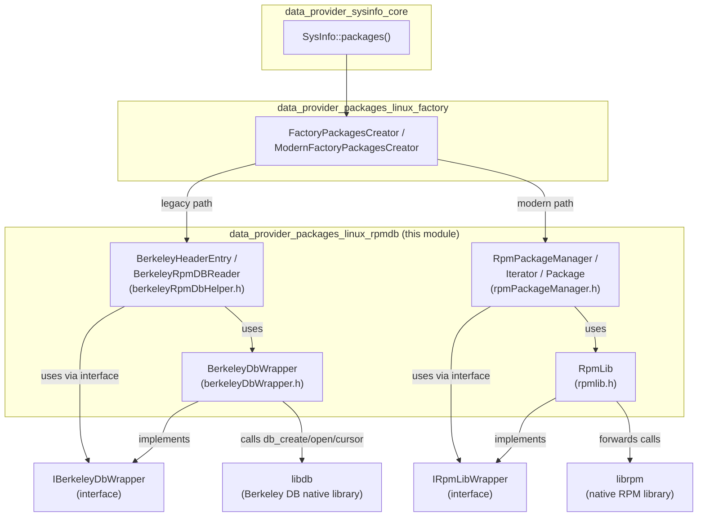
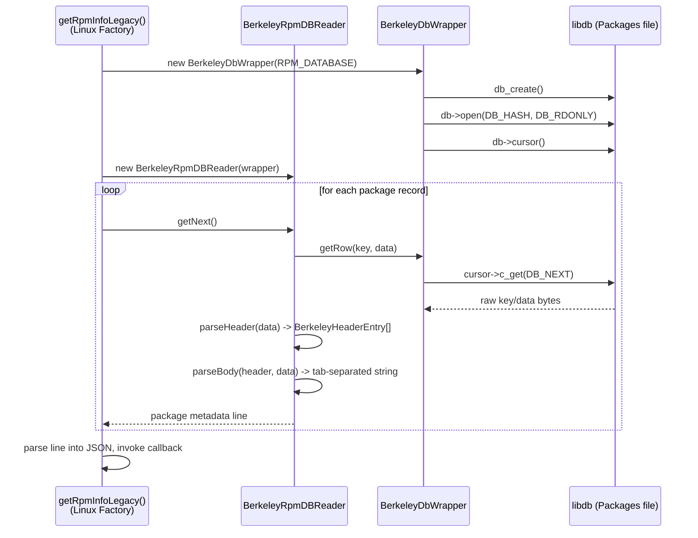
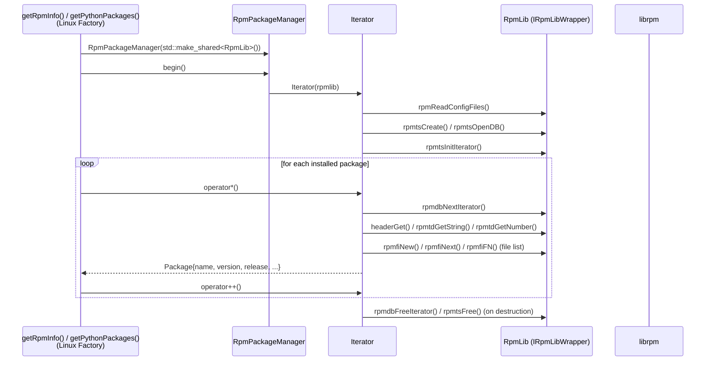
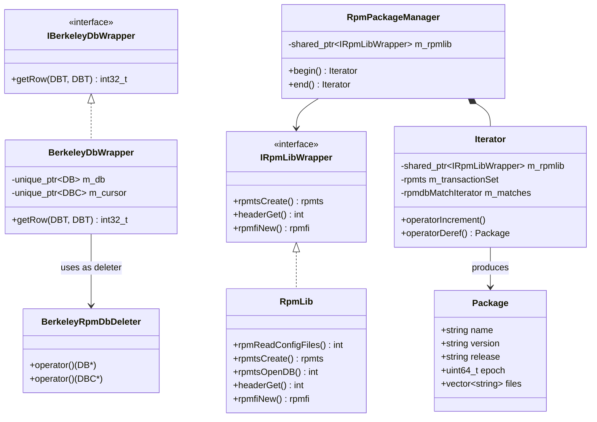
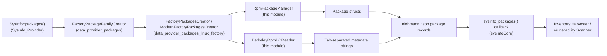

# Linux RPM Database Reader (`data_provider_packages_linux_rpmdb`)

## Introduction

This module provides **low-level, direct access to the legacy Berkeley DB-based RPM package database** (`/var/lib/rpm/Packages`) found on older RPM-based Linux distributions (e.g., CentOS 6/7, older RHEL). It is a specialized fallback mechanism used by the Wazuh System Information Data Provider (`SysInfo`) to enumerate installed packages on systems where the modern `librpm` shared library is unavailable, incompatible, or where direct database parsing is preferred for performance or compatibility reasons.

The module exposes two complementary strategies for reading RPM package data:

1. **Direct Berkeley DB parsing** (`BerkeleyDbWrapper`, `BerkeleyHeaderEntry` / `BerkeleyRpmDBReader`) — manually opens and walks the raw Berkeley DB `Packages` file, decoding RPM header/tag binary structures without depending on `librpm`.
2. **`librpm`-based iteration** (`RpmLib`, `RpmPackageManager`, `Iterator`, `Package`) — a thin, testable C++ wrapper around the official `librpm` C API, exposing an STL-like iterator over installed packages.

Both approaches feed into the higher-level Linux package retrieval pipeline (see [data_provider_packages_linux_factory.md](data_provider_packages_linux_factory.md)) which decides, at runtime, which strategy to use.

---

## Purpose and Core Functionality

| Component | File | Responsibility |
|---|---|---|
| `BerkeleyDbWrapper` / `BerkeleyRpmDbDeleter` | `berkeleyDbWrapper.h` | RAII wrapper around the native Berkeley DB (`libdb`) `DB`/`DBC` handles; opens the RPM `Packages` file in read-only hash mode and exposes raw cursor-based row iteration (`getRow`). |
| `BerkeleyHeaderEntry` (+ `BerkeleyRpmDBReader`) | `berkeleyRpmDbHelper.h` | Parses the binary RPM header/tag format embedded in each Berkeley DB record, extracting package metadata (name, version, release, arch, size, vendor, etc.) and file lists (including Python-specific file detection for vulnerability scanning use cases). |
| `RpmLib` | `rpmlib.h` | Concrete implementation of the `IRpmLibWrapper` interface, forwarding every call directly to the real `librpm` C functions (`rpmtsCreate`, `rpmtsInitIterator`, `headerGet`, `rpmfiNew`, etc.). Enables dependency injection and unit testing without touching the real RPM database. |
| `RpmPackageManager` / `Iterator` / `Package` | `rpmPackageManager.h` | Provides a modern, STL-style (`begin()`/`end()`) iterable collection of `Package` structs, hiding all `librpm` transaction-set/iterator/header lifecycle management behind RAII-friendly C++ semantics. |

### Why two strategies?

- Some minimal/older RPM-based systems do not ship `librpm` shared libraries usable at runtime by the agent, or embedding/linking `librpm` is undesirable for portability. The **Berkeley DB direct-read path** is a dependency-free fallback that manually decodes the RPM header binary format.
- When `librpm` **is** available, the `RpmPackageManager`/`RpmLib` path is preferred since it is officially supported, less brittle to RPM database format changes, and provides richer/more accurate metadata (including file lists) via `rpmfi`.

---

## Architecture Overview

---

## Component Relationships and Data Flow

### 1. Legacy Berkeley DB Path

Key parsing logic in `BerkeleyRpmDBReader`:
- `parseHeader()` reads the binary RPM header block (index count + data size), validates bounds against `HEADER_TAGS_MAX`, then decodes each 16-byte (`ENTRY_SIZE`) tag entry (tag id, type, offset, count) using big-endian 32-bit integers (`Utils::toInt32BE`, from [Shared_Modules_Infrastructure_(C++)](Shared_Modules_Infrastructure_(C++).md)).
- `parseBody()` uses the decoded header entries to extract package fields (`TAG_PACKAGE_NAMES`: name, architecture, description, size, epoch, release, version, vendor, install_time, group), producing a tab-separated string consumed by the Linux package retriever.
- `parsePythonFilesBody()` / `getNextPythonFiles()` specifically extract file paths (`TAG_DIRINDEXES`, `TAG_BASENAMES`, `TAG_DIRNAMES`) for packages whose name starts with `python`, supporting Python package/module inventory used by vulnerability detection.

### 2. Modern `librpm` Path

`RpmPackageManager::Iterator` encapsulates the full `librpm` transaction lifecycle (`rpmts`, `rpmdbMatchIterator`, `rpmtd`, `Header`) as private members, releasing all native resources in its destructor — consumers only interact with the safe `Package` value type and range-for-compatible `begin()/end()`.

---

## Dependency Injection & Testability

Both strategies are designed around **interface-based dependency injection**:

This pattern (also used extensively across [System_Information_Data_Provider_(C++)](System_Information_Data_Provider_(C++).md) and [Syscheck___FIM_Daemon_(C_C++)](Syscheck___FIM_Daemon_(C_C++).md)) allows the unit test suite to mock `IRpmLibWrapper`/`IBerkeleyDbWrapper` and simulate arbitrary RPM database contents without a real system RPM database.

---

## Integration with the Wider System

- **Upstream caller**: [data_provider_packages_linux_factory](data_provider_packages_linux_factory.md) (`packageLinuxDataRetriever.h`, `modernPackageDataRetriever.hpp`) selects between the RPM DB reader in this module and other Linux package parsers (`dpkg`, `pacman`, `apk` — see [data_provider_packages_linux_parsers](data_provider_packages_linux_parsers.md)) based on which package manager/database is present on the host.
- **Downstream consumer**: Parsed package records feed into [data_provider_sysinfo_core](data_provider_sysinfo_core.md) (`sysInfo.cpp::sysinfo_packages`), which serializes results to JSON for the `syscollector` module and ultimately the [Inventory Harvester / Vulnerability Scanner](Advanced_Security_Modules_(C++_Inventory_&_Vulnerability).md) for asset/vulnerability correlation.
- **Shared utilities**: Byte-order conversion (`Utils::toInt32BE`) and other low-level helpers come from [Shared_Modules_Infrastructure_(C++)](Shared_Modules_Infrastructure_(C++).md) (`byteArrayHelper.h`).

---

## Key Design Notes

- **RAII resource management**: `BerkeleyRpmDbDeleter` and `RpmPackageManager::Iterator`'s destructor ensure native handles (`DB*`, `DBC*`, `rpmts`, `rpmdbMatchIterator`, `rpmtd`, `Header`) are always released, even on exceptions, avoiding resource/memory leaks in a long-running daemon (the Wazuh agent).
- **Big-endian binary parsing**: The Berkeley DB RPM header format stores all integers in big-endian order (`m_db->set_lorder(m_db.get(), 1234)` forces big-endian access), requiring explicit conversion via `Utils::toInt32BE` rather than relying on host byte order.
- **Bounds validation**: `parseHeader()` explicitly validates `indexSize` against `HEADER_TAGS_MAX` and cross-checks the estimated total header+data size against the actual `DBT` buffer size before parsing, guarding against malformed or corrupted RPM database records causing out-of-bounds reads.
- **Read-only access**: `BerkeleyDbWrapper` always opens the database with `DB_RDONLY`, ensuring the data provider never mutates the system's RPM package database.
- **Python package detection**: The Berkeley DB reader includes a specialized code path (`parsePythonFilesBody`/`getNextPythonFiles`) to identify installed Python interpreter file layouts, supporting the vulnerability scanner's need to enumerate Python modules for CVE matching.
- **Fallback selection logic**: In the higher-level factory (`packageLinuxDataRetriever.h::getPackages`), the presence of the RPM database directory (`Utils::existsDir(RPM_PATH)`) determines whether the legacy Berkeley DB reader path is invoked at all — on non-RPM systems (e.g., Debian-based), this module is simply not exercised.

## Related Modules

- [data_provider_packages_linux_factory.md](data_provider_packages_linux_factory.md) — orchestrates selection of this module vs. other Linux package retrieval strategies.
- [data_provider_packages_linux_parsers.md](data_provider_packages_linux_parsers.md) — sibling parsers for `dpkg`, `pacman`, and `apk` package databases.
- [data_provider_packages_macos_bsd.md](data_provider_packages_macos_bsd.md) / [data_provider_packages_windows.md](data_provider_packages_windows.md) / [data_provider_packages_solaris.md](data_provider_packages_solaris.md) — sibling platform-specific package family implementations.
- [data_provider_sysinfo_core.md](data_provider_sysinfo_core.md) — top-level `SysInfo` API that ultimately triggers package enumeration.
- [Shared_Modules_Infrastructure_(C++).md](Shared_Modules_Infrastructure_(C++).md) — shared low-level utilities (byte helpers, smart-pointer wrappers) used throughout this module.
- [System_Information_Data_Provider_(C++).md](System_Information_Data_Provider_(C++).md) — parent module tree containing this component.
