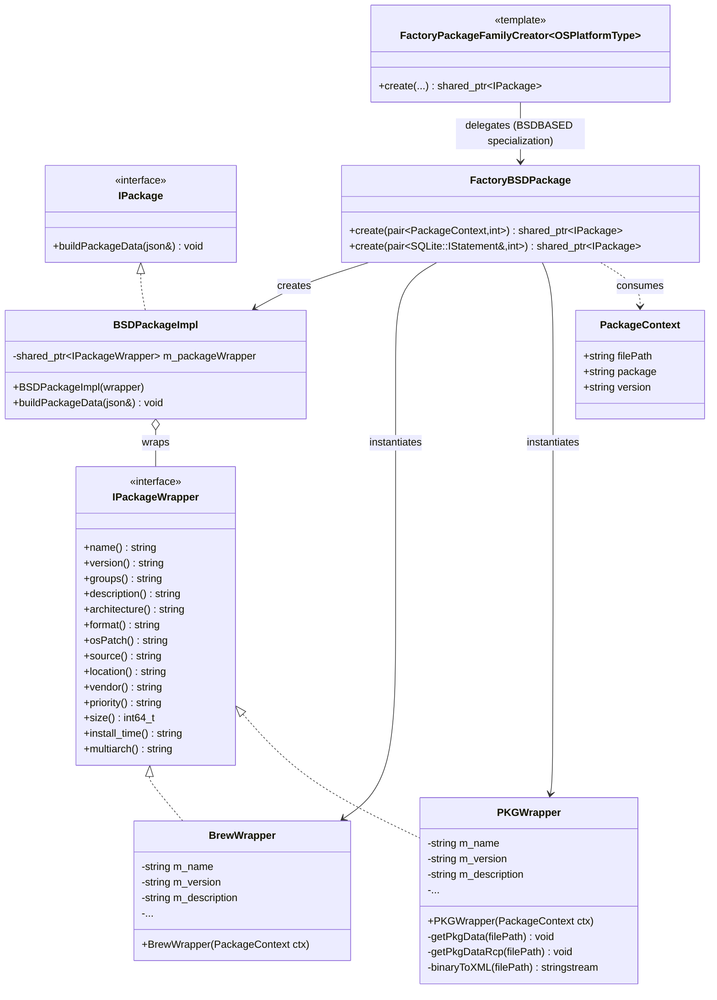
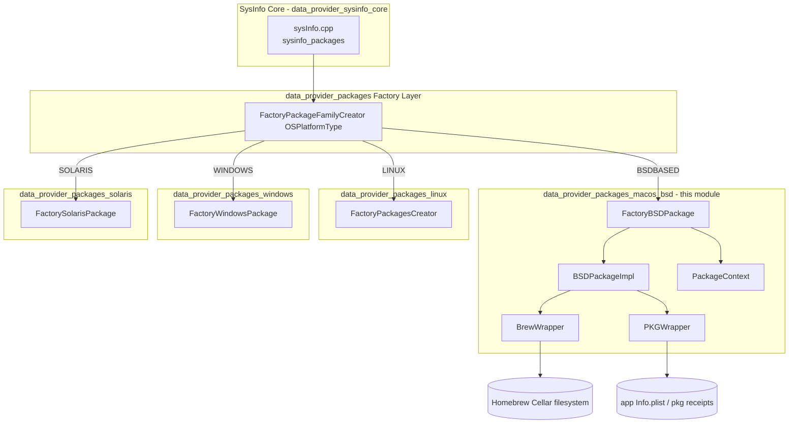
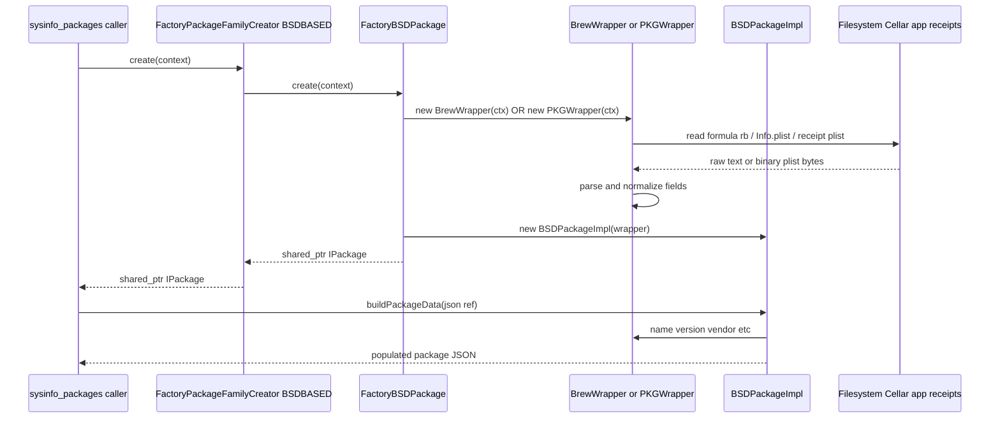
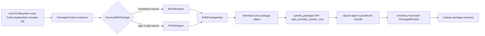

# macOS / BSD Package Data Provider (`data_provider_packages_macos_bsd`)

## Introduction

This module is the **macOS/BSD-specific implementation** of the Wazuh `sysinfo` package-inventory subsystem. It is responsible for discovering, parsing and normalizing software package information found on macOS (and other BSD-derived) systems, exposing it through the common `IPackage` interface used by the rest of the [System Information Data Provider](System_Information_Data_Provider_(C++).md).

It knows how to read three different sources of truth for installed software on macOS:

1. **Homebrew** formula cellars (`/usr/local/Cellar`, `/opt/homebrew/Cellar`) — via `BrewWrapper`.
2. **Application bundles** (`*.app/Contents/Info.plist`) — via `PKGWrapper` (bundle mode).
3. **Installer receipts** (`*.pkg` / `PackageInfo` / receipts database plists) — via `PKGWrapper` (receipt mode).

The module plugs into the platform-agnostic package factory chain (`FactoryPackageFamilyCreator`) so that the generic `sysinfo_packages()` entry point (see [SysInfo Core](data_provider_sysinfo_core.md)) can retrieve BSD/macOS package data without any platform-specific code leaking into the caller.

This module is a sibling of [`data_provider_packages_linux`](data_provider_packages_linux.md), [`data_provider_packages_windows`](data_provider_packages_windows.md) and [`data_provider_packages_solaris`](data_provider_packages_solaris.md), all children of the parent [`data_provider_packages`](System_Information_Data_Provider_(C++).md) family.

---

## Purpose & Core Functionality

| Responsibility | Component |
|---|---|
| Hold the minimal identifying context (file path, package name, version) for a package to be parsed | `PackageContext` |
| Parse a Homebrew formula folder into normalized fields (name, version, description, vendor…) | `BrewWrapper` |
| Parse a macOS `.app` bundle `Info.plist` or a `.pkg` installer receipt (plain or binary plist) into normalized fields | `PKGWrapper` |
| Adapt any `IPackageWrapper` (Brew or PKG) into the generic `IPackage` interface consumed by the sysinfo engine | `BSDPackageImpl` |
| Select/instantiate the correct wrapper implementation for a given package source | `FactoryBSDPackage` |
| Provide the platform dispatch point used by the OS-agnostic package retrieval code | `FactoryPackageFamilyCreator<OSPlatformType::BSDBASED>` |

All of these components collaborate to produce a `nlohmann::json` package object with a normalized schema (`name`, `version`, `vendor`, `description`, `architecture`, `format`, `source`, `location`, `size`, `priority`, `groups`, `multiarch`, `install_time`) that is later consumed by:

* the C API surface in `sysInfo.cpp` (`sysinfo_packages`, `sysinfo_packages_cb`) — see [SysInfo Core](data_provider_sysinfo_core.md)
* the [Inventory Harvester](Advanced_Security_Modules_(C++_Inventory_&_Vulnerability).md) package element (`PackageElement`) that syncs inventory data into the indexer.

---

## Architecture

### Class / Interface Diagram

> `IPackage` and `IPackageWrapper` are the platform-agnostic interfaces declared in `ipackageInterface.h` / `ipackageWrapper.h` (part of the shared package-retrieval scaffolding used across all OS families — Linux, Windows, Solaris and BSD/macOS).

### Module Position in the System

---

## Component Details

### `PackageContext`
A simple value struct passed to wrapper constructors, carrying:
- `filePath` – base directory being scanned (e.g. Cellar path, receipts DB path, `/Applications`)
- `package` – the package/formula/bundle name discovered during directory enumeration
- `version` – the version folder or identifier associated with the package

It decouples filesystem enumeration logic (outside this module) from parsing logic (inside this module).

### `BrewWrapper` (implements `IPackageWrapper`)
Parses a single Homebrew-installed formula:
- Reads the formula's embedded Ruby metadata file (`<Cellar>/<pkg>/<version>/.brew/<pkg>.rb`) to extract the `desc` field as the package description.
- Splits `ctx.version` on `_` to strip Homebrew revision suffixes.
- Strips a trailing `@<digit>` suffix from versioned formula names (e.g. `python@3` → `python`) using `m_name.rfind('@')`.
- Hardcodes `format = "pkg"`, `source = "homebrew"`.
- Leaves architecture, vendor, size, and install time as `UNKNOWN_VALUE` / defaults since Homebrew metadata does not readily expose them.

### `PKGWrapper` (implements `IPackageWrapper`)
Handles two distinct macOS package metadata formats, both potentially stored as **plain XML plist** or **binary plist** (auto-detected via the `bplist00` magic header):

1. **Bundle mode** (`getPkgData`): triggered when `ctx.package` ends with `.app`. Reads `Contents/Info.plist` and extracts:
   - `CFBundleName` / `CFBundleExecutable` → package name
   - `CFBundleShortVersionString` / `CFBundleVersion` → version (prefers the more detailed `CFBundleVersion` when it is a prefix match)
   - `LSApplicationCategoryType` → `groups`
   - `CFBundleIdentifier` → `description`, and via a regex also derives `vendor` (capitalizing the first letter)
   - `source` is set to `"utilities"` or `"applications"` depending on whether the path contains `/Utilities`.

2. **Receipt mode** (`getPkgDataRcp`): used for classic installer packages. Reads a receipts plist and extracts:
   - `PackageIdentifier` → reverse-DNS parsed into `vendor` (2nd token) and `name` (remaining tokens, excluding known noise tokens `pkg`, `x86_64`, `arm64`)
   - `PackageVersion` → version
   - `InstallDate` → install time
   - `source = "receipts"`

Binary plists are converted to XML in-memory using `libplist` (`plist_from_bin` + `plist_to_xml`) via the private `binaryToXML()` helper, so both code paths can share the same line-oriented XML parsing logic (`getValueFnc` extracts the text between `>` and `<`).

### `BSDPackageImpl` (implements `IPackage`)
A thin adapter that owns a `shared_ptr<IPackageWrapper>` (either a `BrewWrapper` or `PKGWrapper` instance) and implements `buildPackageData(nlohmann::json&)` by copying each wrapper accessor (`name()`, `version()`, `vendor()`, etc.) into the output JSON object. This is the object type actually returned to the generic sysinfo package-collection loop.

### `FactoryBSDPackage`
Exposes two static `create()` overloads:
- `create(const std::pair<PackageContext, int>&)` — builds a wrapper directly from filesystem-discovered `PackageContext` (used for Homebrew/App bundle scanning).
- `create(const std::pair<SQLite::IStatement&, const int>&)` — builds a wrapper from a row of a SQLite-backed receipts/package database query (see [`sqliteWrapperTemp.h`](Shared_Modules_Infrastructure_(C++).md)), used when receipt information has been pre-indexed into a local SQLite database for performance.

Internally it decides which concrete wrapper (`BrewWrapper` vs `PKGWrapper`) to instantiate based on the `int` discriminator / path characteristics carried in the context, then wraps the result in a `BSDPackageImpl`.

### `FactoryPackageFamilyCreator<OSPlatformType::BSDBASED>`
A template specialization (defined in `packageFamilyDataAFactory.h`) of the OS-family dispatcher used by the platform-agnostic package retrieval code. It simply forwards both `create()` overloads to `FactoryBSDPackage`. The primary (unspecialized) template throws a runtime error, guaranteeing a compile-time-safe extension point: adding support for a new OS family means adding a new specialization here, mirroring what Linux, Windows and Solaris already do.

---

## Data Flow

### End-to-end pipeline

---

## Relationship to Other Modules

| Related Module | Relationship |
|---|---|
| [System Information Data Provider (parent)](System_Information_Data_Provider_(C++).md) | Overall C++ library this module belongs to; defines `IPackage`/`IPackageWrapper` interfaces and the `OSPlatformType` enum used for factory specialization. |
| [`data_provider_packages_linux`](data_provider_packages_linux.md) | Sibling implementation for Linux (dpkg/rpm/apk/pacman) using the same `FactoryPackageFamilyCreator` extension pattern. |
| [`data_provider_packages_windows`](data_provider_packages_windows.md) | Sibling implementation for Windows (registry/APPX) packages. |
| [`data_provider_packages_solaris`](data_provider_packages_solaris.md) | Sibling implementation for Solaris packages; also referenced directly inside `packageFamilyDataAFactory.h`. |
| [`data_provider_sysinfo_core`](System_Information_Data_Provider_(C++).md) | Hosts `sysInfo.cpp`, which calls into this module (through the factory) as part of `sysinfo_packages()` / `sysinfo_packages_cb()`, and platform utsname-based OS detection files (`sysInfoMac.cpp`, `sysInfoFreeBSD.cpp`, `sysInfoOpenBSD.cpp`). |
| [Shared Modules Infrastructure (C++)](Shared_Modules_Infrastructure_(C++).md) | Provides `sqliteWrapperTemp.h` (`SQLite::IStatement` used by the SQLite-based `FactoryBSDPackage::create` overload), plus general string/filesystem helpers (`stringHelper.h`, `filesystemHelper.h`) used by `BrewWrapper` and `PKGWrapper`. |
| [Advanced Security Modules (Inventory & Vulnerability)](Advanced_Security_Modules_(C++_Inventory_&_Vulnerability).md) | Downstream consumer: `PackageElement` and the Inventory Harvester package pipeline ingest the normalized JSON produced here for indexing and vulnerability scanning. |

---

## Extension Points

To add support for a new macOS/BSD package source (e.g. MacPorts, pkgsrc):

1. Implement a new class satisfying `IPackageWrapper` (following the pattern in `BrewWrapper`/`PKGWrapper`).
2. Extend `FactoryBSDPackage::create()` to select the new wrapper based on the discriminator carried in `PackageContext` or the SQLite row.
3. No changes are required in `FactoryPackageFamilyCreator` or the callers in `data_provider_sysinfo_core`, since they are decoupled from the concrete wrapper types through the `IPackage`/`IPackageWrapper` interfaces.

To add support for an entirely new OS family, add a new `FactoryPackageFamilyCreator<OSPlatformType::X>` specialization alongside the existing `BSDBASED` and `SOLARIS` ones in `packageFamilyDataAFactory.h`.

---

## Summary

The `data_provider_packages_macos_bsd` module is a small, tightly-scoped adapter layer that normalizes three heterogeneous macOS package metadata formats (Homebrew formulas, application bundles, and installer receipts — in both plain and binary plist encodings) into the single `IPackage` abstraction shared by the entire Wazuh `sysinfo` package-inventory pipeline. It participates in a classic **Abstract Factory** pattern (`FactoryPackageFamilyCreator` → `FactoryBSDPackage` → concrete wrappers) that keeps OS-specific parsing isolated from the platform-agnostic collection and reporting code in [`data_provider_sysinfo_core`](System_Information_Data_Provider_(C++).md).
