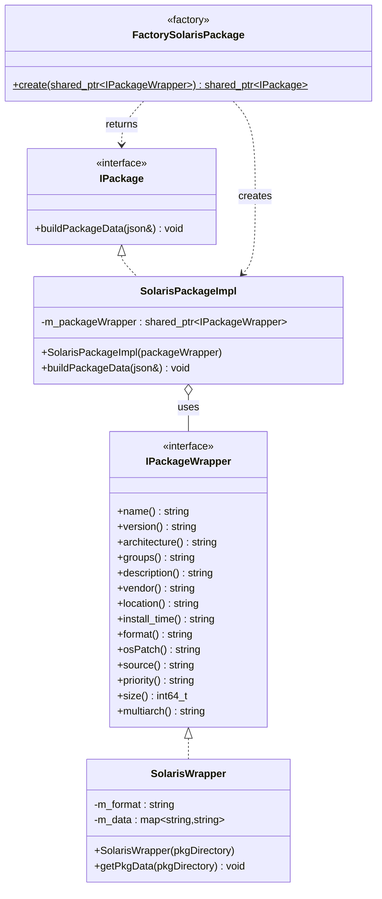
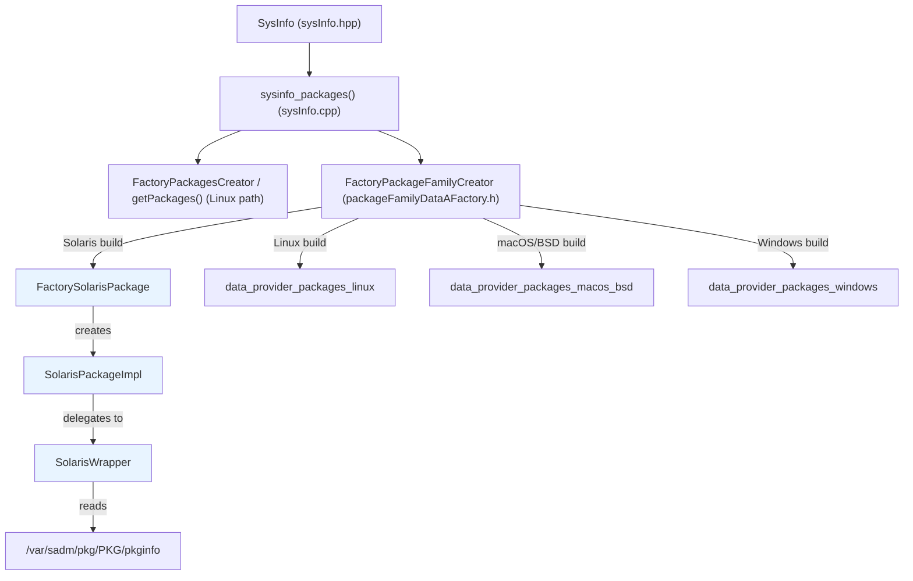
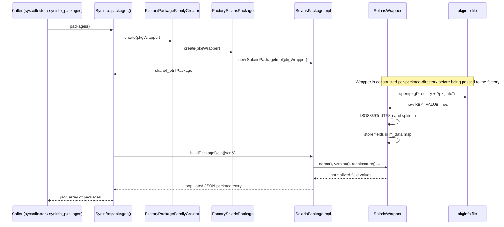
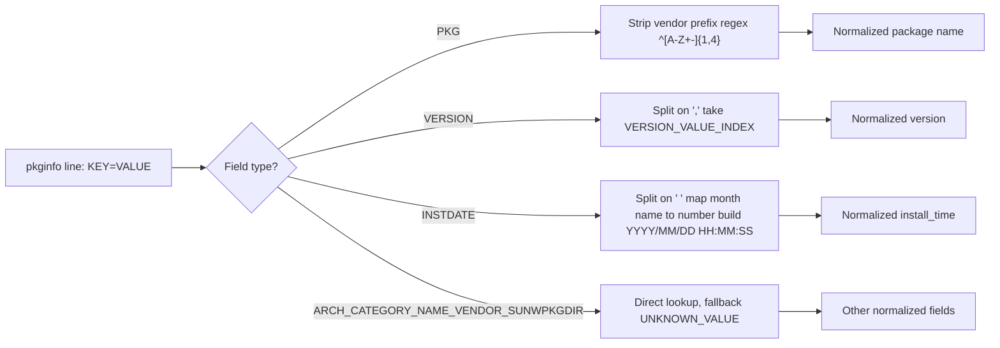

# Data Provider Packages – Solaris

## Introduction

The **data_provider_packages_solaris** module is the Solaris-specific implementation of Wazuh's cross-platform package inventory subsystem. It is responsible for discovering software packages installed on a Solaris host and exposing them in the normalized JSON schema that Wazuh's `SysInfo`/syscollector pipeline uses across all supported operating systems.

The module consists of exactly two C++ header files:

| File | Purpose |
|---|---|
| `src/data_provider/src/packages/packageSolaris.h` | Defines `SolarisPackageImpl` (the `IPackage` implementation) and `FactorySolarisPackage` (its factory) |
| `src/data_provider/src/packages/solarisWrapper.h` | Defines `SolarisWrapper`, which parses the native Solaris `pkginfo` package metadata files |

This module is a small, focused leaf in the much larger [System_Information_Data_Provider_(C++)](System_Information_Data_Provider_(C++).md) subsystem, and it is a sibling of the equivalent implementations for other operating systems (Linux, Windows, macOS/BSD). It follows the same **Wrapper + Factory + Interface** design pattern used throughout the `data_provider` package family, allowing the platform-agnostic `SysInfo` class to retrieve package data without any knowledge of Solaris-specific file formats.

---

## Purpose and Core Functionality

On Solaris, package metadata is stored on disk as a `pkginfo` text file inside each installed package's directory (e.g. `/var/sadm/pkg/<PKGNAME>/pkginfo`). This file contains `KEY=VALUE` pairs such as `PKG`, `VERSION`, `ARCH`, `CATEGORY`, `VENDOR`, `INSTDATE`, etc.

The module's job is to:

1. **Parse** the `pkginfo` file for a given package directory (`SolarisWrapper`).
2. **Normalize** the raw fields into the common package attributes required by the `IPackageWrapper` interface (name, version, architecture, vendor, install time, etc.).
3. **Adapt** that wrapper into an `IPackage` object (`SolarisPackageImpl`) that can serialize itself into the shared package JSON schema consumed by the rest of the system (syscollector, inventory harvester, vulnerability scanner).
4. **Instantiate** the correct implementation transparently via the `FactorySolarisPackage` factory, which is invoked by the OS-family dispatch factory (`FactoryPackageFamilyCreator`) when the running host is detected as Solaris.

### Key responsibilities of `SolarisWrapper`

- Opens and reads the `pkginfo` file line by line.
- Converts each line from ISO-8859-1 to UTF-8 (Solaris package metadata may not be UTF-8 encoded).
- Splits `KEY=VALUE` lines and stores them in an internal `std::map<std::string, std::string>`.
- Exposes accessor methods (`name()`, `version()`, `architecture()`, `groups()`, `description()`, `vendor()`, `location()`, `install_time()`, etc.) required by the `IPackageWrapper` interface.
- Applies Solaris-specific parsing rules:
  - Strips a vendor-name prefix pattern (`^[A-Z+-]{1,4}`) from the package name.
  - Splits `VERSION=1.2.3,REVISION=1234`-style values to extract only the version portion.
  - Parses the `INSTDATE` field (format: `Oct 06 2015 08:51`) into a normalized `YYYY/MM/DD HH:MM:SS` string using a static month-name lookup table.
- Fields that Solaris packages do not natively provide (`osPatch`, `source`, `priority`, `size`, `multiarch`) return safe defaults (`UNKNOWN_VALUE`, `0`, or empty string).

### Key responsibilities of `SolarisPackageImpl` / `FactorySolarisPackage`

- `SolarisPackageImpl` wraps a `std::shared_ptr<IPackageWrapper>` (typically a `SolarisWrapper` instance) and implements `buildPackageData()`, which populates an `nlohmann::json` object with the normalized fields — this is the method invoked by the generic package retrieval pipeline.
- `FactorySolarisPackage::create()` is a static factory method that constructs a `SolarisPackageImpl` from a given `IPackageWrapper`, decoupling the caller (the OS-family factory) from the concrete Solaris types.

---

## Architecture

### Class relationships

### Module placement in the package subsystem

> Note: `FactoryPackageFamilyCreator::create(shared_ptr<IPackageWrapper>&)` in this Solaris build directly delegates to `FactorySolarisPackage::create(...)`. On other platforms (e.g. macOS/BSD), the equivalent factory dispatches to `FactoryBSDPackage` instead; on Linux, package retrieval uses a different factory entry point (`FactoryPackagesCreator`) because Linux supports multiple package managers (dpkg, rpm, apk, pacman). See [data_provider_packages_linux](data_provider_packages_linux.md), [data_provider_packages_macos_bsd](data_provider_packages_macos_bsd.md), and [data_provider_packages_windows](data_provider_packages_windows.md) for the sibling implementations.

---

## Data Flow

The following sequence illustrates how a package inventory request flows from the generic `SysInfo` API down into the Solaris-specific wrapper and back out as JSON.

### Field parsing detail

---

## Component Reference

### `SolarisWrapper` (`solarisWrapper.h`)

Implements `IPackageWrapper` for Solaris `pkginfo` files.

- **Constructor**: `SolarisWrapper(const std::string& pkgDirectory)` — immediately parses `<pkgDirectory>/pkginfo` via `getPkgData()`.
- **Field constants**: `NAME_FILE_INFO`, `NAME_FIELD`, `ARCH_FIELD`, `VERSION_FIELD`, `GROUPS_FIELD`, `DESC_FIELD`, `LOCATION_FIELD`, `VENDOR_FIELD`, `INSTALL_TIME_FIELD` map to the raw `pkginfo` key names (`PKG`, `ARCH`, `VERSION`, `CATEGORY`, `NAME`, `SUNW_PKG_DIR`, `VENDOR`, `INSTDATE`).
- **`MONTH`** — static lookup table translating 3-letter month abbreviations (`Jan`...`Dec`) to zero-padded numeric month strings, used by `install_time()`.
- **Accessors** (all `override` from `IPackageWrapper`): `name()`, `version()`, `groups()`, `description()`, `architecture()`, `format()` (always returns `"pkg"`), `osPatch()`, `source()`, `location()`, `priority()`, `size()`, `vendor()`, `install_time()`, `multiarch()`.
- **`getPkgData(pkgDirectory)`** (private) — opens the `pkginfo` file, reads it line-by-line, transcodes to UTF-8, and populates the `m_data` map.

### `SolarisPackageImpl` / `FactorySolarisPackage` (`packageSolaris.h`)

- **`SolarisPackageImpl`** — final implementation of `IPackage` for Solaris. Holds a `const std::shared_ptr<IPackageWrapper> m_packageWrapper` and implements `buildPackageData(nlohmann::json&)` to populate the output JSON using the wrapper's accessors.
- **`FactorySolarisPackage`** — exposes a single static `create(const std::shared_ptr<IPackageWrapper>&)` method returning a `std::shared_ptr<IPackage>` wrapping a new `SolarisPackageImpl`.

---

## Relationship to Other Modules

- **Parent module**: [data_provider_packages](data_provider_packages.md) — the general package-retrieval subsystem, which also defines the shared `IPackage` / `IPackageWrapper` interfaces (`packageFamilyDataAFactory.h`) that this module implements.
- **Sibling modules** (same interface, different OS):
  - [data_provider_packages_linux](data_provider_packages_linux.md) — dpkg/rpm/pacman/apk parsers and rpmlib bindings.
  - [data_provider_packages_macos_bsd](data_provider_packages_macos_bsd.md) — `FactoryBSDPackage`, `BrewWrapper`, `PKGWrapper`.
  - [data_provider_packages_windows](data_provider_packages_windows.md) — `FactoryWindowsPackage`, `AppxWindowsWrapper`.
- **Consumer**: [data_provider_sysinfo_core](data_provider_sysinfo_core.md) — `SysInfo::packages()` and the C API `sysinfo_packages()` in `sysInfo.cpp` invoke the OS-appropriate factory (via `FactoryPackageFamilyCreator`) to obtain `IPackage` instances, and serialize their `buildPackageData()` output into the syscollector package inventory JSON.
- **Downstream integrations**: The normalized package JSON produced here feeds into the [syscollector_module](syscollector_module.md) (agent-side collection service) and ultimately into the [inventory_harvester_module](inventory_harvester_module.md), which indexes package data (`PackageElement`, `InventoryPackageHarvester`) for storage/search in the Wazuh indexer.
- **Shared utilities used**: `Utils::split`, `Utils::ISO8859ToUTF8` from `stringHelper.h` (part of [shared_utils](shared_utils.md) → `common_helpers`), and the `sharedDefs.h` constant `UNKNOWN_VALUE`.

---

## Design Notes & Constraints

- **No package size or multiarch support**: Solaris `pkginfo` files do not expose installed size or multi-architecture info, so these fields are hardcoded to `0` / empty string respectively. Downstream consumers must tolerate these defaults for Solaris entries.
- **Encoding safety**: Because Solaris systems may still emit legacy Latin-1 (ISO-8859-1) encoded text in package metadata, every line read from `pkginfo` is explicitly transcoded to UTF-8 before being stored, preventing malformed JSON output later in the pipeline.
- **Defensive parsing**: The `install_time()` parser wraps its field-index access in a `try/catch` block, silently returning an empty string if the `INSTDATE` format doesn't match expectations — avoiding crashes on malformed or unusual package metadata.
- **Stateless factory**: `FactorySolarisPackage` holds no internal state; it exists purely to satisfy the factory-pattern contract expected by `FactoryPackageFamilyCreator`, enabling compile-time platform selection without runtime branching in the calling code.
