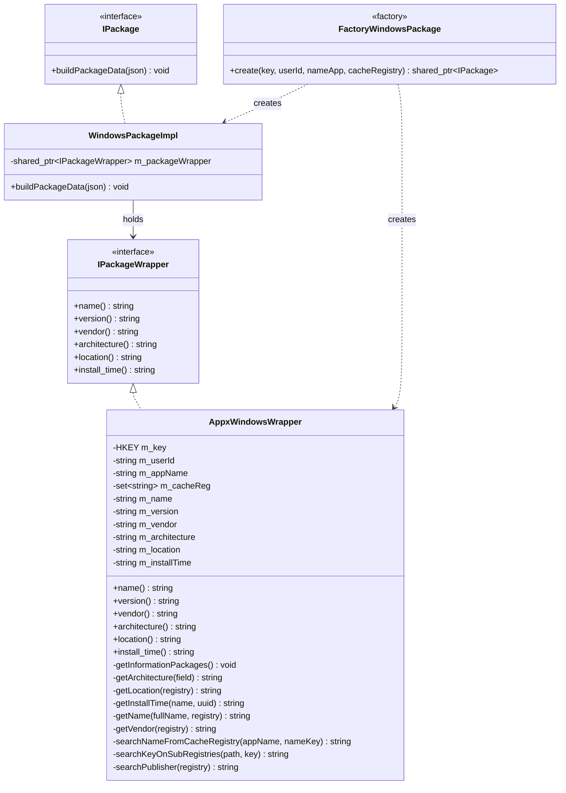
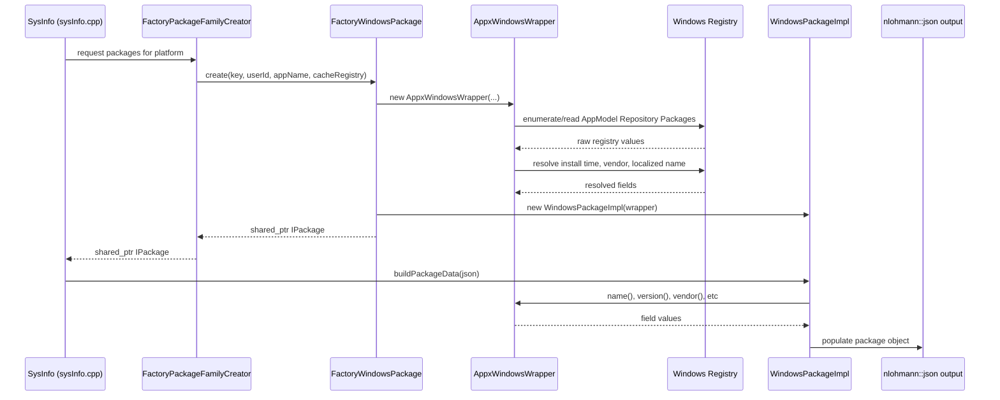
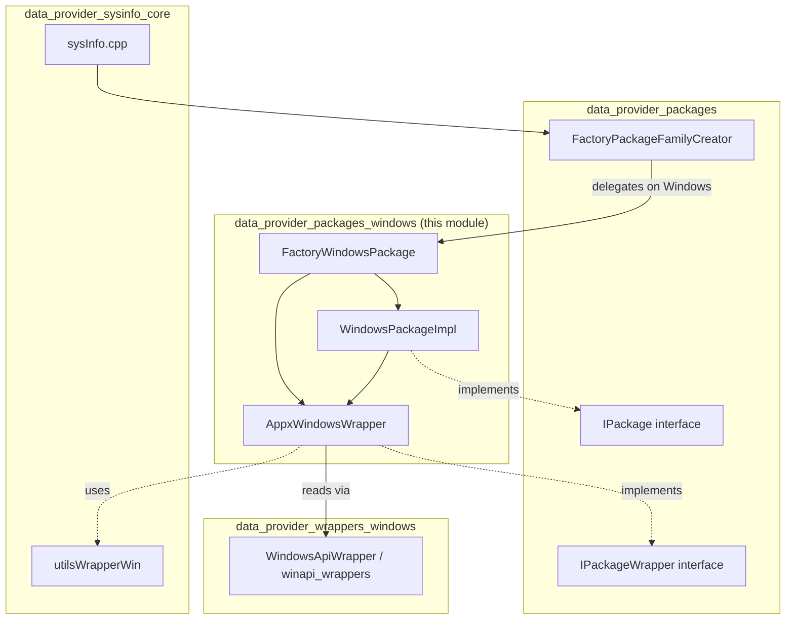
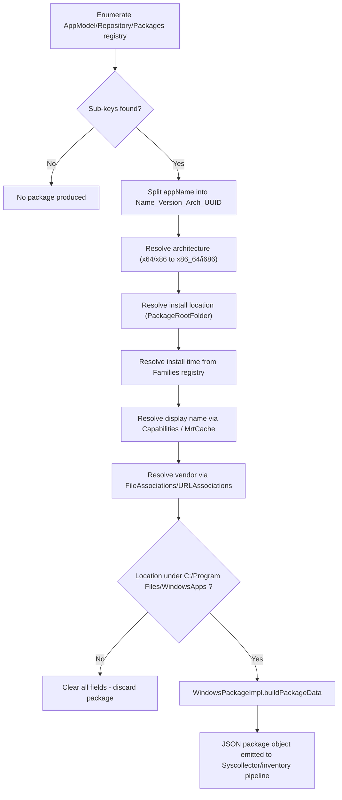

# Data Provider — Windows Packages Module

## Introduction

The **Windows Packages** module is the Windows-specific implementation of Wazuh's cross-platform *Package Inventory* subsystem, part of the [System Information Data Provider (C++)](System_Information_Data_Provider_(C++).md). It is responsible for discovering and describing software packages installed on a Windows host, specifically modern **APPX/UWP (Microsoft Store)** packages registered under the AppModel repository.

This module plugs into the platform-agnostic package abstraction (`IPackage` / `IPackageWrapper`) defined by [data_provider_packages](data_provider_packages.md), allowing the generic [SysInfo_Provider](data_provider_sysinfo_core.md) code to request package inventories without knowing the underlying OS-specific retrieval mechanism.

Two files make up this module:

| File | Responsibility |
|---|---|
| `packagesWindows.h` | Defines `WindowsPackageImpl` (the `IPackage` implementation for Windows) and `FactoryWindowsPackage` (the factory that builds `IPackage` instances from a wrapper). |
| `appxWindowsWrapper.h` | Defines `AppxWindowsWrapper`, an `IPackageWrapper` implementation that extracts APPX/UWP package metadata directly from the Windows Registry. |

 

## Purpose and Core Functionality

On Windows, package information is not exposed through a single unified store the way it is on Linux (dpkg/rpm databases) or macOS (`pkgutil`/Homebrew). Instead, it is scattered across several registry hives:

- **Traditional Win32 applications**: `Uninstall` registry keys (handled elsewhere in the broader `data_provider_packages` factory chain, not in this module).
- **Modern APPX/UWP packages**: Registered under
  `SOFTWARE\Classes\Local Settings\Software\Microsoft\Windows\CurrentVersion\AppModel\Repository\Packages`,
  with related install-time, vendor, and localized-name data spread across additional registry paths.

This module specifically handles the **APPX/UWP** package family. Its core responsibilities are:

1. **Locate installed APPX packages** by enumerating registry sub-keys under the `AppModel\Repository\Packages` hive.
2. **Parse the package identity string** (format: `<Name>_<Version>_<Architecture>_<UUID>`) to extract structured version/architecture/name fields.
3. **Resolve indirect/localized strings**. Windows Store packages often store display names as indirect resource references (prefixed with `@{`); the wrapper resolves these by searching the **MrtCache** registry area.
4. **Determine the vendor/publisher** by cross-referencing `FileAssociations`/`URLAssociations` capability sub-keys against `SOFTWARE\Classes\<Publisher>\Application`.
5. **Filter out non-Store packages**: any resolved package whose install location is not under `C:\Program Files\WindowsApps` is discarded, since it isn't a genuine Store-managed package.
6. **Adapt the extracted data into the generic `IPackage` JSON structure** consumed by the rest of the [Syscollector](syscollector_module.md) / inventory pipeline.

 

## Architecture

The module follows the same **Wrapper + Adapter + Factory** design pattern used throughout `data_provider_packages` (see [data_provider_packages_linux](data_provider_packages_linux.md) and [data_provider_packages_macos_bsd](data_provider_packages_macos_bsd.md) for sibling implementations):

- **`IPackageWrapper`** (interface, defined outside this module) — abstracts "raw" access to a single package's fields (name, version, vendor, architecture, etc.).
- **`AppxWindowsWrapper`** (this module) — concrete wrapper that reads APPX package fields from the Windows Registry.
- **`IPackage`** (interface, defined outside this module) — abstracts building the final JSON representation of a package.
- **`WindowsPackageImpl`** (this module) — concrete `IPackage` adapter; simply delegates field access to an injected `IPackageWrapper` and serializes it into JSON.
- **`FactoryWindowsPackage`** (this module) — factory that constructs an `IPackage` (a `WindowsPackageImpl` wrapping an `AppxWindowsWrapper`) given a registry key, user SID, package name and a cache-registry set.

 

## Component Reference

### `FactoryWindowsPackage` (`packagesWindows.h`)

A static factory with a single `create()` overload that:
1. Instantiates an `AppxWindowsWrapper` from the supplied `HKEY`, user SID, application registry key name, and localized-name cache set.
2. Wraps it in a `WindowsPackageImpl`.
3. Returns the result as a `shared_ptr<IPackage>`.

This mirrors the platform-specific factories used by sibling modules — e.g., `FactoryPackagesCreator`/`ModernFactoryPackagesCreator` in [data_provider_packages_linux](data_provider_packages_linux.md), and `FactoryBSDPackage` in [data_provider_packages_macos_bsd](data_provider_packages_macos_bsd.md) — and is itself invoked from the top-level `FactoryPackageFamilyCreator` (`packageFamilyDataAFactory.h`) that selects the correct OS-specific factory at compile/run time within `data_provider_packages`. Notably, `FactoryPackageFamilyCreator`'s generic implementation throws a runtime error by default; platform-specific translation units specialize/route to `FactoryWindowsPackage` when compiled for Windows.

### `WindowsPackageImpl` (`packagesWindows.h`)

A thin adapter implementing `IPackage`:
- Holds a `shared_ptr<IPackageWrapper>`.
- `buildPackageData(nlohmann::json& package)` populates the output JSON object using the wrapper's accessor methods (name, version, vendor, architecture, format, location, size, install_time, etc.), following the same contract as other OS implementations of `IPackage`.

### `AppxWindowsWrapper` (`appxWindowsWrapper.h`)

The core Windows-specific data-extraction logic. Key registry paths used:

| Constant | Registry Path | Purpose |
|---|---|---|
| `APPLICATION_STORE_REGISTRY` | `...\AppModel\Repository\Packages` | Root of installed APPX package identities |
| `APPLICATION_INSTALL_TIME_REGISTRY` | `...\AppModel\Repository\Families` | Source of install-time (`InstallTime`, QWORD) |
| `APPLICATION_VENDOR_REGISTRY` | `SOFTWARE\Classes` | Root used to resolve publisher/vendor from capability associations |
| `CACHE_NAME_REGISTRY` | `SOFTWARE\Classes\Local Settings\MrtCache` | Cache used to resolve indirect/localized display names (`@{...}` strings) |
| `STORE_APPLICATION_DATABASE` | `C:\Program Files\WindowsApps` | Filter — only packages installed here are considered genuine Store packages |

**Construction flow (`getInformationPackages`)**:
1. Validates the registry key for the given `appName` exists and has enumerable sub-keys (`isRegistryValid`).
2. Splits `appName` into `Name_Version_Architecture_UUID` components.
3. Resolves version, architecture (`x64`→`x86_64`, `x86`→`i686`), install location (`PackageRootFolder` value), install time, display name, and vendor.
4. Discards all extracted fields if the resolved `location` does not point inside `C:\Program Files\WindowsApps`, filtering out spurious/non-Store entries.

**Name resolution (`getName` / `searchNameFromCacheRegistry` / `searchKeyOnSubRegistries`)**:
Handles the common case where a package's display name is not stored literally but as an indirect string reference (e.g. `@{Microsoft.WindowsStore_...?ms-resource://...}`). The wrapper searches the `MrtCache` registry recursively to resolve the actual string value.

**Vendor resolution (`getVendor` / `searchPublisher`)**:
Iterates over `FileAssociations` and `URLAssociations` capability sub-keys to find a `vendorRegistry` reference, then looks up `ApplicationCompany` under `SOFTWARE\Classes\<vendorRegistry>\Application`.

 

## Data Flow

 

## Component Interaction / Dependency Diagram

 

## Relationship to Sibling and Related Modules

- **[data_provider_packages](data_provider_packages.md)** — the parent module defining `IPackage`, `IPackageWrapper`, and the OS-selecting `FactoryPackageFamilyCreator` that this module plugs into.
- **[data_provider_packages_linux](data_provider_packages_linux.md)** — the equivalent implementation for Linux (dpkg/rpm/pacman/apk parsers and factories).
- **[data_provider_packages_macos_bsd](data_provider_packages_macos_bsd.md)** — the equivalent implementation for macOS/BSD (`pkgutil`, Homebrew, `pkg`).
- **[data_provider_packages_solaris](data_provider_packages_solaris.md)** — the equivalent implementation for Solaris.
- **[data_provider_wrappers_windows](data_provider_wrappers_windows.md)** — lower-level Windows API/registry wrapper utilities (`WindowsApiWrapper`, `GroupsHelper`, `UsersHelper`) that support registry access patterns similar to those used here.
- **[data_provider_sysinfo_core](data_provider_sysinfo_core.md)** — the top-level `SysInfo` class and `sysInfo.cpp` driver code (`sysinfo_packages`, etc.) that ultimately triggers package enumeration and consumes the JSON built by `WindowsPackageImpl`.
- **[syscollector_module](syscollector_module.md)** — the Wazuh agent module that periodically invokes the data provider's package inventory to synchronize package information with the manager (via `wdb`/`inventory_harvester`).
- **[Advanced_Security_Modules_(C++_Inventory_&_Vulnerability)](Advanced_Security_Modules_(C++_Inventory_&_Vulnerability).md)** — specifically the `inventory_harvester_module` (`packageElement.hpp`) and `vulnerability_scanner_module`, which consume package inventory data (including Windows package data produced here) to build inventory documents and match against vulnerability feeds.

 

## Process Flow: Building a Windows Package Inventory Entry

 

## Key Design Notes

- **Read-only, registry-driven design**: unlike Linux/macOS package modules that parse binary databases (RPM/dpkg/berkeley db), the Windows module relies entirely on registry traversal (`Utils::Registry` helper), reflecting the way the Windows App Model stores metadata.
- **Best-effort resolution with graceful degradation**: name/vendor resolution steps are wrapped in `try/catch` blocks; failures result in empty strings rather than exceptions propagating to callers, keeping the inventory scan resilient to partially-populated registry state.
- **Strict scope**: this module only covers **APPX/UWP Store packages** — traditional Win32 program inventories (via `Uninstall` registry keys) are handled by a separate code path within the broader `data_provider_packages` family (not included in this module).
- **UNKNOWN_VALUE conventions**: fields not applicable to Windows packages (e.g. `groups`, `description`, `source`, `priority`) consistently return `UNKNOWN_VALUE`/empty, matching the shared `IPackageWrapper` contract used across all OS implementations.
