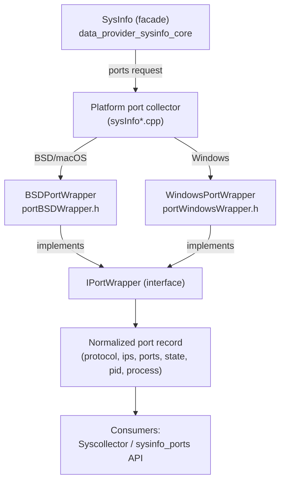
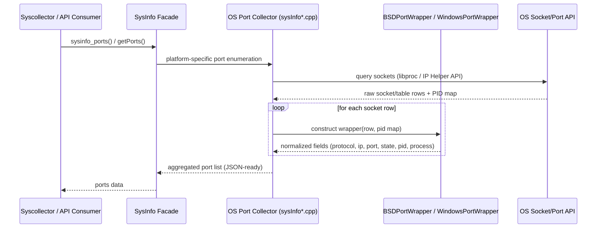

# Data Provider Ports Module

## 1. Purpose

The **Data Provider Ports** module is a small, highly-focused component of the [System Information Data Provider (C++)](System_Information_Data_Provider_(C++).md) subsystem. Its sole responsibility is to provide a **platform-specific abstraction over a running host's open network ports** (TCP/UDP sockets), normalizing OS-native socket/connection information into a common representation that the rest of the sysinfo stack (and ultimately Wazuh's Syscollector module) can consume uniformly.

Because socket/port enumeration APIs differ radically between operating systems (BSD-family `libproc`/`socket_fdinfo` structures vs. the Windows `IP Helper API` — `GetExtendedTcpTable`/`GetExtendedUdpTable`), this module implements one wrapper class per platform family, both of which conform to the shared `IPortWrapper` interface defined at the `sysinfo` core level. This keeps the platform-specific code isolated behind a small, testable surface while presenting a consistent contract (`protocol()`, `localIp()`, `localPort()`, `remoteIP()`, `remotePort()`, `state()`, `pid()`, `processName()`, etc.) to callers.

## 2. Scope & Files

| File | Platform | Core Component(s) |
|---|---|---|
| `src/data_provider/src/ports/portBSDWrapper.h` | macOS / BSD | `ProcessInfo`, `BSDPortWrapper` |
| `src/data_provider/src/ports/portWindowsWrapper.h` | Windows | `PortTables`, `WindowsPortWrapper` |

There is no corresponding Linux/Solaris wrapper in this module because those platforms are handled by other sibling files within the broader `data_provider` tree (outside the core components documented here); this module is scoped strictly to the two files listed above.

## 3. Architecture Overview

Both wrapper classes implement the `IPortWrapper` interface (declared in `iportWrapper.h`, part of the parent `data_provider` module) and are instantiated by the platform-specific port-collection routines inside `sysInfo.cpp` (see [`data_provider_sysinfo_core`](data_provider_sysinfo_core.md)). The core `SysInfo` facade calls into these OS-specific collectors, which construct one wrapper instance per discovered socket, then serialize the wrapper's normalized fields into the generic port JSON/array structure returned to consumers such as Syscollector.

## 4. Component Details

### 4.1 `BSDPortWrapper` (macOS / BSD)

- **Input**: a `ProcessInfo` struct (PID + process name) and a `std::shared_ptr<socket_fdinfo>` obtained from the BSD `libproc` socket-FD enumeration APIs.
- **`ProcessInfo`**: a minimal POD struct holding `pid` and `processName`, with `operator<` defined so instances can be used as keys/sorted in containers (e.g., when mapping PIDs to open sockets).
- **Responsibilities**:
  - Maps native BSD socket kind (`SOCKINFO_TCP` / `SOCKINFO_IN`) and address family (`AF_INET`/`AF_INET6`) to protocol strings (`tcp`, `tcp6`, `udp`, `udp6`) via the static `PORTS_TYPE` lookup table.
  - Maps native TCP state constants (`TSI_S_ESTABLISHED`, `TSI_S_SYN_SENT`, etc.) to human-readable state strings via the static `STATE_TYPE` table.
  - Extracts local/remote IP addresses using `getnameinfo()` against constructed `sockaddr_in`/`sockaddr_in6` structures, stripping any scope-id suffix (`%...`) via `Utils::substrOnFirstOccurrence`.
  - Extracts local/remote ports via `ntohs()` on the raw socket info fields.
  - `txQueue()`, `rxQueue()`, and `inode()` are not available on this platform and simply return `0`.
  - Throws `std::runtime_error` in its constructor if the supplied socket info pointer is null, guarding against invalid wrapper construction.

### 4.2 `WindowsPortWrapper` and `PortTables` (Windows)

- **`PortTables`**: a simple aggregate holding smart-pointer-owned arrays of the four Windows IP Helper table types needed for a full port scan: `MIB_TCPTABLE_OWNER_PID`, `MIB_TCP6TABLE_OWNER_PID`, `MIB_UDPTABLE_OWNER_PID`, `MIB_UDP6TABLE_OWNER_PID`. This struct is used by the collector to hold the raw OS query results before wrapping each row.
- **`WindowsPortWrapper`**: constructed from one row of any of the four table types above, plus a `pid -> processName` map (`std::map<pid_t, std::string>`) built ahead of time by the collector. It is overloaded per row type (`_MIB_TCPROW_OWNER_PID`, `_MIB_TCP6ROW_OWNER_PID`, `_MIB_UDPROW_OWNER_PID`, `_MIB_UDP6ROW_OWNER_PID`), populating a uniform set of `const` member fields at construction time (protocol, local/remote ip & port, state, pid, process name).
  - Address formatting uses `Utils::NetworkWindowsHelper::IAddressToString` (IPv4) and `Utils::NetworkWindowsHelper::getIpV6Address` (IPv6), both part of the shared Windows networking helpers (`windowsHelper.h`).
  - Process name resolution special-cases well-known system PIDs (`0` → "System Idle Process", `4` → "System") via the static `SYSTEM_PROCESSES` map before falling back to the supplied process map; unresolved PIDs return `UNKNOWN_VALUE`.
  - State strings are resolved from the static `STATE_TYPE` map (`MIB_TCP_STATE_ESTAB`, `MIB_TCP_STATE_SYN_SENT`, etc.); UDP rows have no TCP state and simply store `0`.
  - `processName()` converts the resolved name from ANSI to UTF-8 via `Utils::EncodingWindowsHelper::stringAnsiToStringUTF8` before returning, ensuring consistent encoding across the API boundary.
  - `txQueue()`, `rxQueue()`, and `inode()` are not meaningful on Windows and return default-constructed values (`{}`).

## 5. Interaction with the Rest of the System

This normalized port data ultimately feeds into the broader Wazuh inventory pipeline — most notably the [Syscollector wodle](wazuh_modules_core.md) and the [Advanced Security Modules (Inventory Harvester)](inventory_harvester_module.md), where port records are indexed as part of host inventory (`InventoryPortHarvester` / port elements).

## 6. Related Modules

- **Parent module**: [System Information Data Provider (C++)](System_Information_Data_Provider_(C++).md) — the umbrella component defining `SysInfo`, the `IPortWrapper` interface, and all platform data collectors.
- **Sibling wrapper modules** (same architectural pattern applied to other resource types):
  - [`data_provider_network`](data_provider_network.md) — network interface wrappers (Linux/BSD/Solaris/Windows).
  - [`data_provider_packages`](data_provider_packages.md) — package manager wrappers.
  - [`data_provider_users`](data_provider_users.md) / [`data_provider_groups`](data_provider_groups.md) — user/group enumeration wrappers.
  - [`data_provider_wrappers_unix`](data_provider_wrappers_unix.md) and [`data_provider_wrappers_windows`](data_provider_wrappers_windows.md) — lower-level OS API wrappers shared across the data provider.
- **Consumers**:
  - [`syscollector_module_native_daemon`](syscollector_module_native_daemon.md) — the native Syscollector wazuh module (`wm_syscollector.c`, `syscollector.cpp`) that periodically invokes port collection and forwards results.
  - [`inventory_harvester_module`](inventory_harvester_module.md) — indexes port inventory data (`InventoryPortHarvester`, `PortFile`) into the security data store.
- **Shared utilities used internally**: string helpers (`stringHelper.h`) and Windows API wrappers (`windowsHelper.h`), documented as part of [`shared_utils`](shared_utils.md) / [`common_helpers`](common_helpers.md) and [`data_provider_wrappers_windows`](data_provider_wrappers_windows.md) respectively.

## 7. Summary

| Aspect | Detail |
|---|---|
| Language | C++ (header-only classes) |
| Platforms covered | macOS/BSD, Windows |
| Design pattern | Strategy/Adapter — concrete wrappers implement a common `IPortWrapper` interface |
| External dependencies | BSD `libproc` socket FD info; Windows IP Helper API (`iphlpapi`) tables |
| Output | Normalized port record: protocol, local/remote IP & port, connection state, owning PID, process name |
| Consumers | Syscollector native daemon, Inventory Harvester, `sysinfo_ports` public API |

Given its small size and tightly-scoped responsibility (two header files, two classes), this module does not warrant further sub-module decomposition.
