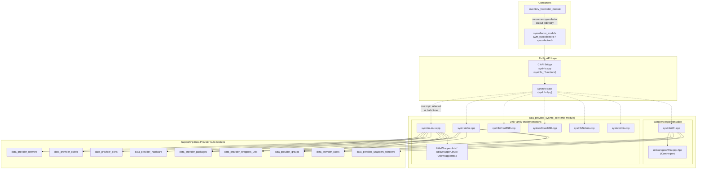
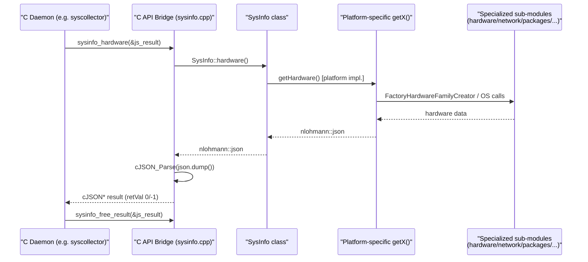
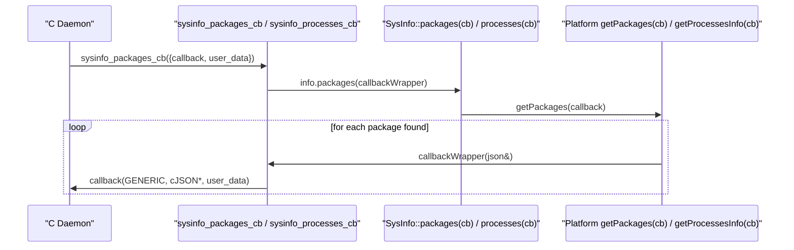

# Data Provider — SysInfo Core

## 1. Purpose

`data_provider_sysinfo_core` is the **platform dispatch layer** of Wazuh's `SysInfo` C++ library (part of the broader [System_Information_Data_Provider (C++)](System_Information_Data_Provider_(C++).md) module, referred to in this wiki simply as the data provider). It implements the concrete, OS-specific bodies of the `SysInfo` class methods (`getHardware()`, `getPackages()`, `getOsInfo()`, `getProcessesInfo()`, `getNetworks()`, `getPorts()`, `getHotfixes()`, `getGroups()`, `getUsers()`) and exposes a stable **C API** (`sysinfo_*` functions) that is consumed by native Wazuh daemons and modules such as `wazuh_modules/wm_syscollector.c` and the [syscollector native daemon](syscollector_module.md) (`syscollector_module_native_daemon`).

In short, this module answers the question **"how do I get hardware, OS, process, network, port, package, hotfix, group and user information on *this* operating system?"** for every platform Wazuh supports: Linux, macOS (Darwin/BSD-based), FreeBSD, OpenBSD, Solaris, generic Unix, and Windows.

The module itself contains no public interface class — it is a set of `.cpp` translation units that provide the implementation for the `SysInfo` class declared in [`SysInfo_Provider`](SysInfo_Provider.md) (`sysInfo.hpp`). Exactly **one** of the platform-specific `.cpp` files is compiled into the final binary, selected at build time based on the target OS.

## 2. Architecture Overview

### Key Design Points

- **Single Responsibility per File**: Each `sysInfo<Platform>.cpp` file provides the full set of `SysInfo::get*()` overrides for exactly one platform family. Only one file participates in any given compiled binary.
- **Callback-based Streaming**: Several methods (`getProcessesInfo`, `getPackages`) have both a "collect-and-return" overload (`nlohmann::json getX() const`) and a "streaming" overload (`void getX(std::function<void(nlohmann::json&)> callback) const`) used to avoid materializing very large in-memory JSON documents (e.g., thousands of processes/packages) when the caller wants to process items one at a time (see the `sysinfo_packages_cb` / `sysinfo_processes_cb` C API functions).
- **C API Bridge**: `sysInfo.cpp` wraps the C++ `SysInfo` class with a plain-C, `cJSON`-based interface (`sysinfo_hardware`, `sysinfo_packages`, `sysinfo_os`, `sysinfo_processes`, `sysinfo_networks`, `sysinfo_ports`, `sysinfo_hotfixes`, `sysinfo_groups`, `sysinfo_users`, plus the `_cb` streaming variants and `sysinfo_free_result`). This is the ABI boundary used by C daemons (e.g., `wm_syscollector.c`) that cannot link directly against C++ STL types.
- **Delegation to Specialized Sub-modules**: The platform files themselves delegate heavy-lifting to focused sub-modules documented elsewhere in this wiki:
  - Hardware detection → [data_provider_hardware](data_provider_hardware.md)
  - Network interface enumeration → [data_provider_network](data_provider_network.md)
  - Package inventory (native + PyPI/NPM/etc.) → [data_provider_packages](data_provider_packages.md)
  - OS release/version parsing → [data_provider_osinfo](data_provider_osinfo.md)
  - Open port enumeration → [data_provider_ports](data_provider_ports.md)
  - Group/user enumeration → [data_provider_groups](data_provider_groups.md) and [data_provider_users](data_provider_users.md)
  - Low-level OS primitive wrappers → [data_provider_wrappers_unix](data_provider_wrappers_unix.md) and [data_provider_wrappers_windows](data_provider_wrappers_windows.md)
- **Graceful Degradation**: Platforms with limited support (FreeBSD, OpenBSD, Solaris, generic Unix) simply return empty `nlohmann::json{}` objects for unsupported categories (e.g., processes, ports, hotfixes, groups, users) rather than failing, keeping the unified `SysInfo` interface usable everywhere.

## 3. Sub-modules

This module is split into three sub-modules along platform boundaries, each documented in detail in its own file:

| Sub-module | Description | Documentation |
|---|---|---|
| **C API Bridge** | The `extern "C"` `sysinfo_*` functions and cJSON conversion glue that expose the C++ `SysInfo` class to C callers. | [data_provider_sysinfo_core_capi.md](data_provider_sysinfo_core_capi.md) |
| **Unix-family Platform Implementations** | `SysInfo` method implementations for Linux, macOS, FreeBSD, OpenBSD, Solaris and generic Unix, plus their small OS-primitive wrapper helpers (`UtilsWrapperUnix`, `UtilsWrapperLinux`, `UtilsWrapperMac`). | [data_provider_sysinfo_core_unix.md](data_provider_sysinfo_core_unix.md) |
| **Windows Platform Implementation** | `SysInfo` method implementations for Windows, including TCP/UDP port table enumeration (`getTablePorts`), registry-based package/hotfix discovery, and the `ComHelper` WMI/Windows Update Agent COM wrapper (`ConvertStringToBSTR`). | [data_provider_sysinfo_core_windows.md](data_provider_sysinfo_core_windows.md) |

> **Note:** All three sub-module documents, along with this overview, live in the same flat documentation folder as the rest of the wiki (not nested under a `data_provider_sysinfo_core/` path).

## 4. High-Level Data Flow

For streaming-style queries (packages, processes), the flow is similar but the daemon supplies a native callback that is invoked once per item, avoiding a full in-memory buildup:

## 5. How this module fits into the System

- **Upstream dependency**: [`SysInfo_Provider`](SysInfo_Provider.md) declares the abstract `SysInfo` class interface (`sysInfo.hpp`) that this module implements per-platform.
- **Sibling data-provider sub-modules**: Hardware, network, packages, OS-info, ports, groups and users detection logic is factored out into dedicated sub-modules (see table above); the platform files in this module act as the **orchestration/glue layer** that calls into those factories and assembles the final JSON documents returned by `SysInfo`.
- **Downstream consumers**: The compiled `SysInfo` shared library (and its C API) is consumed by:
  - The native `syscollector` module (see [syscollector_module](syscollector_module.md) and its native daemon sub-module `syscollector_module_native_daemon`), which periodically scans the host and publishes hardware/OS/network/port/package/hotfix/user/group inventory to the Wazuh manager.
  - The [inventory_harvester_module](inventory_harvester_module.md), which indexes syscollector-produced inventory data into the Wazuh indexer.
  - Test tooling under `data_provider_testtool` (`testtool/main.cpp`, `cmdLineActions.h`) used to manually exercise `SysInfo` from the command line.
- **Build-time platform selection**: Only one of the platform `.cpp` files described here is included per target build; there is no runtime dispatch — the correct implementation is selected by the build system (CMake) based on the compilation target OS.
