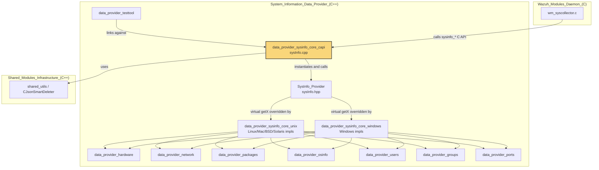
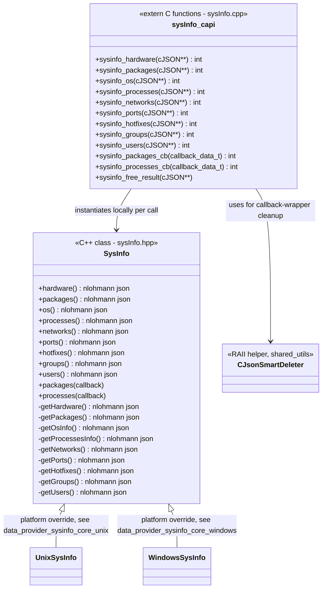
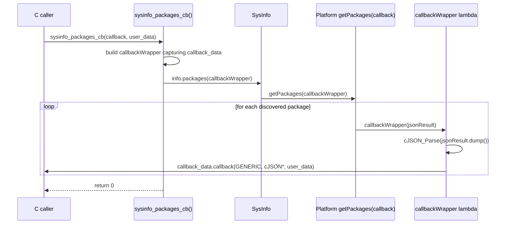
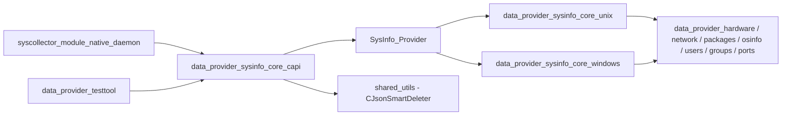

# Data Provider SysInfo Core C API (`data_provider_sysinfo_core_capi`)

## Introduction

The `data_provider_sysinfo_core_capi` module is the **C-language façade** for the Wazuh System Information Data Provider. It exposes the internal C++ `SysInfo` class — which aggregates hardware, OS, network, package, port, process, hotfix, group and user inventory — through a stable, ABI-safe, `extern "C"` interface based on `cJSON`.

This module is intentionally small and focused: it contains **no platform-specific logic** and **no inventory-collection logic** of its own. Instead, it is a thin adapter layer that:

1. Instantiates the platform-agnostic `SysInfo` object.
2. Invokes the appropriate `nlohmann::json`-returning (or callback-based) getter.
3. Converts the resulting JSON into a `cJSON*` tree that C callers (daemons, wodules, test tools) can consume.
4. Normalizes all exceptions into a simple integer return code (`0` = success, `-1` = failure) so that no C++ exception ever crosses the C ABI boundary.

Because of this role, it is the **single integration point** used by every consumer of system inventory data throughout the Wazuh agent/manager codebase, including the `syscollector` wazuh module, unit-test wrappers, and the `testtool` command-line utility.

---

## Position in the System



The `data_provider_sysinfo_core_capi` module sits directly beneath [SysInfo_Provider](data_provider_sysinfo_core.md) (the abstract/base `SysInfo` class) and above the platform-specific implementations documented in `data_provider_sysinfo_core_unix.md` and `data_provider_sysinfo_core_windows.md`. Consumers such as the native `syscollector` wazuh module (see `Wazuh_Modules_Daemon_(C)`) and the [data_provider_testtool](data_provider_testtool.md) link against this C API rather than the C++ classes directly, since most host daemons in the codebase (`src/wazuh_modules`, `src/shared`) are written in C.

---

## Core Responsibilities

| Responsibility | Description |
|---|---|
| **ABI stabilization** | Wraps C++ objects/exceptions/`nlohmann::json` behind a plain C function/struct interface (`extern "C"`). |
| **JSON transcoding** | Converts `nlohmann::json` (used internally by `SysInfo`) into `cJSON*` (used throughout the rest of the Wazuh C codebase). |
| **Error containment** | Catches all exceptions inside each function and returns `-1` on failure, `0` on success, guaranteeing no exception unwinds into C code. |
| **Streaming support** | Provides callback-based variants (`sysinfo_packages_cb`, `sysinfo_processes_cb`) for large datasets (packages, processes) to avoid building a single huge JSON document in memory. |
| **Resource cleanup** | Provides `sysinfo_free_result` to release `cJSON` trees allocated by this module. |

---

## Component Inventory

All core components live in a single file: `src/data_provider/src/sysInfo.cpp`.

| Function | Kind | Purpose |
|---|---|---|
| `sysinfo_hardware` | Snapshot getter | Returns hardware inventory (CPU, RAM, board serial, etc.) as `cJSON`. |
| `sysinfo_os` | Snapshot getter | Returns OS information (name, version, architecture, kernel). |
| `sysinfo_networks` | Snapshot getter | Returns network interface/address/protocol inventory. |
| `sysinfo_ports` | Snapshot getter | Returns open network port inventory. |
| `sysinfo_hotfixes` | Snapshot getter | Returns installed OS hotfixes/patches (mainly Windows). |
| `sysinfo_groups` | Snapshot getter | Returns local system groups. |
| `sysinfo_users` | Snapshot getter | Returns local system users. |
| `sysinfo_packages` | Snapshot getter | Returns the full installed-package inventory as one `cJSON` array. |
| `sysinfo_processes` | Snapshot getter | Returns the full running-process inventory as one `cJSON` array. |
| `sysinfo_packages_cb` | Streaming getter | Same as `sysinfo_packages` but invokes a caller-supplied callback once per package, avoiding a large in-memory buffer. |
| `sysinfo_processes_cb` | Streaming getter | Same as `sysinfo_processes` but invokes a caller-supplied callback once per process. |
| `sysinfo_free_result` | Cleanup | Frees a `cJSON*` tree previously returned by any of the getter functions. |

---

## Architecture

### Class / Function Relationship



Each `sysinfo_*` function follows an identical pattern:
1. Construct a **local, short-lived `SysInfo` instance**.
2. Call the matching public method (`hardware()`, `packages()`, etc.).
3. Serialize (`.dump()`) the returned `nlohmann::json` into a string.
4. Parse that string into a new `cJSON*` via `cJSON_Parse`.
5. Return `0` on success; any thrown exception is swallowed and `-1` is returned.

### Data Flow — Snapshot Query (e.g., `sysinfo_os`)

```mermaid
sequenceDiagram
    participant Caller as C caller (wm_syscollector.c / testtool)
    participant CAPI as sysinfo_os()
    participant SI as SysInfo (C++)
    participant Impl as Platform getOsInfo() (Unix/Windows impl)
    participant JSON as nlohmann::json

    Caller->>CAPI: sysinfo_os(&js_result)
    CAPI->>SI: SysInfo info; info.os()
    SI->>Impl: getOsInfo()
    Impl-->>SI: nlohmann::json (OS fields)
    SI-->>CAPI: nlohmann::json
    CAPI->>JSON: os.dump()
    JSON-->>CAPI: JSON string
    CAPI->>CAPI: cJSON_Parse(string)
    CAPI-->>Caller: return 0, js_result set to cJSON*
    Caller->>CAPI: sysinfo_free_result(&js_result)
```

### Data Flow — Streaming Query (`sysinfo_packages_cb`)



The streaming variants avoid accumulating the entire package/process list into a single `nlohmann::json` array in memory; instead each item is converted and handed to the caller immediately, which is important on hosts with very large package or process counts.

---

## Error Handling Model

Every function follows the same defensive pattern:

```cpp
auto retVal { -1 };
try
{
    if (js_result) // or callback_data.callback
    {
        SysInfo info;
        const auto& data { info.getterMethod() };
        *js_result = cJSON_Parse(data.dump().c_str());
        retVal = 0;
    }
}
catch (...) { }
return retVal;
```

Key points:
- **Null-checks** guard against callers passing invalid output pointers.
- **Catch-all `(...)`** ensures no C++ exception (e.g. from filesystem access, WMI queries, `nlohmann::json` parsing) ever propagates into C code, which would otherwise cause undefined behavior/crashes across the ABI boundary.
- **`cJSON_Parse` failure** (e.g., malformed dump — should not normally occur) results in `*js_result` being `nullptr` while `retVal` is still `0`; callers should treat a `nullptr` result defensively.

---

## Relationship to Sibling Modules

| Sibling Module | Relationship |
|---|---|
| [SysInfo_Provider](data_provider_sysinfo_core.md) | Parent module; defines the abstract `SysInfo` class and its virtual `getX()` methods that this C API calls. |
| `data_provider_sysinfo_core_unix` | Provides Linux/macOS/FreeBSD/OpenBSD/Solaris overrides of `SysInfo`'s virtual getters (e.g., `sysInfoLinux.cpp`, `sysInfoMac.cpp`). The C API is platform-agnostic and works unmodified regardless of which override is linked in. |
| `data_provider_sysinfo_core_windows` | Provides the Windows override (`sysInfoWin.cpp`) of the same virtual getters. |
| `data_provider_hardware`, `data_provider_network`, `data_provider_packages`, `data_provider_osinfo`, `data_provider_users`, `data_provider_groups`, `data_provider_ports` | Lower-level collectors invoked indirectly through the platform-specific `SysInfo` overrides; not called directly by this C API. |
| `data_provider_testtool` | A CLI tool (`testtool/main.cpp`) that links against this C API to exercise and print inventory data for manual testing. |
| `syscollector_module_native_daemon` (in `Wazuh_Modules_Daemon_(C)` / `System_Information_Data_Provider_(C++)`) | The primary production consumer: `wm_syscollector.c` and the `Syscollector` C++ class call these `sysinfo_*` functions to gather inventory data for periodic scans sent to `wazuh-db`/the indexer. |
| `shared_utils` (`Shared_Modules_Infrastructure_(C++)`) | Supplies `CJsonSmartDeleter`, an RAII helper used within `sysinfo_packages_cb`/`sysinfo_processes_cb` to safely manage the lifetime of intermediate `cJSON` objects per callback invocation. |



---

## Header Contract

The public C header (`sysInfo.h`, included by `sysInfo.cpp`) defines the ABI surface consumed by this module's callers:

- `int sysinfo_hardware(cJSON** js_result);`
- `int sysinfo_packages(cJSON** js_result);`
- `int sysinfo_os(cJSON** js_result);`
- `int sysinfo_processes(cJSON** js_result);`
- `int sysinfo_networks(cJSON** js_result);`
- `int sysinfo_ports(cJSON** js_result);`
- `int sysinfo_hotfixes(cJSON** js_result);`
- `int sysinfo_groups(cJSON** js_result);`
- `int sysinfo_users(cJSON** js_result);`
- `int sysinfo_packages_cb(callback_data_t callback_data);`
- `int sysinfo_processes_cb(callback_data_t callback_data);`
- `void sysinfo_free_result(cJSON** js_data);`

`callback_data_t` bundles a function pointer (`callback`) with an opaque `user_data` pointer and (for `sysinfo_packages_cb`/`sysinfo_processes_cb`) is invoked once per discovered item with a `GENERIC` result-type tag.

---

## Usage Guidance for Consumers

1. **Always check the return code.** A `-1` means the pointer output is undefined (do not attempt to free it).
2. **Always pair a successful call with `sysinfo_free_result`** to avoid leaking the `cJSON` tree.
3. **Prefer the `_cb` variants** (`sysinfo_packages_cb`, `sysinfo_processes_cb`) when iterating over potentially large collections (packages, processes) to minimize peak memory usage.
4. **Do not assume platform-specific fields.** The JSON schema returned varies slightly by OS since the underlying `SysInfo` implementation differs across `data_provider_sysinfo_core_unix` and `data_provider_sysinfo_core_windows`; consumers should treat optional fields defensively.
5. **This module performs no caching.** Each call to a `sysinfo_*` function constructs a fresh `SysInfo` and performs a live system scan; callers needing periodic snapshots (like `syscollector`) are responsible for their own scheduling/caching.

---

## Summary

`data_provider_sysinfo_core_capi` is a minimal but critical **glue layer** that makes the cross-platform, C++-based system inventory engine (`SysInfo`) usable from the predominantly C codebase of Wazuh's agent and manager daemons. It has no business logic of its own — all inventory collection is delegated to the `SysInfo` class hierarchy — but it is essential for ABI stability, exception safety, and JSON format interoperability (`nlohmann::json` ↔ `cJSON`) between the C++ data provider and its C consumers, most notably the `syscollector` wazuh module.
