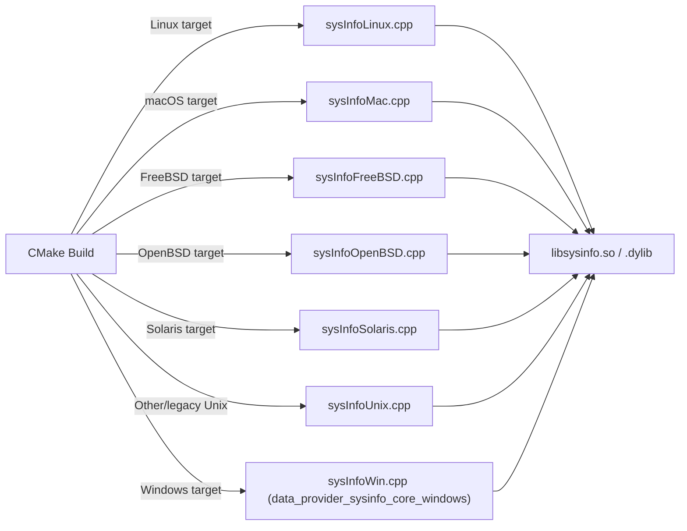
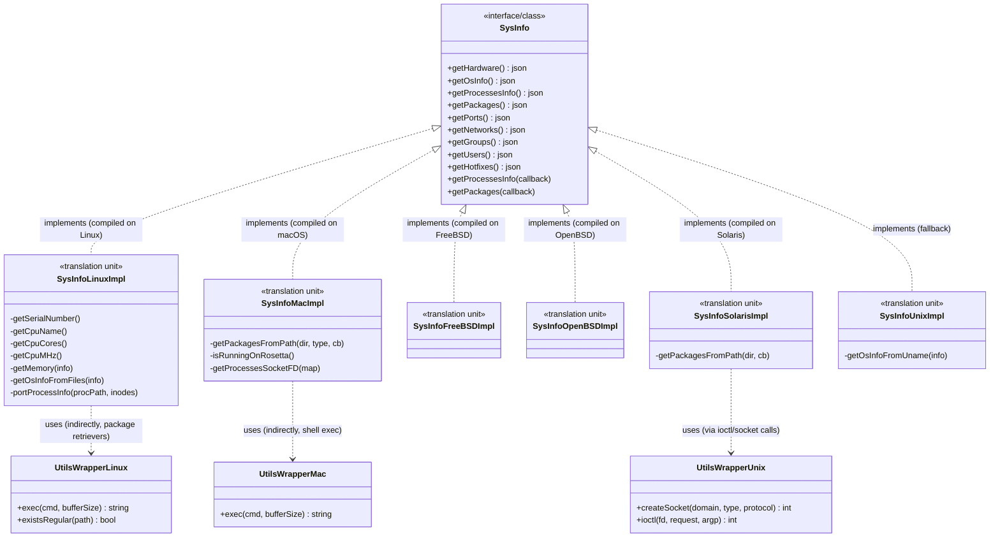
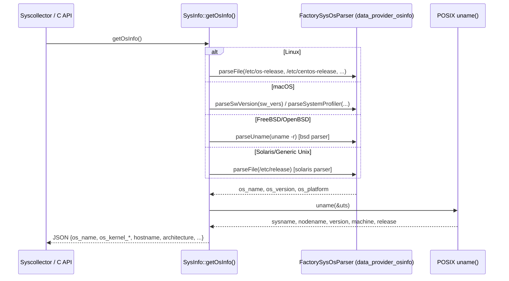
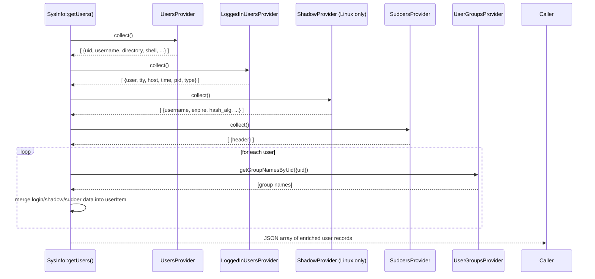
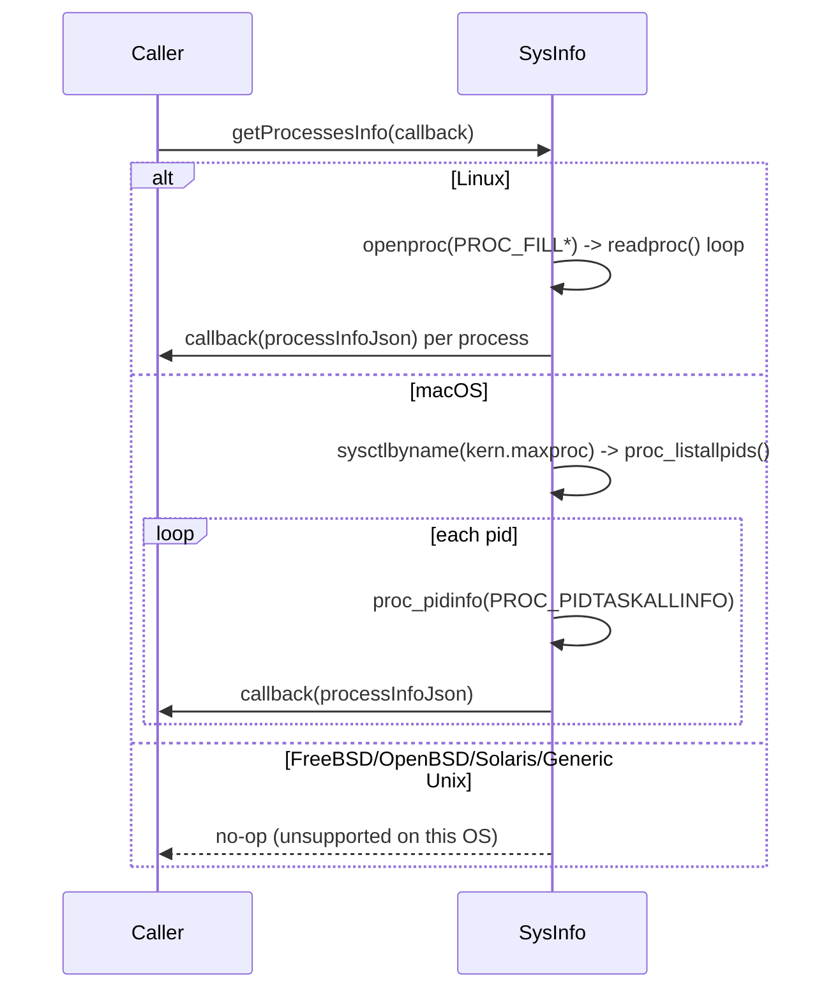
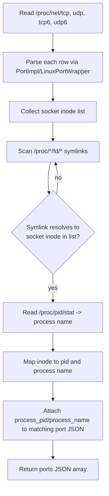
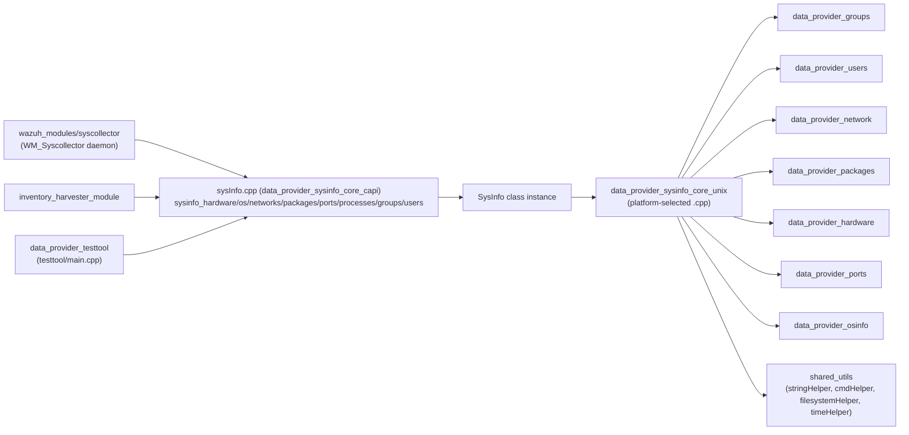

# Data Provider – Unix SysInfo Core

## Introduction

`data_provider_sysinfo_core_unix` provides the **Unix-family implementations** of the `SysInfo` interface that powers the Wazuh System Information Data Provider (`libsysinfo`). While the public API and data-model are declared once in `sysInfo.hpp` (see [SysInfo_Provider.md](SysInfo_Provider.md)), the actual system calls, `/proc` parsing, `sysctl` queries, and command execution required to populate that data differ dramatically across operating systems. This module contains one translation unit per supported Unix-like platform — **Linux, macOS (Darwin), FreeBSD, OpenBSD, Solaris**, and a **generic Unix fallback** — plus a small set of *wrapper* classes (`UtilsWrapperUnix`, `UtilsWrapperLinux`, `UtilsWrapperMac`) that isolate raw OS primitives (sockets, `ioctl`, shell execution) behind mockable interfaces for unit testing.

At build time, exactly one of these `.cpp` files is compiled into the final `libsysinfo` shared library depending on the target platform, so all of them satisfy the very same `SysInfo` method contract (`getHardware`, `getOsInfo`, `getProcessesInfo`, `getPackages`, `getPorts`, `getNetworks`, `getGroups`, `getUsers`, `getHotfixes`). This module is a sibling of [data_provider_sysinfo_core_windows](data_provider_sysinfo_core_windows.md) and a consumer of [data_provider_sysinfo_core_capi](data_provider_sysinfo_core_capi.md), which exposes these C++ objects through a C ABI to the rest of Wazuh (Syscollector module, `wazuh-agent`, inventory harvester, etc.).

## Purpose & Scope

| Concern | Description |
|---|---|
| **What it does** | Implements the OS-specific data-collection logic behind the cross-platform `SysInfo` class for every Unix-like target Wazuh supports. |
| **What it does not do** | It does not define the public API/schema (owned by [SysInfo_Provider](SysInfo_Provider.md)), does not implement Windows logic (see [data_provider_sysinfo_core_windows](data_provider_sysinfo_core_windows.md)), and does not implement the low-level per-domain collectors (groups/users/network/packages/hardware/ports) which live in their own dedicated modules and are only *orchestrated* from here. |
| **Why it's separate** | Isolating platform code by file allows the build system to compile only the relevant translation unit per target OS, keeping the shared `SysInfo` class free of `#ifdef` sprawl and allowing each OS implementation to evolve independently (e.g., Linux gets full user/group/process support while OpenBSD/Solaris/generic Unix remain partially stubbed). |

## Architecture

### Component Placement

```mermaid
graph TB
    subgraph "System_Information_Data_Provider (C++)"
        SysInfoIface["SysInfo_Provider<br/>(sysInfo.hpp - interface & JSON schema)"]
        CAPI["data_provider_sysinfo_core_capi<br/>(sysInfo.cpp - C ABI wrapper)"]
        subgraph "data_provider_sysinfo_core_unix (this module)"
            Linux["sysInfoLinux.cpp"]
            Mac["sysInfoMac.cpp"]
            FreeBSD["sysInfoFreeBSD.cpp"]
            OpenBSD["sysInfoOpenBSD.cpp"]
            Solaris["sysInfoSolaris.cpp"]
            UnixGeneric["sysInfoUnix.cpp"]
            WrapUnix["UtilsWrapperUnix.hpp"]
            WrapLinux["utilsWrapperLinux.hpp"]
            WrapMac["utilsWrapperMac.hpp"]
        end
        Windows["data_provider_sysinfo_core_windows<br/>(sysInfoWin.cpp)"]
    end
    Groups["data_provider_groups"]
    Users["data_provider_users"]
    Network["data_provider_network"]
    Packages["data_provider_packages"]
    Hardware["data_provider_hardware"]
    Ports["data_provider_ports"]
    OsInfo["data_provider_osinfo"]
    SharedUtils["shared_utils<br/>(stringHelper, filesystemHelper, cmdHelper)"]

    SysInfoIface -.declares.-> Linux
    SysInfoIface -.declares.-> Mac
    SysInfoIface -.declares.-> FreeBSD
    SysInfoIface -.declares.-> OpenBSD
    SysInfoIface -.declares.-> Solaris
    SysInfoIface -.declares.-> UnixGeneric
    CAPI -->|instantiates| SysInfoIface

    Linux --> Groups
    Linux --> Users
    Linux --> Network
    Linux --> Packages
    Linux --> SharedUtils
    Mac --> Groups
    Mac --> Users
    Mac --> Packages
    Mac --> Hardware
    Mac --> Ports
    Solaris --> Packages
    Solaris --> Network
    Solaris --> OsInfo
    FreeBSD --> OsInfo
    OpenBSD --> OsInfo
    UnixGeneric --> OsInfo

    Linux -.uses.-> WrapLinux
    Mac -.uses.-> WrapMac
    Solaris -.uses.-> WrapUnix

    style Linux fill:#dbeafe
    style Mac fill:#dbeafe
    style FreeBSD fill:#dbeafe
    style OpenBSD fill:#dbeafe
    style Solaris fill:#dbeafe
    style UnixGeneric fill:#dbeafe
```

### Build-Time Platform Selection

Only **one** `.cpp` implementation of `SysInfo`'s methods is linked into `libsysinfo` for a given target — the build (CMake) selects the correct file based on the compilation platform. This is effectively the **Strategy pattern applied at compile time**: the class name and method signatures are identical, but the implementation is swapped per platform.

## Component Breakdown

| File | Target Platform | Key APIs Used | Notes |
|---|---|---|---|
| `sysInfoLinux.cpp` | Linux | `/proc`, `libproc` (`openproc`/`readproc`), `/sys`, `uname()` | Most complete implementation: hardware, OS info, processes, packages, ports (with process/inode correlation), networks, users, groups. |
| `sysInfoMac.cpp` | macOS (Darwin) | `libproc` (`proc_pidinfo`, `proc_listallpids`), `sysctl`, `sw_vers`, `system_profiler`, SQLite (`MacPorts` registry) | Full-featured implementation including Rosetta-translation detection and package discovery across `.app`, `.plist`, Homebrew, and MacPorts locations. |
| `sysInfoFreeBSD.cpp` | FreeBSD | `sysctl` (`HW_PHYSMEM`, `HW_NCPU`, `HW_MODEL`, `vm.vmtotal`), `pkg query` | Implements hardware, OS info, and packages (via `pkg` CLI); processes/ports/networks/groups/users are stubbed (unsupported). |
| `sysInfoOpenBSD.cpp` | OpenBSD | `sysctl` (`HW_PHYSMEM`, `HW_CPUSPEED`, `HW_SERIALNO`, `HW_MODEL`, `HW_NCPU`) | Implements hardware and OS info only; most other categories return empty JSON. |
| `sysInfoSolaris.cpp` | Solaris/SunOS | `lifreq`/`lifconf` (network interfaces), `/var/sadm/pkg/`, `/etc/release` | Implements OS info, packages, and full IPv4/IPv6 network interface enumeration; hardware/users/groups/processes are stubbed. |
| `sysInfoUnix.cpp` | Generic/legacy Unix (fallback, e.g. HP-UX) | `uname()`, shell `uname -r` | Minimal fallback implementation used when no dedicated platform file applies; most getters return empty/default data. |
| `UtilsWrapperUnix.hpp` | POSIX (all) | `socket()`, `ioctl()` | Thin static wrapper enabling test doubles for raw POSIX socket/ioctl calls (used heavily by `sysInfoSolaris.cpp`'s network code). |
| `utilsWrapperLinux.hpp` | Linux | shell `exec`, `stat` | Wraps command execution and regular-file existence checks used by the Linux implementation and its package retrievers. |
| `utilsWrapperMac.hpp` | macOS | shell `exec` | Wraps command execution (`sw_vers`, `system_profiler`, etc.) for the macOS implementation. |

## Class/Interface Relationship

## Data Flow: Representative Sequences

### `getOsInfo()` — Common Pattern Across Platforms

Every implementation follows the same two-step pattern: (1) determine distribution/version info from OS-specific sources, (2) fill kernel-level fields via POSIX `uname()`.

### `getUsers()` / `getGroups()` — Linux & macOS Orchestration

On Linux and macOS, the SysInfo implementation acts as an **orchestrator**, delegating to the dedicated extended-source providers (see [data_provider_users](data_provider_users.md) and [data_provider_groups](data_provider_groups.md)) and merging their results into the unified inventory schema.

### `getProcessesInfo()` — Platform-Specific Enumeration

### `getPorts()` — Linux Inode Correlation

Linux's port collection is the most elaborate: it parses `/proc/net/{tcp,udp,...}` for socket entries, then cross-references socket inodes against `/proc/<pid>/fd/*` symlinks to resolve the owning process (`portProcessInfo`).

## Platform Feature Matrix

| Capability | Linux | macOS | FreeBSD | OpenBSD | Solaris | Generic Unix |
|---|:---:|:---:|:---:|:---:|:---:|:---:|
| `getHardware()` | Full (`/proc/cpuinfo`, `/proc/meminfo`) | Full (via [data_provider_hardware](data_provider_hardware.md)) | Full (`sysctl`) | Full (`sysctl`) | Stub (`UNKNOWN_VALUE`/0) | Stub |
| `getOsInfo()` | Full (`/etc/os-release` family) | Full (`sw_vers`, `system_profiler`) | Full (bsd parser) | Full (bsd parser) | Full (`/etc/release`) | Full (SunOS/HP-UX detection) |
| `getProcessesInfo()` | Full (`libproc`) | Full (`libproc`/Darwin) | None | None | None | None |
| `getPackages()` | Full ([data_provider_packages](data_provider_packages.md) Linux factory + Python/NPM scan) | Full (`.app`/`.plist`/Homebrew/MacPorts) | Full (`pkg query`) | None | Full (`/var/sadm/pkg/`) | None |
| `getPorts()` | Full (inode-correlated) | Full (`proc_pidfdinfo` socket FDs) | None | None | None | None |
| `getNetworks()` | Full ([data_provider_network](data_provider_network.md) Linux factory) | Delegated elsewhere in mac build | None | None | Full (`lifreq`/`lifconf`) | None |
| `getGroups()` / `getUsers()` | Full (groups, users, logins, shadow, sudoers) | Full (no shadow file concept) | None | None | None | None |
| `getHotfixes()` | Not applicable | Not applicable | Not applicable | Not applicable | Not applicable | Not applicable |

## Utility Wrapper Classes

These lightweight static-method classes exist purely to make platform system calls **mockable in unit tests** (see [Unit_Tests_-_Shared_Library](Unit_Tests_-_Shared_Library.md)-style test suites for the data provider). They contain no business logic themselves.

| Class | Wrapped Primitives | Primary Consumer |
|---|---|---|
| `UtilsWrapperUnix` | `socket()`, `ioctl()` | `sysInfoSolaris.cpp` network interface enumeration (`lifreq`/`lifconf`) |
| `UtilsWrapperLinux` | Shell command execution, `stat()`-based regular file existence check | Linux package retrievers ([data_provider_packages_linux](data_provider_packages.md)) |
| `UtilsWrapperMac` | Shell command execution | macOS OS-info collection (`sw_vers`, `system_profiler`) |

## Integration with the Wider System

Downstream, the JSON produced by these implementations is consumed by:
- **Syscollector daemon** (`Wazuh_Modules_Daemon_(C)` → `wm_syscollector.c`), which serializes and forwards snapshots/deltas to `wazuh-db`.
- **Inventory Harvester** ([inventory_harvester_module](inventory_harvester_module.md)), which indexes hardware/OS/network/package/port/process/user/group elements into the Wazuh indexer.
- **`syscollector` unit/integration test tool** ([data_provider_testtool](data_provider_testtool.md)).

## Design Notes & Rationale

1. **One class, many translation units.** `SysInfo` is declared once ([SysInfo_Provider](SysInfo_Provider.md)); each platform file only *defines* its methods. This keeps the public contract stable while allowing radically different implementations (e.g., Linux's `/proc` parsing vs. macOS's Mach/`libproc` APIs vs. Solaris's `sysctl`-free, `lifreq`-based networking).
2. **Feature parity is intentionally uneven.** BSD/Solaris/generic-Unix targets are typically used in constrained or legacy environments where full process/port/user telemetry is unnecessary or unavailable; those getters simply return an empty `nlohmann::json()` object rather than throwing, keeping the C API contract uniform (see [data_provider_sysinfo_core_capi](data_provider_sysinfo_core_capi.md)).
3. **Delegation over duplication.** Where richer platform-specific logic already exists as its own component (group/user enumeration, network family construction, package retrieval, hardware detection, port wrapping), the Unix core files act as thin **orchestrators**, calling into those dedicated providers/factories instead of re-implementing OS parsing logic. This avoids logic duplication between, e.g., `sysInfoLinux.cpp` and `data_provider_groups_linux`.
4. **Testability via wrapper indirection.** Raw syscalls (`socket`, `ioctl`, shell `exec`) are wrapped in small static classes (`UtilsWrapperUnix/Linux/Mac`) specifically so that unit tests can substitute mocked implementations without requiring root privileges or specific OS state.
5. **Graceful degradation for exotic architectures.** `sysInfoUnix.cpp` exists as a catch-all fallback (e.g., for HP-UX) so that the shared `libsysinfo` build never fails to link on platforms without a dedicated implementation — at the cost of most fields returning `UNKNOWN_VALUE`/`0`/empty JSON.

## Related Documentation

- [SysInfo_Provider](SysInfo_Provider.md) — public `SysInfo` interface and overall data schema.
- [data_provider_sysinfo_core_capi](data_provider_sysinfo_core_capi.md) — C ABI (`sysinfo_*` functions) built on top of this module.
- [data_provider_sysinfo_core_windows](data_provider_sysinfo_core_windows.md) — Windows counterpart implementation.
- [data_provider_groups](data_provider_groups.md) / [data_provider_users](data_provider_users.md) — extended-source providers used by the Linux/macOS implementations.
- [data_provider_network](data_provider_network.md) — network family factory used by Linux/Solaris implementations.
- [data_provider_packages](data_provider_packages.md) — package retrieval factories used across all Unix platforms.
- [data_provider_hardware](data_provider_hardware.md) — macOS hardware collection factory.
- [data_provider_ports](data_provider_ports.md) — BSD/port wrapper types used by macOS port enumeration.
- [data_provider_osinfo](data_provider_osinfo.md) — `FactorySysOsParser` used across nearly all platform files for `/etc/os-release`-style parsing.
- [data_provider_testtool](data_provider_testtool.md) — CLI tool exercising this module end-to-end.
- [Wazuh_Modules_Daemon_(C)](Wazuh_Modules_Daemon_(C).md) — the Syscollector wmodule that consumes this data via the C API.
