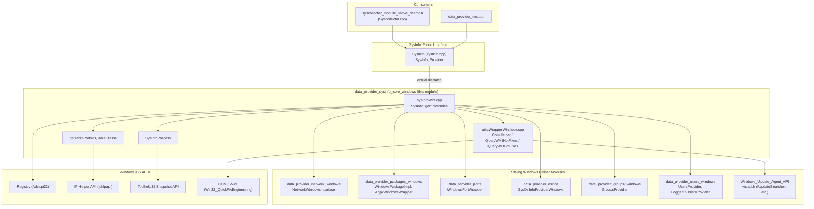
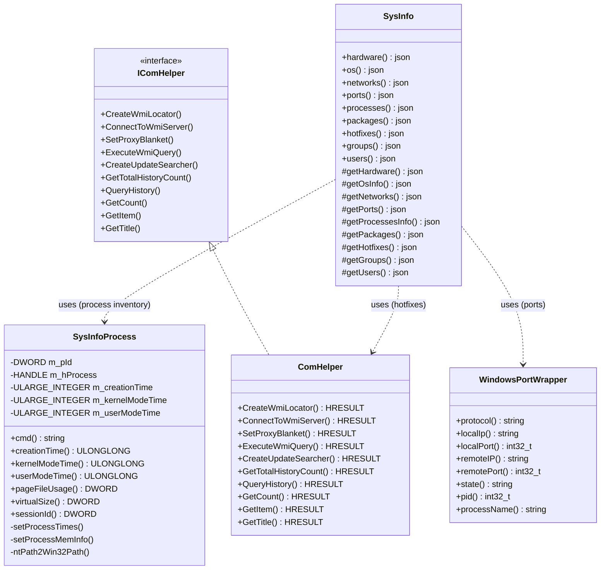
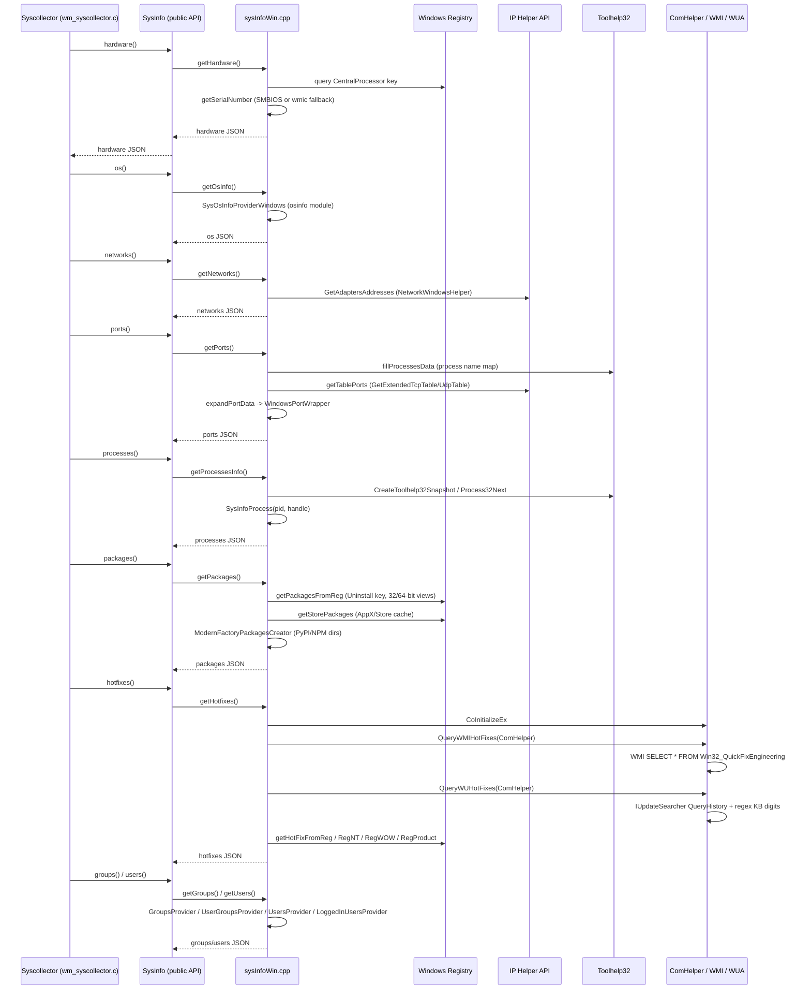
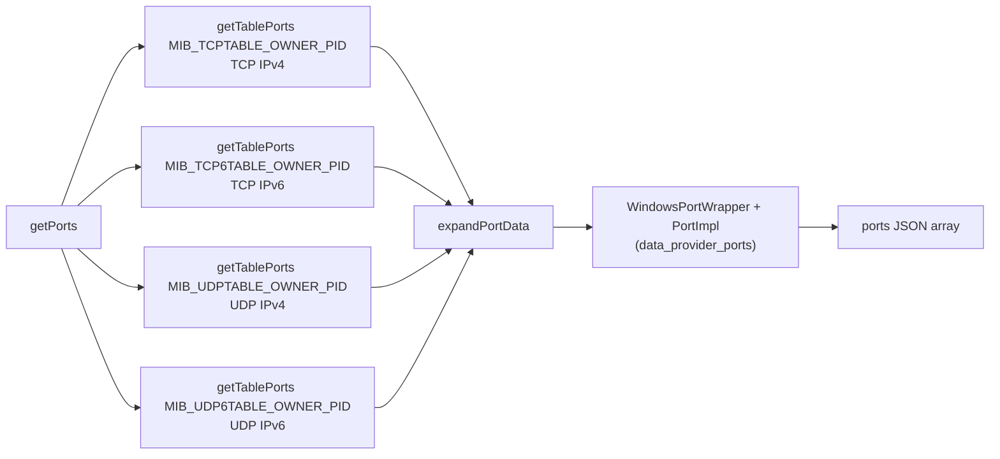
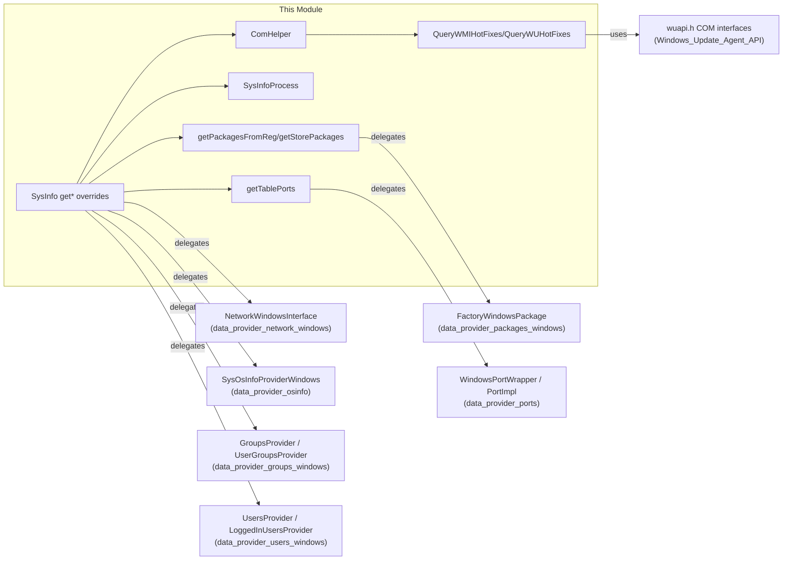

# Data Provider SysInfo Core — Windows

## Introduction

The **`data_provider_sysinfo_core_windows`** module is the Windows-specific implementation layer of the Wazuh `SysInfo` data provider. It supplies the concrete logic that gathers hardware, operating system, network, process, port, package, hotfix, user, and group inventory data on Windows hosts, and exposes a small set of low-level COM/WinAPI helper utilities used to query Windows Management Instrumentation (WMI) and the Windows Update Agent (WUA) for installed hotfixes.

This module is one of three OS-specific backends (`_windows`, `_unix`, and the common `_capi`) that plug into the platform-agnostic [`SysInfo_Provider`](SysInfo_Provider.md) interface declared in `sysInfo.hpp`. It is compiled only on Windows builds and is consumed by the Syscollector Wazuh module (see [`syscollector_module`](syscollector_module.md) and [`syscollector_module_native_daemon`](syscollector_module_native_daemon.md)) to populate the agent's system inventory that is ultimately synchronized to `wazuh-db` and surfaced through the Wazuh API/framework (`framework/wazuh/syscollector.py`, `api/api/controllers/syscollector_controller.py`).

## Purpose & Scope

| Concern | Description |
|---|---|
| **What it does** | Implements every `SysInfo::get*()` virtual method (hardware, OS, networks, ports, processes, packages, hotfixes, groups, users) using native Windows APIs: WinAPI, Registry, IP Helper API (`iphlpapi`), Toolhelp32 snapshots, COM/WMI, and the Windows Update Agent COM interfaces. |
| **Why it exists** | Each supported OS family requires a fundamentally different set of system calls to collect the same categories of inventory data. This module isolates all Windows-only code (COM initialization, registry parsing, `GetExtendedTcpTable`/`GetExtendedUdpTable`, WMI/WUA hotfix queries) behind the common `SysInfo` interface so the rest of the codebase (Syscollector, testtool, other data_provider consumers) remains OS-agnostic. |
| **Where it sits** | It is a leaf implementation module inside the larger `System_Information_Data_Provider_(C++)` component tree, at the same architectural level as `data_provider_sysinfo_core_unix` (the POSIX/macOS/BSD/Solaris counterpart) and `data_provider_sysinfo_core_capi` (the shared C API surface that both platforms plug into). |

## Core Components

| Component | File | Responsibility |
|---|---|---|
| `SysInfo::getHardware/getOsInfo/getNetworks/getPorts/getProcessesInfo/getPackages/getHotfixes/getGroups/getUsers` | `sysInfoWin.cpp` | Overrides of the pure-virtual-like methods declared in `SysInfo` (see [`SysInfo_Provider`](SysInfo_Provider.md)) that perform the actual Windows-specific data collection. |
| `getTablePorts<T, TableClass>` | `sysInfoWin.cpp` | Generic template helper that calls the Windows IP Helper API (`GetExtendedTcpTable`/`GetExtendedUdpTable`) twice — first to size the buffer, then to fill it — for TCP/UDP IPv4/IPv6 port tables. |
| `SysInfoProcess` | `sysInfoWin.cpp` | RAII-style wrapper around a Windows process handle (`HANDLE`) that extracts command line, CPU times, memory usage, and session ID for a single process via `GetProcessImageFileName`, `GetProcessTimes`, and `GetProcessMemoryInfo`. |
| `getPackagesFromReg` / `getStorePackages` | `sysInfoWin.cpp` | Enumerate the Windows Uninstall registry keys and the Windows Store application cache registry to build package inventory entries. |
| `getSerialNumber` / `getCpuName` / `getCpuMHz` / `getCpuCores` / `getMemory` | `sysInfoWin.cpp` | Hardware inventory collectors using SMBIOS firmware tables, the CPU registry key, and `GlobalMemoryStatusEx`. |
| `ComHelper` (`IComHelper`) | `utilsWrapperWin.hpp` / `utilsWrapperWin.cpp` | Thin, mockable wrapper around COM/WMI (`IWbemLocator`, `IWbemServices`) and Windows Update Agent (`IUpdateSearcher`, `IUpdateHistoryEntryCollection`) interfaces, enabling dependency injection for unit testing. |
| `QueryWMIHotFixes` / `QueryWUHotFixes` | `utilsWrapperWin.cpp` | Free functions that use an `IComHelper` implementation to enumerate installed hotfixes via WMI (`Win32_QuickFixEngineering`) and via the Windows Update Agent history, merging results into a `std::set<std::string>`. |
| `ConvertStringToBSTR` (`_com_util` namespace) | `utilsWrapperWin.cpp` | Minimal, dependency-free implementation of a C-string-to-`BSTR` converter, avoiding a full COM support library dependency. |
| `BstrToString` | `utilsWrapperWin.cpp` | Converts a COM `BSTR` (UTF-16) to a standard `std::string` (UTF-8) using `std::wstring_convert`. |

## Architecture

The module sits between the OS-agnostic `SysInfo` public API and raw Windows system calls. It relies on several sibling modules from the broader `System_Information_Data_Provider_(C++)` component (see the "Related Modules" section) for network, package, and port data modeling.

## Class & Interface Relationships

## Data Flow: Building a Complete Inventory Snapshot

This diagram shows how a single Syscollector scan cycle traverses this module's Windows-specific collectors.

## Key Implementation Details

### 1. Port Enumeration (`getTablePorts`)

`getTablePorts` is a generic template used four times (TCP-IPv4, TCP-IPv6, UDP-IPv4, UDP-IPv6) to call the IP Helper API's `GetExtendedTcpTable`/`GetExtendedUdpTable` functions with the standard two-phase pattern:
1. Call with a `nullptr` buffer to discover the required `size`.
2. Allocate a buffer of that size and call again to fill it.

Each resulting table is expanded into JSON entries via `expandPortData`, which delegates per-row formatting to `WindowsPortWrapper` (from the [`data_provider_ports`](data_provider_ports.md) module) through the generic `PortImpl` model.

### 2. Process Inventory (`SysInfoProcess`)

`SysInfoProcess` wraps a process `HANDLE` obtained from `OpenProcess` and:
- Converts `FILETIME` creation/kernel/user times into second-resolution `ULARGE_INTEGER` values, adjusting the creation time from the Windows epoch (1601) to Unix epoch.
- Retrieves memory counters (`PagefileUsage`, `WorkingSetSize`) via `GetProcessMemoryInfo`.
- Resolves the executable path by reading the NT-style kernel path (`GetProcessImageFileName`) and mapping it to a Win32 drive-letter path using a cached `SystemDrivesMap` built from `QueryDosDevice`.

`System Idle Process` (PID 0) and `System` (PID 4) are special-cased since they cannot be opened via `OpenProcess`.

### 3. Package Collection

Packages are gathered from three sources, merged and deduplicated in `SysInfo::getPackages`:
- **Uninstall registry keys** (`getPackagesFromReg`), scanned under both `KEY_WOW64_32KEY` and `KEY_WOW64_64KEY` views to capture 32-bit and 64-bit installed applications, and per-user under `HKEY_USERS`.
- **Windows Store / AppX packages** (`getStorePackages`), which cross-references the AppX cache registry with `FactoryWindowsPackage` (see [`data_provider_packages_windows`](data_provider_packages_windows.md)).
- **Modern language package managers** (PyPI, NPM), by expanding registry-derived install directories (`getPythonDirectories`, `getNodeDirectories`) and delegating to `ModernFactoryPackagesCreator` (see [`data_provider_packages_linux_factory`](data_provider_packages_linux_factory.md) for the shared cross-platform retriever pattern).

### 4. Hotfix Collection via COM (`ComHelper`, `QueryWMIHotFixes`, `QueryWUHotFixes`)

Because direct COM calls are difficult to unit test, all WMI/WUA interactions go through the `IComHelper` interface, implemented by `ComHelper`. This enables tests to substitute a mock implementation. Two independent collection strategies are combined into a single `std::set<std::string>` to avoid duplicates:
- **WMI** query against `Win32_QuickFixEngineering`, extracting the `HotFixID` field.
- **Windows Update Agent (WUA)** history, extracting KB numbers via regex (`KB[0-9]+`) from update titles.

Registry-based fallbacks (`getHotFixFromReg`, `getHotFixFromRegNT`, `getHotFixFromRegWOW`, `getHotFixFromRegProduct` from `PackageWindowsHelper`) supplement the COM-based results for maximum coverage across Windows versions.

### 5. String/COM Conversion Utilities

- `_com_util::ConvertStringToBSTR` — a lightweight, dependency-free ANSI-to-`BSTR` converter used where a minimal COM string bridge is needed without linking a full COM utility library.
- `BstrToString` — converts a `BSTR` (UTF-16) into a UTF-8 `std::string` for JSON serialization.

## Component Interaction Diagram

## Testing

Because native COM/registry/WinAPI calls are hard to exercise directly, this module's logic is validated through wrapper abstractions and mocks in the shared test infrastructure:
- `IComHelper` / `ComHelper` allow WMI and WUA calls to be mocked in unit tests without a live Windows environment.
- Higher-level SysInfo behavior (independent of OS) is covered by [`Unit_Tests_-_Shared_Library`](Unit_Tests_-_Shared_Library.md)'s `test_sysinfo_utils` suite and the `src/unit_tests/wrappers/wazuh/data_provider/sysInfo_wrappers.c` mocks used throughout the C daemon test suites (e.g., `wm_control_getPrimaryIP_sysinfo_network_*` tests in [`Unit_Tests_-_Wazuh_Modules_(Cloud_Misc)`](Unit_Tests_-_Wazuh_Modules_(Cloud_Misc).md)).

## Related Modules

- [`SysInfo_Provider`](SysInfo_Provider.md) — the platform-agnostic `SysInfo` class and public interface that this module implements for Windows.
- [`data_provider_sysinfo_core_unix`](data_provider_sysinfo_core_unix.md) — the POSIX/macOS/BSD/Solaris sibling implementation of the same interface (Linux, macOS, FreeBSD, OpenBSD, Solaris variants).
- [`data_provider_sysinfo_core_capi`](data_provider_sysinfo_core_capi.md) — the C API surface (`sysinfo_hardware`, `sysinfo_networks`, etc.) exposed to non-C++ consumers, wrapping the `SysInfo` class used by this module.
- [`data_provider_network_windows`](data_provider_network_windows.md) — `NetworkWindowsInterface` / `WindowsNetworkImpl` used by `getNetworks()`.
- [`data_provider_packages_windows`](data_provider_packages_windows.md) — `FactoryWindowsPackage`, `AppxWindowsWrapper`, `WindowsPackageImpl` used by `getPackages()`.
- [`data_provider_ports`](data_provider_ports.md) — `WindowsPortWrapper` / `PortTables` used by `getPorts()`.
- [`data_provider_osinfo`](data_provider_osinfo.md) — `SysOsInfoProviderWindows` used by `getOsInfo()`.
- [`data_provider_groups_windows`](data_provider_groups_windows.md) and [`data_provider_users_windows`](data_provider_users_windows.md) — group/user providers used by `getGroups()`/`getUsers()`.
- [`data_provider_wrappers_windows`](data_provider_wrappers_windows.md) — lower-level Windows API wrapper primitives (`WindowsApiWrapper`, `WinBaseApiWrapper`, `GroupsHelper`, `UsersHelper`) consumed transitively by the provider classes above.
- [`Windows_Update_Agent_API`](Windows_Update_Agent_API.md) — the `wuapi.h` COM interface declarations (`IUpdateSearcher`, `IUpdateHistoryEntryCollection`, etc.) used by `ComHelper`/`QueryWUHotFixes`.
- [`syscollector_module`](syscollector_module.md) and [`syscollector_module_native_daemon`](syscollector_module_native_daemon.md) — the primary consumer daemon/module that invokes `SysInfo` to populate inventory data synced through `wazuh_db`.
- [`data_provider_testtool`](data_provider_testtool.md) — CLI test tool (`main.cpp`, `CmdLineActions`) that can invoke this module's collectors directly for manual verification on Windows hosts.
