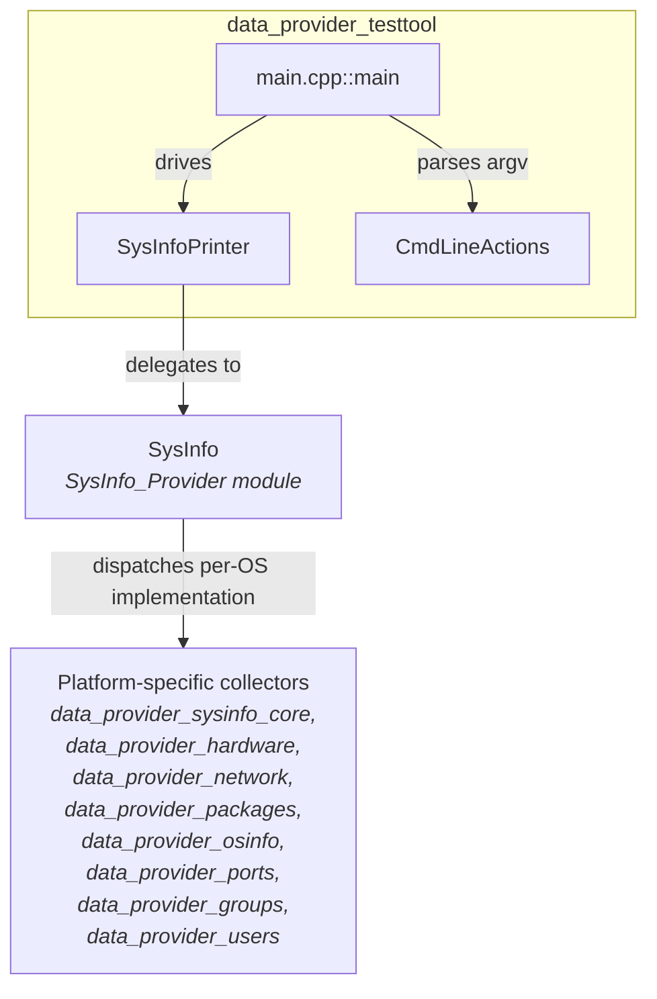
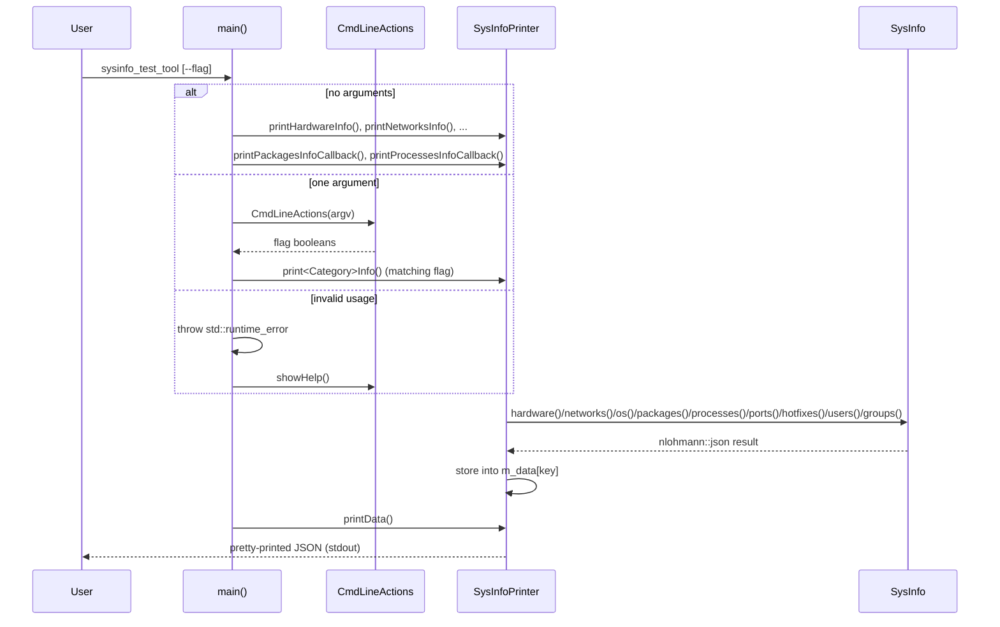

# Data Provider Test Tool

## 1. Purpose

The **`data_provider_testtool`** module is a small, self-contained **command-line diagnostic utility** (`sysinfo_test_tool`) that exercises the [`SysInfo`](SysInfo_Provider.md) library — the core C++ facade of the [System Information Data Provider](System_Information_Data_Provider_(C++).md) subsystem.

Its sole responsibility is to:
1. Parse a single optional CLI flag that selects which category of system information to retrieve (hardware, network, OS, packages, processes, ports, hotfixes, users, groups).
2. Invoke the corresponding `SysInfo` accessor (either the synchronous JSON-returning API or the callback-based streaming API).
3. Pretty-print the resulting JSON document to standard output.

This tool has **no production runtime role**; it exists purely to let developers and QA engineers manually validate — on any supported platform (Linux, Windows, macOS, BSD, Solaris) — that the underlying data-provider library correctly collects and serializes system inventory data. It is typically used during development, in CI smoke tests, and for troubleshooting on customer systems.

## 2. Architecture Overview

The tool is intentionally minimal: two files implement a classic **Command pattern** (`CmdLineActions`) feeding a thin **presentation layer** (`SysInfoPrinter`) that calls into the shared `SysInfo` library.



**Key design points:**

- **`CmdLineActions`** (`cmdLineActions.h`) is a small immutable value object. On construction it inspects `argv[1]` once and stores a boolean flag per supported action (`--hardware`, `--networks`, `--packages`, `--processes`, `--ports`, `--os`, `--hotfixes`, `--users`, `--groups`, `--packages-cb`, `--processes-cb`). It also exposes a static `showHelp()` used for usage/error output.
- **`SysInfoPrinter`** (`main.cpp`) owns a `SysInfo` instance and an internal `nlohmann::json m_data` accumulator. Each `print*Info()` method calls the matching `SysInfo` getter and stores the result under a named JSON key (e.g. `"hw"`, `"networks"`, `"os"`). `printData()` serializes the accumulated document with 2-space indentation.
- **`main()`** implements the CLI contract:
  - **No arguments**: runs *all* categories (default full inventory dump), including both callback-based variants for packages/processes.
  - **One argument**: dispatches to the single matching `CmdLineActions` flag.
  - **More than one argument** or an **unrecognized flag**: throws a `std::runtime_error`, catches it at the top level, prints the error and the CLI help text (`CmdLineActions::showHelp()`).

## 3. Process / Data Flow



## 4. Core Components

| Component | File | Responsibility |
|---|---|---|
| `CmdLineActions` | `src/data_provider/testtool/cmdLineActions.h` | Parses and exposes the single CLI action flag; prints usage help. |
| `SysInfoPrinter` | `src/data_provider/testtool/main.cpp` | Wraps a `SysInfo` instance, invokes the relevant accessor(s), and accumulates/prints results as JSON. |
| `main` | `src/data_provider/testtool/main.cpp` | Entry point; argument-count dispatch, error handling, and orchestration of `CmdLineActions` + `SysInfoPrinter`. |

### 4.1 Supported Actions

| Flag | Effect |
|---|---|
| *(none)* | Prints hardware, networks, OS, packages, processes, ports, hotfixes, users, plus packages/processes via callback — the complete inventory. |
| `--hardware` | CPU/board/memory info via `SysInfo::hardware()`. |
| `--networks` | Network interfaces via `SysInfo::networks()`. |
| `--os` | Operating system info via `SysInfo::os()`. |
| `--packages` | Installed packages via `SysInfo::packages()`. |
| `--packages-cb` | Installed packages streamed via the callback overload `SysInfo::packages(std::function<...>)`. |
| `--processes` | Running processes via `SysInfo::processes()`. |
| `--processes-cb` | Running processes streamed via the callback overload `SysInfo::processes(std::function<...>)`. |
| `--ports` | Open network ports via `SysInfo::ports()`. |
| `--hotfixes` | Installed hotfixes (Windows) via `SysInfo::hotfixes()`. |
| `--users` | System users via `SysInfo::users()`. |
| `--groups` | System groups via `SysInfo::groups()`. |

## 5. Relationship to the Broader Data Provider

`data_provider_testtool` is a **leaf consumer** module: it depends on, but is not depended upon by, any other module in the `System_Information_Data_Provider_(C++)` component tree. All actual data-collection logic — OS-specific parsing, hardware/network/package/port enumeration — lives in sibling modules and is reached exclusively through the `SysInfo` facade:

- [`SysInfo_Provider`](SysInfo_Provider.md) — the `SysInfo` façade class itself (`sysInfo.hpp`), the single API surface this tool calls.
- [`data_provider_sysinfo_core`](data_provider_sysinfo_core.md) — platform dispatch (`sysInfo.cpp` and per-OS `sysInfo*.cpp` files) that `SysInfo` delegates to internally.
- [`data_provider_hardware`](data_provider_hardware.md) — hardware family factories used by `hardware()`.
- [`data_provider_network`](data_provider_network.md) — network interface factories used by `networks()`.
- [`data_provider_packages`](data_provider_packages.md) — package retrieval used by `packages()` (both sync and callback forms).
- [`data_provider_osinfo`](data_provider_osinfo.md) — OS parsers used by `os()`.
- [`data_provider_ports`](data_provider_ports.md) — port table helpers used by `ports()`.
- [`data_provider_groups`](data_provider_groups.md) — group enumeration used by `groups()`.
- [`data_provider_users`](data_provider_users.md) — user enumeration used by `users()`.
- [`data_provider_wrappers_unix`](data_provider_wrappers_unix.md) / [`data_provider_wrappers_windows`](data_provider_wrappers_windows.md) — low-level OS API wrappers used transitively by the above.

Because the test tool depends only on the public `SysInfo` interface, it remains stable even as the internal collector implementations evolve per platform — making it a reliable, lightweight smoke-test harness for the whole data-provider subsystem.

## 6. Usage Example

```
$ ./sysinfo_test_tool --os
{
  "os": {
    "os_name": "...",
    "os_version": "...",
    ...
  }
}

$ ./sysinfo_test_tool
{
  "hw": { ... },
  "networks": { ... },
  "os": { ... },
  "packages": { ... },
  "ports": { ... },
  "processes": { ... },
  "hotfixes": { ... },
  "users": { ... },
  "packages_cb": [ ... ],
  "processes_cb": [ ... ]
}

$ ./sysinfo_test_tool --bogus
Error getting system information: Action value: --bogus not found.

Usage: sysinfo_test_tool [options]
Options:
        <without args>  Prints the complete Operating System information.
        --hardware      Prints the current Operating System hardware information.
        ...
```

## 7. Notes for Maintainers

- Adding a new inventory category requires three coordinated changes: (1) a new getter on `SysInfo` (see [`SysInfo_Provider`](SysInfo_Provider.md)), (2) a new `constexpr` action string + boolean flag + accessor in `CmdLineActions`, and (3) a new `print<Category>Info()` method plus a branch in `main()`.
- The tool only supports **one action flag at a time** (or none, for "all"); passing multiple arguments is treated as invalid usage and triggers the help text.
- All output goes through a single shared `nlohmann::json` document, so keys must remain unique across the categories printed in the "no arguments" default path.
