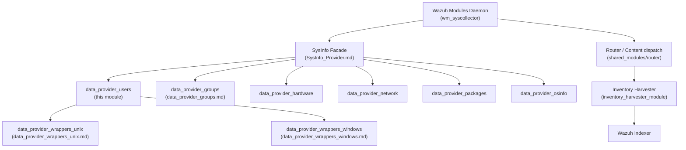
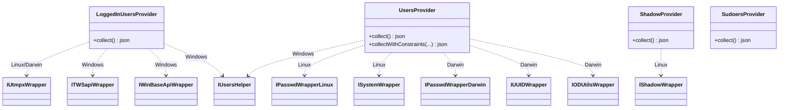
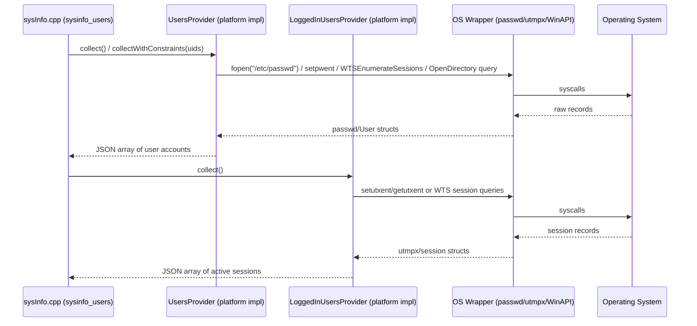

# Data Provider — Users Module

## Introduction

The **`data_provider_users`** module is part of the C++ **System Information Data Provider** (`src/data_provider`), the library responsible for collecting host inventory information that feeds Wazuh's Syscollector and related inventory/vulnerability pipelines. This particular module focuses exclusively on **user-related host inventory data**:

* **Logged-in users** — who is currently logged into the system, from which terminal/host, and since when.
* **Local/remote user accounts** — the full list of user accounts defined on the system (UID/GID, home directory, shell, description, etc.).
* **Shadow password metadata** (Linux) — password aging/status information from `/etc/shadow`, without exposing the actual password hash.
* **Sudoers configuration** (Unix) — parsed content of `/etc/sudoers` (and included files), describing which users/groups can run commands with elevated privileges.

All providers return their results as `nlohmann::json` documents so that they can be consumed uniformly by the higher-level `SysInfo` facade (see [SysInfo_Provider.md](SysInfo_Provider.md)) and ultimately published to the Wazuh Manager/Indexer through the syscollector/inventory-harvester pipeline.

## Purpose in the Overall System

Each platform-specific `UsersProvider` / `LoggedInUsersProvider` implementation is compiled conditionally depending on the target OS (Linux, macOS/Darwin, Windows), and is invoked by the platform-neutral `sysInfo_*` glue code (`sysinfo_users` in `src/data_provider/src/sysInfo.cpp`, see [data_provider_sysinfo_core.md](data_provider_sysinfo_core.md)) to build the aggregated inventory snapshot that is periodically synchronized to the backend.

## Architecture Overview

The module follows a **Strategy pattern per operating system**: each provider class exposes the same conceptual `collect()` (and, where relevant, `collectWithConstraints()`) API, but the concrete implementation differs per platform because the underlying OS APIs (`utmpx`, `/etc/passwd`, Win32 WTS/LSA APIs, OpenDirectory, etc.) are entirely different. All OS-level calls are abstracted behind small wrapper interfaces (`IUtmpxWrapper`, `IPasswdWrapperLinux`, `ISystemWrapper`, `IShadowWrapper`, `IUsersHelper`, `ITWSapiWrapper`, etc.) that live in the sibling [data_provider_wrappers_unix](data_provider_wrappers_unix.md) and [data_provider_wrappers_windows](data_provider_wrappers_windows.md) modules. This enables dependency injection and unit-testability without touching real system state.

### High-Level Data Flow

## Sub-modules

Because the implementation is split per operating system (with a small Unix-shared component), documentation is organized into the following sub-modules:

| Sub-module | Scope | Documentation |
|---|---|---|
| **Linux Users Providers** | `logged_in_users_linux`, `users_linux`, `shadow_linux` — session (`utmpx`), account (`/etc/passwd`), and shadow (`/etc/shadow`) data collection on Linux. | [data_provider_users_linux.md](data_provider_users_linux.md) |
| **Darwin (macOS) Users Providers** | `logged_in_users_darwin`, `users_darwin` — session (`utmpx`) and account (passwd + OpenDirectory + UUID) data collection on macOS. | [data_provider_users_darwin.md](data_provider_users_darwin.md) |
| **Windows Users Providers** | `logged_in_users_win`, `users_windows` — session data via Terminal Services / WinAPI, and local account data via `IUsersHelper`. | [data_provider_users_windows.md](data_provider_users_windows.md) |
| **Unix Shared: Sudoers** | `sudoers_unix` — recursive parsing of `/etc/sudoers` and `#include`d files, shared by Linux and macOS. | [data_provider_users_sudoers.md](data_provider_users_sudoers.md) |

## Related Modules

* [data_provider_groups.md](data_provider_groups.md) — sibling module collecting OS group and user-group membership information; frequently consumed together with this module (e.g., to enrich user records with group names).
* [data_provider_wrappers_unix.md](data_provider_wrappers_unix.md) — Unix/Linux/Darwin low-level OS API wrappers (`utmpx`, `passwd`, `shadow`, OpenDirectory, UUID) used by this module's providers.
* [data_provider_wrappers_windows.md](data_provider_wrappers_windows.md) — Windows-specific low-level API wrappers (WTS/Terminal Services, LSA/SDDL, Win32 Base API, `UsersHelper`) used by the Windows providers.
* [data_provider_sysinfo_core.md](data_provider_sysinfo_core.md) — the platform-neutral glue (`sysInfo.cpp`, `sysInfoLinux.cpp`, `sysInfoMac.cpp`, `sysInfoWin.cpp`) that invokes these providers and assembles the final inventory payload exposed via `SysInfo`.
* [SysInfo_Provider.md](SysInfo_Provider.md) — the public `SysInfo` facade class that exposes `getUsers()` / related APIs consumed by the Wazuh Modules Daemon (`wm_syscollector`).
* [inventory_harvester_module](inventory_harvester_module.md) — downstream consumer that maps collected user/group inventory events (`UserElement`, `GroupElement`) into the Wazuh Indexer's inventory schema.

## Key Design Notes

* **Dependency Injection for Testability**: Every provider has a default constructor (using the real OS wrapper implementations) and a constructor accepting injected wrapper interfaces, enabling deterministic unit tests without touching the real OS.
* **JSON as the Universal Output Format**: All `collect()` methods return `nlohmann::json`, keeping the interface OS-agnostic and simplifying downstream aggregation in `SysInfo`.
* **Constraint-based Filtering**: `UsersProvider::collectWithConstraints(...)` (Linux/Darwin/Windows) allows callers (e.g. `SysInfo`) to request only specific usernames/UIDs, which is useful for on-demand queries instead of full inventory scans.
* **Security-conscious Shadow Handling**: `ShadowProvider` intentionally avoids exposing the raw password hash value; it only reports a `password_status` classification (`empty`, `not_set`, `locked`, `active`) and the hashing algorithm identifier when detectable.
