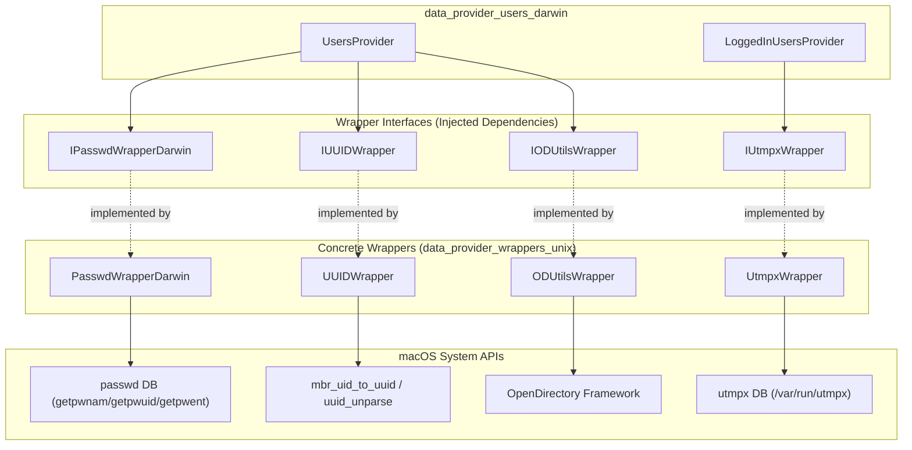
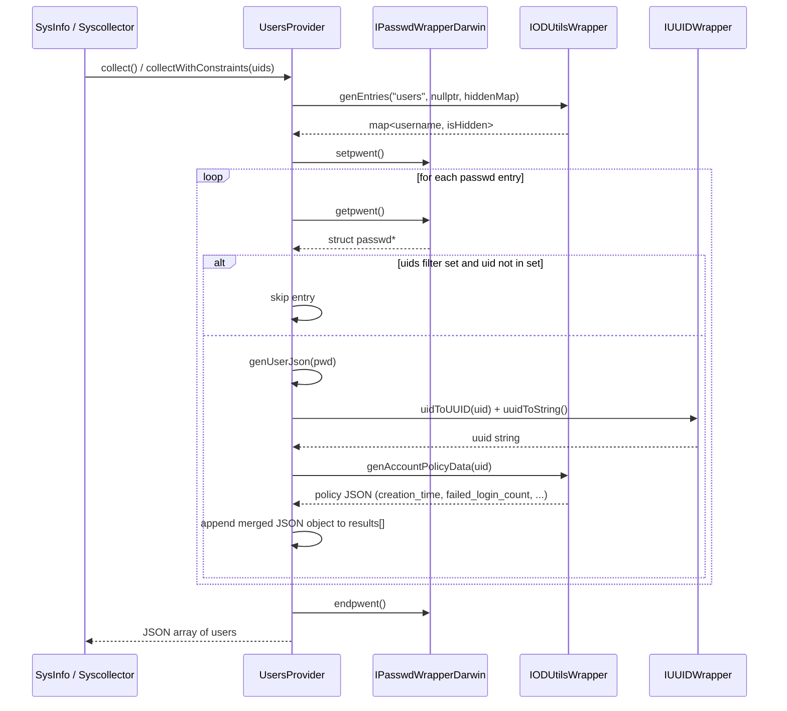
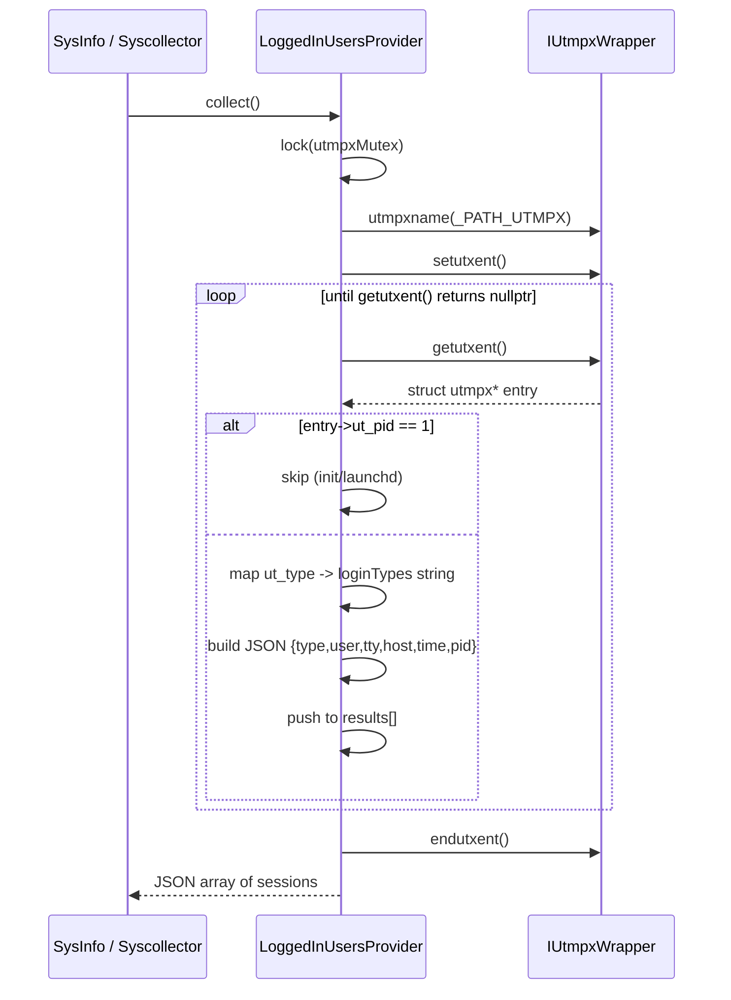
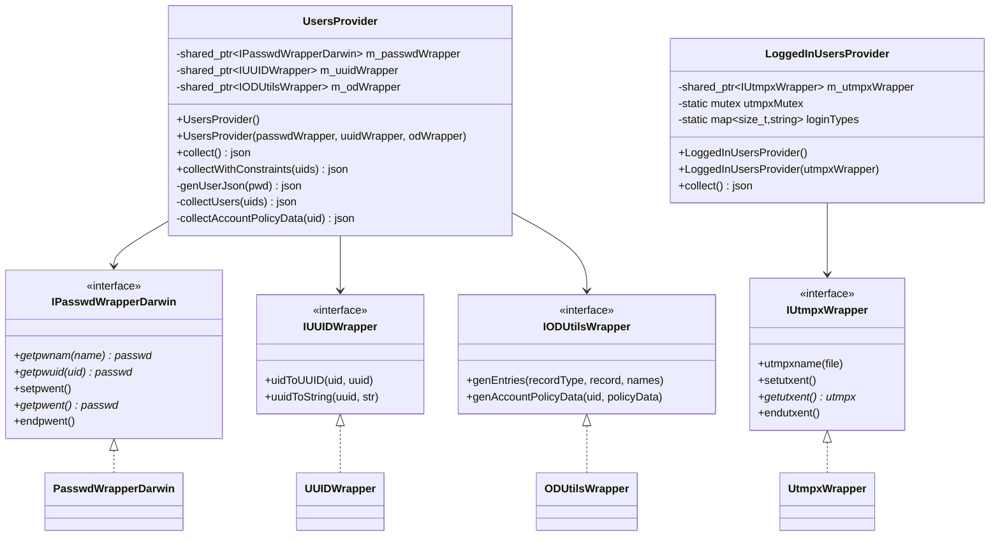
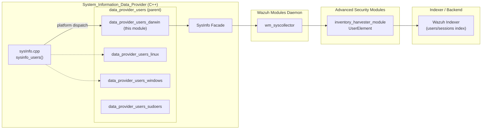

# Data Provider — Users (Darwin/macOS)

## Introduction

The **`data_provider_users_darwin`** module is the macOS-specific implementation of Wazuh's user-information data provider. It is part of the broader [System Information Data Provider (C++)](System_Information_Data_Provider_(C++).md) subsystem, which is responsible for gathering host inventory data (users, groups, processes, packages, network interfaces, etc.) that feeds Wazuh's Syscollector and Inventory Harvester modules.

This module provides two focused capabilities on Darwin/macOS hosts:

1. **`UsersProvider`** — Enumerates local system user accounts (from the BSD `passwd` database) enriched with macOS-specific identity data (UUID) and OpenDirectory account-policy attributes (creation time, failed login count/timestamp, password last-set time).
2. **`LoggedInUsersProvider`** — Enumerates currently and historically logged-in user sessions from the `utmpx` session database, classifying each entry by login/session type (e.g., `user`, `login`, `boot_time`).

Both providers return data as `nlohmann::json` structures, which are consumed by the higher-level `SysInfo` facade (see [`SysInfo_Provider`](SysInfo_Provider.md)) and ultimately surfaced through Syscollector's user/session inventory tables and the Inventory Harvester's `UserElement` (see [`inventory_harvester_module`](inventory_harvester_module.md)).

The module follows Wazuh's data-provider design pattern of **wrapper injection**: all OS/library calls (`getpwnam`, `getpwuid`, `utmpx*`, OpenDirectory queries, UUID conversion) are abstracted behind interfaces so that unit tests can substitute mocks, keeping the providers fully testable without requiring a real macOS environment.

---

## Module Purpose & Scope

| Aspect | Description |
|---|---|
| **Platform** | Apple Darwin / macOS only |
| **Language** | C++ |
| **Primary Outputs** | JSON arrays/objects describing OS user accounts and logged-in sessions |
| **Consumers** | `SysInfo` facade, Syscollector daemon, Inventory Harvester (`UserElement`) |
| **Sibling Modules** | [`data_provider_users_linux`](data_provider_users_linux.md), [`data_provider_users_windows`](data_provider_users_windows.md), [`data_provider_users_sudoers`](data_provider_users_sudoers.md) |
| **Parent Module** | [`data_provider_users`](data_provider_users.md) |

---

## Components

### 1. `UsersProvider` (`users_darwin.hpp`)

Collects OS-level user account information by combining three data sources:

- **BSD `passwd` database** — via `IPasswdWrapperDarwin` (login name, UID, GID, home directory, shell, GECOS field).
- **UUID subsystem** — via `IUUIDWrapper`, converting a UID into a macOS-native UUID string (`mbr_uid_to_uuid` + `uuid_unparse`).
- **OpenDirectory** — via `IODUtilsWrapper`, querying the `accountPolicyData` attribute for extended account policy metadata (creation time, failed login count/timestamp, password last-set time) and record visibility (hidden/system accounts).

**Public API:**

| Method | Purpose |
|---|---|
| `UsersProvider()` | Default constructor; wires up concrete `PasswdWrapperDarwin`, `UUIDWrapper`, `ODUtilsWrapper` implementations. |
| `UsersProvider(passwdWrapper, uuidWrapper, odWrapper)` | Dependency-injection constructor used primarily by unit tests. |
| `nlohmann::json collect()` | Returns a JSON array with **all** system users. |
| `nlohmann::json collectWithConstraints(const std::set<uid_t>& uids)` | Returns a JSON array filtered to the given UID set. |

**Private helpers:**

- `genUserJson(const struct passwd*)` — builds the per-user JSON object (username, uid, gid, description, directory, shell, uuid, `is_hidden`).
- `collectUsers(const std::set<uid_t>&)` — iterates the passwd database (optionally filtered) and merges in OpenDirectory hidden-record data.
- `collectAccountPolicyData(uid_t)` — retrieves and formats the OpenDirectory account-policy JSON fragment for a single UID.

### 2. `LoggedInUsersProvider` (`logged_in_users_darwin.hpp` / `.cpp`)

Reads the `utmpx` session accounting database (`/var/run/utmpx`) to report both active and historical login events.

**Public API:**

| Method | Purpose |
|---|---|
| `LoggedInUsersProvider()` | Default constructor; wires up a concrete `UtmpxWrapper`. |
| `LoggedInUsersProvider(std::shared_ptr<IUtmpxWrapper>)` | Dependency-injection constructor for testing. |
| `nlohmann::json collect()` | Iterates all `utmpx` records and returns a JSON array of session entries. |

**Behavior details:**

- Uses a static `std::mutex` (`utmpxMutex`) to serialize access to the non-reentrant `utmpx*` C API across threads.
- Skips the `PID == 1` (`init`/`launchd`) housekeeping record.
- Maps the numeric `ut_type` field to a human-readable string via the static `loginTypes` table: `empty`, `boot_time`, `new_time`, `old_time`, `init`, `login`, `user`, `dead` (defaults to `"unknown"` for unrecognized types).
- Emits per-record fields: `type`, `user`, `tty`, `host`, `time` (epoch seconds), `pid`.

### 3. Supporting Wrapper Interfaces (Darwin-specific)

These live in [`data_provider_wrappers_unix`](data_provider_wrappers_unix.md) but are the direct collaborators of this module's providers:

| Wrapper | Interface | Wraps |
|---|---|---|
| `PasswdWrapperDarwin` | `IPasswdWrapperDarwin` | `getpwnam`, `getpwuid`, `setpwent`, `getpwent`, `endpwent` |
| `UUIDWrapper` | `IUUIDWrapper` | `mbr_uid_to_uuid`, `uuid_unparse` |
| `ODUtilsWrapper` | `IODUtilsWrapper` | OpenDirectory `genEntries` (record enumeration/hidden flag) and `genAccountPolicyData` (plist-based account policy parsing) |
| `UtmpxWrapper` | `IUtmpxWrapper` (shared with Linux, in `iutmpx_wrapper.hpp`) | `utmpxname`, `setutxent`, `getutxent`, `endutxent` |

---

## Architecture

---

## Data Flow

### UsersProvider.collect() Flow

### LoggedInUsersProvider.collect() Flow

---

## Component Relationships

---

## Integration with the Broader System

The Darwin providers are selected at compile time as part of the platform-specific implementation of `sysInfo_users` (see [`data_provider_sysinfo_core`](data_provider_sysinfo_core.md)). The resulting JSON feeds:

- **Syscollector** (`wm_syscollector`, see [`syscollector_module`](syscollector_module.md) and [`wazuh_modules_core`](Wazuh_Modules_Daemon_(C).md)), which persists user/session state into `wdb` tables (`sys_users`, session records).
- **Inventory Harvester's `UserElement`** (see [`inventory_harvester_module`](inventory_harvester_module.md)), which transforms this data into indexer documents for the Wazuh Indexer (`InventoryUserHarvester`).

---

## Design Patterns

- **Dependency Injection / Wrapper Pattern**: All macOS/BSD system calls are hidden behind interfaces (`IPasswdWrapperDarwin`, `IUUIDWrapper`, `IODUtilsWrapper`, `IUtmpxWrapper`), letting unit tests substitute mocks and avoid depending on live system state. Default constructors wire up real implementations, while parameterized constructors support test injection.
- **Facade over multiple data sources**: `UsersProvider` aggregates three otherwise-unrelated APIs (passwd, UUID, OpenDirectory) into one cohesive user record.
- **Static Synchronization**: `LoggedInUsersProvider` uses a static mutex because the `utmpx*` C API is process-global and not thread-safe; the mutex ensures serialized access even across multiple `LoggedInUsersProvider` instances.
- **JSON as Interchange Format**: Both providers return `nlohmann::json`, consistent with the rest of the data-provider ecosystem (see [`data_provider_sysinfo_core`](data_provider_sysinfo_core.md)), simplifying downstream serialization to the sysinfo API and Syscollector deltas.

---

## Related Modules

| Module | Relationship |
|---|---|
| [`data_provider_users`](data_provider_users.md) | Parent grouping covering cross-platform user providers. |
| [`data_provider_users_linux`](data_provider_users_linux.md) | Equivalent Linux implementation (passwd/shadow based). |
| [`data_provider_users_windows`](data_provider_users_windows.md) | Equivalent Windows implementation (via WinAPI). |
| [`data_provider_users_sudoers`](data_provider_users_sudoers.md) | Related provider for `sudoers` privilege data (Unix). |
| [`data_provider_wrappers_unix`](data_provider_wrappers_unix.md) | Supplies the concrete wrapper implementations used here. |
| [`data_provider_groups_darwin`](data_provider_groups_darwin.md) | Sibling module providing macOS group/user-group data, often correlated with user records. |
| [`SysInfo_Provider`](SysInfo_Provider.md) | Facade that dispatches to this module on Darwin hosts. |
| [`data_provider_sysinfo_core`](data_provider_sysinfo_core.md) | Core `sysInfo.cpp`/platform dispatch logic invoking these providers. |
| [`syscollector_module`](syscollector_module.md) | Consumes user/session inventory produced indirectly via `SysInfo`. |
| [`inventory_harvester_module`](inventory_harvester_module.md) | Consumes and indexes user inventory data (`UserElement`, `InventoryUserHarvester`). |

---

## Summary

The `data_provider_users_darwin` module cleanly separates **what** user/session data is collected (`UsersProvider`, `LoggedInUsersProvider`) from **how** it is retrieved from the operating system (injected wrapper interfaces). This separation keeps the module testable and maintainable while integrating seamlessly into Wazuh's larger inventory pipeline — from raw OS queries, through `SysInfo`, into Syscollector state and the Inventory Harvester's indexed documents.
