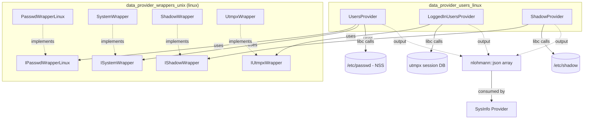
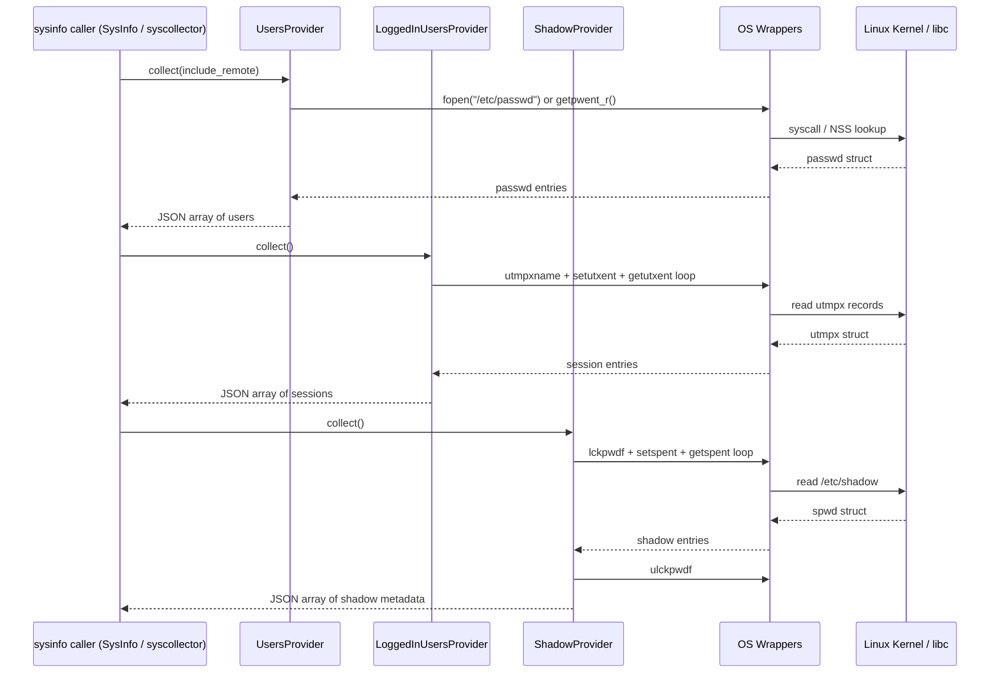
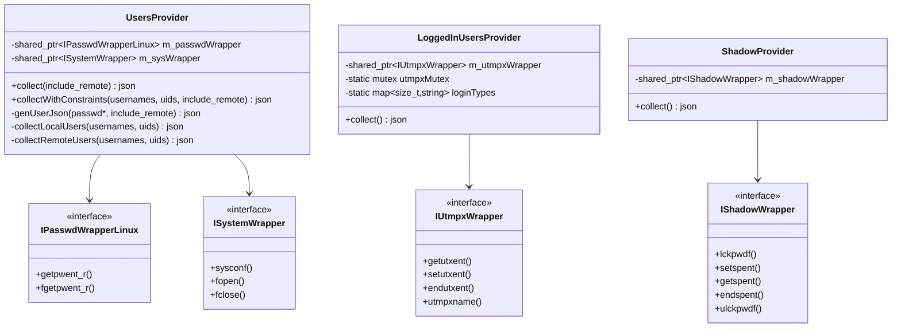
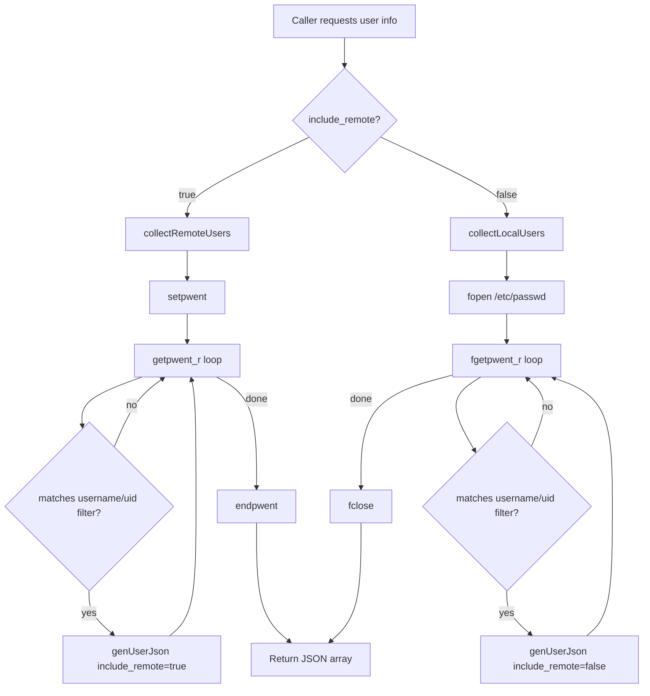

# Data Provider Users (Linux)

## Introduction

The **data_provider_users_linux** module is the Linux-specific implementation of user-related information collection within the Wazuh System Information Data Provider (`sysinfo`) subsystem. It is responsible for gathering three categories of operating-system identity data directly from native Linux system interfaces:

1. **Local and remote user accounts** — retrieved from `/etc/passwd` and the NSS (Name Service Switch) passwd database.
2. **Currently logged-in user sessions** — retrieved from the `utmpx` session accounting database.
3. **Shadow password/account-aging metadata** — retrieved from the `/etc/shadow` database.

This module is a leaf component in the broader `data_provider_users` family (which also contains Darwin, Windows, and cross-platform "sudoers" variants). It follows the same architectural pattern used throughout the `System_Information_Data_Provider_(C++)` module: a thin **Provider** class that owns the collection logic, and a **Wrapper** interface/implementation pair that isolates direct OS/libc calls for testability.

## Purpose and Core Functionality

The module exposes three independent, single-responsibility providers, each returning results as a `nlohmann::json` array so they can be seamlessly merged into the broader `sysinfo` JSON payload consumed by `SysInfo::users()` and related APIs (see [SysInfo_Provider](SysInfo_Provider.md)).

| Provider | Source File(s) | System API | Output |
|---|---|---|---|
| `UsersProvider` | `users_linux.hpp/.cpp` | `/etc/passwd` (direct read) and `getpwent_r`/`fgetpwent_r` (NSS) | Array of user objects: uid, gid, username, description, home dir, shell |
| `LoggedInUsersProvider` | `logged_in_users_linux.hpp`, `logged_in_users_linux.cpp` | `utmpx` API (`getutxent`, `setutxent`, `endutxent`) | Array of session objects: type, user, tty, time, pid, host (IPv4/IPv6) |
| `ShadowProvider` | `shadow_linux.hpp`, `shadow_linux.cpp` | `/etc/shadow` via `getspent`/`setspent`/`lckpwdf` | Array of shadow entries: password aging fields, password status, hash algorithm |

All three providers share these design characteristics:
- **Dependency Injection** via wrapper interfaces (`IPasswdWrapperLinux`, `IUtmpxWrapper`, `IShadowWrapper`, `ISystemWrapper`), enabling unit testing without touching real system state.
- **Default constructors** that wire up production wrapper implementations, while a parameterized constructor accepts injected (mock) wrappers.
- **JSON-first design**: all outputs use `nlohmann::json`, matching the format expected by the syscollector/inventory pipeline.
- **Thread-safety** where relevant (e.g., `LoggedInUsersProvider` guards `utmpx` access with a static mutex since the underlying C API is not reentrant).

## Architecture

For related platform-specific variants, see:
- [data_provider_users_darwin](data_provider_users_darwin.md)
- [data_provider_users_windows](data_provider_users_windows.md)
- [data_provider_users_sudoers](data_provider_users_sudoers.md)

For the broader groups (non-user) equivalent, see [data_provider_groups_linux](data_provider_groups_linux.md).

For shared OS abstraction primitives used across all platforms, see [data_provider_wrappers_unix](data_provider_wrappers_unix.md).

## Component Details

### 1. UsersProvider (`users_linux.hpp` / `users_linux.cpp`)

Responsible for enumerating user accounts. It supports two collection strategies:

- **Local-only collection** (`collectLocalUsers`): Parses `/etc/passwd` directly using `fopen`/`fgetpwent_r`, bypassing NSS. Useful when only file-based (local) accounts are desired (e.g., excluding LDAP/NIS-provided remote accounts).
- **Remote-inclusive collection** (`collectRemoteUsers`): Uses `getpwent_r`/`setpwent`/`endpwent`, which goes through the full NSS chain (files, LDAP, SSSD, etc.), returning both local and remote-resolved accounts.

Public API:
- `collect(bool include_remote = true)` — collects all users.
- `collectWithConstraints(usernames, uids, include_remote)` — filtered collection, restricting results to a specified set of usernames and/or UIDs. This is used to efficiently answer targeted queries (e.g., "give me info only for uid 1000") without loading and filtering the entire passwd database downstream.

Each user record (`genUserJson`) includes: `uid`, `gid`, signed variants (`uid_signed`, `gid_signed`), `username`, `description` (GECOS field), `directory` (home), `shell`, a placeholder `pid_with_namespace` (always `"0"` on Linux, relevant for container-aware queries on other platforms), and an `include_remote` flag indicating which collection path produced the record.

Buffer sizing for reentrant passwd calls is capped at `MAX_GETPW_R_BUF_SIZE` (16 KB) even if `sysconf(_SC_GETPW_R_SIZE_MAX)` reports a larger recommended value, to bound memory usage.

### 2. LoggedInUsersProvider (`logged_in_users_linux.hpp` / `logged_in_users_linux.cpp`)

Enumerates currently active login sessions by iterating the `utmpx` database (typically backed by `/var/run/utmp` or equivalent, opened via `utmpxname(_PATH_UTMPX)`).

Key behaviors:
- Skips the `PID == 1` entry (init/systemd boot pseudo-record).
- Maps numeric `ut_type` values to human-readable strings via a static `loginTypes` table (`empty`, `boot_time`, `new_time`, `old_time`, `init`, `login`, `user`, `dead`).
- Extracts `user`, `tty` (`ut_line`), `time` (`ut_tv.tv_sec`), and `pid`.
- Resolves the session's origin host address, handling both **IPv4** (`ut_addr_v6[1..3] == 0`) and **IPv6** formats stored in the `ut_addr_v6` field, converting to human-readable form using `inet_ntop`.
- Uses a static `std::mutex` (`utmpxMutex`) to serialize access, because the underlying `getutxent`/`setutxent`/`endutxent` calls operate on process-global state and are not thread-safe.

### 3. ShadowProvider (`shadow_linux.hpp` / `shadow_linux.cpp`)

Reads password aging and status metadata from the shadow password database.

Key behaviors:
- Acquires an exclusive lock via `lckpwdf()` before reading, and releases it with `ulckpwdf()` afterward, to prevent conflicting concurrent modifications (e.g., by `passwd(1)`).
- Iterates entries with `setspent()`/`getspent()`/`endspent()`.
- Converts `sp_lstchg` (days since epoch) to seconds (`SECONDS_PER_DAY = 86400`) for the `last_change` field.
- Emits aging fields: `min`, `max`, `warning`, `inactive`, `expire`.
- Derives a `password_status` classification from the password hash field (`sp_pwdp`):
  - `empty` — empty string.
  - `not_set` — `"!!"` sentinel.
  - `locked` — prefixed with `!`, `*`, or `x`.
  - `active` — otherwise.
- Extracts the hashing algorithm identifier (e.g., `6` for SHA-512) via regex `^\$(\w+)\$` into `hash_alg` when present.
- The reserved `sp_flag` field is intentionally excluded from output.

## Dependency Wrappers

All three providers depend on Linux-specific wrapper implementations found in [data_provider_wrappers_unix](data_provider_wrappers_unix.md):

| Interface | Implementation | Wraps |
|---|---|---|
| `IPasswdWrapperLinux` | `PasswdWrapperLinux` | `getpwent_r`, `fgetpwent_r`, `setpwent`, `endpwent` |
| `ISystemWrapper` | `SystemWrapper` | `sysconf`, `fopen`, `fclose`, `strerror` |
| `IShadowWrapper` | `ShadowWrapper` | `lckpwdf`, `setspent`, `getspent`, `endspent`, `ulckpwdf` |
| `IUtmpxWrapper` | `UtmpxWrapper` | `getutxent`, `setutxent`, `endutxent`, `utmpxname` |

This wrapper-based indirection is the standard testing pattern used across the data provider (see also `data_provider_groups_linux`'s `GroupWrapperLinux`/`PasswdWrapperLinux` usage), allowing unit tests to inject mock wrappers and simulate arbitrary `/etc/passwd`, `/etc/shadow`, or `utmpx` content without requiring real system files or root privileges.

## Data Flow

## Component Interaction Diagram

## Integration with the Wider System

- **Upward consumer**: The `sysinfo` C API (`sysinfo_users` in `src/data_provider/src/sysInfo.cpp`, part of [data_provider_sysinfo_core](data_provider_sysinfo_core.md)) invokes these providers (indirectly through `SysInfo`, see [SysInfo_Provider](SysInfo_Provider.md)) to populate the `users` field of the system inventory JSON payload.
- **Peer module**: [data_provider_groups_linux](data_provider_groups_linux.md) provides the analogous group/membership data (`GroupsProvider`, `UserGroupsProvider`) and is typically combined with user data to build full account inventories.
- **Downstream inventory pipeline**: The collected JSON eventually flows into the `inventory_harvester_module` (see `UserElement`, `GroupElement` in [Advanced_Security_Modules_(C++_Inventory_&_Vulnerability)](Advanced_Security_Modules_(C%2B%2B_Inventory_%26_Vulnerability)_module.md)) for indexing into Wazuh's inventory/vulnerability datastore, and into `wazuh_db` (`wdb_users_save`-style tables) for agent-side persistence.
- **Testing**: Corresponding unit tests live under `src/unit_tests/data_provider` (not enumerated in this module's component list but present in the overall repository), using the wrapper interfaces to mock `/etc/passwd`, `/etc/shadow`, and `utmpx` behavior deterministically.

## Process Flow: User Collection Query

## Key Design Notes

- **Testability first**: Every OS interaction is behind an interface, making the module's business logic (filtering, JSON shaping, status classification) fully unit-testable in isolation from the real OS.
- **Security-sensitive data handling**: `ShadowProvider` never exposes raw password hashes — only derived metadata (`password_status`, `hash_alg`) — minimizing risk of credential leakage through inventory/telemetry channels.
- **Concurrency safety**: `LoggedInUsersProvider` uses a static mutex because `utmpx` iteration functions operate on shared/global file-position state in glibc, which is unsafe to call concurrently from multiple threads within the same process.
- **Bounded resource usage**: Passwd buffer allocation is explicitly capped to avoid unbounded memory allocation in case `sysconf` returns an unexpectedly large size hint.
- **Platform parity**: The JSON schema produced here (fields like `uid`, `gid`, `username`, `directory`, `shell`, `type`, `host`) is designed to align closely with the Darwin and Windows counterparts in the `data_provider_users` group, simplifying downstream schema handling (`schemf` in the [Wazuh_Engine_Core_(C++)](engine_builder.md) and the inventory harvester).
