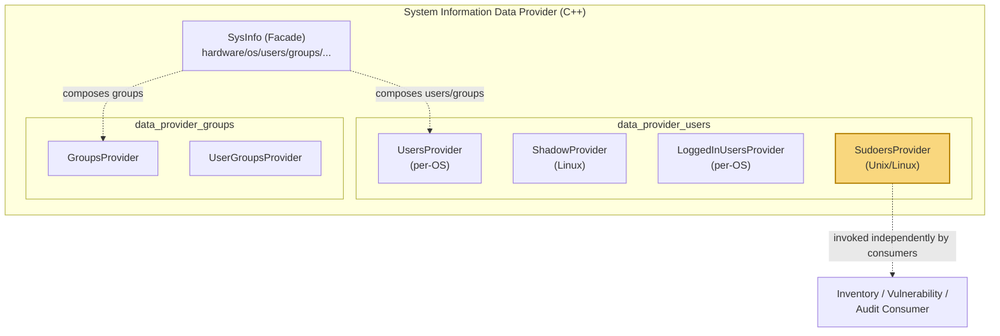
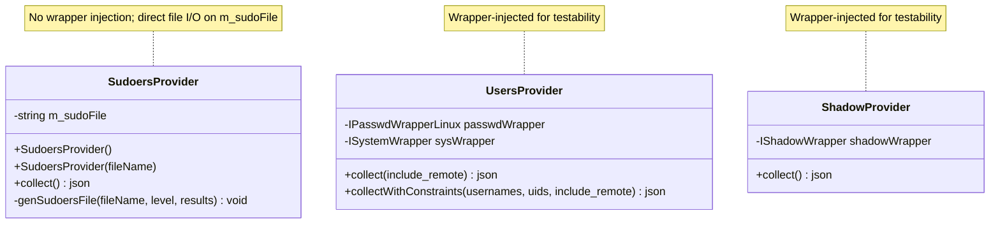
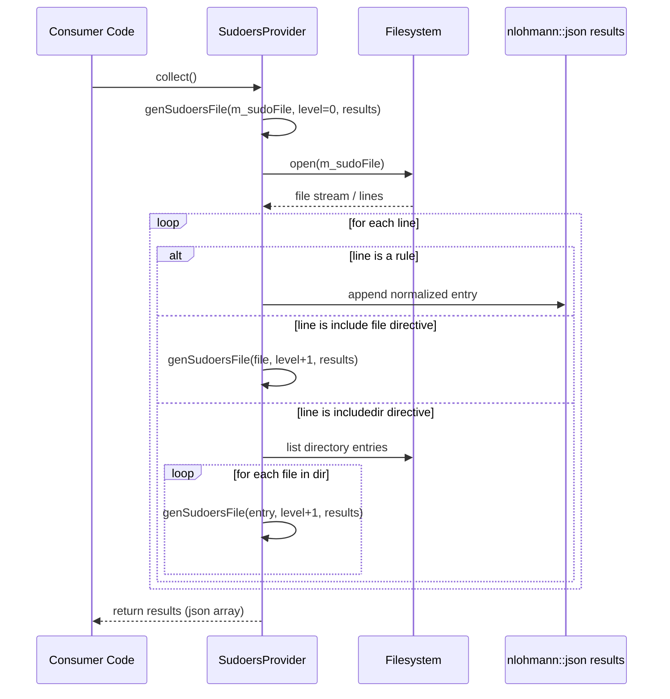
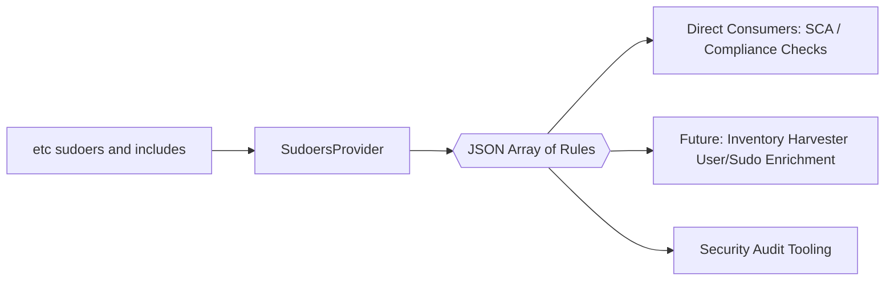

# Data Provider — Users: Sudoers Module

## Introduction

The **`data_provider_users_sudoers`** module is a small, focused component of the Wazuh **System Information Data Provider** (`src/data_provider`). It is responsible for parsing the Unix/Linux `sudoers` configuration (typically `/etc/sudoers`, plus any files referenced through `#include`/`#includedir` directives) and exposing its contents as a normalized JSON structure.

This information is used to give visibility into which users, groups, and hosts have been granted elevated (`sudo`) privileges on a monitored endpoint — a common requirement for security posture assessment, compliance auditing, and inventory/vulnerability correlation.

The module consists of a single public class, `SudoersProvider`, which lives alongside sibling "users" providers (`UsersProvider`, `ShadowProvider`, `LoggedInUsersProvider`) inside the `data_provider_users` family of components.

---

## 1. Purpose and Core Functionality

`SudoersProvider` performs two main functions:

1. **File Discovery & Recursive Parsing** — Starting from a root sudoers file (default `/etc/sudoers` on Linux, `/usr/local/etc/sudoers` on FreeBSD), it recursively resolves `#include <file>` and `#includedir <dir>` directives, tracking a `level` counter to prevent unbounded recursion (e.g., circular includes).
2. **JSON Normalization** — Each discovered rule/line is transformed into a `nlohmann::json` entry appended to a shared `results` array, giving a flat, uniform representation of all effective sudoers entries regardless of how many files they were split across.

### Public Interface

| Member | Description |
|---|---|
| `SudoersProvider()` | Default constructor; uses the platform-default sudoers file path. |
| `SudoersProvider(std::string fileName)` | Constructs the provider against a custom sudoers file path (primarily useful for testing or non-standard installs). |
| `nlohmann::json collect()` | Entry point that triggers parsing and returns the aggregated JSON array of sudoers entries. |
| `genSudoersFile(fileName, level, results)` *(private)* | Recursive worker that reads a single file, resolves includes, and appends parsed entries to `results`. |

```cpp
class SudoersProvider
{
    public:
        explicit SudoersProvider(std::string fileName);
        SudoersProvider();
        nlohmann::json collect();

    private:
        void genSudoersFile(const std::string& fileName,
                            unsigned int level,
                            nlohmann::json& results);
        std::string m_sudoFile;
};
```

---

## 2. Architecture & Component Relationships

### 2.1 Position in the System

`SudoersProvider` is one of several "extended source" providers under `src/data_provider/src/extended_sources/users/`. These providers supply OS-identity-related facts (users, groups, shadow/password metadata, logged-in sessions, and sudo privileges) that complement the core `SysInfo` facade (`hardware()`, `packages()`, `os()`, `processes()`, `networks()`, `ports()`, `hotfixes()`, `groups()`, `users()`). While `SysInfo` currently exposes `groups()` and `users()` directly, `SudoersProvider` is designed as an additional, independently-instantiable data source that can be composed by callers (e.g., an inventory/vulnerability harvester or a dedicated sudo-audit collector) needing this specific dataset.

For the broader context of the parent module, see **[SysInfo_Provider](System_Information_Data_Provider_(C++).md)** and its sibling documentation for **[data_provider_users_linux](data_provider_users_linux.md)** (covers `UsersProvider`, `ShadowProvider`, `LoggedInUsersProvider` for Linux).



### 2.2 Class Relationships (Sibling Providers)

Unlike `UsersProvider` (which depends on `IPasswdWrapperLinux` / `ISystemWrapper`) or `ShadowProvider` (which depends on `IShadowWrapper`), `SudoersProvider` has **no wrapper dependency injection** — it operates directly on the filesystem path stored in `m_sudoFile`, using standard file I/O to read and parse text lines. This makes it simpler but also less unit-testable via mocking; tests typically exercise it by pointing `m_sudoFile` at a temporary fixture file via the parameterized constructor.



---

## 3. Data Flow

### 3.1 Collection Sequence

The `collect()` call kicks off recursive parsing. Each `#include`/`#includedir` directive encountered increases the recursion `level`, and each file's rules are appended into the same `results` JSON array so the final output is a single flat collection.



### 3.2 Data Shape

The output is a JSON array where each element represents a single effective sudoers rule/line (user/group/host/command specification), suitable for downstream ingestion (e.g., indexing, comparison against security baselines, or export via the same pipelines used for other `SysInfo` datasets — see **[data_provider_sysinfo_core](System_Information_Data_Provider_(C++).md)** for how `sysInfo.cpp` bridges C++ providers to the C API consumed by native daemons).

---

## 4. How It Fits Into the Overall System

- **Module family**: Part of `data_provider_users` → `data_provider_users_sudoers` (this module), sibling to `data_provider_users_linux`, `data_provider_users_darwin`, and `data_provider_users_windows`. Unlike those OS-specific packages, sudoers parsing is inherently a Unix/Linux-style text-file concept (no direct Windows equivalent), so this provider is scoped to Unix/Linux platforms.
- **Consumers**: The `data_provider` library is statically/dynamically linked into agent components that need endpoint inventory data. While the current `SysInfo` facade (see `sysInfo.cpp`) does not yet expose a `sudoers()` accessor alongside `hardware()/users()/groups()`, the provider is available for direct instantiation by any module that needs sudo-privilege visibility — for example, future extensions of the **[inventory_harvester_module](Advanced_Security_Modules_(C++_Inventory_&_Vulnerability).md)** (which already models `Group`, `Host`, `Login`, `Password`, `Process` user-related elements) or SCA/compliance checks in the **[Wazuh_Modules_Daemon_(C)](Wazuh_Modules_Daemon_(C).md)** (`wm_sca.c`).
- **Testing**: Following the pattern of other data-provider components, unit tests would construct `SudoersProvider` with a fixture file path and assert on the shape of the returned JSON (mirroring how `test_wm_sca.c` and other C/C++ suites validate parsing logic against controlled inputs).



---

## 5. Related Documentation

- **[System_Information_Data_Provider_(C++)](System_Information_Data_Provider_(C++).md)** — Parent module overview, `SysInfo` facade, and C bridge (`sysInfo.cpp`).
- **[data_provider_users_linux](data_provider_users_linux.md)** — Linux implementations of `UsersProvider`, `ShadowProvider`, `LoggedInUsersProvider` (siblings within `data_provider_users`).
- **[data_provider_groups](System_Information_Data_Provider_(C++).md)** — `GroupsProvider` / `UserGroupsProvider`, used together with sudoers data to build a full picture of privilege assignment (group-based sudo rules commonly reference `%groupname`).
- **[Advanced_Security_Modules_(C++_Inventory_&_Vulnerability)](Advanced_Security_Modules_(C++_Inventory_&_Vulnerability).md)** — Downstream consumer candidate for user/privilege inventory data (`inventory_harvester_module`).
- **[Wazuh_Modules_Daemon_(C)](Wazuh_Modules_Daemon_(C).md)** — Houses `wm_sca.c` (Security Configuration Assessment), a natural consumer of sudo-privilege facts for policy checks.

---

## 6. Key Design Notes

- **Recursion guard via `level`**: The `genSudoersFile` method threads a `level` parameter through recursive calls specifically to bound `#include`/`#includedir` chains and avoid infinite loops from misconfigured or malicious sudoers files.
- **Single accumulation buffer**: All recursive calls write into the same `results` JSON reference, so callers receive one unified array regardless of the underlying file topology.
- **Platform scoping**: The commented-out platform-specific constants in the header (`kSudoFile` for Linux vs. FreeBSD) indicate the design intent to eventually parameterize the default path per-OS at compile time; currently, the default is provided via constructor logic in the corresponding `.cpp` implementation (not shown here) using `m_sudoFile`.
- **No external wrapper dependency**: This keeps the class lightweight, but means tests must exercise it through real (temporary) files rather than mocked wrapper interfaces, differing from the pattern used in `UsersProvider`/`ShadowProvider`.
