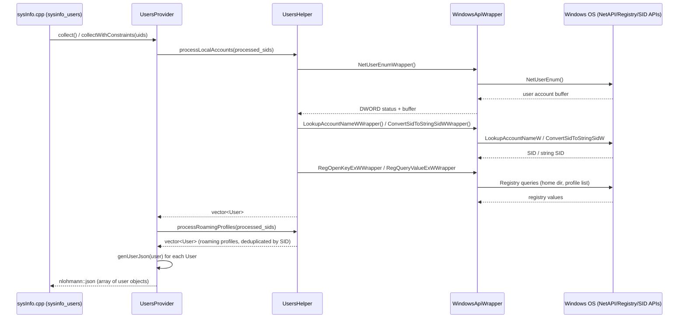
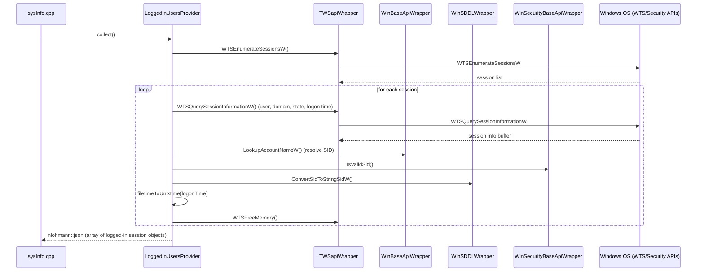

# Data Provider — Windows Users Module

## Introduction

The **Windows Users** module (`data_provider_users_windows`) is a platform-specific component of Wazuh's System Information Data Provider (`SysInfo`) subsystem. It is responsible for collecting **local user account inventory** and **currently logged-in session information** from Windows hosts. This data feeds Wazuh's Syscollector/Inventory pipeline, ultimately populating the user inventory tables consumed by the manager, API, and indexer.

This module contains two cooperating providers:

- **`UsersProvider`** — enumerates local and roaming-profile user accounts on the system (analogous to querying `/etc/passwd` on Unix systems, but using the Windows Security Account Manager, registry, and Win32 networking APIs).
- **`LoggedInUsersProvider`** — enumerates active logon sessions on the system using the Windows Terminal Services (WTS) API family, similar to querying `utmp`/`who` on Unix systems.

Both providers follow the dependency-injection + wrapper pattern used throughout the `data_provider` module, isolating raw Win32 API calls behind interfaces to enable unit testing without a live Windows environment.

## Position in the System

This module is a leaf component of the broader **System Information Data Provider (C++)** subsystem (see [SysInfo_Provider.md](SysInfo_Provider.md) for the top-level `SysInfo` facade that aggregates OS, hardware, network, package, port, process, and user information across platforms).

It is a sibling to the equivalent Linux and macOS implementations:
- [data_provider_users_linux.md](data_provider_users_linux.md)
- [data_provider_users_darwin.md](data_provider_users_darwin.md)

All three platform variants implement the same conceptual contract (`UsersProvider`/`LoggedInUsersProvider`-style collection classes) so that the platform-agnostic `sysInfo.cpp` core (see [data_provider_sysinfo_core.md](data_provider_sysinfo_core.md)) can call into whichever implementation is compiled for the target OS without changing its own logic (see `sysinfo_users` in `src/data_provider/src/sysInfo.cpp`).

The Windows-specific low-level Win32 API bindings used by this module live in the neighboring [data_provider_wrappers_windows.md](data_provider_wrappers_windows.md) module. The equivalent "groups" collection for Windows lives in a related module, `data_provider_groups_windows` (see the `groups_windows.hpp` / `user_groups_windows.hpp` headers under `src/data_provider/src/extended_sources/groups/include/`).

## Architecture

### Component Overview

```mermaid
classDiagram
    class UsersProvider {
        -shared_ptr~IUsersHelper~ m_usersHelper
        +UsersProvider(usersHelper)
        +UsersProvider()
        +collect() json
        +collectWithConstraints(uids) json
        -genUserJson(user) json
    }

    class LoggedInUsersProvider {
        -shared_ptr~ITWSapiWrapper~ m_twsApiWrapper
        -shared_ptr~IWinBaseApiWrapper~ m_winBaseWrapper
        -shared_ptr~IWinSDDLWrapper~ m_winSddlWrapper
        -shared_ptr~IWinSecurityBaseApiWrapper~ m_winSecurityWrapper
        -shared_ptr~IUsersHelper~ m_usersHelpersWrapper
        +LoggedInUsersProvider(...)
        +LoggedInUsersProvider()
        +collect() json
        -filetimeToUnixtime(fileTime) ull
    }

    class IUsersHelper {
        <<interface>>
        +getUserShell(sid) string
        +processLocalAccounts(processed_sids) vector~User~
        +processRoamingProfiles(processed_sids) vector~User~
    }

    class UsersHelper {
        -shared_ptr~IWindowsApiWrapper~ m_winapiWrapper
        +getUserShell(sid) string
        +processLocalAccounts(processed_sids) vector~User~
        +processRoamingProfiles(processed_sids) vector~User~
        +getSidFromAccountName(name) BYTE[]
        +psidToString(sid) string
        +getRidFromSid(sid) DWORD
        -getUserHomeDir(sid) string
        -getGidFromUsername(username) uint32
        -getRoamingProfileSids() vector~string~
    }

    class User {
        +uint32 generation
        +uint32 uid
        +uint32 gid
        +string sid
        +string username
        +string description
        +string type
        +string directory
    }

    class IWindowsApiWrapper {
        <<interface>>
    }
    class WindowsApiWrapper {
        +NetUserEnumWrapper()
        +NetLocalGroupEnumWrapper()
        +NetUserGetInfoWrapper()
        +RegOpenKeyExWWrapper()
        +RegQueryValueExWWrapper()
        +RegQueryInfoKeyWWrapper()
        +LookupAccountSidWWrapper()
        +LookupAccountNameWWrapper()
        +ConvertSidToStringSidWWrapper()
        +NetUserGetLocalGroupsWrapper()
        +GetSidSubAuthorityWrapper()
        +RegEnumKeyWWrapper()
        +RegCloseKeyWrapper()
    }

    class ITWSapiWrapper {
        <<interface>>
    }
    class TWSapiWrapper {
        +WTSEnumerateSessionsW()
        +WTSQuerySessionInformationW()
        +WTSFreeMemory()
    }

    class IWinBaseApiWrapper {
        <<interface>>
    }
    class WinBaseApiWrapper {
        +LookupAccountNameW()
    }

    class IWinSDDLWrapper {
        <<interface>>
    }
    class WinSDDLWrapper {
        +ConvertSidToStringSidW()
    }

    class IWinSecurityBaseApiWrapper {
        <<interface>>
    }
    class WinSecurityBaseApiWrapper {
        +IsValidSid()
    }

    UsersProvider --> IUsersHelper : uses
    UsersProvider ..> User : produces
    LoggedInUsersProvider --> ITWSapiWrapper : uses
    LoggedInUsersProvider --> IWinBaseApiWrapper : uses
    LoggedInUsersProvider --> IWinSDDLWrapper : uses
    LoggedInUsersProvider --> IWinSecurityBaseApiWrapper : uses
    LoggedInUsersProvider --> IUsersHelper : uses (shell/user resolution)

    UsersHelper ..|> IUsersHelper
    UsersHelper --> IWindowsApiWrapper : uses
    WindowsApiWrapper ..|> IWindowsApiWrapper
    TWSapiWrapper ..|> ITWSapiWrapper
    WinBaseApiWrapper ..|> IWinBaseApiWrapper
    WinSDDLWrapper ..|> IWinSDDLWrapper
    WinSecurityBaseApiWrapper ..|> IWinSecurityBaseApiWrapper
```

### Layering

The module follows a strict three-layer design that mirrors the pattern used across the whole `data_provider` component (see [data_provider_wrappers_windows.md](data_provider_wrappers_windows.md) and the Unix equivalent [data_provider_wrappers_unix.md](data_provider_wrappers_unix.md)):

1. **Provider layer** (`UsersProvider`, `LoggedInUsersProvider`) — public-facing classes that expose `collect()` and produce `nlohmann::json` results consumed by `sysInfo.cpp`.
2. **Helper layer** (`UsersHelper` / `IUsersHelper`) — encapsulates the business logic for enumerating accounts, resolving SIDs, reading registry-based profile lists, and mapping Win32 structures into the internal `User` data model.
3. **Raw API wrapper layer** (`WindowsApiWrapper`, `TWSapiWrapper`, `WinBaseApiWrapper`, `WinSDDLWrapper`, `WinSecurityBaseApiWrapper`) — thin, virtual-dispatch wrappers around actual Win32 calls (`NetUserEnum`, `WTSEnumerateSessionsW`, `LookupAccountSidW`, `ConvertSidToStringSidW`, `IsValidSid`, registry APIs, etc.). This layer exists purely to allow mocking in unit tests.

This separation allows the higher-level providers to be tested with fake/mock implementations of the interfaces without requiring an actual Windows Security Account Manager or Terminal Services subsystem.

## Data Flow

### User Account Inventory Collection

### Logged-in Users Session Collection

## Core Components

### `UsersProvider`
*File: `src/data_provider/src/extended_sources/users/include/users_windows.hpp`*

Public API for collecting the local user account inventory.

| Member | Description |
|---|---|
| `UsersProvider(shared_ptr<IUsersHelper>)` | Dependency-injection constructor, primarily used for testing with a mock helper. |
| `UsersProvider()` | Default constructor; wires up the production `UsersHelper` + `WindowsApiWrapper` chain. |
| `collect()` | Returns a JSON array describing every discoverable user account (local accounts plus roaming profiles), deduplicated by SID. |
| `collectWithConstraints(const std::set<uint32_t>& uids)` | Same as `collect()` but filters results to only the specified UIDs — used for targeted/incremental lookups. |
| `genUserJson(const User&)` *(private)* | Converts an internal `User` struct into the standardized JSON schema shared across all platforms (uid, gid, sid, username, description, type, directory). |

### `LoggedInUsersProvider`
*File: `src/data_provider/src/extended_sources/users/include/logged_in_users_win.hpp`*

Public API for collecting active logon session information equivalent to `who`/`utmp` on Unix.

| Member | Description |
|---|---|
| `LoggedInUsersProvider(twsWrapper, winBaseWrapper, winSddlWrapper, winSecurityWrapper, usersHelperWrapper)` | Full dependency-injection constructor for unit testing. |
| `LoggedInUsersProvider()` | Default constructor wiring production wrapper implementations. |
| `collect()` | Enumerates WTS sessions via `WTSEnumerateSessionsW`, queries per-session details via `WTSQuerySessionInformationW`, resolves the associated user SID, and returns a JSON array of active sessions (user, host/session type, session state, logon time). |
| `filetimeToUnixtime(const FILETIME&)` *(private)* | Converts a Windows `FILETIME` (100-nanosecond intervals since 1601-01-01) into a Unix epoch timestamp for cross-platform consistency. |
| `m_kSessionStates` *(private, static)* | Static lookup table mapping WTS session-state integer codes (e.g., `WTSActive`, `WTSDisconnected`) to human-readable strings. |

### Supporting Types (from `data_provider_wrappers_windows`)

These types are defined in the sibling module [data_provider_wrappers_windows.md](data_provider_wrappers_windows.md) but are essential dependencies of this module:

- **`User`** (`iusers_utils_wrapper.hpp`) — plain data struct holding `uid`, `gid`, `sid`, `username`, `description`, `type`, and `directory`, plus a `generation` counter and equality operator used for deduplication.
- **`UsersHelper`** (`users_utils_wrapper.hpp`) — concrete implementation of `IUsersHelper` that performs the actual account enumeration logic: `processLocalAccounts`, `processRoamingProfiles`, `getUserShell`, SID↔string conversions, and registry-based home directory/roaming profile discovery.
- **`TWSapiWrapper`, `WinBaseApiWrapper`, `WinSDDLWrapper`, `WinSecurityBaseApiWrapper`, `WindowsApiWrapper`** (`winapi_wrappers.hpp`, `windows_api_wrapper.hpp`) — thin pass-through wrappers over Win32 APIs (Terminal Services, SID/account lookup, registry access, Net* user/group enumeration).

## Key Design Patterns

- **Dependency Injection**: Both provider classes accept their collaborator interfaces via constructor injection, with a convenience default constructor that wires up production implementations. This is the same pattern used across the entire `data_provider` module (see [data_provider_groups_windows.md](data_provider_groups_windows.md) for the analogous group-collection design).
- **Wrapper/Adapter over Win32 API**: Raw, hard-to-mock Windows API calls (`NetUserEnum`, `WTSEnumerateSessionsW`, `LookupAccountSidW`, registry functions) are isolated behind small interfaces (`IWindowsApiWrapper`, `ITWSapiWrapper`, `IWinBaseApiWrapper`, `IWinSDDLWrapper`, `IWinSecurityBaseApiWrapper`) implemented by concrete `*Wrapper` classes. This enables full unit-test coverage without a live Windows session.
- **SID-based Deduplication**: `UsersProvider` tracks a `std::set<std::string>` of `processed_sids` while walking both local accounts and roaming profiles, ensuring a single canonical `User` entry per SID even when the same account is discoverable via multiple registry/API paths.
- **JSON as Interchange Format**: Both providers return `nlohmann::json` objects/arrays, matching the schema expected by the platform-agnostic `sysInfo.cpp` core and ultimately by the `sysinfo_users` C API and the `syscollector`/`inventory_harvester` pipelines.

## Cross-Module Relationships

| Related Module | Relationship |
|---|---|
| [SysInfo_Provider.md](SysInfo_Provider.md) | Defines the top-level `SysInfo` facade; `sysinfo_users` in `sysInfo.cpp` dispatches to this module's providers on Windows builds. |
| [data_provider_sysinfo_core.md](data_provider_sysinfo_core.md) | Contains the platform-dispatch logic (`sysInfo.cpp`) and OS-specific glue that selects this module's implementation at compile time. |
| [data_provider_wrappers_windows.md](data_provider_wrappers_windows.md) | Supplies the `User` struct, `UsersHelper`, and all Win32 API wrapper classes consumed here. |
| [data_provider_users_linux.md](data_provider_users_linux.md) / [data_provider_users_darwin.md](data_provider_users_darwin.md) | Equivalent user/session providers for other platforms, sharing the same conceptual JSON output contract. |
| [data_provider_groups_windows.md](data_provider_groups_windows.md) | Sibling module providing group inventory on Windows using an analogous provider/helper/wrapper architecture. |
| [inventory_harvester_module.md](inventory_harvester_module.md) | Downstream consumer: the `UserElement` in the Inventory Harvester (`src/wazuh_modules/inventory_harvester/src/systemInventory/elements/userElement.hpp`) maps this collected user data into indexer documents. |
| [wazuh_modules_core.md](wazuh_modules_core.md) | `wm_syscollector.c` invokes the `SysInfo` layer periodically to gather and forward user inventory data from Windows agents. |

## Testing Considerations

Because the provider and helper classes are fully interface-driven, unit tests can substitute mock implementations of `IUsersHelper`, `ITWSapiWrapper`, `IWinBaseApiWrapper`, `IWinSDDLWrapper`, and `IWinSecurityBaseApiWrapper` to simulate:

- Multiple concurrent user sessions in various WTS states (active, disconnected, idle).
- Local accounts and roaming profiles with overlapping/duplicate SIDs.
- SID resolution failures (invalid or orphaned SIDs) without needing an actual invalid Windows security context.
- Registry read failures (missing "ProfileList" keys, denied access) that occur when the wrapper layer returns Win32 error codes.

This is consistent with the wider Wazuh testing strategy used for native C/C++ daemons; see [Unit_Tests_-_Syscheck_FIM.md](Unit_Tests_-_Syscheck_FIM.md) and other native unit-test documentation for related patterns applied elsewhere in the codebase.
