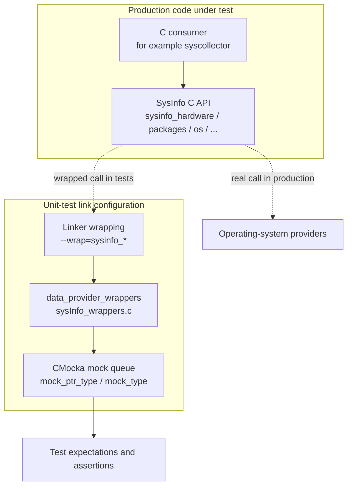
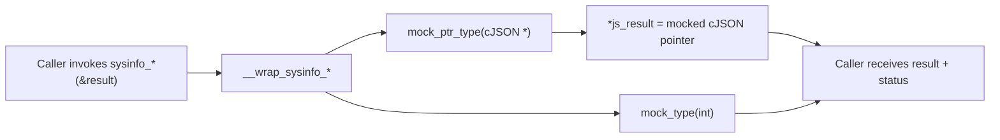
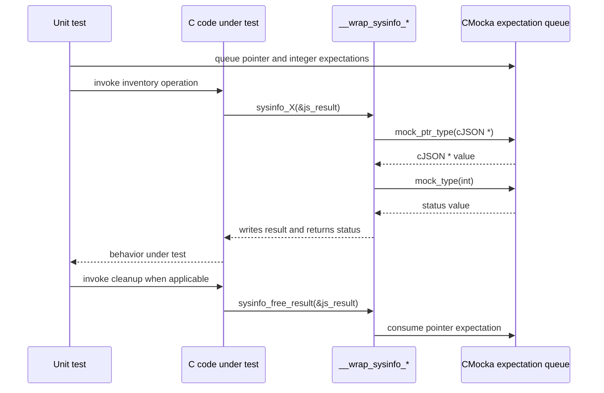
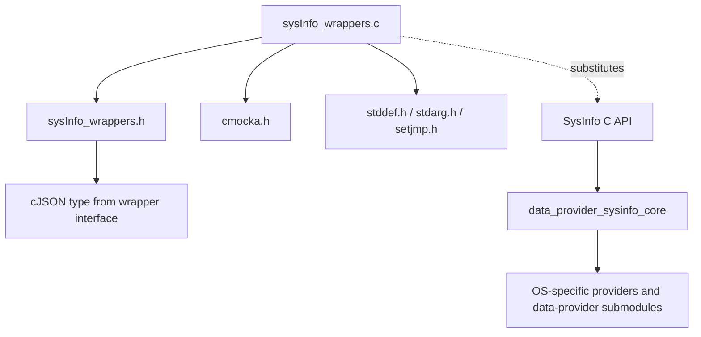
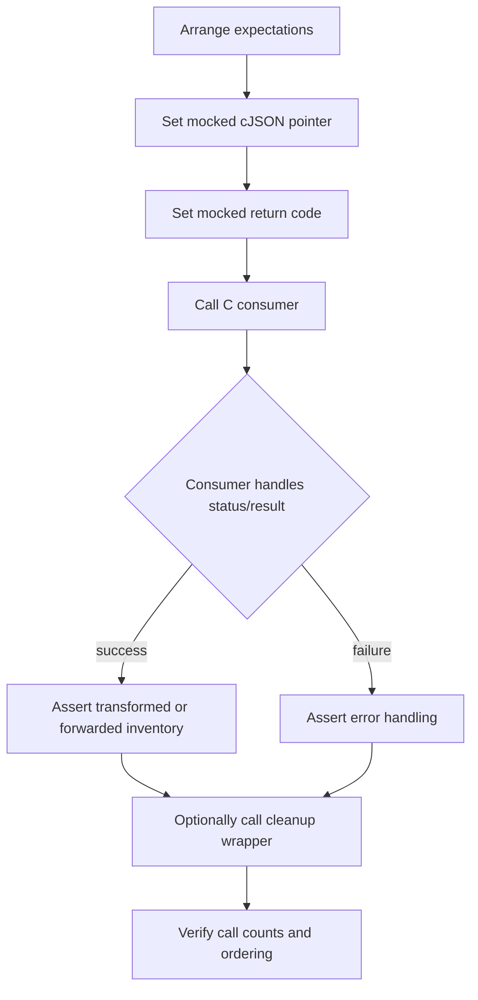
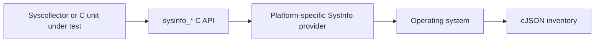
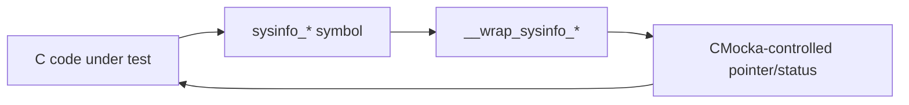

# Data Provider Wrappers (Unit-Test Mocks)

## Introduction

`data_provider_wrappers` is the unit-test support module for the C-facing `SysInfo` data-provider API. It replaces the real system-inventory functions with CMocka-controlled test doubles so C code can exercise success, failure, null-result, and cleanup paths without querying the host operating system.

The module is implemented by [`sysInfo_wrappers.c`](src/unit_tests/wrappers/wazuh/data_provider/sysInfo_wrappers.c) and is associated with the broader [data provider SysInfo core](data_provider_sysinfo_core.md). It is not a production inventory provider: it exists only at test link time.

## Purpose and Scope

The wrapper exports substitutes for seven `sysinfo_*` functions:

| Wrapper | Mocked operation | Contract modeled |
|---|---|---|
| `__wrap_sysinfo_hardware` | Hardware inventory | Writes a mocked `cJSON *`; returns a mocked status |
| `__wrap_sysinfo_packages` | Package inventory | Writes a mocked `cJSON *`; returns a mocked status |
| `__wrap_sysinfo_os` | Operating-system inventory | Writes a mocked `cJSON *`; returns a mocked status |
| `__wrap_sysinfo_processes` | Process inventory | Writes a mocked `cJSON *`; returns a mocked status |
| `__wrap_sysinfo_networks` | Network-interface inventory | Writes a mocked `cJSON *`; returns a mocked status |
| `__wrap_sysinfo_ports` | Open-port inventory | Writes a mocked `cJSON *`; returns a mocked status |
| `__wrap_sysinfo_free_result` | Result cleanup | Consumes a mocked pointer-to-result argument without freeing data |

The wrappers deliberately model only the C ABI boundary. Collection details remain documented with the production components: [data_provider_network](data_provider_network.md), [data_provider_packages](data_provider_packages.md), [data_provider_osinfo](data_provider_osinfo.md), and [data_provider_sysinfo_core](data_provider_sysinfo_core.md).

## Architecture



In a test binary, linker wrapping redirects calls to `sysinfo_hardware`, `sysinfo_packages`, `sysinfo_os`, `sysinfo_processes`, `sysinfo_networks`, `sysinfo_ports`, and `sysinfo_free_result` to the corresponding `__wrap_*` implementation. The wrapper then obtains values from CMocka's expectation queue.

## Component Design

### Inventory wrappers

The six inventory wrappers share the same two-step behavior:

1. Assign `*js_result` from `mock_ptr_type(cJSON *)`.
2. Return `mock_type(int)` as the simulated API result.



This allows each test to independently control the output object and status code. A test can therefore represent, for example, a valid JSON result with a success code, an error code with a null result, or an error code with a partially constructed result.

### Cleanup wrapper

`__wrap_sysinfo_free_result` accepts a `cJSON **` but does not call a real destructor. It assigns a mocked value to its local `js_data` parameter:

```c
js_data = mock_ptr_type(cJSON **);
```

Because the parameter is passed by value, this assignment does not alter the caller's pointer. The practical purpose is to consume a CMocka pointer expectation and let tests verify that cleanup was invoked without releasing a test-owned object. Tests that need to validate actual JSON ownership or deallocation must use the production cleanup implementation or a dedicated mock with explicit side effects.

## Call and Data Flow



The wrapper does not create, parse, inspect, or serialize JSON. The `cJSON *` is opaque to this module and is supplied by the test. Consequently, assertions about JSON contents belong in the test or in the production SysInfo tests, not in this wrapper.

## Dependencies



Direct dependencies visible in the implementation are:

- `sysInfo_wrappers.h`, which declares the wrapped functions and exposes the `cJSON` type used by their signatures.
- CMocka, for `mock_ptr_type()` and `mock_type()`.
- Standard headers needed by the test-wrapper build and CMocka integration.

The wrapper is conceptually dependent on the C API exposed by [`data_provider_sysinfo_core_capi`](data_provider_sysinfo_core_capi.md), while its test role is consumed by unit tests and linker-wrap configuration rather than by the runtime Syscollector pipeline.

## Process Flow for a Typical Test



The expectation order matters: each inventory wrapper reads the pointer expectation first and the integer expectation second. Tests should queue expectations in that order for every invocation. Repeated calls require repeated expectations unless the test framework configuration supplies them through a reusable expectation mechanism.

## Testing Considerations

- **Status values are opaque:** the wrapper returns whatever integer the test queues. The meaning of success or failure is defined by the caller's API contract.
- **Result ownership is simulated:** returned pointers are not allocated by the wrapper and must not be assumed to be safe to destroy unless the test created them for that purpose.
- **Null scenarios are supported:** queueing `NULL` for `mock_ptr_type(cJSON *)` exercises callers that receive no result.
- **Cleanup is non-destructive:** the cleanup wrapper is suitable when the test only needs to verify the cleanup path was reached.
- **Platform independence:** no Linux, BSD, macOS, Solaris, or Windows API is accessed. Platform behavior is tested in the production providers and their platform wrapper modules, such as [data_provider_wrappers_unix](data_provider_wrappers_unix.md) and [data_provider_wrappers_windows](data_provider_wrappers_windows.md).

## Relationship to the Overall System

At runtime, the SysInfo C API delegates to platform-specific inventory providers and ultimately supplies data to consumers such as the Syscollector module; see [data_provider_sysinfo_core](data_provider_sysinfo_core.md) and [syscollector_module](syscollector_module.md). During unit tests, this module replaces that native collection boundary so tests can isolate higher-level C logic from host state, permissions, installed packages, running processes, network configuration, and open ports.

In other words, the production path is:



while the wrapped test path is:



## Source Reference

- `src/unit_tests/wrappers/wazuh/data_provider/sysInfo_wrappers.c`
- `src/unit_tests/wrappers/wazuh/data_provider/sysInfo_wrappers.h`
- [data_provider_sysinfo_core](data_provider_sysinfo_core.md)
- [data_provider_sysinfo_core_capi](data_provider_sysinfo_core_capi.md)
- [data_provider_wrappers_unix](data_provider_wrappers_unix.md)
- [data_provider_wrappers_windows](data_provider_wrappers_windows.md)
