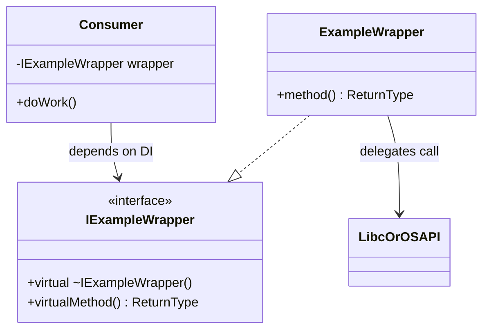

# Data Provider — Unix Wrappers (`data_provider_wrappers_unix`)

## 1. Purpose

This module provides a thin, testable **abstraction layer over Unix/POSIX system calls** used by the
Wazuh System Information Data Provider (`SysInfo`) to enumerate users, groups, sessions and shadow
credentials on Unix-like operating systems (Linux and Darwin/macOS).

Rather than calling libc functions such as `getpwnam`, `getgrgid_r`, `getspent` or `getutxent`
directly from business logic, the higher-level providers (see
[data_provider_users_linux.md](data_provider_users_linux.md),
[data_provider_users_darwin.md](data_provider_users_darwin.md),
[data_provider_groups_linux.md](data_provider_groups_linux.md),
[data_provider_groups_darwin.md](data_provider_groups_darwin.md)) depend on small **interface +
implementation** pairs defined here. This enables:

- **Dependency injection**: providers receive an interface pointer/reference instead of calling
  global libc functions, so unit tests can supply mock implementations.
- **Platform isolation**: Linux-specific reentrant (`_r`) POSIX APIs and Darwin-specific
  OpenDirectory/UUID APIs are each encapsulated behind a platform-specific wrapper, keeping
  OS-conditional code out of the data collection logic.
- **Single Responsibility**: each wrapper exposes only the narrow set of system calls needed for
  one concern (passwd database, group database, shadow database, UUID conversion, OpenDirectory
  queries, login session records).

This module contains **only header files** (interfaces and thin inline implementations) — there is
no independent runtime behavior; all logic simply forwards to the corresponding POSIX/Darwin system
call. The value provided is architectural: it defines the seams used for mocking in
[data_provider_users_linux.md](data_provider_users_linux.md) and
[data_provider_users_darwin.md](data_provider_users_darwin.md) unit tests.

## 2. Architecture Overview

The module is organized around three platform scopes, each following the same
**Interface (`I...Wrapper`) → Concrete implementation (`...Wrapper`)** pattern:

```mermaid
graph TB
    subgraph "Consumers (outside this module)"
        UP_L["Users/Groups Providers (Linux)"]
        UP_D["Users/Groups Providers (Darwin)"]
        SO_C["Sudoers / LoggedInUsers Providers"]
    end

    subgraph "data_provider_wrappers_unix"
        subgraph "Generic Unix"
            IUTMPX[IUtmpxWrapper]
            UTMPX[UtmpxWrapper]
            UTMPX --> IUTMPX
        end

        subgraph "Linux-specific"
            IGRP_L[IGroupWrapperLinux]
            GRP_L[GroupWrapperLinux]
            IPWD_L[IPasswdWrapperLinux]
            PWD_L[PasswdWrapperLinux]
            ISHD[IShadowWrapper]
            SHD[ShadowWrapper]
            ISYS[ISystemWrapper]
            SYS[SystemWrapper]
            GRP_L --> IGRP_L
            PWD_L --> IPWD_L
            SHD --> ISHD
            SYS --> ISYS
        end

        subgraph "Darwin/macOS-specific"
            IGRP_D[IGroupWrapperDarwin]
            GRP_D[GroupWrapperDarwin]
            IPWD_D[IPasswdWrapperDarwin]
            PWD_D[PasswdWrapperDarwin]
            IUUID[IUUIDWrapper]
            UUID[UUIDWrapper]
            IOD[IODUtilsWrapper]
            OD[ODUtilsWrapper]
            GRP_D --> IGRP_D
            PWD_D --> IPWD_D
            UUID --> IUUID
            OD --> IOD
        end
    end

    subgraph "Native OS / Kernel APIs"
        LIBC_PWD["libc: getpwnam_r, getpwuid_r, fgetpwent_r, ..."]
        LIBC_GRP["libc: getgrgid_r, getgrent_r, getgrouplist"]
        LIBC_SHD["libc: getspent, setspent, lckpwdf"]
        LIBC_UTX["libc: getutxent, setutxent, utmpxname"]
        LIBC_SYS["libc: sysconf, fopen, strerror"]
        DARWIN_APIS["macOS: mbr_uid_to_uuid, uuid_unparse, OpenDirectory (od::)"]
    end

    UTMPX -.calls.-> LIBC_UTX
    GRP_L -.calls.-> LIBC_GRP
    PWD_L -.calls.-> LIBC_PWD
    SHD -.calls.-> LIBC_SHD
    SYS -.calls.-> LIBC_SYS
    GRP_D -.calls.-> LIBC_GRP
    PWD_D -.calls.-> LIBC_PWD
    UUID -.calls.-> DARWIN_APIS
    OD -.calls.-> DARWIN_APIS

    UP_L --> IGRP_L
    UP_L --> IPWD_L
    UP_L --> ISHD
    UP_L --> ISYS
    UP_D --> IGRP_D
    UP_D --> IPWD_D
    UP_D --> IUUID
    UP_D --> IOD
    SO_C --> IUTMPX
```

## 3. Sub-modules

This module's fourteen header files naturally group into three sub-modules based on platform
scope. Detailed responsibilities, method contracts, and usage diagrams for each are documented
separately:

| Sub-module | Scope | Documentation |
|---|---|---|
| **Linux wrappers** | Reentrant passwd/group access, `/etc/shadow` access, and generic `sysconf`/file helpers for Linux | [data_provider_wrappers_unix_linux.md](data_provider_wrappers_unix_linux.md) |
| **Darwin/macOS wrappers** | passwd/group access, UUID↔UID conversion, and OpenDirectory record/account-policy queries for macOS | [data_provider_wrappers_unix_darwin.md](data_provider_wrappers_unix_darwin.md) |
| **Generic Unix (utmpx)** | Login/session record access (`utmpx` database) shared across Unix platforms | [data_provider_wrappers_unix_utmpx.md](data_provider_wrappers_unix_utmpx.md) |

## 4. How this module fits into the System Information Data Provider

The `data_provider_wrappers_unix` module is a **leaf infrastructure module** inside the broader
System_Information_Data_Provider_(C++) component. It is consumed by:

- **User providers**: [data_provider_users_linux.md](data_provider_users_linux.md) and
  [data_provider_users_darwin.md](data_provider_users_darwin.md) use the passwd/shadow wrappers to
  build the `users` table returned by `SysInfo::getUsers()`.
- **Group providers**: [data_provider_groups_linux.md](data_provider_groups_linux.md) and
  [data_provider_groups_darwin.md](data_provider_groups_darwin.md) use the group wrappers to build
  the `groups` table and resolve group membership for users.
- **Logged-in users / sudoers providers**: the generic `IUtmpxWrapper`/`UtmpxWrapper` pair is used by
  `LoggedInUsersProvider` implementations (see
  [data_provider_users_linux.md](data_provider_users_linux.md) and
  [data_provider_users_darwin.md](data_provider_users_darwin.md)) to enumerate active login sessions,
  and by [data_provider_users_sudoers.md](data_provider_users_sudoers.md) indirectly through shared
  user-resolution helpers.

For the equivalent Windows-side abstraction layer (SID/account/user & group helper wrappers), see
[data_provider_wrappers_windows.md](data_provider_wrappers_windows.md). For the top-level façade that
aggregates all platform providers into a single `SysInfo` API, see
[SysInfo_Provider.md](SysInfo_Provider.md) and [data_provider_sysinfo_core.md](data_provider_sysinfo_core.md).

## 5. Design Pattern Summary

Every wrapper in this module follows the same **Interface Segregation + Adapter** pattern:

Key characteristics common to all wrappers documented here:

1. **No state** — every wrapper is stateless; all methods simply forward arguments to the
   corresponding OS/libc call and return its result unchanged.
2. **Pure virtual interfaces** — each interface (`I*Wrapper`) declares the exact subset of
   system calls needed by consumers, nothing more, easing mock creation in unit tests.
3. **`override` on all implementations** — guarantees interface/implementation signatures stay
   in sync.
4. **Header-only** — all code is defined inline in headers (`.hpp`), so there is no separate
   compiled translation unit to document beyond the header content itself.

## 6. Related Documentation

- [data_provider_wrappers_unix_linux.md](data_provider_wrappers_unix_linux.md) — Linux passwd,
  group, shadow, and system wrappers.
- [data_provider_wrappers_unix_darwin.md](data_provider_wrappers_unix_darwin.md) — Darwin/macOS
  passwd, group, UUID, and OpenDirectory wrappers.
- [data_provider_wrappers_unix_utmpx.md](data_provider_wrappers_unix_utmpx.md) — Cross-platform
  Unix `utmpx` (login session) wrapper.
- [data_provider_wrappers_windows.md](data_provider_wrappers_windows.md) — Windows equivalent
  wrapper layer for users/groups.
- [data_provider_users_linux.md](data_provider_users_linux.md) /
  [data_provider_users_darwin.md](data_provider_users_darwin.md) — Consumers that build the
  `users` inventory table using these wrappers.
- [data_provider_groups_linux.md](data_provider_groups_linux.md) /
  [data_provider_groups_darwin.md](data_provider_groups_darwin.md) — Consumers that build the
  `groups` inventory table using these wrappers.
- [SysInfo_Provider.md](SysInfo_Provider.md) — The top-level `SysInfo` facade that orchestrates
  all data providers, including those relying on this module.
