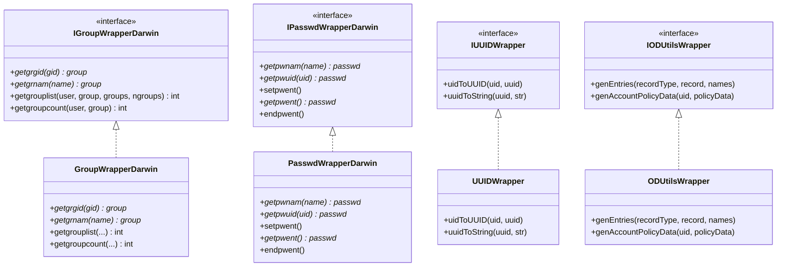
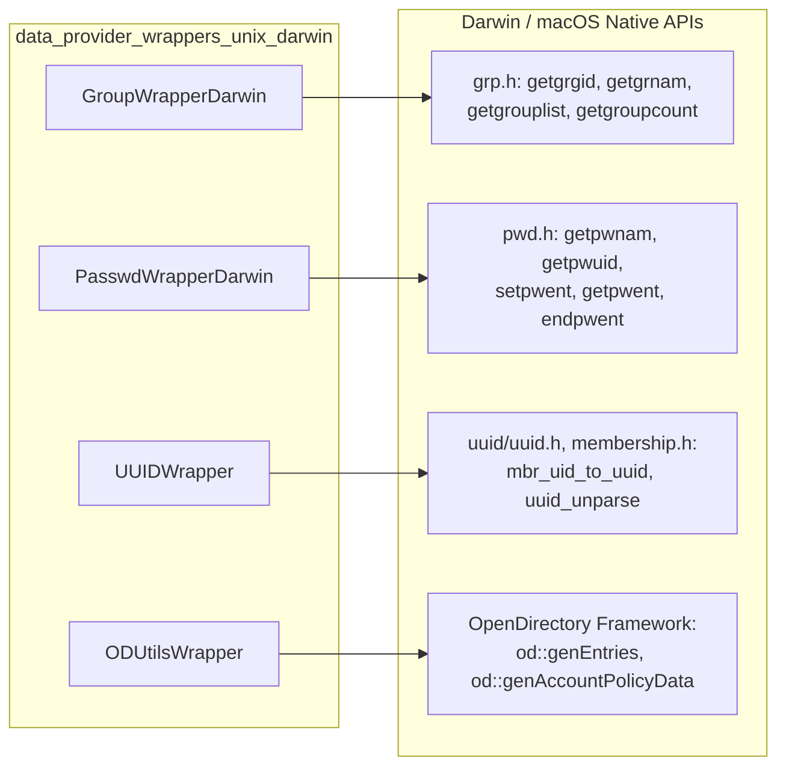
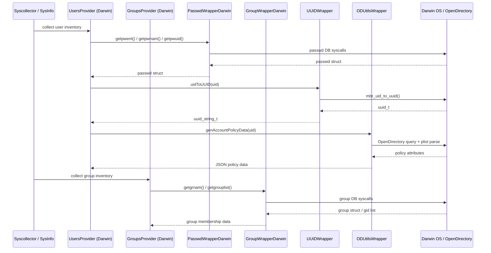

# Data Provider Wrappers — Unix/Darwin

## Introduction

The **`data_provider_wrappers_unix_darwin`** module provides a thin, testable abstraction layer over the native macOS/Darwin system APIs used to retrieve **user**, **group**, and **UUID/identity** information. It is part of the larger [System Information Data Provider (C++)](System_Information_Data_Provider_(C++).md) subsystem, which powers Wazuh's `syscollector` and inventory features (hardware, network, OS, packages, ports, users, and groups).

This module isolates direct calls to Darwin-specific POSIX and macOS frameworks (`<grp.h>`, `<pwd.h>`, `<uuid/uuid.h>`, `<membership.h>`, and the OpenDirectory framework) behind small interfaces (`IGroupWrapperDarwin`, `IPasswdWrapperDarwin`, `IUUIDWrapper`, `IODUtilsWrapper`). This design allows the higher-level data providers (e.g., `UsersProvider`, `GroupsProvider`, `UserGroupsProvider` for Darwin) to be unit-tested by injecting mock wrappers instead of depending on real OS state.

## Purpose and Core Functionality

The module wraps four categories of native functionality:

| Concern | Wrapper Class | Interface | Underlying API |
|---|---|---|---|
| Group lookup & membership | `GroupWrapperDarwin` | `IGroupWrapperDarwin` | `getgrgid`, `getgrnam`, `getgrouplist`, `getgroupcount` (`<grp.h>`) |
| User (passwd) database access | `PasswdWrapperDarwin` | `IPasswdWrapperDarwin` | `getpwnam`, `getpwuid`, `setpwent`, `getpwent`, `endpwent` (`<pwd.h>`) |
| UID ⇄ UUID conversion | `UUIDWrapper` | `IUUIDWrapper` | `mbr_uid_to_uuid`, `uuid_unparse` (`<uuid/uuid.h>`, `<membership.h>`) |
| OpenDirectory record & policy queries | `ODUtilsWrapper` | `IODUtilsWrapper` | `od::genEntries`, `od::genAccountPolicyData` |

Each wrapper class implements a pure-virtual interface, enabling **dependency injection** so that consumers (data providers) can be tested with mock implementations rather than requiring an actual macOS environment or specific user/group state.

## Architecture

### Component Diagram

### System Call Mapping

## Component Details

### `GroupWrapperDarwin` / `IGroupWrapperDarwin`
- **File**: `src/data_provider/src/extended_sources/wrappers/unix/darwin/group_wrapper.hpp`, `igroup_wrapper.hpp`
- Wraps group-database lookups (`getgrgid`, `getgrnam`) and group-membership enumeration (`getgrouplist`, `getgroupcount`).
- `getgroupcount` uses the macOS-only `libSystem.B` exported symbol `getgroupcount(const char*, gid_t)`, declared via `extern "C"` since it is not part of a public header.
- Consumed by `data_provider_groups_darwin` components such as `GroupsProvider` and `UserGroupsProvider` (Darwin variants) to enumerate group membership for users during syscollector group inventory scans.

### `PasswdWrapperDarwin` / `IPasswdWrapperDarwin`
- **File**: `src/data_provider/src/extended_sources/wrappers/unix/darwin/passwd_wrapper.hpp`, `ipasswd_wrapper.hpp`
- Wraps the standard POSIX passwd database iteration API: `getpwnam`, `getpwuid`, and the stateful iterator triplet `setpwent` / `getpwent` / `endpwent`.
- Used by the Darwin `UsersProvider` (see `data_provider_users_darwin`) to enumerate all local user accounts and resolve individual user records by name or UID.

### `UUIDWrapper` / `IUUIDWrapper`
- **File**: `src/data_provider/src/extended_sources/wrappers/unix/darwin/uuid_wrapper.hpp`
- Encapsulates macOS's membership services API (`mbr_uid_to_uuid`) to translate a UID into a generalized UUID, and `uuid_unparse` to render that UUID as a human-readable string.
- Used wherever a stable, unique identifier for a macOS user account is required beyond the numeric UID (e.g., for correlating user identities across systems that support UUID-based identity, such as Open Directory or Active Directory-bound Macs).
- Note: The `IUUIDWrapper` interface itself lives in a sibling header (`iuuid_wrapper.hpp`) not included in this module's core component list, but `UUIDWrapper` is defined here as the Darwin-specific implementation.

### `ODUtilsWrapper` / `IODUtilsWrapper`
- **File**: `src/data_provider/src/extended_sources/wrappers/unix/darwin/open_directory_utils_wrapper.hpp`
- Wraps queries against the local **OpenDirectory** node, macOS's directory-services database that stores user and group records (even when not bound to a network directory).
- `genEntries`: Searches for user or group records by type, optionally filtered by name, returning a map of record names and their "hidden" status.
- `genAccountPolicyData`: Retrieves and parses the `accountPolicyData` plist attribute for a given user UID, extracting fields such as `creation_time`, `failed_login_count`, `failed_login_timestamp`, and `password_last_set_time`. These fields feed into extended user-inventory data (e.g., password aging/lockout details) collected by syscollector.
- Depends on an internal `od::` namespace (implemented elsewhere in the Darwin extended-sources tree) that performs the actual OpenDirectory/plist parsing work.

## Data Flow

## Relationship to Other Modules

- **Parent module**: `data_provider_wrappers_unix` — the umbrella grouping for all Unix-family wrapper implementations, which also includes:
  - `data_provider_wrappers_unix_linux` — the Linux-equivalent wrappers (`GroupWrapperLinux`, `PasswdWrapperLinux`, `ShadowWrapper`, `SystemWrapper`), following the same interface-based design pattern.
  - `data_provider_wrappers_unix_utmpx` — cross-Unix `utmpx`-based wrappers for logged-in-user session data (`UtmpxWrapper`).
- **Sibling architecture**: `data_provider_wrappers_windows` provides the analogous abstraction layer for Windows (`GroupsHelper`, `UsersHelper`, `WindowsApiWrapper`, etc.).
- **Consumers**: The `data_provider_users` and `data_provider_groups` modules — specifically their Darwin-specific children `data_provider_users_darwin` (`UsersProvider`, `LoggedInUsersProvider`) and `data_provider_groups_darwin` (`GroupsProvider`, `UserGroupsProvider`) — depend directly on these wrappers to implement platform-specific data collection while remaining unit-testable via mock injection.
- **Top-level integration**: Ultimately, data gathered through this module surfaces via `SysInfo` (`src/data_provider/include/sysInfo.hpp`) and the `sysinfo_*` C API functions (`sysInfo.cpp`), which are consumed by the `syscollector_module` and `inventory_harvester_module` to populate user/group inventory in the Wazuh indexer. See [System_Information_Data_Provider_(C++).md](System_Information_Data_Provider_(C++).md) for the full parent-module documentation, and [Advanced_Security_Modules_(C++_Inventory_&_Vulnerability).md](Advanced_Security_Modules_(C++_Inventory_&_Vulnerability).md) for how inventory data is indexed downstream.

## Design Rationale: Interface/Implementation Split

Every wrapper in this module follows the same pattern:

1. An abstract interface (`I*Wrapper`) declares pure virtual methods mirroring the native API signatures.
2. A concrete Darwin implementation (`*WrapperDarwin` / `UUIDWrapper` / `ODUtilsWrapper`) implements the interface by delegating directly to the OS call (often via the `::` global scope operator to disambiguate from the wrapper's own method of the same name).

This mirrors the same pattern used across the codebase's Linux equivalents (`data_provider_wrappers_unix_linux`) and Windows equivalents (`data_provider_wrappers_windows`), enabling:

- **Testability**: Higher-level providers can be unit tested against mock wrappers without requiring specific OS/user state.
- **Portability**: Platform-specific behavior is isolated at the lowest layer, keeping provider logic (in `data_provider_users` / `data_provider_groups`) platform-agnostic where possible.
- **Minimal surface area**: Each wrapper exposes only the exact subset of the native API needed by the data providers.

## Related Documentation

- [System_Information_Data_Provider_(C++).md](System_Information_Data_Provider_(C++).md) — parent module overview covering hardware, network, OS info, packages, and ports data providers.
- Sibling wrapper modules (documented alongside this one under the same parent):
  - `data_provider_wrappers_unix_linux`
  - `data_provider_wrappers_unix_utmpx`
  - `data_provider_wrappers_windows`
- Consumer modules:
  - `data_provider_users_darwin`
  - `data_provider_groups_darwin`
- [Advanced_Security_Modules_(C++_Inventory_&_Vulnerability).md](Advanced_Security_Modules_(C++_Inventory_&_Vulnerability).md) — downstream consumer of collected user/group inventory data.
