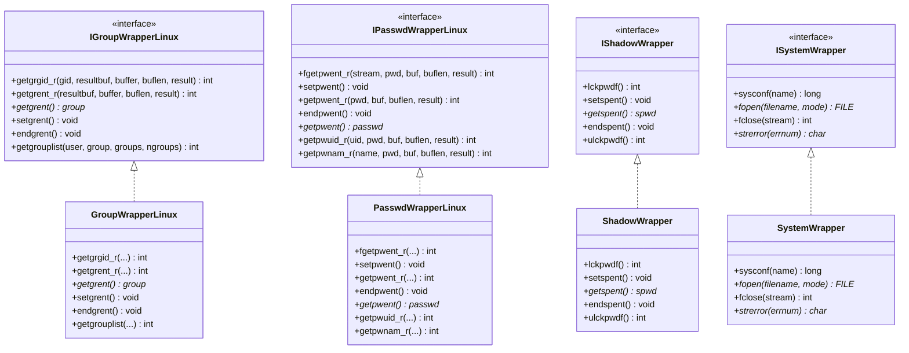
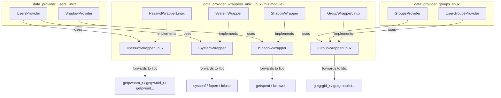
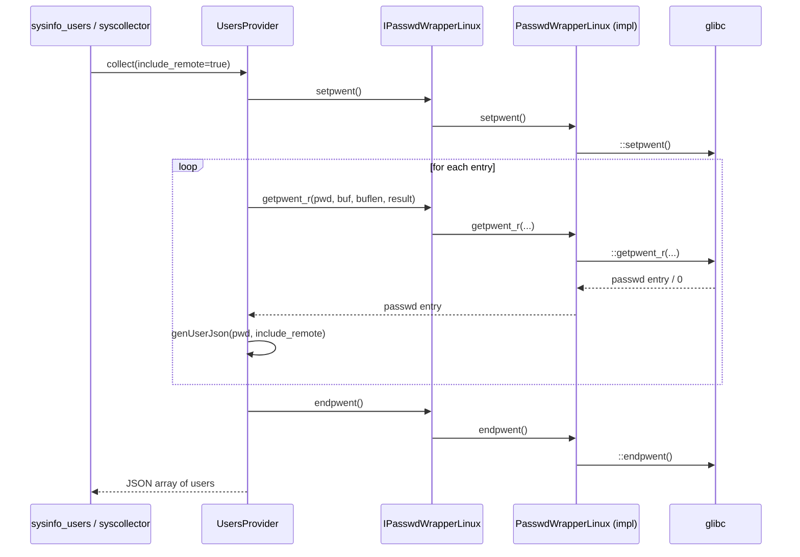

# Data Provider Wrappers — Unix (Linux)

## Introduction

The **`data_provider_wrappers_unix_linux`** module provides thin, mockable C++ wrapper classes around Linux-specific POSIX system APIs used to query operating-system identity databases: the **passwd** database (users), the **group** database (groups), the **shadow** password database, and a handful of generic **system** calls (`sysconf`, `fopen`, `fclose`, `strerror`).

This module is a leaf component of the [System Information Data Provider (C++)](System_Information_Data_Provider_(C++).md) subsystem. It exists purely as an **abstraction/indirection layer**: instead of calling `getpwnam_r()`, `getgrgid_r()`, `getspent()`, etc. directly, the higher-level Linux data providers (`UsersProvider`, `GroupsProvider`, `ShadowProvider` — see [data_provider_users](data_provider_users.md) and [data_provider_groups](data_provider_groups.md)) depend on these wrapper **interfaces**, allowing unit tests to inject mock implementations and avoid touching the real OS databases during testing.

It sits alongside sibling wrapper packages for other Unix flavors ([data_provider_wrappers_unix_darwin](data_provider_wrappers_unix_darwin.md)) and shared utmpx wrappers ([data_provider_wrappers_unix_utmpx](data_provider_wrappers_unix_utmpx.md)), all children of [data_provider_wrappers_unix](data_provider_wrappers_unix.md).

## Purpose and Core Functionality

The module has a single, focused responsibility: **decouple business logic from raw libc/POSIX calls** related to Linux user/group/shadow/system information retrieval. It follows the classic **Wrapper + Interface (Dependency Inversion)** pattern used throughout the `data_provider` codebase (see also [data_provider_wrappers_windows](data_provider_wrappers_windows.md) for the Windows analog).

Each wrapper pairs an abstract interface (pure virtual class) with one concrete implementation that forwards calls to the real system function using the global `::` scope resolution operator. This allows:

- **Testability**: Test doubles/mocks can implement the interface without requiring root privileges, real `/etc/passwd`/`/etc/shadow` access, or specific system state.
- **Portability boundary**: Platform-specific quirks (Linux `_r` reentrant functions, buffer management, `getgrouplist`, etc.) are isolated behind a stable interface consumed by OS-agnostic provider code.
- **Single Responsibility**: Each wrapper focuses on one system resource (users, groups, shadow, or generic system calls).

## Components

| Component | Interface | Implementation | Wrapped APIs |
|---|---|---|---|
| Group access | `IGroupWrapperLinux` (`igroup_wrapper.hpp`) | `GroupWrapperLinux` (`group_wrapper.hpp`) | `getgrgid_r`, `getgrent_r`, `getgrent`, `setgrent`, `endgrent`, `getgrouplist` |
| Passwd access | `IPasswdWrapperLinux` (`ipasswd_wrapper.hpp`) | `PasswdWrapperLinux` (`passwd_wrapper.hpp`) | `fgetpwent_r`, `setpwent`, `getpwent_r`, `endpwent`, `getpwent`, `getpwuid_r`, `getpwnam_r` |
| Shadow access | `IShadowWrapper` (external interface, `ishadow_wrapper.hpp`) | `ShadowWrapper` (`shadow_wrapper.hpp`) | `lckpwdf`, `setspent`, `getspent`, `endspent`, `ulckpwdf` |
| System calls | `ISystemWrapper` (external interface, `isystem_wrapper.hpp`) | `SystemWrapper` (`system_wrapper.hpp`) | `sysconf`, `fopen`, `fclose`, `strerror` |

All four wrappers are stateless, header-only (or single small `.cpp`) classes with no internal fields — they simply forward to the corresponding `::` global function.

## Architecture

## Dependency and Usage Flow

The wrappers are consumed by the concrete Linux data providers (siblings in [data_provider_users](data_provider_users.md) and [data_provider_groups](data_provider_groups.md)), which receive them via constructor dependency injection (`std::shared_ptr<...>`).

## Sequence Example: User Lookup via `UsersProvider`

The following sequence shows how a higher-level provider consumes the `PasswdWrapperLinux` wrapper to enumerate local users without invoking libc directly, enabling substitution with a mock in unit tests.

## Component Details

### `GroupWrapperLinux` / `IGroupWrapperLinux`
Wraps the POSIX group database (`/etc/group`) APIs:
- `getgrgid_r` — reentrant lookup of a group by GID.
- `getgrent_r` / `getgrent` / `setgrent` / `endgrent` — sequential iteration over all group entries.
- `getgrouplist` — retrieves all group IDs a given user belongs to (used to build user→group associations, e.g., by `UserGroupsProvider` in [data_provider_groups](data_provider_groups.md)).

Consumed primarily by `GroupsProvider` (group enumeration) to build the `groups` inventory table, and indirectly supports `UserGroupsProvider`'s group-membership resolution.

### `PasswdWrapperLinux` / `IPasswdWrapperLinux`
Wraps the POSIX passwd database (`/etc/passwd`) APIs, including both file-stream based (`fgetpwent_r`, for scanning a specific file such as one used for "remote" NSS-mapped users) and standard NSS-backed (`getpwent_r`, `getpwuid_r`, `getpwnam_r`) lookup functions.

Consumed by `UsersProvider` to enumerate local (via `getpwent_r`) and remote (via `fgetpwent_r` on alternate sources) user accounts, feeding the `users` inventory table (see [Advanced_Security_Modules_(C++_Inventory_&_Vulnerability)](Advanced_Security_Modules_(C++_Inventory_&_Vulnerability).md) for downstream consumption of user data via the Inventory Harvester).

### `ShadowWrapper` / `IShadowWrapper`
Wraps the shadow password database (`/etc/shadow`) APIs used to read password aging/policy fields (`lckpwdf`/`ulckpwdf` for locking, `setspent`/`getspent`/`endspent` for iteration).

Consumed by `ShadowProvider` (in [data_provider_users](data_provider_users.md)) to collect shadow-related metadata (e.g., last password change, expiration) without exposing actual password hashes.

### `SystemWrapper` / `ISystemWrapper`
A generic, small wrapper exposing standard C library primitives (`sysconf`, `fopen`, `fclose`, `strerror`) that are needed by providers to determine buffer sizes (`sysconf(_SC_GETPW_R_SIZE_MAX)`), open supplementary data files, and produce human-readable error messages.

Consumed by `UsersProvider` for buffer-size calculation prior to calling reentrant passwd functions, and error reporting.

## Design Rationale

1. **Reentrancy first**: Linux/glibc favors thread-safe `_r`-suffixed functions (`getpwnam_r`, `getgrgid_r`, `getpwent_r`) over their legacy non-reentrant counterparts. These wrappers standardize on the reentrant APIs.
2. **No internal state**: Every wrapper class is stateless; all mutable state (buffers, iteration cursors) is owned by the underlying OS/libc, mirroring the semantics of the wrapped calls exactly. This keeps the wrapper trivial to reason about and mock.
3. **Interface segregation**: Each wrapper interface exposes only the functions actually needed by data providers — not the full breadth of the corresponding POSIX API — keeping mocks minimal.
4. **Symmetry with other platforms**: The same wrapper/interface pattern is mirrored for Darwin ([data_provider_wrappers_unix_darwin](data_provider_wrappers_unix_darwin.md)) and Windows ([data_provider_wrappers_windows](data_provider_wrappers_windows.md)), allowing the `sysinfo`/`syscollector` core ([data_provider_sysinfo_core](data_provider_sysinfo_core.md)) to select the correct implementation per platform via factory/build configuration while keeping provider logic (`UsersProvider`, `GroupsProvider`, `ShadowProvider`) largely platform-agnostic in structure.

## Related Modules

- [data_provider_users](data_provider_users.md) — `UsersProvider` and `ShadowProvider` consumers of the passwd/shadow wrappers, plus Darwin/Windows/sudoers variants.
- [data_provider_groups](data_provider_groups.md) — `GroupsProvider` and `UserGroupsProvider` consumers of the group wrapper.
- [data_provider_wrappers_unix_darwin](data_provider_wrappers_unix_darwin.md) — Equivalent wrapper set for macOS/Darwin (Open Directory based).
- [data_provider_wrappers_unix_utmpx](data_provider_wrappers_unix_utmpx.md) — Sibling wrapper for logged-in-user (`utmpx`) session data.
- [data_provider_wrappers_windows](data_provider_wrappers_windows.md) — Analogous wrapper set for Windows user/group APIs.
- [data_provider_sysinfo_core](data_provider_sysinfo_core.md) — Top-level `SysInfo` facade that orchestrates OS-specific providers, including the Linux ones that depend on this module.
- [System Information Data Provider (C++)](System_Information_Data_Provider_(C++).md) — Parent module overview covering hardware, network, OS-info, and package data providers alongside users/groups.
