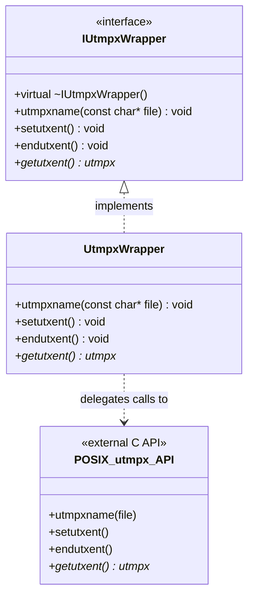
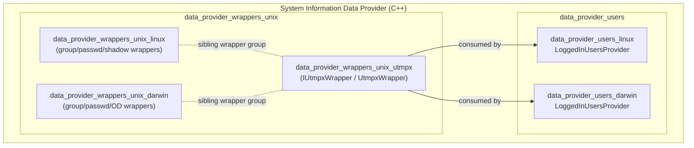
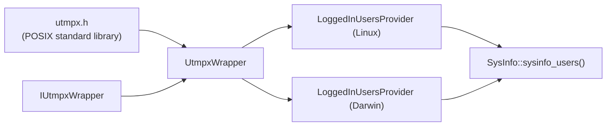
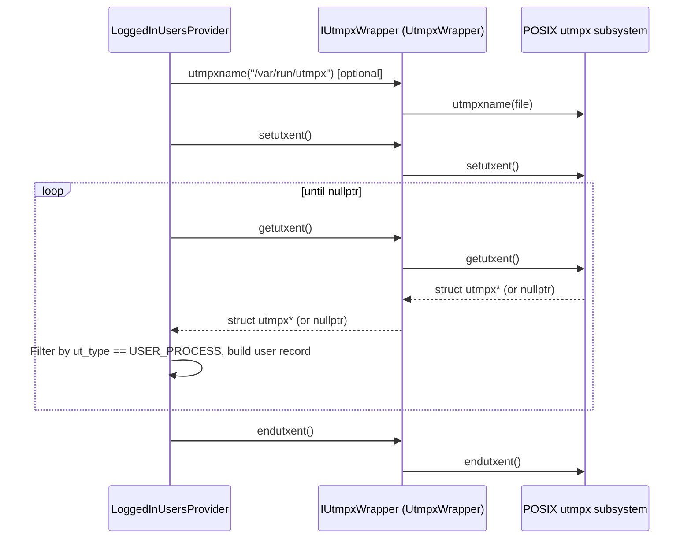

# Data Provider — Unix `utmpx` Wrapper Module

## Introduction

The **`data_provider_wrappers_unix_utmpx`** module is a minimal, focused abstraction layer over the POSIX `utmpx` API (`<utmpx.h>`). It is part of the broader System Information Data Provider (C++) subsystem, specifically the `data_provider_wrappers_unix` group of OS-call wrappers that make platform-dependent, hard-to-unit-test system calls mockable and testable.

`utmpx` is the standard Unix mechanism for tracking login records (who is currently logged in, when they logged in, from which terminal/host, etc.). Both Linux and macOS (Darwin) expose this API with an (almost) identical interface, which is why this wrapper lives at the generic **Unix** level rather than under a Linux- or Darwin-specific folder — it is shared by both platform implementations.

This module exists purely to:
1. Define a **pure virtual interface** (`IUtmpxWrapper`) around the four `utmpx` library calls used by the data provider.
2. Provide a **concrete implementation** (`UtmpxWrapper`) that simply forwards calls to the real system functions.

This pattern (interface + thin real implementation) allows higher-level components — most notably the **Logged-In Users providers** — to be unit tested with mocked/fake session data instead of depending on the real OS login database.

---

## Purpose and Core Functionality

| Component | Type | Responsibility |
|---|---|---|
| `IUtmpxWrapper` | Abstract interface (`.hpp`) | Declares the contract for reading utmpx (login session) records: selecting the file, resetting/closing the stream, and iterating entries. |
| `UtmpxWrapper` | Concrete class (`.hpp`) | Implements `IUtmpxWrapper` by delegating 1:1 to the real POSIX functions (`utmpxname`, `setutxent`, `endutxent`, `getutxent`). |

### Interface Contract (`IUtmpxWrapper`)

| Method | Underlying syscall | Purpose |
|---|---|---|
| `utmpxname(const char* file)` | `utmpxname(3)` | Overrides the default utmpx database file path (useful for testing with a custom/mock file, or supporting non-default paths like `/var/run/utmpx`). |
| `setutxent()` | `setutxent(3)` | Rewinds the utmpx file to the first entry, opening it if necessary. |
| `endutxent()` | `endutxent(3)` | Closes the utmpx file and releases any associated resources. |
| `getutxent()` | `getutxent(3)` | Reads and returns the next `struct utmpx*` record, or `nullptr` when there are no more entries. |

### Design Rationale

- **Testability**: Direct calls to `utmpxname`/`setutxent`/`getutxent`/`endutxent` cannot be intercepted by common C++ mocking frameworks (they are free C functions, not virtual methods). Wrapping them behind an interface enables dependency injection of mock implementations (e.g., via gMock) in unit tests for consumers such as `LoggedInUsersProvider`.
- **Minimal surface area**: The wrapper exposes only the four functions actually consumed by the data provider — it is intentionally not a full utmpx API wrapper.
- **Platform portability**: Both Linux and Darwin/macOS implement the utmpx API with compatible signatures, so a single shared wrapper avoids code duplication between the `data_provider_wrappers_unix_linux` and `data_provider_wrappers_unix_darwin` sibling modules.

---

## Architecture

### Class Diagram

### Module Position in the System

---

## Dependencies

- **Upstream dependency**: `<utmpx.h>` — the POSIX standard header providing `struct utmpx` and the C API being wrapped. No other internal Wazuh module dependencies exist; this is a leaf-level, header-only wrapper.
- **Downstream consumers** (outside this module, part of the `data_provider_users` group):
  - `src/data_provider/src/extended_sources/users/src/logged_in_users_linux.cpp` (`LoggedInUsersProvider`, Linux)
  - `src/data_provider/src/extended_sources/users/src/logged_in_users_darwin.cpp` (`LoggedInUsersProvider`, Darwin)

  These providers use `IUtmpxWrapper`/`UtmpxWrapper` to enumerate currently logged-in user sessions as part of the `sysinfo_users` inventory data collected by the `SysInfo` provider facade (see `src/data_provider/include/sysInfo.hpp`).

---

## Data Flow / Usage Sequence

The typical usage pattern by a consumer such as `LoggedInUsersProvider` is: open/rewind the utmpx stream, iterate all entries filtering for active user-process records, then close the stream.

---

## Testing Considerations

Because `IUtmpxWrapper` is a pure virtual interface, unit tests for `LoggedInUsersProvider` (in the `data_provider_users_linux` and `data_provider_users_darwin` sub-modules) can supply a mock implementation that:
- Returns a scripted sequence of `struct utmpx` records from `getutxent()`.
- Verifies `setutxent()`/`endutxent()` are called exactly once per scan cycle (RAII-style stream lifecycle).
- Simulates edge cases such as an empty utmpx database (`getutxent()` immediately returns `nullptr`) or malformed/partial records.

This avoids depending on the real host's `/var/run/utmpx` (or equivalent) file, which is non-deterministic across CI environments.

---

## Related Documentation

- `data_provider_wrappers_unix` — parent module covering all Unix system-call wrapper interfaces (group, passwd, shadow, system, utmpx).
- `data_provider_wrappers_unix_linux` — Linux-specific sibling wrappers (`GroupWrapperLinux`, `PasswdWrapperLinux`, `ShadowWrapper`, `SystemWrapper`).
- `data_provider_wrappers_unix_darwin` — Darwin-specific sibling wrappers (`GroupWrapperDarwin`, `PasswdWrapperDarwin`, `ODUtilsWrapper`, `UUIDWrapper`).
- `data_provider_users` — consumer module containing `LoggedInUsersProvider` implementations for Linux, Darwin, and Windows.
- `SysInfo_Provider` — top-level `SysInfo` facade that aggregates user/session inventory data (`sysinfo_users`) produced using this wrapper.
