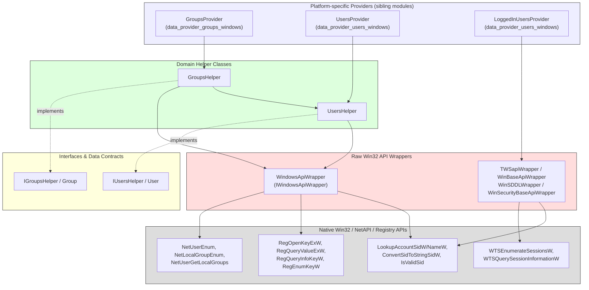
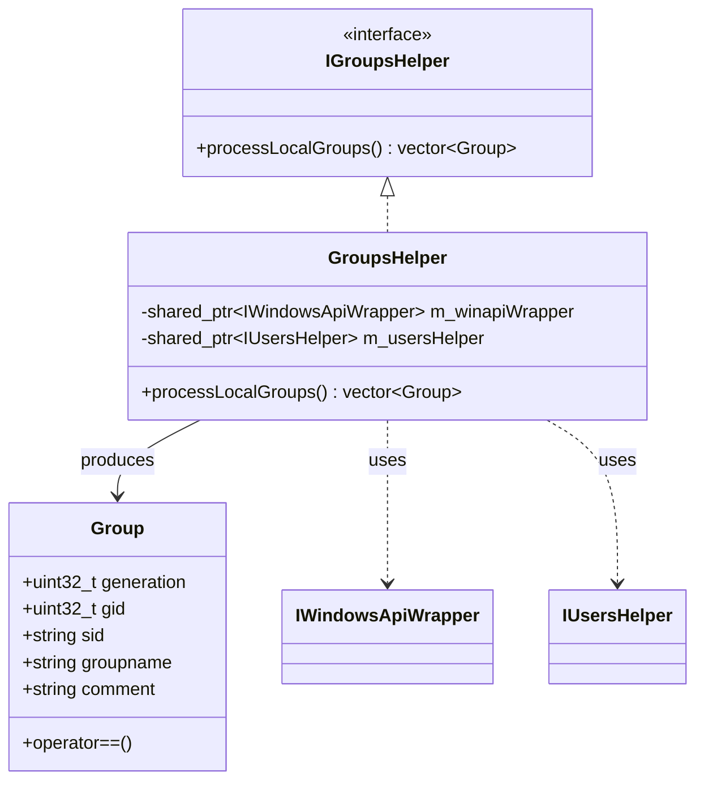
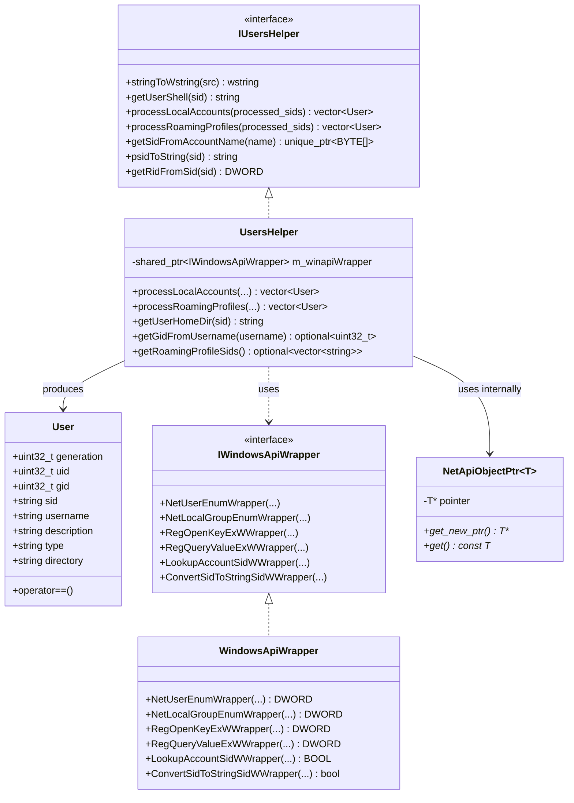
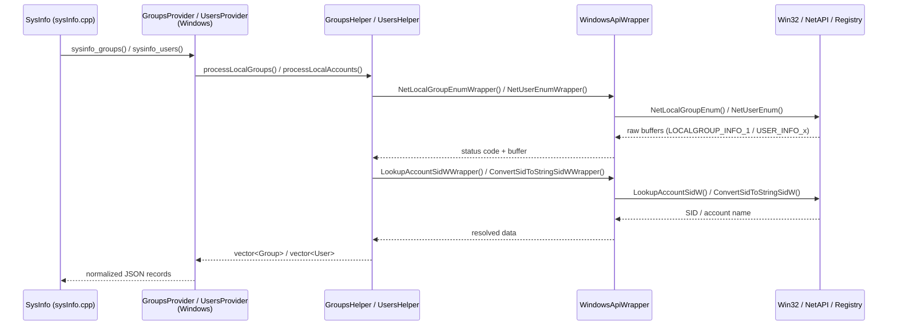

# Data Provider Wrappers – Windows

## 1. Purpose

The **`data_provider_wrappers_windows`** module is a thin, testable abstraction layer that isolates the
Wazuh **System Information Data Provider** (see
[System_Information_Data_Provider_(C++)](System_Information_Data_Provider_(C++).md)) from the native
Win32 API surface it depends on to enumerate **local users, roaming profiles, and local groups** on
Windows agents.

Rather than calling Win32 functions (`NetUserEnum`, `NetLocalGroupEnum`, `RegOpenKeyExW`,
`LookupAccountSidW`, `WTSEnumerateSessionsW`, …) directly from business logic, all such calls are funneled
through small, interface-based wrapper classes. This design:

- **Decouples** high-level user/group collection logic (`UsersHelper`, `GroupsHelper`) from the raw OS
  API, allowing the logic to be unit-tested with mocked API implementations.
- **Centralizes** Windows-specific quirks (SID conversion, registry profile enumeration, RPC/NetAPI
  buffer lifetime management) into a small number of well-documented classes.
- **Mirrors** the equivalent POSIX abstractions found in
  [data_provider_wrappers_unix](data_provider_wrappers_unix.md), so the same downstream consumers
  (`GroupsProvider`, `UsersProvider`, `LoggedInUsersProvider` — see
  [data_provider_groups](data_provider_groups.md) and [data_provider_users](data_provider_users.md))
  can be built consistently across platforms via the Factory pattern used throughout
  `sysInfo.cpp` (see [data_provider_sysinfo_core](data_provider_sysinfo_core.md)).

This module contains **no business logic of its own** — it strictly wraps OS primitives and exposes
higher-level, still-Windows-specific helper operations (`processLocalGroups`, `processLocalAccounts`,
`processRoamingProfiles`) that are consumed by the platform-specific provider implementations
(`groups_windows.hpp`, `users_windows.hpp`, `logged_in_users_win.hpp`) in the sibling modules noted above.

## 2. Architecture Overview

The module is organized into three cooperating layers:

1. **Raw Win32 API Wrappers** (`winapi_wrappers.hpp`, `windows_api_wrapper.hpp`) — one-to-one wrappers
   around individual WinAPI calls (`WTSEnumerateSessionsW`, `LookupAccountNameW`,
   `ConvertSidToStringSidW`, `IsValidSid`, `NetUserEnum`, `RegQueryValueExW`, etc.), each hidden behind
   a small interface (`ITWSapiWrapper`, `IWinBaseApiWrapper`, `IWinSDDLWrapper`,
   `IWinSecurityBaseApiWrapper`, `IWindowsApiWrapper`) so that unit tests can substitute mocks.
2. **Domain Helper Classes** (`users_utils_wrapper.hpp`, `groups_utils_wrapper.hpp`) — higher-level
   helpers (`UsersHelper`, `GroupsHelper`) that combine several raw API calls to produce fully-populated
   domain structs (`User`, `Group`). These classes depend on the raw wrapper interfaces via dependency
   injection (constructor parameters), never calling Win32 functions directly.
3. **Domain Data Contracts & Interfaces** (`iusers_utils_wrapper.hpp`, `igroups_utils_wrapper.hpp`) —
   plain data structures (`User`, `Group`) and the abstract interfaces (`IUsersHelper`,
   `IGroupsHelper`) that decouple the helper implementations from their consumers.

### Key Design Patterns

- **Adapter / Wrapper Pattern**: Every Win32 API surface used is wrapped 1:1 behind a virtual method
  (e.g., `IWindowsApiWrapper::NetUserEnumWrapper`), enabling mocking in `googlemock`/`gtest`-style unit
  tests without touching the real OS.
- **Dependency Injection**: `UsersHelper` and `GroupsHelper` accept their wrapper dependencies through
  constructors (`std::shared_ptr<IWindowsApiWrapper>`), following the same convention used across the
  whole [System_Information_Data_Provider_(C++)](System_Information_Data_Provider_(C++).md) module
  (see also [data_provider_wrappers_unix](data_provider_wrappers_unix.md) for the POSIX equivalent).
- **RAII Smart Pointers**: The `NetApiObjectPtr<T>` template (in `users_utils_wrapper.hpp`) safely wraps
  NetAPI-allocated buffers (`USER_INFO_0/2/3/4`, `LOCALGROUP_USERS_INFO_0`, `LOCALGROUP_INFO_1`),
  automatically invoking `NetApiBufferFree` on destruction — avoiding manual buffer-leak bugs common
  when working with the legacy NetAPI.
- **Data Transfer Objects**: `User` and `Group` are simple, comparably-equal (`operator==`) structs used
  as the common currency exchanged between this module and the Windows-specific provider
  implementations in [data_provider_groups](data_provider_groups.md) and
  [data_provider_users](data_provider_users.md).

## 3. Sub-modules

This module consists of a single cohesive C++ header-only component set. Given its small footprint
(six closely related headers), it is documented in full in this file rather than split into separate
sub-module pages. Logically, it breaks down into two functional groups, both described in the sections
below:

| Logical Group | Files | Responsibility |
|---|---|---|
| **Group Management** | `groups_utils_wrapper.hpp`, `igroups_utils_wrapper.hpp` | Enumerating local Windows groups and exposing them as `Group` structs. |
| **User & Win32 API Wrapping** | `users_utils_wrapper.hpp`, `iusers_utils_wrapper.hpp`, `winapi_wrappers.hpp`, `windows_api_wrapper.hpp` | Enumerating local user accounts and roaming profiles, SID handling, and wrapping the underlying Win32/NetAPI/Registry/WTS calls. |

### 3.1 Group Management (`GroupsHelper` / `Group` / `IGroupsHelper`)

**Files:** `groups_utils_wrapper.hpp`, `igroups_utils_wrapper.hpp`

- **`Group`** (struct, in `igroups_utils_wrapper.hpp`) — Data contract representing a Windows local
  group: `generation`, `gid`, `sid`, `groupname`, `comment`. Supports value equality via `operator==`,
  which is used by the syscollector/inventory pipeline to detect changes between scans (see
  [data_provider_groups_windows](data_provider_groups_windows.md) and, at the daemon level,
  [inventory_harvester_module](inventory_harvester_module.md) `GroupElement`).
- **`IGroupsHelper`** — Abstract interface exposing `processLocalGroups()`, allowing the concrete
  `GroupsHelper` implementation to be swapped for a test double.
- **`GroupsHelper`** — Concrete implementation that:
  - Depends on `IWindowsApiWrapper` (to call `NetLocalGroupEnum`, translate SIDs, etc.) and
    `IUsersHelper` (to cross-reference user/group memberships when needed).
  - Implements `processLocalGroups()`, returning a `std::vector<Group>` representing every local group
    discovered on the host, ready for use by `GroupsProvider` in
    [data_provider_groups_windows](data_provider_groups_windows.md).

### 3.2 User Accounts & Win32 API Wrapping (`UsersHelper` / `User` / `IUsersHelper` / Win32 wrapper classes)

**Files:** `users_utils_wrapper.hpp`, `iusers_utils_wrapper.hpp`, `winapi_wrappers.hpp`,
`windows_api_wrapper.hpp`

- **`User`** (struct, in `iusers_utils_wrapper.hpp`) — Data contract for a Windows user account/profile:
  `generation`, `uid`, `gid`, `sid`, `username`, `description`, `type`, `directory`, with value equality.
- **`IUsersHelper`** — Abstract interface defining the full user-processing contract:
  `stringToWstring`, `getUserShell`, `processLocalAccounts`, `processRoamingProfiles`,
  `getSidFromAccountName`, `psidToString`, `getRidFromSid`.
- **`UsersHelper`** — Concrete implementation built on top of `IWindowsApiWrapper`. Notable behaviors:
  - `processLocalAccounts()` — enumerates local user accounts via NetAPI (`NetUserEnum`), resolves group
    membership (`NetUserGetLocalGroups`), and builds `User` records; tracks `processed_sids` to avoid
    duplicate emission when merged with roaming-profile data.
  - `processRoamingProfiles()` — walks the registry `ProfileList` key
    (`SOFTWARE\Microsoft\Windows NT\CurrentVersion\ProfileList`) to discover roaming profiles not
    captured by the local NetAPI enumeration, filtering out well-known SIDs (`kWellKnownSids`).
  - SID helpers (`getSidFromAccountName`, `psidToString`, `getRidFromSid`) centralize the
    error-prone SID<->string/RID conversions required by both group and user processing.
  - Uses the internal `NetApiObjectPtr<T>` RAII template to guarantee `NetApiBufferFree` is always
    called for NetAPI buffers (`USER_INFO_0/2/3/4`, `LOCALGROUP_USERS_INFO_0`, `LOCALGROUP_INFO_1`),
    and a custom registry-handle deleter (`makeRegHandleDeleter`) for safe `RegCloseKey` cleanup.
- **`TWSapiWrapper`, `WinBaseApiWrapper`, `WinSDDLWrapper`, `WinSecurityBaseApiWrapper`**
  (`winapi_wrappers.hpp`) — minimal 1:1 wrappers around Terminal Services (`WTS*`), account lookup
  (`LookupAccountNameW`), SID string conversion (`ConvertSidToStringSidW`), and SID validation
  (`IsValidSid`) APIs. These are primarily consumed by `LoggedInUsersProvider`
  (see [data_provider_users_windows](data_provider_users_windows.md)) to enumerate active login
  sessions.
- **`WindowsApiWrapper`** (`windows_api_wrapper.hpp`) — the broader, general-purpose Win32 API wrapper
  implementing `IWindowsApiWrapper`, covering NetAPI (`NetUserEnumWrapper`,
  `NetLocalGroupEnumWrapper`, `NetUserGetInfoWrapper`, `NetUserGetLocalGroupsWrapper`), the Windows
  Registry (`RegOpenKeyExWWrapper`, `RegQueryValueExWWrapper`, `RegQueryInfoKeyWWrapper`,
  `RegEnumKeyWWrapper`, `RegCloseKeyWrapper`), and SID/Security utilities
  (`IsValidSidWrapper`, `ConvertSidToStringSidAWrapper`/`WWrapper`, `ConvertStringSidToSidAWrapper`,
  `LookupAccountSidWWrapper`, `LookupAccountNameWWrapper`, `FreeSidWrapper`,
  `GetSidSubAuthorityCountWrapper`, `GetSidSubAuthorityWrapper`, `GetLastErrorWrapper`). This is the
  single injection point used by both `UsersHelper` and `GroupsHelper`.

## 4. Data Flow

The typical call path from a syscollector scan down to a raw Win32 API call looks as follows:

This flow parallels the POSIX implementation described in
[data_provider_wrappers_unix](data_provider_wrappers_unix.md), enabling the shared
`FactoryPackagesCreator`/`FactoryNetworkFamilyCreator`-style factories in
[data_provider_sysinfo_core](data_provider_sysinfo_core.md) to select the correct wrapper set at
compile time per platform.

## 5. Relationship to Other Modules

| Related Module | Relationship |
|---|---|
| [System_Information_Data_Provider_(C++)](System_Information_Data_Provider_(C++).md) | Parent module; this module supplies the Windows-specific low-level building blocks used by the cross-platform data provider. |
| [data_provider_groups_windows](data_provider_groups_windows.md) | Consumes `GroupsHelper`/`Group` to implement `GroupsProvider` and `UserGroupsProvider` for Windows. |
| [data_provider_users_windows](data_provider_users_windows.md) | Consumes `UsersHelper`/`User` and the Win32 wrapper classes (`TWSapiWrapper`, etc.) to implement `UsersProvider` and `LoggedInUsersProvider` for Windows. |
| [data_provider_wrappers_unix](data_provider_wrappers_unix.md) | Sibling module providing the equivalent abstraction for Linux/Darwin (`group`, `passwd`, `utmpx` wrappers). |
| [data_provider_sysinfo_core](data_provider_sysinfo_core.md) | Orchestrates calls into the platform-specific providers (via factories) that ultimately depend on this module on Windows builds. |
| [inventory_harvester_module](inventory_harvester_module.md) | Downstream consumer (via `GroupElement`/`UserElement`) of the normalized group/user data originally sourced through this module. |

## 6. Testing Considerations

Because every Win32 call is behind an interface (`IWindowsApiWrapper`, `ITWSapiWrapper`,
`IWinBaseApiWrapper`, `IWinSDDLWrapper`, `IWinSecurityBaseApiWrapper`), unit tests can inject mock
implementations to simulate:

- NetAPI enumeration failures/edge cases (empty group lists, `ERROR_MORE_DATA`, partial buffers).
- Registry access failures (missing `ProfileList` key, permission-denied on `RegOpenKeyExW`).
- SID conversion failures and well-known SID filtering (`kWellKnownSids`).

This mirrors the mocking approach used throughout the broader Wazuh codebase's C++ unit test suites
(see [Unit_Tests_-_Syscheck_FIM](Unit_Tests_-_Syscheck_FIM.md) and
[Unit_Test_Wrappers_&_Mocks](Unit_Test_Wrappers_&_Mocks.md) for analogous wrapper/mock patterns applied
elsewhere in the codebase).
