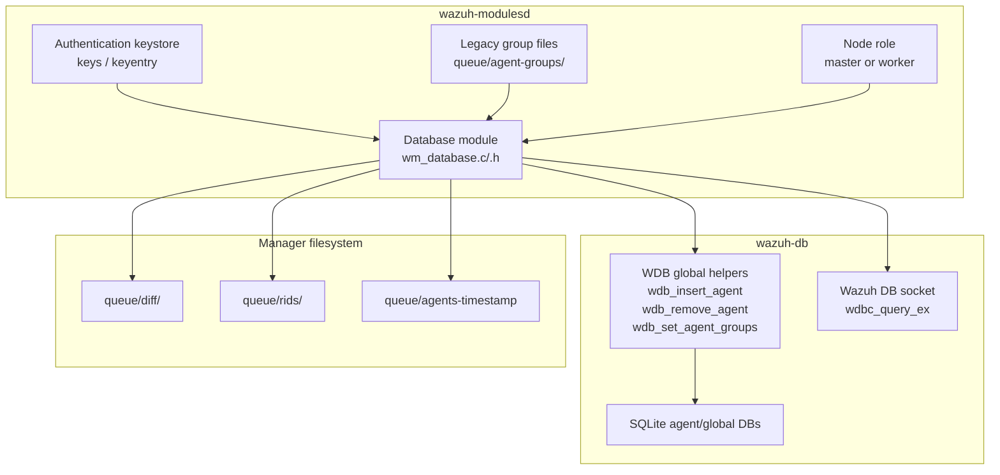
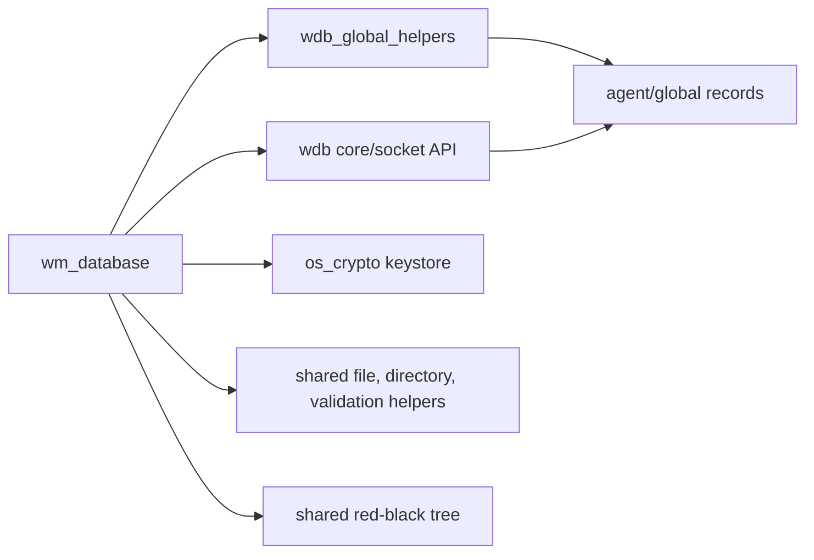
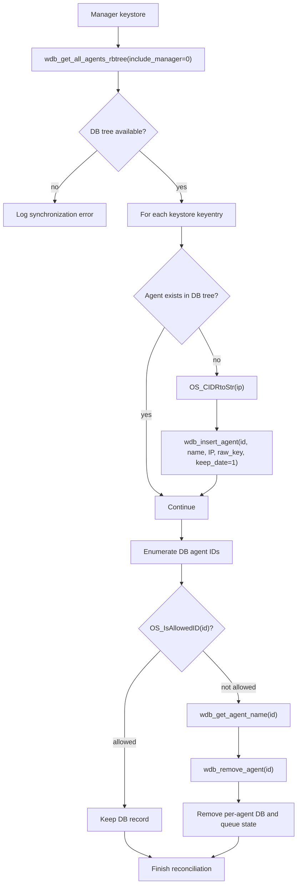
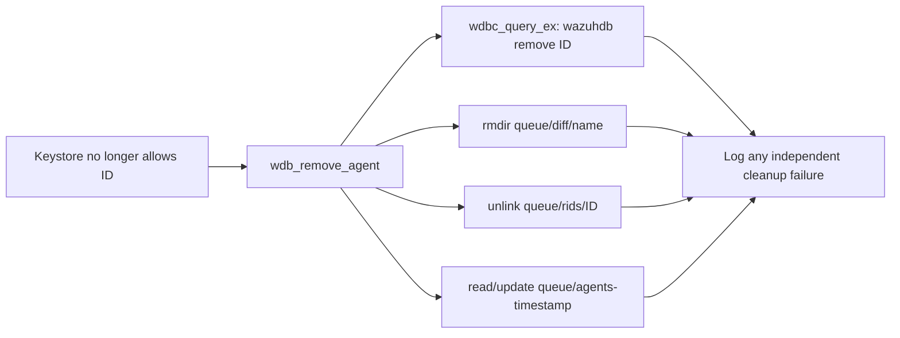

# Database Module

## Introduction

The database module is the `wazuh-modulesd` database worker responsible for reconciling manager-side agent metadata with `wazuh-db`. Its two visible synchronization paths are agent-group files and the authentication keystore. The module consumes files and keystore entries, validates and normalizes them, then creates, updates, or removes records through the Wazuh DB interface.

This module is an integration layer rather than the database engine itself. Persistent storage, SQL execution, transactions, statement caching, agent/group schema, and database-state reporting belong to the [Wazuh DB daemon](wazuh_db.md). Module lifecycle and scheduling are owned by the broader [Wazuh modules daemon](wazuh_modules.md); agent identity and key material are supplied by the authentication/agent-management components.

## Responsibilities

| Responsibility | Production boundary | Behavior evidenced by tests |
|---|---|---|
| Legacy group synchronization | `wm_sync_legacy_groups_files()` | Scans `queue/agent-groups`, processes files, removes successfully handled files, and removes the directory afterward. |
| One group-file synchronization | `wm_sync_group_file()` | Extracts an agent ID from the filename, reads one CSV line, and calls `wdb_set_agent_groups(..., "override", "synced")`. |
| Keystore reconciliation | `sync_keys_with_wdb()` | Inserts keystore agents missing from the DB and removes DB agents no longer allowed by the keystore. |
| Worker-node safety | `is_worker` branch | Worker nodes do not synchronize legacy group files; they delete them instead. |
| Cleanup after deletion | Wazuh DB and filesystem helpers | Removes an agent DB, diff directory, RID file, and timestamp state where applicable. |
| Diagnostics | Wazuh logging wrappers | Uses database-tagged debug/error messages for invalid files, DB failures, and cleanup failures. |

## Architecture



### Component relationships



The supplied module tree identifies the following production components:

- `src/wazuh_modules/wm_database.c` and `wm_database.h`: database worker implementation and module state/configuration.
- `src/wazuh_modules/wmodules.c` and `wmodules_def.h`: daemon registration, lifecycle, and module context.
- `src/wazuh_db/wdb_global.c`, `wdb_global_helpers.c`, and `wdb_global.h`-related interfaces: agent, group, label, connection-status, and synchronization operations.
- `src/wazuh_db/wdb.c`, `wdb_parser.c`, and `wdb_pool.h`: DB connection management, command parsing, pooled per-agent databases, and SQL execution.
- `src/os_crypto/shared/keys.c` and `sec.h`: manager keystore structures and agent key material.

For detailed schema and SQL behavior, see [Wazuh DB](wazuh_db.md); for agent identity and group-management callers, see [agent module](agent_module.md).

## Data flow: group files

```mermaid
flowchart TD
    START["Periodic/module-triggered scan"] --> OPEN["opendir queue/agent-groups"]
    OPEN --> ROLE{"Worker node?"}
    ROLE -- "yes" --> DELETEW["unlink each group file"]
    ROLE -- "no" --> FILE["Read directory entry"]
    FILE --> ID["Use numeric filename as agent ID"]
    ID --> READ["wfopen(path, \"r\")"]
    READ --> VALID{"Readable and non-empty?"}
    VALID -- "no" --> LOGERR["Log failure; continue scan"]
    VALID -- "empty" --> CLOSE["Log empty file and close"]
    VALID -- "yes" --> CSV["Read CSV group list"]
    CSV --> LIMIT["Accept configured maximum group count"]
    LIMIT --> SET["wdb_set_agent_groups(id, groups, override, synced)"]
    SET --> REMOVE["unlink successfully synced file"]
    CLOSE --> NEXT["Next directory entry"]
    LOGERR --> NEXT
    REMOVE --> NEXT
    DELETEW --> NEXT
    NEXT --> DONE{"More files?"}
    DONE -- "yes" --> FILE
    DONE -- "no" --> RMDIR["rmdir queue/agent-groups"]
```

`wm_sync_group_file()` treats the filename as the source of the agent ID. Invalid names fail before opening the file. A valid file is read as a single CSV payload and passed to the WDB group setter in override mode with synchronization status `synced`. The tests explicitly cover an empty file, the maximum group count, and a payload exceeding the maximum; the latter verifies that the module still delegates a valid normalized result to WDB.

`wm_sync_legacy_groups_files()` owns directory iteration and post-processing. A successfully synchronized file is removed. If synchronization fails, the file remains and an error is logged. On worker nodes, files are removed without synchronization because group ownership is centralized on the master. Directory removal is attempted after iteration and failures are logged.

## Data flow: keystore reconciliation



`sync_keys_with_wdb()` performs a two-sided reconciliation:

1. It obtains the current non-manager agent tree from WDB.
2. For each keystore entry absent from that tree, it converts the stored IP and inserts the agent with its ID, name, raw key, and `keep_date=1`.
3. It enumerates DB IDs and uses `OS_IsAllowedID()` to find records no longer represented by the keystore. Those agents are removed through WDB.
4. Removal also attempts associated per-agent resources, including `wazuhdb remove <id>`, `queue/diff/<name>`, `queue/rids/<id>`, and the agents-timestamp file.

The production code is expected to tolerate partial cleanup failures: the tests assert diagnostic logging for failed insert, remove, WDB-socket cleanup, and file operations rather than treating every cleanup failure as a process-fatal condition.

## Process flows and error handling

### Group-file processing

```mermaid
sequenceDiagram
    participant D as Database module
    participant FS as queue/agent-groups
    participant DB as wazuh-db

    D->>FS: opendir()
    FS-->>D: directory entries
    alt worker node
        D->>FS: unlink(file)
    else master node
        D->>FS: wfopen(file, "r")
        FS-->>D: CSV or empty input
        alt valid CSV
            D->>DB: set_agent_groups(id, groups, override, synced)
            DB-->>D: status
            D->>FS: unlink(file)
        else invalid/open/read failure
            D->>D: log error; preserve file
        end
    end
    D->>FS: rmdir(directory)
```

### Agent deletion cleanup



Important error cases covered by the unit suite include invalid agent filenames, failure to open the group directory or group file, empty group files, failed WDB insertion/removal, a missing WDB agent tree, worker-node handling, and inability to remove residual files/directories. Errors are generally logged with the `wazuh-modulesd:database` tag while iteration continues where safe.

## State, ownership, and concurrency notes

- The database module uses global daemon state such as `test_mode` and `is_worker` in the test harness; production values are supplied by the modules daemon and cluster role configuration.
- Group synchronization is role-sensitive. The master is the authoritative writer for group assignments, while workers discard legacy files to avoid stale or conflicting ownership.
- The keystore is the authority for agent existence. WDB is reconciled to it rather than treated as the source of truth for agent keys.
- WDB operations are delegated to helper APIs and sockets. This keeps SQL, transactions, caching, and per-agent DB lifecycle outside the module.
- File content is bounded by module constants such as `OS_BUFFER_SIZE` and `MAX_GROUPS_PER_MULTIGROUP`; callers should preserve these limits when changing parsing code.

## Testing

The test suite is `src/unit_tests/wazuh_modules/database/test_wm_database.c` and uses CMocka. It builds a synthetic `keystore`, red-black-tree DB view, directory entries, files, and WDB responses through wrappers. The tests are organized around:

- `wm_sync_group_file`: filename validation, file-open failure, empty input, maximum group count, and over-limit group input.
- `wm_sync_legacy_groups_files`: directory-open failure, master success, master file failure, worker deletion, and directory cleanup.
- `sync_keys_with_wdb`: insertion of missing agents, removal of stale agents, combined insert/delete reconciliation, and null DB-tree failure.

Wrapper expectations are useful maintenance documentation: they show that IP conversion precedes insertion, group updates use `override`/`synced`, agent IDs are compared through a red-black tree, and stale-agent cleanup invokes both WDB and filesystem operations.

## Related modules

- [Wazuh DB](wazuh_db.md) — SQLite-backed global and per-agent persistence, WDB parser, transactions, pools, integrity, and state.
- [Wazuh modules daemon](wazuh_modules.md) — module registration, lifecycle, and scheduling context.
- [Agent module](agent_module.md) — agent/group management APIs and higher-level agent operations.
- [Cluster module](cluster_module.md) — master/worker role and distributed synchronization context.
- [Shared modules](shared_modules.md) — shared router, database synchronization, socket, and utility infrastructure.
