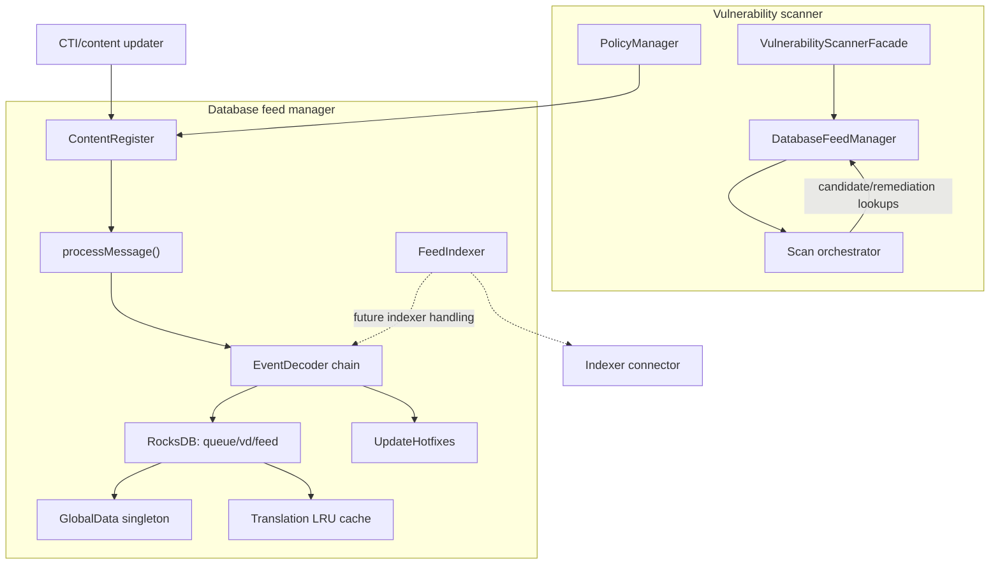
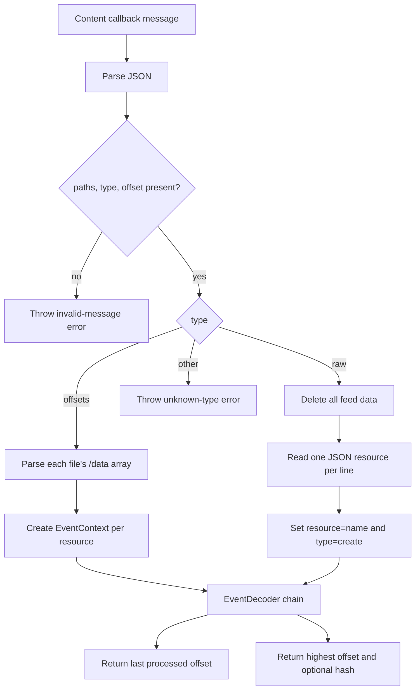
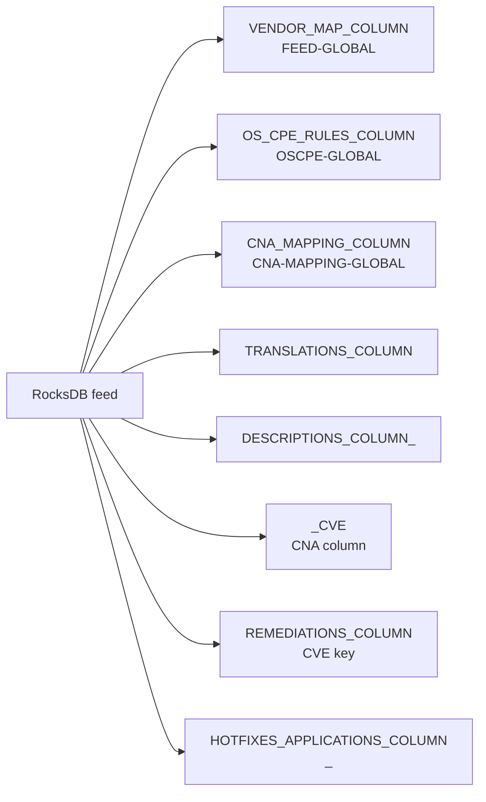
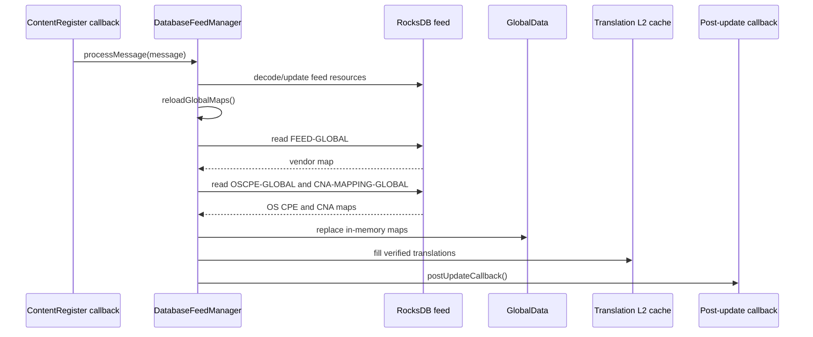
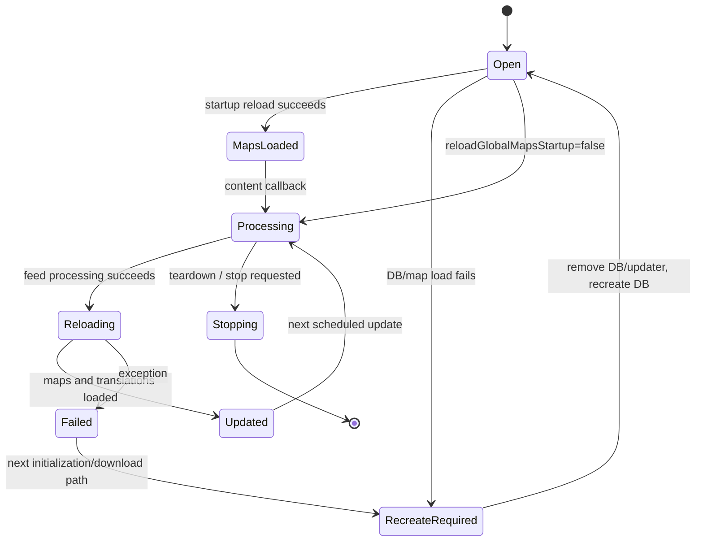

# Database Feed Manager

## Introduction

The **Database Feed Manager** is the vulnerability scanner’s feed-ingestion and lookup layer. It maintains the local vulnerability feed in RocksDB, consumes incremental or raw feed-processing messages, decodes resources through an event-processing chain, reloads global scanner maps, and exposes efficient lookup helpers for vulnerability scanning.

The module is part of the [vulnerability scanner facade](vulnerability_scanner_facade.md). It is not the scanner’s matching engine: package/version matching belongs to the scan orchestrator and version-matching components owned by that facade, while index publication is delegated to the [indexer connector](indexer_connector.md).

## Responsibilities

| Responsibility | Main component | Description |
|---|---|---|
| Feed persistence | `TDatabaseFeedManager`, `TRocksDBWrapper` | Opens `queue/vd/feed` and reads/writes feed column families. |
| Feed ingestion | `processMessage`, `EventContext`, `EventDecoder` | Processes offset-based or consolidated raw files. |
| Feed consistency | `reloadGlobalMaps`, FlatBuffers verifiers | Validates and loads vendor, OS CPE, CNA, and translation data. |
| Vulnerability lookup | `getVulnerabilitiesCandidates`, descriptive/remediation methods | Retrieves FlatBuffers records and scans candidate arrays. |
| Package-to-CNA routing | `getCnaNameBy*` helpers | Resolves a CNA/ADP using source, format, vendor contents, or vendor prefix. |
| Translation acceleration | `TranslationLRUCache` | Keeps a bounded Level 2 cache of compiled translation regular expressions. |
| Hotfix reverse index | `UpdateHotfixes` | Stores and removes `hotfix_CVE` relationships for Windows remediations. |
| Content scheduling | `ContentRegister`, `update` | Registers the feed callback and applies scheduler interval changes. |
| Shutdown | `teardown`, `m_shouldStop` | Stops processing at safe checkpoints. |

## Architecture overview



`FeedIndexer` is structurally a chain handler and owns an indexer connector, but its supplied `handleRequest()` only forwards to the base handler. The actual indexer integration is therefore an extension point, not an implemented feed-processing step in this header.

## Components

### `TDatabaseFeedManager`

File: `src/wazuh_modules/vulnerability_scanner/src/databaseFeedManager/databaseFeedManager.hpp`

`TDatabaseFeedManager` is a final, dependency-injectable template with defaults for `PolicyManager`, `ContentRegister`, and `Utils::RocksDBWrapper`. It inherits `Observer<nlohmann::json&>` so configuration updates can be delivered through `update()`.

Its constructor:

1. Reads updater configuration and its topic name from `PolicyManager`.
2. Opens RocksDB at `queue/vd/feed` with automatic repair disabled.
3. Optionally calls `reloadGlobalMaps()` at startup.
4. If opening or loading fails, removes the feed database/updater directory and recreates the database so the content updater can download a complete feed.
5. Optionally registers a `ContentRegister` callback that processes feed files, reloads maps, and invokes the post-update callback.

The member declaration order is intentional: the shared mutex, content registration, database, translation cache, and stop flag must be destroyed in a safe dependency order.

### `EventContext`

File: `src/wazuh_modules/vulnerability_scanner/src/databaseFeedManager/eventContext.hpp`

`EventContext` is the mutable context passed through the feed event chain. It contains:

- a reference to the original processing message;
- a reference to the current JSON resource;
- an optional detached CVE FlatBuffer;
- the shared feed database;
- a `ResourceType` discriminator (`CVE`, `TRANSLATION`, `VENDOR_MAP`, `OSCPE_RULES`, `CNA_MAPPING`, or `UNKNOWN`).

The references are non-owning. The caller must keep the message and resource alive while the chain processes the context.

### `GlobalData`

File: `src/wazuh_modules/vulnerability_scanner/src/databaseFeedManager/globalData.hpp`

`GlobalData` is a process-wide singleton containing JSON maps used by scanner components:

- vendor mappings;
- operating-system CPE mappings;
- CNA/ADP mappings;
- the manager name.

`reloadGlobalMaps()` populates the first three values from RocksDB. `managerName()` defaults an empty name to `manager`.

### `FeedIndexer`

File: `src/wazuh_modules/vulnerability_scanner/src/databaseFeedManager/feedIndexer.hpp`

`FeedIndexer<TIndexerConnector>` is an `AbstractHandler<std::shared_ptr<EventContext>>`. It receives an injected indexer connector and forwards the context to the next handler through the base implementation. The class provides the intended chain boundary for indexing feed events, but the supplied implementation contains no connector call.

### `UpdateHotfixes`

File: `src/wazuh_modules/vulnerability_scanner/src/databaseFeedManager/updateHotfixes.hpp`

`UpdateHotfixes` maintains the reverse relationship needed to answer “which CVEs are associated with this hotfix?” For each Windows remediation in a CVE v5 entry it writes an empty-value record using:

```text
key = <hotfix>_<cve-id>
column = HOTFIXES_APPLICATIONS_COLUMN
```

`storeVulnerabilityHotfixes()` creates the column family on demand. `removeHotfix()` deletes the same keys when a vulnerability is removed or replaced.

## Feed processing



### Offset messages

For `type == "offsets"`, every path is parsed through `JsonArray::parse()` using the `/data` JSON pointer. Each resource is sent to a fresh `EventContext` and `EventDecoder`. The offset is updated from each resource’s `offset`; processing stops between resources when `m_shouldStop` becomes true. The returned tuple is `{currentOffset, "", true}`.

### Raw messages

For `type == "raw"`, exactly one path is required because the file is a consolidated snapshot. The database is cleared before reading. Each line must contain `name` and `offset`; it is converted into a create resource and sent through the same decoder chain. Since offsets may not be ordered, the maximum offset is returned. A `fileMetadata.hash` is returned when present.

An interruption returns `{0, "", true}`. This distinguishes a deliberate stop from a processing failure while allowing the updater to persist its own progress semantics.

## Database layout and lookup API



Important operations:

| Method | Behavior |
|---|---|
| `getCVEDatabase()` | Returns the underlying feed database reference for scanner integrations. |
| `getVulnerabilitiesCandidates(cna, package, callback)` | Seeks from `<package.name>_CVE` in the CNA column, verifies candidate-array FlatBuffers, and stops when the callback reports a vulnerable candidate. |
| `getVulnerabilityDescriptiveInformation(cve, subShortName, result)` | Reads `DESCRIPTIONS_COLUMN_<subShortName>` and returns a verified/deserialized description pointer when found. |
| `getVulnerabilityRemediation(cve, result)` | Reads and verifies remediation FlatBuffers; absence means no remediation. |
| `getHotfixVulnerabilities(hotfix)` | Seeks the hotfix reverse-index column and returns the CVE keys found. |
| `getTranslationFromL2(package, osPlatform)` | Finds the first target/platform and product/vendor regex match and returns translated package fields. |
| `getCnaNameBySource/Format/Contains/Prefix` | Resolves a CNA/ADP from `GlobalData::vendorMaps()`. |

FlatBuffers are verified before candidate, translation, and remediation data is dereferenced. Descriptive information is read as a generated FlatBuffers object after a successful RocksDB lookup; malformed data handling should therefore remain aligned with the feed decoder and database validation path.

## Translation cache

`Translation` stores optional product, vendor, and version regular expressions, translated values, and valid target platforms. `fillL2CacheTranslations()` iterates the translation column until the configured LRU cache is full, verifies each FlatBuffer, compiles non-empty regexes, and stores the result.

`getTranslationFromL2()` applies matching in this order:

1. target platform;
2. product regex against package name, if configured;
3. vendor regex against package vendor, if configured;
4. translated output construction.

When a version regex matches the package name, capture group 1 becomes the translated version; otherwise the feed-provided translated version is used. The cache size comes from `PolicyManager::getTranslationLRUSize()`.

## Global-map reload and recovery



If the database cannot be opened or the required global records are missing/invalid, construction removes the existing feed/updater state and recreates the database. This deliberately forces a complete content download rather than continuing with incomplete global maps.

## Concurrency and lifecycle

`processMessage()` and `reloadGlobalMaps()` take an exclusive scoped lock on the shared mutex. This protects the database and process-wide map refresh from concurrent scanner reads/updates. `teardown()` sets `m_shouldStop`; offset parsing checks it after resources, while raw parsing checks it on each line.

The content callback treats a successful processing result followed by a successful map reload as the update boundary. It then runs the optional post-update callback. Any exception logs an error and returns `{0, "", false}`.



## Integration points

- [vulnerability_scanner_facade.md](vulnerability_scanner_facade.md): owns and coordinates the feed manager with policy, scanning, subscriptions, and reporting.
- [content_manager_facade.md](content_manager_facade.md): manages content providers and update scheduling at the shared content-manager boundary.
- [content_manager_orchestration.md](content_manager_orchestration.md): details the update orchestration that invokes the feed file callback.
- [indexer_connector.md](indexer_connector.md): documents the connector intended for feed/index publication and scanner result indexing.
- [wazuh_db_fim_syscollector.md](wazuh_db_fim_syscollector.md): describes inventory data sources whose package, OS, and hotfix information is consumed by vulnerability scanning.

## Operational considerations

- The feed path is fixed as `queue/vd/feed`.
- Raw updates are destructive from the local database’s perspective: all feed data is deleted before the snapshot is parsed.
- Offset updates are incremental and return the last resource offset processed.
- Feed records must remain valid according to their generated FlatBuffers schemas.
- Translation matching is bounded by the configured LRU size; adding translations beyond capacity does not populate the cache after it becomes full.
- CNA selection depends on the JSON structures loaded into `GlobalData`; missing mappings return an empty string.
- `FeedIndexer` should not be treated as publishing data until its TODO implementation is completed.
