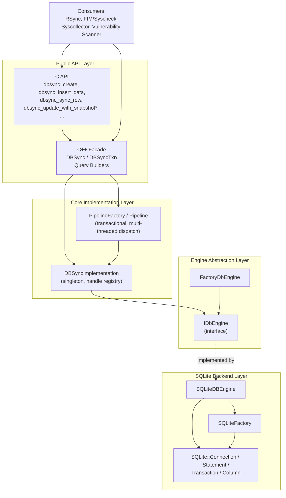
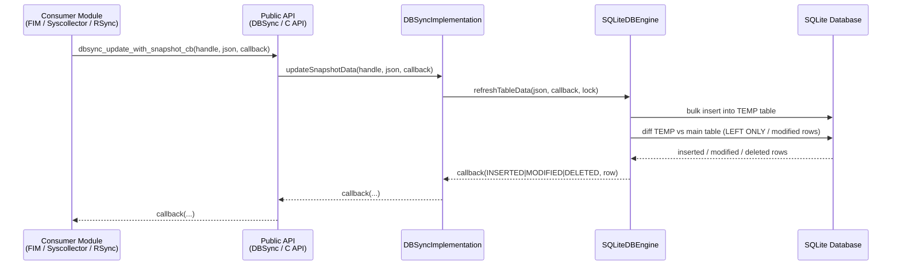
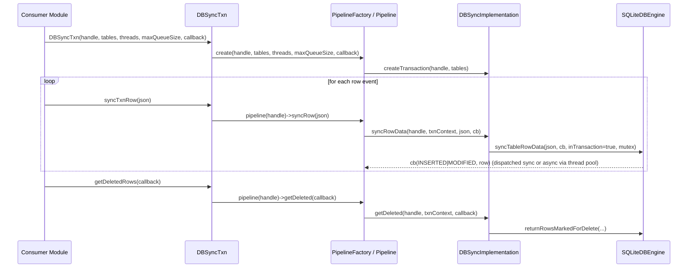

# DBSync Module

## Introduction

**DBSync** (`src/shared_modules/dbsync`) is a Wazuh shared C++ library that provides a generic, thread-safe, SQLite-backed **data synchronization engine**. It is the low-level building block used across many Wazuh agent/manager components (FIM, Syscollector, Vulnerability Scanner, RSync, and others) to:

- Persist arbitrary tabular data ("snapshots") in a local SQLite database.
- Detect **differences** between a newly captured snapshot and the previously stored state (insertions, modifications, deletions).
- Perform **row-level upserts** ("sync row") with change detection, optionally inside high-throughput **transactions** processed by a worker-thread pipeline.
- Expose both a **C API** (used by C modules such as Syscollector and FIM) and a **C++ facade** (used by C++ modules such as `rsync`) over the same underlying implementation.

DBSync does not know anything about the semantic meaning of the data it stores (files, packages, processes, etc.) — it is a reusable **generic diffing/sync engine** on top of SQLite, decoupled from any particular business domain.

## Role in the Overall System

DBSync sits in the **Shared Modules Infrastructure (C++)** layer of Wazuh, alongside other reusable libraries such as `rsync`, `router`, `indexer_connector`, and the generic `shared_utils`. It has no outgoing dependency on higher-level Wazuh modules; instead, it is consumed by them:

- **RSync** (see [rsync.md](rsync.md)) wraps DBSync (`dbsyncWrapper.h`) to compute checksums/ranges used for remote database synchronization between agents and the manager (`wazuh_db`).
- **Syscheck/FIM** uses DBSync transactions to persist file/registry inventory and detect changes.
- **Syscollector** and the **Vulnerability Scanner** modules use DBSync (directly or via RSync) to persist and diff hardware, OS, package, process, port, and network inventory data.
- Generic primitives such as smart pointers, JSON helpers, and locking utilities used internally by DBSync are provided by [shared_utils.md](shared_utils.md).

## Architecture Overview

DBSync is organized in four cooperating layers:

### Layer Summary

| Layer | Sub-module doc | Responsibility |
|---|---|---|
| Public API | [dbsync_public_api.md](dbsync_public_api.md) | Exposes the C API (`dbsync.cpp`) and the C++ object-oriented facade (`dbsync.hpp`: `DBSync`, `DBSyncTxn`, `SelectQuery`, `InsertQuery`, `DeleteQuery`, `SyncRowQuery`) used by consumer modules. |
| Core Implementation | [dbsync_core_implementation.md](dbsync_core_implementation.md) | `DBSyncImplementation` singleton manages DB handles and engine contexts; `PipelineFactory`/`Pipeline` implement asynchronous, multi-threaded transactional row synchronization. |
| Engine Abstraction | [dbsync_engine_abstraction.md](dbsync_engine_abstraction.md) | `IDbEngine` interface decouples the sync logic from any specific database technology; `FactoryDbEngine` instantiates the concrete engine (currently SQLite only). |
| SQLite Backend | [dbsync_sqlite_backend.md](dbsync_sqlite_backend.md) | `SQLiteDBEngine` implements `IDbEngine` on top of SQLite, handling schema introspection, bulk insert, row diffing, transactions, and max-row-count enforcement; thin RAII wrappers (`SQLite::Connection`, `Statement`, `Transaction`, `Column`) isolate raw `sqlite3` C calls. |

## End-to-End Data Flow

The two most common operations in DBSync are a **snapshot update** (used to detect what changed compared to the previous full dataset) and a **transactional row sync** (used for high-throughput incremental updates, e.g. during a FIM scan).

## Key Design Characteristics

- **Handle-based multiplexing**: A single process can create multiple independent DBSync instances (`DBSYNC_HANDLE`), each backed by its own `IDbEngine`/SQLite connection, tracked by `DBSyncImplementation`.
- **Dual API surface**: The C API (`dbsync.h`/`dbsync.cpp`) wraps JSON payloads as `cJSON*`, converting to/from `nlohmann::json` for internal processing; the C++ facade (`dbsync.hpp`) works directly with `nlohmann::json` and RAII objects (`DBSync`, `DBSyncTxn`).
- **Fluent query builders**: `SelectQuery`, `InsertQuery`, `DeleteQuery`, and `SyncRowQuery` (all extending the generic `Query<T>` template, built on the `Utils::Builder` pattern from [shared_utils.md](shared_utils.md)) provide a type-safe way to construct the JSON payloads consumed by the engine.
- **Transactional pipeline with worker pool**: `DBSyncTxn`/`Pipeline` can dispatch row-sync work across a configurable number of threads (`ReadNode` from `shared_utils`), falling back to synchronous processing once a max queue size is reached — trading latency for backpressure control.
- **Pluggable database engine**: Although only `SQLiteDBEngine` exists today, the `IDbEngine` interface and `FactoryDbEngine` allow adding other engines without touching `DBSyncImplementation` or the public API.
- **Snapshot diffing via temp tables**: `SQLiteDBEngine` creates a `_TEMP` copy of a table, bulk-inserts the new snapshot into it, and uses SQL `LEFT JOIN`-style queries to compute inserted, modified, and deleted rows relative to the persisted table — the core mechanism behind `updateWithSnapshot`.
- **Row quota enforcement**: `setTableMaxRow`/`MaxRows` allow bounding a table's size, turning it into a FIFO-like queue when the limit is exceeded — used by modules that must cap resource usage (e.g., limiting the number of tracked files).

## Related Modules

- [rsync.md](rsync.md) — Remote synchronization module that wraps DBSync (`DBSyncWrapper`) to compute and exchange checksums/ranges of synchronized tables between agent and manager.
- [shared_utils.md](shared_utils.md) — Generic C++ utilities (RAII wrappers, builder/observer patterns, threading primitives, SQLite helper templates) used internally by DBSync.
- Higher-level consumers such as Syscheck/FIM, Syscollector, and the Vulnerability Scanner modules (documented separately) rely on DBSync as their persistence/diffing backend but are out of scope for this document.

## Sub-module Documentation

- [dbsync_public_api.md](dbsync_public_api.md) — C and C++ public interfaces.
- [dbsync_core_implementation.md](dbsync_core_implementation.md) — Handle/context management and the transactional pipeline.
- [dbsync_engine_abstraction.md](dbsync_engine_abstraction.md) — Database engine interface and factory.
- [dbsync_sqlite_backend.md](dbsync_sqlite_backend.md) — Concrete SQLite implementation and low-level wrappers.
