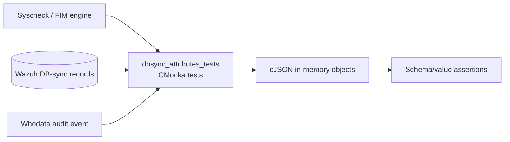
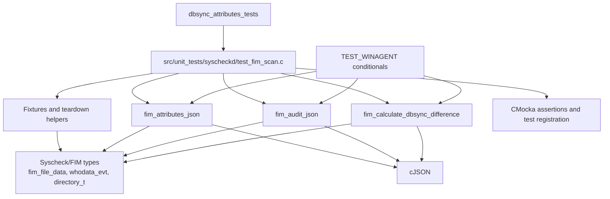
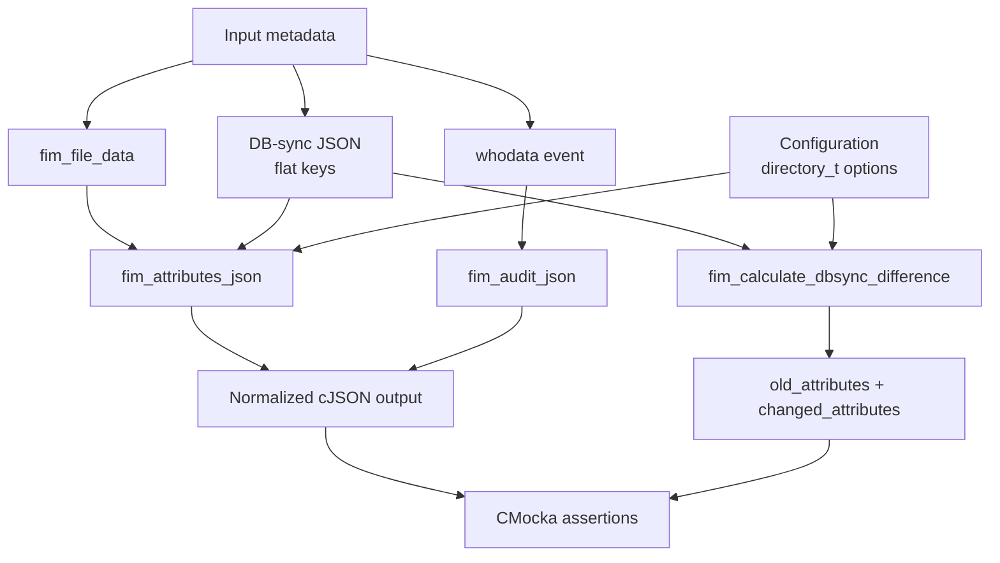
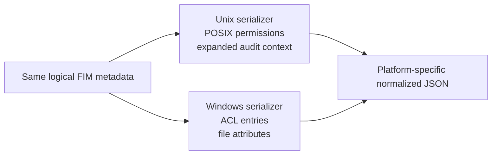
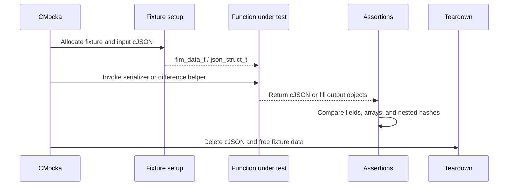

# `dbsync_attributes_tests`

## Introduction

`dbsync_attributes_tests` is a logical group of CMocka unit tests in `src/unit_tests/syscheckd/test_fim_scan.c`. It verifies the translation of Syscheck/File Integrity Monitoring (FIM) metadata and Wazuh DB-sync records into normalized JSON, together with the extraction of changed DB-sync attributes.

The tests are part of the broader `test_fim_scan` test executable rather than a standalone production module. They exercise serialization and comparison helpers in memory; they do not access a live Wazuh database or filesystem.

Related documentation: [Syscheck/FIM core](syscheckd_core.md), [Syscheck DB layer](syscheckd_db.md), [FIM scan tests](test_fim_scan.md), and [shared test utilities](shared_test_utilities.md).

## Scope and responsibilities

The module covers three contracts:

1. `fim_attributes_json` converts file metadata or a DB-sync row into the alert-facing FIM JSON schema.
2. `fim_audit_json` converts a whodata/audit event into its JSON representation.
3. `fim_calculate_dbsync_difference` extracts configured fields from a DB-sync change and prepares old-value/change structures for event generation.

The test group validates field names, nesting, array representation, values, and platform-specific behavior. It also verifies that a missing change payload is treated as a no-op.

## Position in the system

The production functions under test are shared by scan, realtime, whodata, and transaction-callback paths. Those higher-level paths are tested by sibling groups in the same source file; this module concentrates on their JSON and DB-sync data contract.

## Component architecture

### Main components

| Component | Role |
|---|---|
| `test_fim_attributes_json` | Checks serialization of a populated `fim_file_data` object. |
| `test_dbsync_attributes_json` | Checks conversion from flat DB-sync keys to normalized FIM JSON. |
| `test_fim_audit_json` | Checks serialization of whodata process/user information. |
| `test_fim_calculate_dbsync_difference` | Checks configured-field extraction and normalized old values. |
| `test_fim_calculate_dbsync_difference_no_changed_data` | Checks safe behavior when the DB-sync change object is `NULL`. |
| `setup_json_event_attributes` / `teardown_json_event_attributes` | Own the `json_struct_t` fixture used by the DB-sync serializer test. |
| `teardown_delete_json` | Releases the JSON object attached to the shared FIM fixture. |
| `teardown_local_data` | Releases dynamically allocated file metadata for related tests. |

## Data contracts under test

### FIM attribute JSON

`fim_attributes_json` produces a normalized object containing the fields enabled by `directory_t.options`. The Unix test expects fields including:

- `size`, `uid`, `gid`, `owner`, `group`, `inode`, `device`, and `mtime`;
- `permissions` as an array;
- `hash` as an object containing `md5`, `sha1`, and `sha256`.

The source DB-sync representation uses flat/internal names such as `group_`, `hash_md5`, `hash_sha1`, and `hash_sha256`. The expected output confirms their public/alert-facing names and nesting.

### Audit JSON

`fim_audit_json` serializes the whodata event. Common fields include `user_id`, `user_name`, `process_name`, and `process_id`. Unix builds additionally verify process and parent-process context, group identity, audit identity, and effective identity fields.

### DB-sync difference data

`fim_calculate_dbsync_difference` receives:

- a `directory_t` configuration describing which metadata fields are monitored;
- a cJSON DB-sync change object;
- an output array for changed attributes;
- an output object for old/normalized values.

The test enables size, permissions, ownership, timestamps, inode/device, and all three hashes. It verifies that the resulting object contains normalized fields and a nested `hash` object. A Windows build also verifies ACL permissions and file attributes.

## Data flow

## Test behavior

### `test_fim_attributes_json`

The shared FIM fixture supplies representative metadata: size `1500`, permissions `0664`, ownership values, inode `606060`, modification time `1570184223`, and fixed MD5/SHA-1/SHA-256 values. The test calls `fim_attributes_json(NULL, old_data, configuration)` and validates the resulting object.

### `test_dbsync_attributes_json`

This test uses an isolated `json_struct_t` fixture. It passes a DB-sync-style object to `fim_attributes_json`, serializes the result without formatting, and compares the complete JSON string. Exact-string comparison makes field naming, ordering, nesting, and array encoding observable.

### `test_fim_audit_json`

The whodata event fixture contains user, process, parent-process, and audit identity data. The test confirms that the serializer preserves the expected identity and process context, with Unix and Windows expectations separated by compile-time conditionals.

### `test_fim_calculate_dbsync_difference`

The test supplies a complete changed record and enables all relevant monitoring flags. It verifies that the helper maps DB-sync fields into `old_attributes`, including the `group_` to `group` mapping and hash-object construction. Windows additionally validates ACL and file-attribute handling.

### `test_fim_calculate_dbsync_difference_no_changed_data`

Passing `NULL` as the changed record must not create a change entry. The test expects an empty `changed_attributes` array and confirms that the helper safely returns without dereferencing absent input.

## Platform-specific behavior

| Concern | Unix-like builds | Windows builds (`TEST_WINAGENT`) |
|---|---|---|
| Permissions | POSIX permission string represented in a one-item array. | ACL data represented as permission JSON entries. |
| File attributes | Not emitted by these assertions. | Emitted as an `attributes` array. |
| Audit fields | Full process, parent, group, audit, and effective-user context. | Only the common subset is asserted. |
| Difference test | Checks POSIX permissions and `attributes: "NULL"` input. | Checks four ACL entries and `CHECK_ATTRS`. |

## Fixtures and lifecycle

The broader test group initializes `fim_data_t`, Syscheck configuration, synchronization primitives, and test-mode state through `setup_group`. The module-specific DB-sync serializer test uses `setup_json_event_attributes`, which allocates a `json_struct_t` containing two cJSON pointers.

Ownership is important: the tests delete generated cJSON objects and fixture-owned input objects in teardown. Production database state is never modified.

## Registration and execution model

The tests are registered in the `tests[]` CMocka array in `test_fim_scan.c`:

- `test_fim_attributes_json` and `test_fim_audit_json` use the shared group fixture and JSON teardown.
- `test_dbsync_attributes_json` uses its dedicated JSON setup/teardown pair.
- The two difference tests use direct in-memory cJSON values and do not require the full FIM fixture.

They execute as part of the same `cmocka_run_group_tests(tests, setup_group, teardown_group)` invocation as scan, callback, directory, and database-state tests. Use the repository’s unit-test build instructions, then run the generated `test_fim_scan` binary or filter the corresponding CTest target if the build system exposes one. The exact binary path is build-configuration dependent.

## Maintenance guidance

When changing the FIM event schema or DB-sync columns, update these tests together with the production serializer/difference logic. In particular, check:

- internal-to-public key mappings such as `group_` → `group`;
- flat hash fields → nested `hash` object;
- permission array and Windows ACL encoding;
- option-gated fields controlled by `directory_t.options`;
- behavior for absent, empty, or malformed DB-sync change objects;
- parity between Unix and Windows expectations.

For scan traversal, missing entries, transaction callbacks, and database-capacity state transitions, see the sibling test documentation rather than duplicating those workflows here: [FIM scan tests](test_fim_scan.md) and [Syscheck DB tests](syscheckd_db.md).

