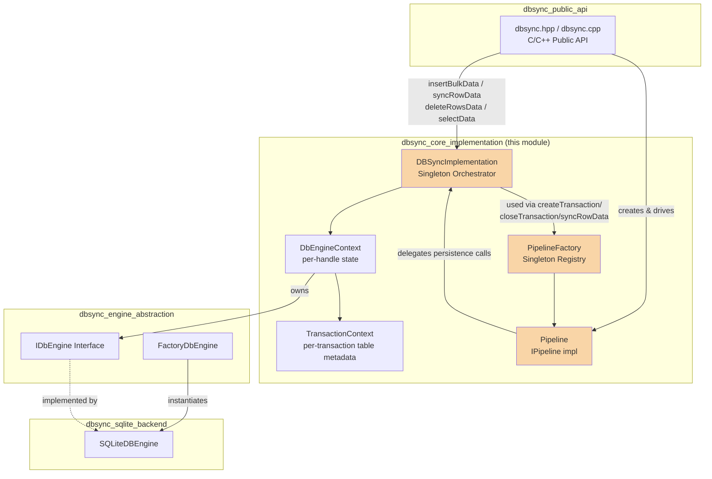
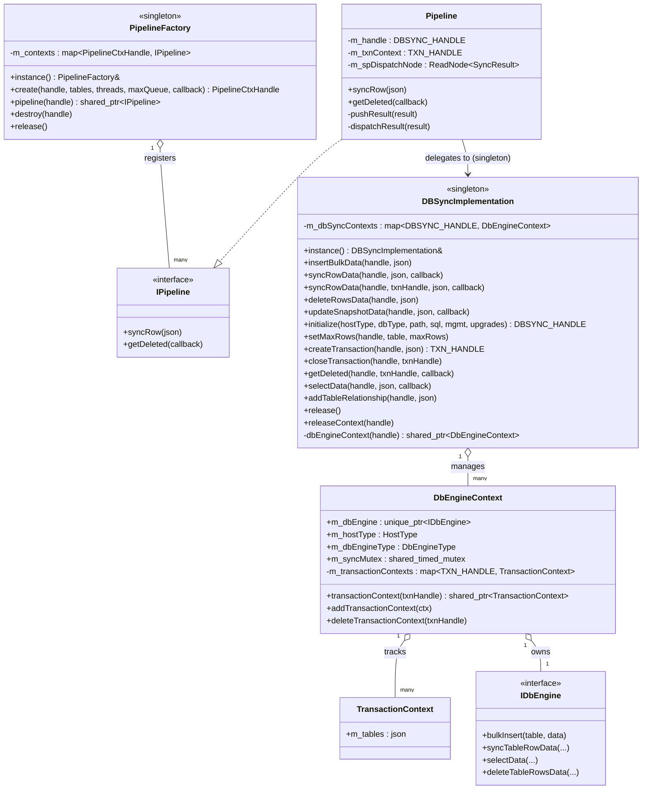
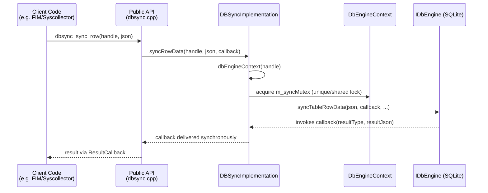
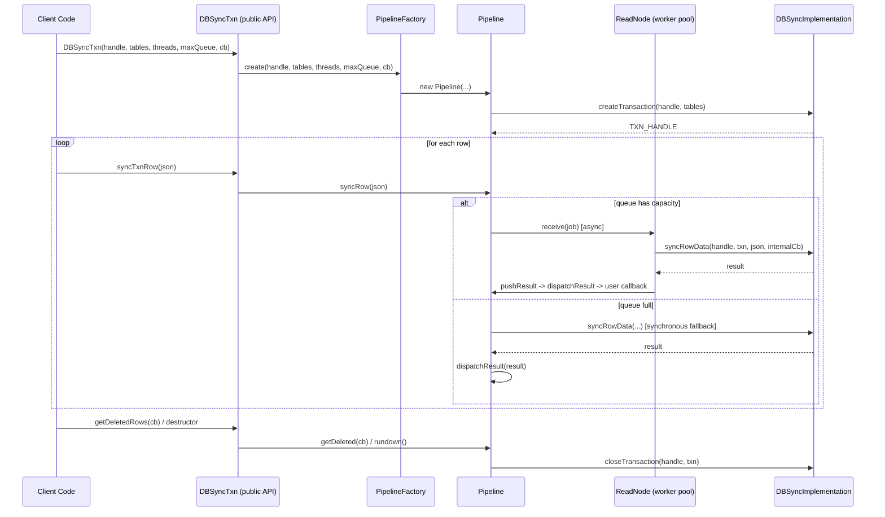
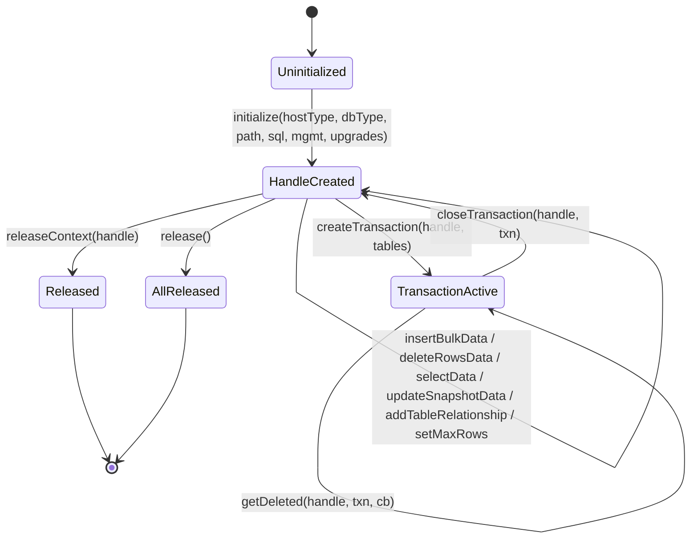

# DBSync Core Implementation

## Introduction

The **DBSync Core Implementation** module is the central orchestration layer of Wazuh's DBSync shared module. It implements the singleton `DBSyncImplementation` class that manages the lifecycle of database synchronization contexts (handles), coordinates transactions, and routes synchronization requests to the underlying database engine. It also provides the `PipelineFactory`/`Pipeline` infrastructure that enables asynchronous, multi-threaded row synchronization with bounded queuing and callback-based result delivery.

This module sits directly beneath the public C++ API (`dbsync.hpp`/`dbsync.cpp`) and above the pluggable database engine abstraction (`IDbEngine`/`FactoryDbEngine`). It is a core building block used throughout Wazuh wherever local state needs to be synchronized against a remote/authoritative data set (e.g., FIM file/registry inventories, syscollector inventories, RSync-based integrity checks).

## Purpose & Core Functionality

- **Handle management**: Creates and tracks `DBSYNC_HANDLE` contexts, each wrapping a concrete `IDbEngine` instance (currently SQLite), the host type, and engine type.
- **Transaction management**: Creates, tracks, and closes logical transactions (`TXN_HANDLE`) scoped to a set of tables, each holding a `TransactionContext` with the associated table metadata.
- **Data synchronization primitives**: Exposes bulk insert, row-level sync (`syncRowData`), delete, and snapshot update operations, delegating actual persistence to the configured `IDbEngine`.
- **Concurrency control**: Uses per-context mutexes and a `shared_timed_mutex` (`m_syncMutex`) to safely allow concurrent reads/writes across multiple threads for the same handle.
- **Asynchronous pipeline processing**: The `PipelineFactory`/`Pipeline` classes build on top of `DBSyncImplementation` to provide worker-thread-based dispatch of `syncRow` operations with configurable concurrency and bounded queue size, falling back to synchronous processing when the queue is full.
- **Error normalization**: Wraps engine-specific error conditions (e.g., max-rows exceeded) into consistent `SyncResult` callback invocations.

## Architecture Overview

## Component Relationships

## Data Flow: Synchronous Row Sync

## Data Flow: Asynchronous Pipeline Sync

## Key Components

### `DBSyncImplementation` (Singleton Orchestrator)
The single entry point for all engine-level operations. It:
- Maintains `m_dbSyncContexts`, a map from `DBSYNC_HANDLE` to `DbEngineContext`, protected by `m_mutex`.
- Provides `initialize()` to construct a new engine context via `FactoryDbEngine::create()` (see [dbsync_engine_abstraction.md](dbsync_engine_abstraction.md)).
- Exposes CRUD-like operations (`insertBulkData`, `syncRowData`, `deleteRowsData`, `updateSnapshotData`, `selectData`) that resolve the context and forward the call to the wrapped `IDbEngine`.
- Manages the transaction lifecycle (`createTransaction`, `closeTransaction`, `getDeleted`) through nested `TransactionContext` objects stored per `DbEngineContext`.
- Supports table relationship declarations (`addTableRelationship`) and per-table row limits (`setMaxRows`).
- Provides teardown via `release()` (clears all contexts) and `releaseContext()` (clears a single handle).

### `DbEngineContext` (private nested class)
Encapsulates all state associated with one `DBSYNC_HANDLE`:
- Owns the `IDbEngine` instance (immutable after construction).
- Records `HostType` and `DbEngineType` used at initialization.
- Tracks active transactions in `m_transactionContexts`, guarded by its own `m_mutex`.
- Exposes a `shared_timed_mutex` (`m_syncMutex`) used by callers to coordinate shared (read) vs. exclusive (write) access to the underlying engine — this is the mechanism that allows `selectData` and `syncRowData` to interleave safely across threads.

### `TransactionContext` (private nested class)
A lightweight value object holding the JSON table list associated with a transaction, created by `createTransaction()` and consumed by pipeline/engine operations that need to know which tables participate in a given transaction scope.

### `PipelineFactory` / `Pipeline` / `IPipeline`
Defined in `dbsyncPipelineFactory.h/.cpp`, this is the asynchronous processing layer built on top of `DBSyncImplementation`:
- `PipelineFactory` is a singleton registry of active `IPipeline` instances, keyed by opaque `PipelineCtxHandle` pointers.
- `Pipeline` (private impl in the `.cpp`) implements `IPipeline`:
  - On construction, calls `DBSyncImplementation::instance().createTransaction()` to obtain a `TXN_HANDLE`.
  - `syncRow()` pushes work either to a background dispatch node (`Utils::ReadNode`, multi-threaded) or synchronously if the queue is full or disabled (`maxQueueSize == 0`).
  - Catches `DbSync::max_rows_error` and generic exceptions, converting them into `SyncResult` (`MAX_ROWS` / `DB_ERROR`) delivered through the same callback path as successful syncs.
  - `getDeleted()` flushes the dispatch node (`rundown()`) before requesting deleted-row diff data from `DBSyncImplementation`.
  - On destruction, tears down the dispatch node and closes the transaction via `DBSyncImplementation::closeTransaction()`.

This pipeline design lets high-volume producers (e.g., syscollector deltas) sync thousands of rows without blocking on each individual database write, while still guaranteeing correctness through the shared transaction context.

## Dependencies

| Dependency | Relationship |
|---|---|
| [dbsync_public_api.md](dbsync_public_api.md) | The public `DBSyncTxn`/`DBSync` C++/C API is the primary consumer of this module; `DBSyncTxn` constructs a `Pipeline` via `PipelineFactory` and drives `syncTxnRow`/`getDeletedRows`. |
| [dbsync_engine_abstraction.md](dbsync_engine_abstraction.md) | `DBSyncImplementation::initialize()` uses `FactoryDbEngine::create()` to obtain an `IDbEngine` instance, which is stored inside `DbEngineContext`. All data operations are delegated to this interface. |
| [dbsync_sqlite_backend.md](dbsync_sqlite_backend.md) | Concrete implementation of `IDbEngine` (currently the only supported backend), instantiated by `FactoryDbEngine`. |
| [shared_utils.md](shared_utils.md) (`threading_dispatch_queues`, `sync_primitives`) | `Pipeline` uses `Utils::ReadNode` (from `pipelineNodesImp.h`) for multi-threaded dispatch, part of the shared utilities' threading/dispatch-queue subsystem. |
| [rsync.md](rsync.md) | RSync's `DBSyncWrapper` consumes DBSync's public API (transitively this core implementation) to perform integrity/checksum synchronization against remote agents. |

## Process Flow: Handle & Context Lifecycle

## Error Handling

- Invalid handles (unregistered `DBSYNC_HANDLE`) or invalid transaction handles (unregistered `TXN_HANDLE`) cause a `dbsync_error` to be thrown with codes such as `INVALID_HANDLE` or `INVALID_TRANSACTION`.
- `PipelineFactory::create()` validates constructor invariants (`callback`, `handle`, `txnContext` all non-null) and throws `dbsync_error{INVALID_PARAMETERS}` otherwise.
- `Pipeline::syncRow()` isolates per-row failures: a `max_rows_error` is translated into a `MAX_ROWS` result, and any other `std::exception` is captured into a `DB_ERROR` result annotated with the exception message — neither exception propagates to the caller, preserving pipeline throughput.

## Thread-Safety Notes

- All top-level `DBSyncImplementation` map accesses (`m_dbSyncContexts`) are guarded by `m_mutex`.
- Each `DbEngineContext` independently protects its `m_transactionContexts` map with its own `m_mutex`, and exposes a `shared_timed_mutex` (`m_syncMutex`) for engine-level read/write coordination (used by callers such as the SQLite engine implementation via `std::unique_lock`/`std::shared_lock`).
- `PipelineFactory` guards its context map with `m_contextsMutex`, allowing multiple independent pipelines (potentially for different handles) to be created/destroyed concurrently.
- The `Pipeline`'s internal dispatch node (`Utils::ReadNode`) provides its own internal thread pool and queue-size bookkeeping, decoupling producer threads (callers of `syncRow`) from the DBSync engine thread(s) actually performing SQL operations.
