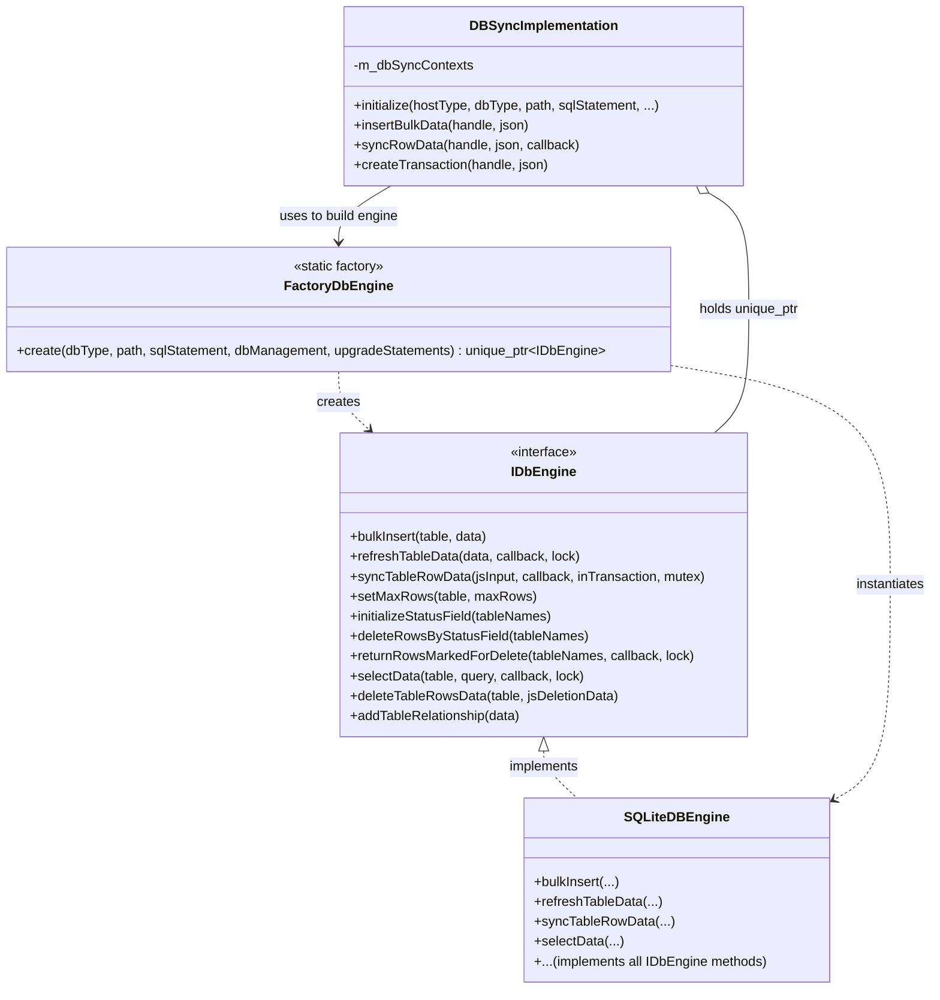
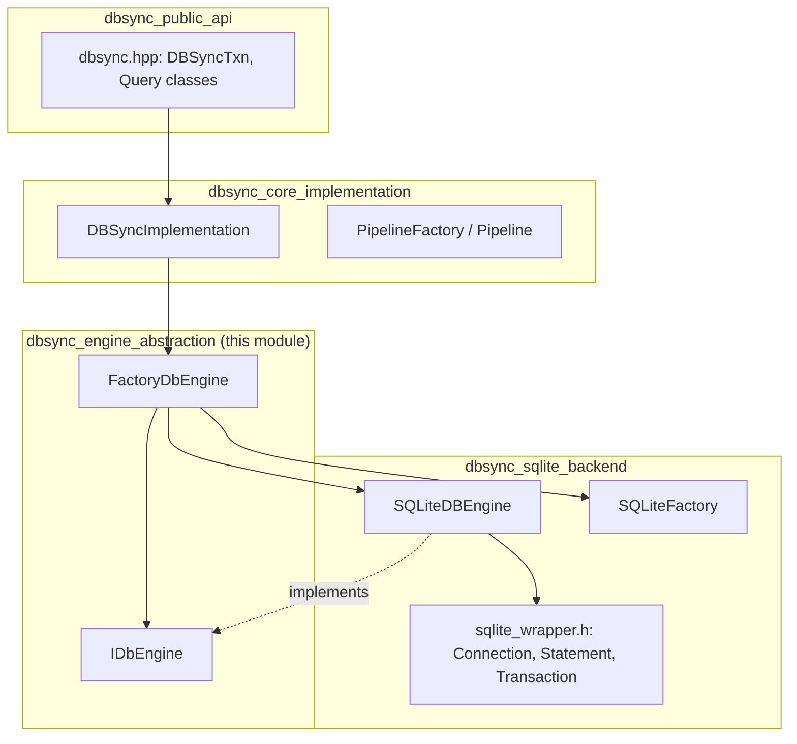
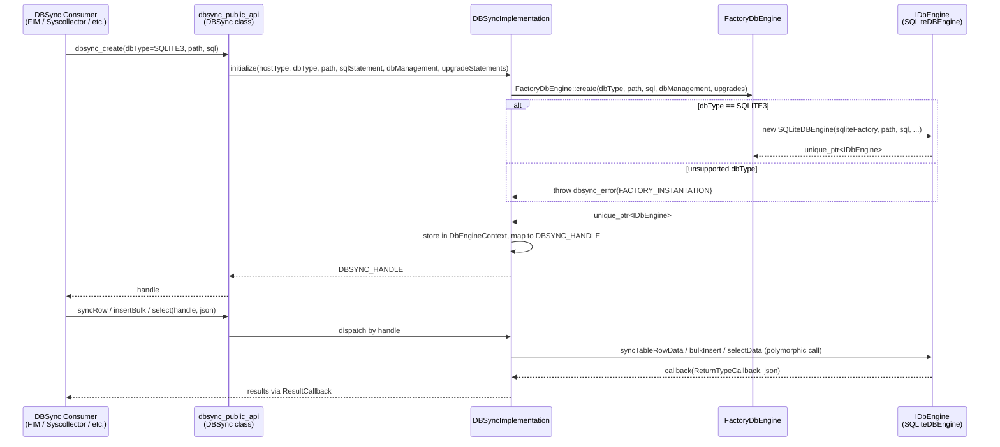

# DBSync Engine Abstraction

## Introduction

`dbsync_engine_abstraction` is a small but pivotal module inside the [DBSync](dbsync_core_implementation.md) shared library. It defines the **storage-engine-agnostic contract** (`IDbEngine`) that all concrete database backends must implement, and the **factory** (`FactoryDbEngine`) responsible for instantiating the correct backend implementation at runtime.

By isolating the abstract interface from any concrete engine implementation (currently SQLite, see [dbsync_sqlite_backend](dbsync_sqlite_backend.md)), this module allows the rest of DBSync — the public API layer ([dbsync_public_api](dbsync_public_api.md)) and the orchestration layer ([dbsync_core_implementation](dbsync_core_implementation.md)) — to remain completely decoupled from the underlying storage technology. This is a classic **Strategy/Factory** design pattern applied to database persistence, enabling DBSync to potentially support additional database engines in the future without any change to its consumers (FIM, Syscollector, Rootcheck, Vulnerability Scanner, etc.).

## Purpose and Core Functionality

This module contains exactly two components:

| Component | File | Responsibility |
|---|---|---|
| `IDbEngine` | `dbengine.h` | Pure virtual interface (abstract base class) defining every operation a database engine must support: bulk insert, table synchronization, snapshot refresh, row selection/deletion, status-field management, and table relationships. |
| `FactoryDbEngine` | `dbengine_factory.h` | Static factory class that instantiates a concrete `IDbEngine` implementation based on a requested `DbEngineType` enum value. |

### Why this abstraction exists

DBSync is used across many Wazuh modules (FIM/Syscheck, Syscollector, Rootcheck, SCA) to synchronize in-memory/agent-collected data against a local persistent store, detect deltas (INSERTED/MODIFIED/DELETED rows), and notify consumers via callbacks. The synchronization *logic* (diffing, transaction management, callback dispatching) is engine-independent, but the actual SQL/storage operations are engine-specific. `IDbEngine` cleanly separates these concerns:

- **`DBSyncImplementation`** (in `dbsync_implementation.h`) and **`DBSyncTxn`** (in `dbsync.hpp`) — both part of [dbsync_core_implementation](dbsync_core_implementation.md) — depend only on the abstract `IDbEngine` interface, never on `SQLiteDBEngine` directly.
- **`FactoryDbEngine::create()`** is the single point where the concrete engine type is resolved and constructed, keeping instantiation logic centralized and swappable.

## Architecture



### Component Details

#### `IDbEngine` (dbengine.h)
An abstract class (pure virtual interface) living in the `DbSync` namespace. It exposes the operations required to:
- Insert bulk rows (`bulkInsert`)
- Perform a full-snapshot refresh/diff against existing table state (`refreshTableData`)
- Synchronize a single row transactionally (`syncTableRowData`)
- Cap table growth (`setMaxRows`)
- Manage soft-delete "status fields" used during transactional synchronization (`initializeStatusField`, `deleteRowsByStatusField`, `returnRowsMarkedForDelete`)
- Query (`selectData`) and delete (`deleteTableRowsData`) rows
- Register cascading relationships between tables (`addTableRelationship`)

All methods accept `nlohmann::json` payloads, keeping the interface storage-technology-neutral and consistent with the JSON-driven public API described in [dbsync_public_api](dbsync_public_api.md). Concurrency primitives (`std::shared_timed_mutex` locks, `Utils::ILocking`) are passed into several methods, since callers in [dbsync_core_implementation](dbsync_core_implementation.md) coordinate locking around long-running snapshot/transaction operations.

#### `FactoryDbEngine` (dbengine_factory.h)
A simple static factory with a single method:

```cpp
static std::unique_ptr<IDbEngine> create(
    const DbEngineType dbType,
    const std::string& path,
    const std::string& sqlStatement,
    const DbManagement dbManagement,
    const std::vector<std::string>& upgradeStatements);
```

- If `dbType == SQLITE3`, it constructs a `SQLiteDBEngine` (see [dbsync_sqlite_backend](dbsync_sqlite_backend.md)), injecting a `SQLiteFactory` for lower-level SQLite wrapper object creation.
- For any unsupported `dbType`, it throws a `dbsync_error{FACTORY_INSTANTATION}` exception.

This factory is the **only** place in DBSync where a concrete engine class name (`SQLiteDBEngine`) is referenced outside of the SQLite backend itself.

## Dependencies and Relationships



- **Upstream dependents**: [dbsync_core_implementation](dbsync_core_implementation.md) (`DBSyncImplementation`) is the sole consumer of `FactoryDbEngine::create()`. It stores the resulting `unique_ptr<IDbEngine>` inside its internal `DbEngineContext`, and all subsequent operations (insert, sync, select, delete) go through the `IDbEngine` interface.
- **Downstream dependency**: [dbsync_sqlite_backend](dbsync_sqlite_backend.md) provides the concrete `SQLiteDBEngine` class that implements `IDbEngine`, plus lower-level SQLite wrappers (`Connection`, `Statement`, `Transaction`) and its own `SQLiteFactory`.
- **Shared utilities**: Both this module and its dependents rely on common utility types from [shared_utils](shared_utils.md) (e.g., `Utils::ILocking`, `Utils::MapWrapperSafe`) and JSON (`nlohmann::json`) for data interchange.
- **External consumers of DBSync**: Modules such as [syscheckd_db](syscheckd_db.md) (FIM), `wm_syscollector` (part of [wazuh_modules_core](wazuh_modules_core.md)), and the [vulnerability_scanner_module](vulnerability_scanner_module.md) all indirectly depend on this abstraction layer through DBSync's public API, without any direct knowledge of the engine type in use.

## Data Flow: Engine Creation and Usage



1. A consumer requests a DBSync instance through the public API (`dbsync_create`), specifying a `DbEngineType` (currently only `SQLITE3` is supported).
2. `DBSyncImplementation::initialize()` delegates engine construction to `FactoryDbEngine::create()`.
3. The factory instantiates the appropriate concrete engine (`SQLiteDBEngine`) and returns it wrapped in a `unique_ptr<IDbEngine>`.
4. `DBSyncImplementation` stores this engine inside a `DbEngineContext`, keyed by an opaque `DBSYNC_HANDLE`.
5. All subsequent calls (`insertBulkData`, `syncRowData`, `selectData`, transaction operations via `DBSyncTxn`) are routed through the `IDbEngine` interface, dispatching polymorphically to the concrete engine without the caller ever needing to know which engine is active.

## Extensibility

Adding support for a new database engine (e.g., a future non-SQLite backend) only requires:
1. Implementing a new class that derives from `IDbEngine` and implements all its pure virtual methods.
2. Adding a new branch in `FactoryDbEngine::create()` for the corresponding `DbEngineType` enum value.

No changes are required in [dbsync_core_implementation](dbsync_core_implementation.md), [dbsync_public_api](dbsync_public_api.md), or any downstream consumer, since they all program against the `IDbEngine` abstraction.

## Error Handling

`FactoryDbEngine::create()` throws a `dbsync_error` (defined in `db_exception.h`) with the `FACTORY_INSTANTATION` error code when an unrecognized `DbEngineType` is requested. This exception propagates up through `DBSyncImplementation::initialize()` to the public API layer, which is responsible for converting C++ exceptions into the C-style error codes/return values expected by DBSync's C API consumers.

## Related Documentation

- [dbsync_public_api.md](dbsync_public_api.md) — The C/C++ public API (`dbsync.hpp`, `dbsync.cpp`) that consumers use to create DBSync handles and invoke synchronization operations.
- [dbsync_core_implementation.md](dbsync_core_implementation.md) — The `DBSyncImplementation` singleton and `PipelineFactory`/`Pipeline` classes that orchestrate engine usage, transactions, and asynchronous processing pipelines.
- [dbsync_sqlite_backend.md](dbsync_sqlite_backend.md) — The concrete SQLite implementation of `IDbEngine` (`SQLiteDBEngine`) along with the low-level SQLite C++ wrapper classes (`Connection`, `Statement`, `Transaction`) and `SQLiteFactory`.
- [shared_utils.md](shared_utils.md) — Common C++ utility primitives (locking, safe map wrappers, JSON helpers) used throughout DBSync and other shared modules.
- [content_manager.md](content_manager.md) / [rsync](rsync.md) — Other shared modules that, like DBSync, are consumed by multiple Wazuh daemons (FIM, Syscollector, Vulnerability Scanner) for data synchronization purposes.
