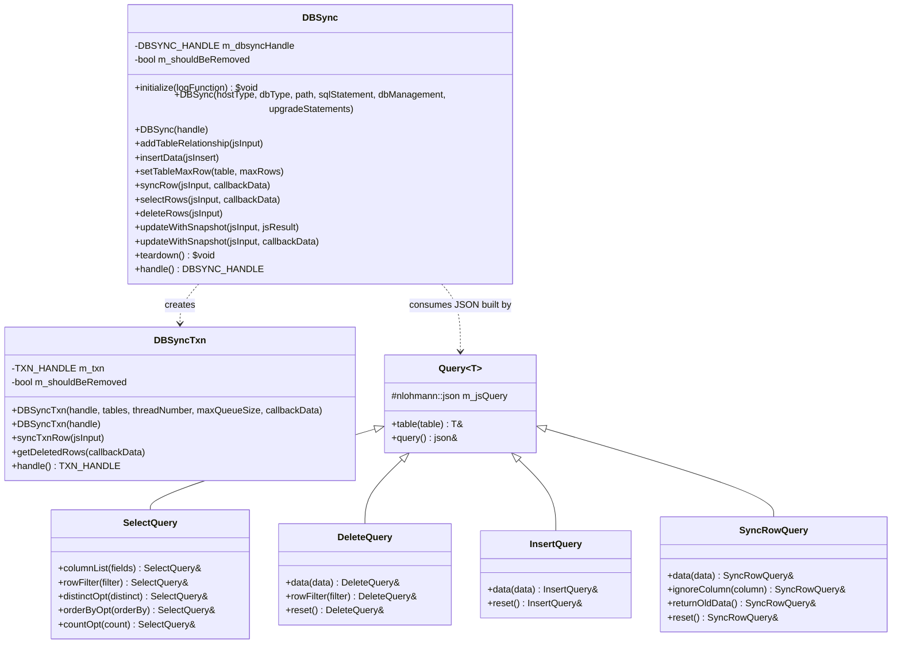
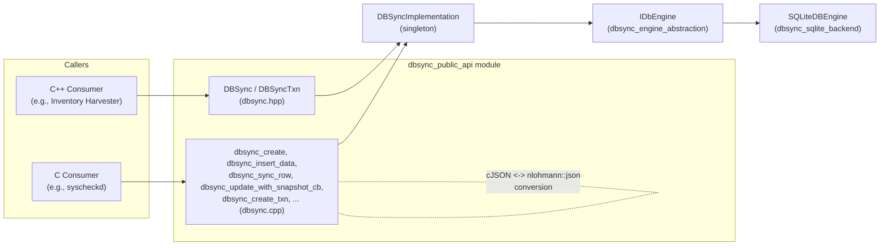
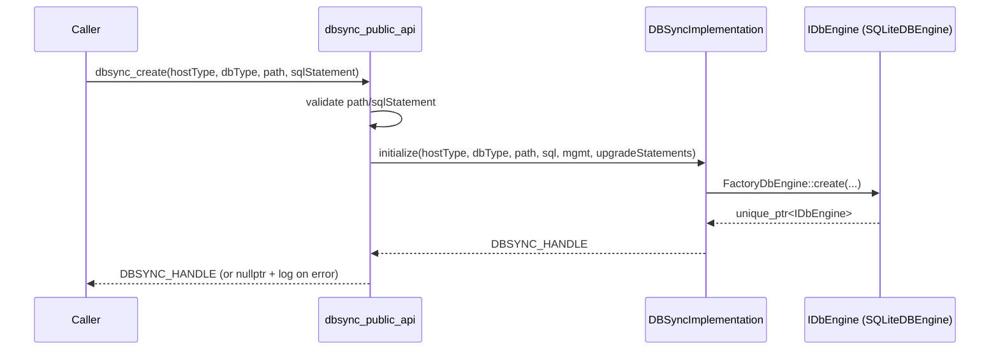
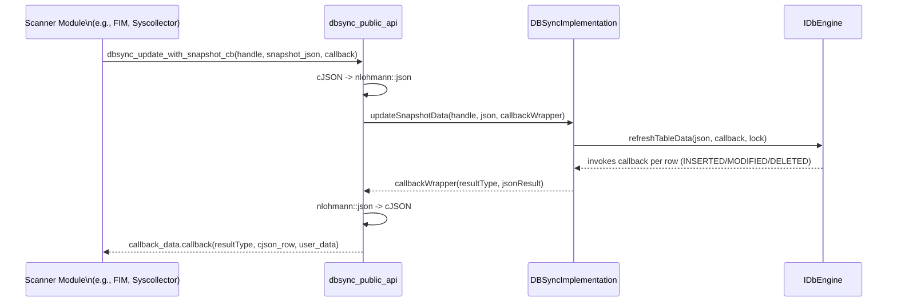
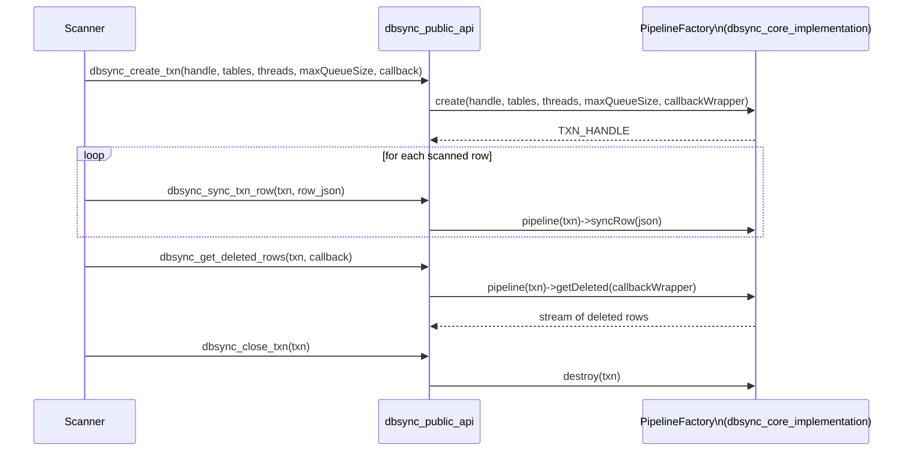
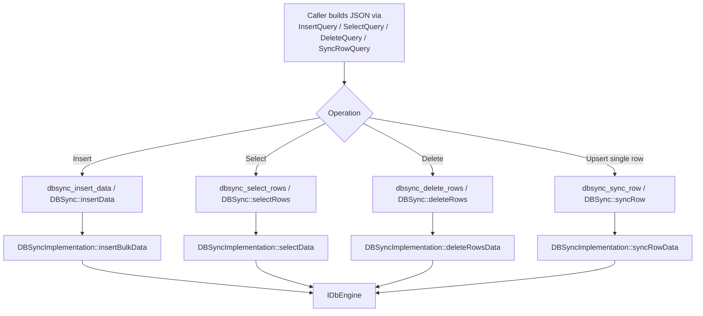
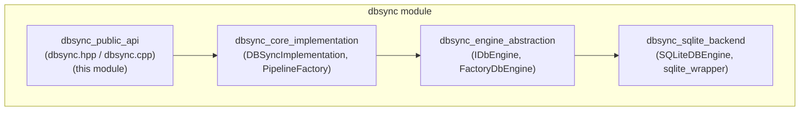

# DBSync Public API

## Introduction

The **dbsync_public_api** module is the outward-facing surface of Wazuh's **DBSync** shared library — a lightweight database synchronization engine used across the Wazuh codebase (FIM/Syscheck, Syscollector, Vulnerability Detection, Inventory Harvester, and others) to keep an in-memory/on-disk SQLite representation of scanned data in sync with what is actually observed on an endpoint.

This module exposes:

- A **C++ RAII-style API** (`DBSync`, `DBSyncTxn`, and the `Query`/`SelectQuery`/`DeleteQuery`/`InsertQuery`/`SyncRowQuery` builder classes) declared in `dbsync.hpp`.
- The **C ABI implementation** (`dbsync_create`, `dbsync_insert_data`, `dbsync_sync_row`, `dbsync_update_with_snapshot_cb`, etc.) implemented in `dbsync.cpp`, which allows the library to be consumed from C code and other language bindings (e.g., the Syscheck/FIM daemon, which is largely C).

The public API is intentionally thin: it validates inputs, translates between `cJSON` (C) and `nlohmann::json` (C++), and delegates all real synchronization logic to the internal engine described in [dbsync_core_implementation.md](dbsync_core_implementation.md), which in turn drives a pluggable storage backend described in [dbsync_engine_abstraction.md](dbsync_engine_abstraction.md) and [dbsync_sqlite_backend.md](dbsync_sqlite_backend.md).

This document explains the module's responsibilities, its architecture, how it fits into the broader `dbsync` and `shared_utils` ecosystem, and the data/control flow for the most common operations.

---

## 1. Purpose and Core Functionality

DBSync solves a recurring problem in Wazuh agents/daemons: **periodically scanned system state (files, packages, network interfaces, processes, registry keys, etc.) must be compared against a previous snapshot to detect additions, modifications, and deletions**, and the differences must be reported so higher layers can generate events/alerts.

The `dbsync_public_api` module provides:

1. **Database lifecycle management** — create/destroy a DBSync instance backed by a SQLite database (in-memory or persistent on disk).
2. **Data mutation primitives** — bulk insert, single-row upsert (`syncRow`), and delete operations.
3. **Querying primitives** — `selectRows` with filtering, ordering, and column projection.
4. **Snapshot-based synchronization** — `updateWithSnapshot`, the core primitive used by scanners: given a full snapshot of current state, DBSync computes and reports the `inserted`, `modified`, and `deleted` rows compared to what's stored.
5. **Transactional bulk synchronization** — `DBSyncTxn`, a higher-throughput, multi-threaded pipeline for synchronizing large volumes of rows (used heavily by Syscheck/FIM during full scans), documented further in [dbsync_core_implementation.md](dbsync_core_implementation.md).
6. **Table relationships** — declarative foreign-key-like relationships between tables so that deleting/updating a parent row can cascade consistently.
7. **Dual language surface** — identical capabilities exposed both as an idiomatic C++ API (`DBSync` class) and a C API (`dbsync_*` free functions) for consumption by C-based daemons (e.g., `syscheckd`).

### Non-Goals

This module does **not** implement SQL execution, transaction pipelining, or storage details — those live in `dbsync_core_implementation` and `dbsync_sqlite_backend`. It also does not perform any FIM/Syscollector-specific business logic; it is a generic key/value-row synchronization primitive consumed by many other modules (see [Section 4](#4-consumers-across-the-codebase)).

---

## 2. Architecture

### 2.1 Component Overview

The `Query<T>` hierarchy (using the CRTP `Utils::Builder<T>` pattern from [shared_utils](shared_utils.md)) provides a fluent, type-safe way to build the JSON payloads that the C++/C entry points expect, avoiding hand-rolled JSON construction by callers.

### 2.2 C vs C++ Surface

Both surfaces converge on the singleton `DBSyncImplementation::instance()` (see [dbsync_core_implementation.md](dbsync_core_implementation.md)). The C API additionally performs `cJSON` ↔ `nlohmann::json` marshalling and normalizes error handling into integer return codes plus a log callback (`dbsync_initialize`), so it can be safely called from pure-C code without exceptions crossing the ABI boundary.

### 2.3 Handle Model

- `DBSYNC_HANDLE` identifies a database instance (a `DbEngineContext` internally).
- `TXN_HANDLE` identifies an open transaction/pipeline (a `TransactionContext` + worker pipeline).
- Both `DBSync` and `DBSyncTxn` C++ classes can either **own** a handle (created via their primary constructors, destroyed in the destructor) or **wrap** an externally-owned handle (secondary constructors taking a raw handle), which is important for interoperability with the C API where the caller manages the handle's lifetime explicitly via `dbsync_close_txn` / `DBSyncImplementation::releaseContext`.

---

## 3. Key Data & Control Flows

### 3.1 Instance Creation

### 3.2 Snapshot-Based Synchronization (`updateWithSnapshot`)

This is the primary pattern used by scanning modules (Syscheck, Syscollector) at the end of a scan cycle: they push a full snapshot of "what exists now" and DBSync reports the delta.

The non-callback overload `dbsync_update_with_snapshot` aggregates all results into a single `js_result` JSON object with `inserted`/`modified`/`deleted` arrays instead of streaming them through a callback — convenient for smaller data sets or synchronous consumers.

### 3.3 Transactional Row Sync (High-Throughput Path)

For large-scale synchronization (e.g., full filesystem scans with hundreds of thousands of files), the module exposes a transaction/pipeline abstraction that batches and parallelizes row processing:

Internally, `inode` values are normalized (converted to strings) before being handed back to callers in both the transaction callback wrapper and `dbsync_get_deleted_rows`, since 64-bit inode numbers can overflow JSON-number precision in some consumers.

### 3.4 Basic CRUD Operations

---

## 4. Consumers Across the Codebase

`dbsync_public_api` (and the DBSync engine as a whole) is a foundational building block used by numerous higher-level modules:

| Consumer | How it uses DBSync | Reference |
|---|---|---|
| Syscheck/FIM daemon | Tracks file/registry state snapshots, uses transactional sync for full scans and `updateWithSnapshot`-like flows for incremental checks | [syscheckd_db.md](syscheckd_db.md) |
| Syscollector (agent module) | Persists hardware/OS/network/package/process inventories and computes deltas each scan cycle | [syscollector_module_native_daemon.md](syscollector_module_native_daemon.md), [syscollector_module_api_framework.md](syscollector_module_api_framework.md) |
| Inventory Harvester | Consumes DBSync-produced deltas (via the Router) to index inventory documents into the indexer | [inventory_harvester_module.md](inventory_harvester_module.md) |
| Vulnerability Scanner | Uses DBSync-backed inventories (packages, OS info) as scan input feeds | [vulnerability_scanner_module.md](vulnerability_scanner_module.md) |
| RSync module | Wraps DBSync data to compute checksums/ranges for cluster-wide state synchronization | [rsync.md](rsync.md) |
| wazuh_db daemon | Persists/queries synchronized data server-side via `wdb_syscollector_save2`/`wdb_fim_*` handlers that ultimately mirror the dbsync-produced deltas | [wazuh_db.md](wazuh_db.md) |

For the generic utility types leveraged by this module (JSON helpers, the `Builder<T>` CRTP pattern, smart-pointer wrappers like `CJsonSmartDeleter`), see [shared_utils.md](shared_utils.md).

---

## 5. Module Placement in the DBSync Subsystem

`dbsync_public_api` is one of four sibling sub-modules that together make up the `dbsync` module (part of [Shared_Modules_Infrastructure_(C++)](Shared_Modules_Infrastructure_(C++).md)):

- **[dbsync_core_implementation.md](dbsync_core_implementation.md)** — Implements `DBSyncImplementation` (the singleton orchestrating handles/contexts) and `PipelineFactory`/`Pipeline` (the multi-threaded transaction engine used by `DBSyncTxn`).
- **[dbsync_engine_abstraction.md](dbsync_engine_abstraction.md)** — Defines `IDbEngine`, the storage-agnostic interface, and `FactoryDbEngine` for instantiating concrete engines.
- **[dbsync_sqlite_backend.md](dbsync_sqlite_backend.md)** — The only current `IDbEngine` implementation, `SQLiteDBEngine`, plus the low-level `sqlite_wrapper` RAII classes.

Callers should only ever interact with the classes/functions documented here; the other three sub-modules are internal implementation details not intended for direct external use.

---

## 6. API Reference Summary

### 6.1 C++ Classes

| Class | Responsibility |
|---|---|
| `DBSync` | Owns/wraps a database handle; provides `insertData`, `syncRow`, `selectRows`, `deleteRows`, `updateWithSnapshot` (two overloads), `setTableMaxRow`, `addTableRelationship`. |
| `DBSyncTxn` | Owns/wraps a transaction handle for high-throughput synchronization; provides `syncTxnRow` and `getDeletedRows`. |
| `Query<T>` (CRTP base) | Fluent builder base providing `.table(name)` and access to the underlying JSON (`query()`). |
| `SelectQuery` | Builds a select query: `columnList`, `rowFilter`, `distinctOpt`, `orderByOpt`, `countOpt`. |
| `DeleteQuery` | Builds a delete query: `data`, `rowFilter`, `reset`. |
| `InsertQuery` | Builds an insert payload: `data`, `reset`. |
| `SyncRowQuery` | Builds a sync-row payload: `data`, `ignoreColumn`, `returnOldData`, `reset`. |

### 6.2 C Functions (selected, defined in `dbsync.cpp`)

| Function | Purpose |
|---|---|
| `dbsync_initialize` | Registers the global log callback used by all error/warning messages. |
| `dbsync_create` / `dbsync_create_persistent` | Creates a volatile or persistent DBSync instance. |
| `dbsync_teardown` | Releases all global state (pipelines + implementation singleton). |
| `dbsync_create_txn` / `dbsync_close_txn` | Opens/closes a transactional pipeline (`DBSyncTxn` equivalent). |
| `dbsync_sync_txn_row` | Pushes one row into an open transaction. |
| `dbsync_add_table_relationship` | Declares a parent/child table relationship. |
| `dbsync_insert_data` | Bulk-inserts rows into a table. |
| `dbsync_set_table_max_rows` | Configures a table as a bounded queue. |
| `dbsync_sync_row` | Upserts a single row, invoking a callback with the resulting diff. |
| `dbsync_select_rows` | Executes a filtered/ordered select query, streaming rows via callback. |
| `dbsync_delete_rows` | Deletes rows (and cascades relationships) matching given keys. |
| `dbsync_get_deleted_rows` | Retrieves rows flagged for deletion within a transaction. |
| `dbsync_update_with_snapshot` | Synchronous snapshot diff into an aggregated `js_result` JSON. |
| `dbsync_update_with_snapshot_cb` | Snapshot diff streamed through a callback (core component covered in detail above). |
| `dbsync_free_result` | Frees a `cJSON*` result produced by `dbsync_update_with_snapshot`. |

All C functions follow the same error-handling convention: they catch `DbSync::dbsync_error` and `nlohmann::json` exceptions internally, convert them to a human-readable message forwarded to the registered log function, and return `-1` (or the exception's `id()`) on failure, `0` on success — ensuring no C++ exception ever escapes across the C ABI boundary.

---

## 7. Design Notes

- **Exception-safety at the boundary**: Every C entry point wraps its logic in try/catch blocks that translate C++ exceptions (`dbsync_error`, `max_rows_error`, `nlohmann::detail::exception`) into integer error codes plus a logged message, making the library safe to call from C.
- **Ownership flexibility**: The dual-constructor pattern (owning vs. non-owning) on `DBSync` and `DBSyncTxn` allows the same C++ types to be used both for creating new resources and for wrapping handles obtained through the C API — useful in mixed C/C++ codebases such as `syscheckd`.
- **Builder pattern for queries**: The `Query<T>` CRTP hierarchy keeps query-construction code type-safe and chainable, avoiding raw JSON string manipulation in calling code (see [shared_utils.md](shared_utils.md) for the underlying `Builder<T>` utility).
- **Inode normalization**: Because JSON numbers are commonly represented as doubles in some parsers, 64-bit inode values are explicitly stringified before crossing the callback boundary in transaction-related flows, avoiding precision loss.
