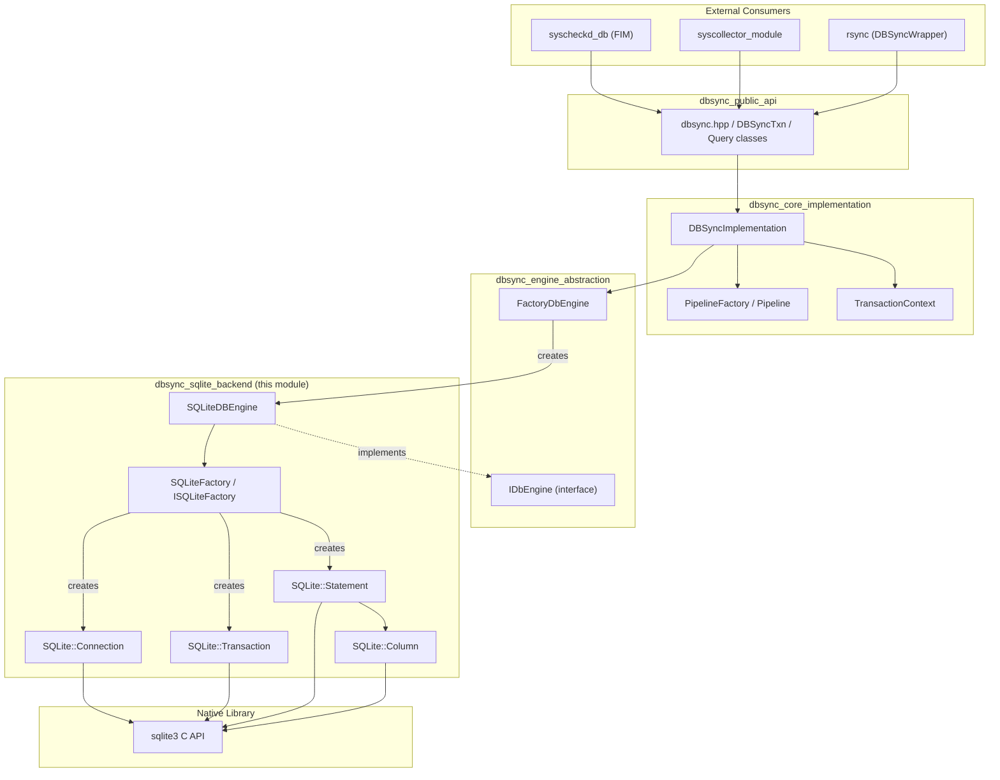
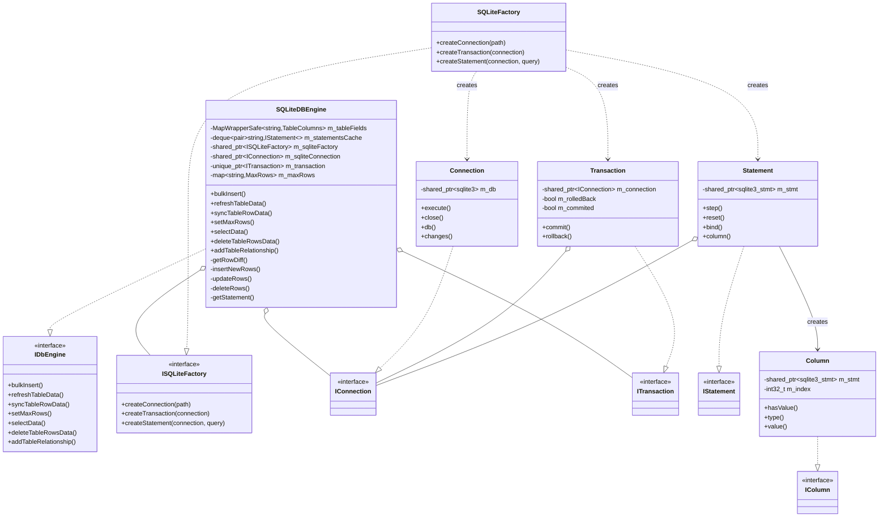
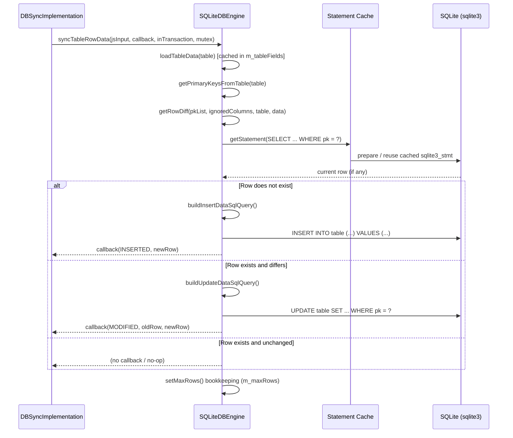
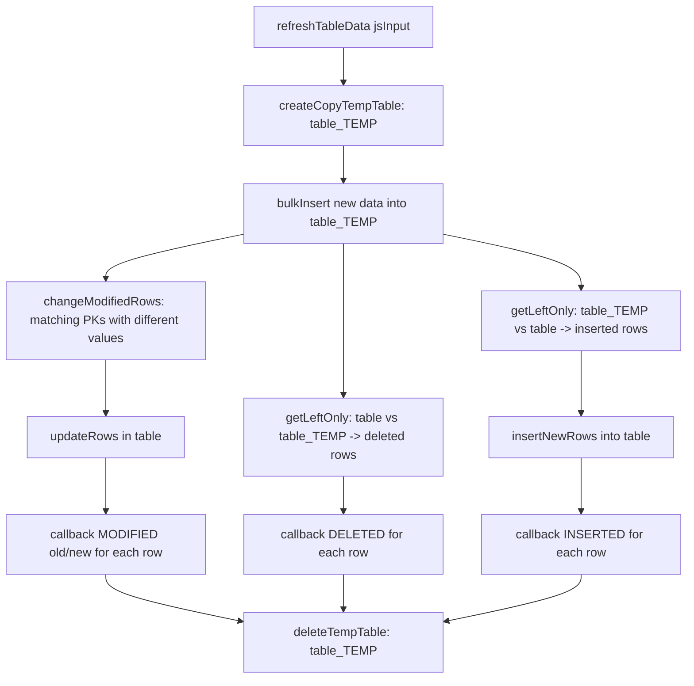
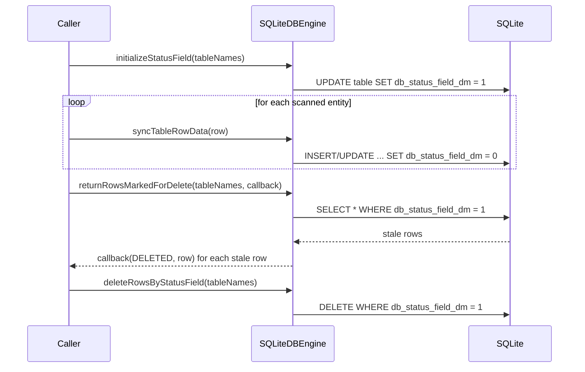

# DBSync SQLite Backend

## Introduction

The **DBSync SQLite Backend** (`dbsync_sqlite_backend`) is the concrete storage-engine implementation used by the [DBSync](dbsync_core_implementation.md) module to persist, synchronize and diff tabular data on top of **SQLite3**. It implements the abstract [`IDbEngine`](dbsync_engine_abstraction.md) interface defined by the DBSync engine-abstraction layer, translating high level synchronization operations (bulk insert, row diffing, snapshot synchronization, selective deletion, table relationships, etc.) into concrete SQL statements executed through a thin, testable C++ wrapper around the native `sqlite3` C API.

This module is a leaf component in the [`dbsync`](dbsync_core_implementation.md) module family, and it is one of the most heavily exercised pieces of infrastructure in Wazuh, since DBSync itself is used by `syscheckd` (FIM), `wazuh_modules/syscollector`, `rsync`, and other inventory/state-syncing components across the agent and manager to keep local SQLite snapshots consistent with the "wazuh-db" component.

## Purpose & Core Functionality

The backend has three cooperating responsibilities:

1. **SQL Engine Implementation (`SQLiteDBEngine`)** — Implements every operation required by the generic DBSync synchronization algorithm (see `dbengine.h::IDbEngine`) using SQLite-specific SQL generation and execution logic: bulk inserts, computing row-level diffs between an incoming JSON payload and the current table state, inserting/updating/deleting the differences, enforcing row-count limits (`MaxRows`), maintaining a "status field" used to mark rows for deletion during full-table refreshes, and building/maintaining SQL triggers for cross-table relationships.
2. **Thin SQLite Wrapper (`SQLite::Connection`, `SQLite::Transaction`, `SQLite::Statement`, `SQLite::Column`)** — Wraps the raw `sqlite3*`, `sqlite3_stmt*` handles from the SQLite3 C library into RAII C++ classes implementing the `SQLite::IConnection` / `SQLite::ITransaction` / `SQLite::IStatement` / `SQLite::IColumn` interfaces (declared in the sibling `isqlite_wrapper.h`, part of the [dbsync_core_implementation](dbsync_core_implementation.md) family), providing safe binding, stepping, and typed column extraction.
3. **Object Factory (`SQLiteFactory` / `ISQLiteFactory`)** — Implements the Abstract Factory pattern so that `SQLiteDBEngine` (and its unit tests) can create `Connection`, `Transaction`, and `Statement` objects without depending directly on concrete SQLite types, enabling dependency injection and mocking in tests.

Together these three pieces let the rest of DBSync remain storage-agnostic while all SQLite-specific behavior (SQL dialect, transaction semantics, statement caching, type mapping) is isolated here.

## Relationship to the Rest of DBSync

This module sits underneath the DBSync core and is invoked indirectly by the public C/C++ API:

- [`dbsync_public_api`](dbsync_public_api.md) — Exposes `dbsync_*` C functions and the `DBSyncTxn`/`Query` C++ classes consumed by external modules (syscheckd, syscollector, rsync).
- [`dbsync_core_implementation`](dbsync_core_implementation.md) — `DBSyncImplementation`, `PipelineFactory`, and `TransactionContext` orchestrate calls into the engine, manage per-database context lifetime, and dispatch pipeline requests.
- [`dbsync_engine_abstraction`](dbsync_engine_abstraction.md) — Declares `IDbEngine` (the interface implemented here) and `FactoryDbEngine`, which decides which concrete engine (currently only SQLite) to instantiate.
- **`dbsync_sqlite_backend` (this module)** — Concrete SQLite implementation described in this document.

Consumers such as `syscheckd_db` ([Syscheck FIM](Syscheck___FIM_Daemon_(C_C++).md)), `wm_syscollector` / `syscollector_module`, and `rsync` (`DBSyncWrapper`) never talk to `SQLiteDBEngine` directly — they always go through the public API and core implementation layers, which in turn call into this backend via the `IDbEngine` pointer produced by `FactoryDbEngine`.

## Architecture Overview

## Component Reference

### `SQLiteDBEngine` (`sqlite_dbengine.h`)

The central class of this module. It implements `DbSync::IDbEngine` and encapsulates all SQLite-backed synchronization logic.

Key public operations (all overrides of `IDbEngine`):

| Method | Responsibility |
|---|---|
| `bulkInsert(table, data)` | Inserts an entire JSON array of rows into `table` in a single prepared-statement loop. |
| `refreshTableData(data, callback, lock)` | Full snapshot refresh: computes inserted/modified/deleted rows against current content and invokes `callback` for each change. |
| `syncTableRowData(jsInput, callback, inTransaction, mutex)` | Synchronizes a single (or partial) row payload — the primary entry point used for incremental/streamed updates (e.g. FIM events). |
| `setMaxRows(table, maxRows)` | Establishes a maximum row-count limit for a table, tracked in `m_maxRows` (`MaxRows{maxRows, currentRows}`), used to bound resource usage (e.g. process/port tables). |
| `initializeStatusField` / `deleteRowsByStatusField` / `returnRowsMarkedForDelete` | Implements the "status field" pattern: rows are tagged with an internal `db_status_field_dm` column so a full scan can mark all existing rows, then anything left un-updated after the scan is understood to be deleted. |
| `selectData(table, query, callback, lock)` | Generic filtered SELECT with JSON-described query semantics (`buildSelectQuery`). |
| `deleteTableRowsData(table, jsDeletionData)` | Deletes rows described by JSON criteria (`deleteRows`, `deleteRowsbyPK`). |
| `addTableRelationship(data)` | Creates SQL triggers (`buildDeleteRelationTrigger`, `buildUpdateRelationTrigger`) so that changes in a parent table cascade into related child tables — used for FIM registry key/value relationships and similar hierarchical inventory data. |

Internal/private helpers implement the row-diffing algorithm central to DBSync:

- `getRowDiff` — Compares incoming JSON data against a temp table snapshot to compute `updatedData` / `oldData`.
- `insertNewRows`, `updateRows`, `deleteRows`, `removeNotExistsRows` — Apply the three classes of changes (insert/update/delete) detected by the diff.
- `getLeftOnly` / `getPKListLeftOnly` / `buildLeftOnlyQuery` — Implement a SQL LEFT-JOIN-based "set difference" to find rows present in one table but not another (used to detect deletions between the live table and a `_TEMP` copy).
- `createCopyTempTable` / `deleteTempTable` — Manage a `<table>_TEMP` scratch table used during full refreshes, named via the `TEMP_TABLE_SUBFIX` constant.
- `buildInsertDataSqlQuery`, `buildUpdateDataSqlQuery`, `buildUpdatePartialDataSqlQuery`, `buildDeleteBulkDataSqlQuery`, `buildSelectMatchingPKsSqlQuery`, `buildModifiedRowsQuery` — SQL string builders that generate parameterized statements based on table schema (`TableColumns`) and primary key lists.
- `bindJsonData` / `bindFieldData` / `getTableData` / `getFieldValueFromTuple` — Type-safe marshaling between `nlohmann::json` values and SQLite's dynamic type system (`ColumnType`: `Text`, `Integer`, `BigInt`, `UnsignedBigInt`, `Double`, `Blob`).
- `getStatement(sql)` — Statement cache (`m_statementsCache`, bounded by `CACHE_STMT_LIMIT = 30`) that avoids re-preparing frequently used SQL text.
- `loadTableData` / `loadFieldData` / `getTableCreateQuery` / `getPrimaryKeysFromTable` — Schema introspection performed at construction/first-use time and cached in `m_tableFields` (a `Utils::MapWrapperSafe<std::string, TableColumns>` — thread-safe map, see [shared_utils](shared_utils.md)).
- `getDbVersion` / `cleanDB` — Handle schema versioning and destructive re-creation of the on-disk database when `DbManagement` dictates persistence (vs. `VOLATILE` in-memory DBs).

Supporting types declared alongside the class:

- `MaxRows{ maxRows, currentRows }` — Simple counter pair used for row-limit enforcement.
- `ColumnType` enum and `ColumnTypeNames` map — SQLite/DBSync type system mapping (`TEXT`, `INTEGER`, `BIGINT`, `UNSIGNED BIGINT`, `DOUBLE`, `BLOB`).
- `TableHeader` enum — Indices into `PRAGMA table_info` result rows (`CID`, `Name`, `Type`, `PK`, `TXNStatusField`).
- `Row`, `Field`, `TableField`, `TableColumns`, `ColumnData` — Core data-modeling `typedef`s/`tuple`s used throughout the diff/insert/update pipeline.
- `dbengine_error` — Exception type wrapping `DbSync::dbsync_error` with a `"dbEngine: "` prefix for diagnostics.

### `SQLite::Connection` / `SQLite::Transaction` / `SQLite::Statement` / `SQLite::Column` (`sqlite_wrapper.h`)

A minimal RAII wrapper layer around the raw `sqlite3` C API, implementing the interfaces declared in `isqlite_wrapper.h` (part of [dbsync_core_implementation](dbsync_core_implementation.md)):

- **`Connection`** — Opens/holds a `std::shared_ptr<sqlite3>` handle, exposes `execute()` for raw SQL, `close()`, `db()` accessor, and `changes()` (wraps `sqlite3_changes`) used to detect how many rows an `UPDATE`/`DELETE` affected.
- **`Transaction`** — RAII transaction guard; `commit()`/`rollback()` plus `isCommited()`/`isRolledBack()` state queries; automatically rolls back in the destructor if neither commit nor rollback was called explicitly, preventing dangling transactions on exceptions.
- **`Statement`** — Wraps `sqlite3_stmt*`; provides `step()`, `reset()`, typed `bind()` overloads (`int32_t`, `uint64_t`, `int64_t`, `std::string`, `double_t`), `columnsCount()`, `expand()` (returns the fully-substituted SQL text for debugging), and `column(index)` to fetch a `Column` accessor.
- **`Column`** — Read-only accessor over a single result column of the current statement row; `hasValue()`, `type()`, `name()`, and typed `value()` overloads matching the same primitive type set as `Statement::bind`.

### `SQLiteFactory` / `ISQLiteFactory` (`sqlite_wrapper_factory.h`)

A small Abstract Factory (`ISQLiteFactory`) with a single concrete implementation (`SQLiteFactory`) that builds `Connection`, `Transaction`, and `Statement` instances. `SQLiteDBEngine` receives an `ISQLiteFactory` via constructor injection, which:

- Decouples `SQLiteDBEngine` from concrete SQLite wrapper construction, enabling **unit testing** by injecting mock factories/wrappers.
- Centralizes object-creation policy in one place (`createConnection`, `createTransaction`, `createStatement`), following the same `Builder`/`Factory` idioms used across the codebase (see [shared_utils](shared_utils.md)).

## Class Diagram

## Data Flow: Row Synchronization (`syncTableRowData`)

The most frequently exercised operation is synchronizing a single row/event against the current table state. This is the pattern used by FIM and Syscollector to persist incremental changes and detect what actually changed (so only real deltas are reported upstream).

## Data Flow: Full Table Refresh (`refreshTableData`)

Used for snapshot-style synchronization where a complete data set is provided and the engine must detect insertions, modifications, *and* deletions relative to what is currently stored.

## Status-Field Deletion Pattern

Some callers (e.g. full inventory scans) prefer a two-phase approach instead of temp-table diffing: mark every row with a status flag, re-insert/update the live rows (which clears their flag), then delete anything still flagged.

## Table Relationships & Triggers

`addTableRelationship` allows DBSync consumers to declare parent/child relationships between tables (e.g., a FIM registry key table and its values table). The engine generates SQL triggers so that:

- Deleting a parent row automatically deletes matching child rows (`buildDeleteRelationTrigger`).
- Updating a parent's primary key propagates to child foreign keys (`buildUpdateRelationTrigger`).

This keeps referential integrity enforced at the SQLite layer without requiring every caller to manually cascade changes.

## Dependencies

| Dependency | Relationship |
|---|---|
| [`dbsync_engine_abstraction`](dbsync_engine_abstraction.md) (`IDbEngine`, `FactoryDbEngine`) | `SQLiteDBEngine` implements `IDbEngine`; `FactoryDbEngine` instantiates `SQLiteDBEngine`. |
| [`dbsync_core_implementation`](dbsync_core_implementation.md) (`DBSyncImplementation`, `PipelineFactory`, `isqlite_wrapper.h` interfaces) | Declares the `SQLite::IConnection` / `ITransaction` / `IStatement` / `IColumn` interfaces implemented in this module and drives calls into `SQLiteDBEngine` through `IDbEngine`. |
| [`dbsync_public_api`](dbsync_public_api.md) (`dbsync.hpp`, `dbsync.cpp`) | Ultimate external-facing API; the chain of calls from `dbsync_*` C functions eventually reaches this backend. |
| [`shared_utils`](shared_utils.md) (`mapWrapperSafe.h`, `makeUnique.h`) | `Utils::MapWrapperSafe` guards `m_tableFields`; `Utils::make_unique` is used for factory-created objects. |
| Native `sqlite3` library | The actual embedded SQL database engine wrapped by `SQLite::Connection/Statement/Column/Transaction`. |
| `nlohmann::json` | Used pervasively as the interchange format for row data, queries, and deletion criteria passed across the `IDbEngine` boundary. |

## Consumers

| Consumer | Usage |
|---|---|
| [Syscheck / FIM Daemon](Syscheck___FIM_Daemon_(C_C++).md) (`syscheckd_db`) | Persists file/registry inventory snapshots and computes changed/added/deleted entries for FIM events. |
| `syscollector_module` / `wm_syscollector` | Stores hardware, OS, package, port, process and network inventory snapshots between scans. |
| `rsync` (`DBSyncWrapper`) | Uses DBSync (and transitively this backend) to compute checksums/ranges for the remote data-synchronization protocol between agents and the manager. |

## Design Notes

- **Statement caching**: `SQLiteDBEngine` bounds its prepared-statement cache to `CACHE_STMT_LIMIT` (30) entries via a `std::deque`, evicting the oldest statement when the limit is exceeded — a simple LRU-like policy that balances memory versus `sqlite3_prepare_v2` overhead.
- **Thread safety**: `m_tableFields` uses `Utils::MapWrapperSafe` (see [shared_utils](shared_utils.md)) for concurrent schema-cache access; callers of table-modifying operations pass in a `std::unique_lock<std::shared_timed_mutex>&` or `Utils::ILocking&` so that DBSync's higher layers can coordinate broader synchronization scopes (e.g., pausing readers during a full refresh).
- **Volatile vs. persistent databases**: The `DbManagement` parameter (`VOLATILE` by default) controls whether the underlying SQLite database is recreated from scratch (`cleanDB`) or persisted/upgraded across restarts using `upgradeStatements`.
- **Error handling**: All SQLite error conditions are surfaced as `dbengine_error`, a specialization of `DbSync::dbsync_error`, preserving the SQLite result code while adding a module-specific message prefix for easier log triage.
