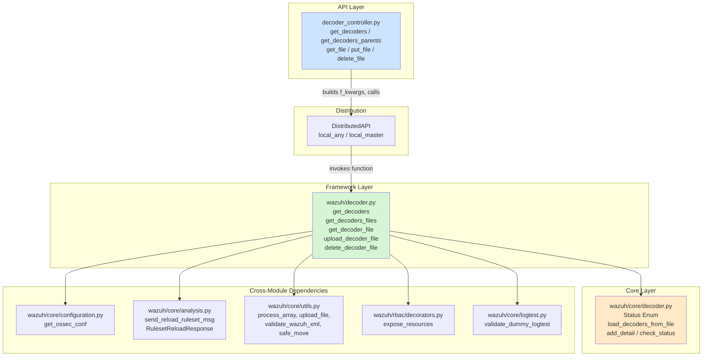
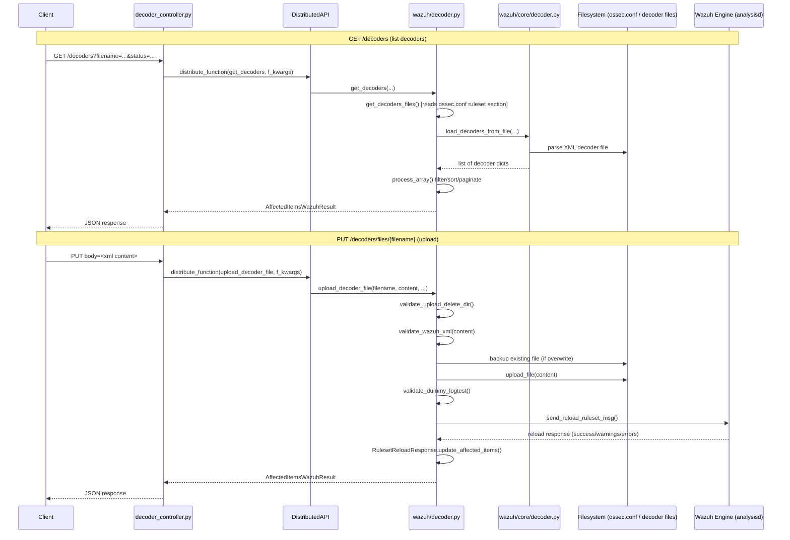

# Decoder Module

## Introduction

The **Decoder Module** provides the API and business-logic layer for managing Wazuh **decoders** — the XML rule-sets used by the Wazuh analysis engine (`analysisd`) to parse and extract fields from raw log events before they are matched against detection rules. This module allows API consumers (the Wazuh dashboard, the CLI, or third-party integrations) to:

- List all decoders currently loaded on the manager (with filtering, sorting, and pagination).
- List parent decoders (base decoders used by other decoders).
- Retrieve the raw or JSON-parsed contents of a decoder file.
- Upload new decoder files or update/overwrite existing ones.
- Delete decoder files.

Every state-changing operation (upload/delete) triggers a **ruleset reload** message to the Wazuh Engine so that the running analysis pipeline picks up the changes without requiring a full manager restart.

This module is intentionally small and tightly layered; it follows the same architectural pattern used by sibling modules such as [rule_module](rule_module.md) and [cdb_list_module](cdb_list_module.md), and it depends heavily on shared infrastructure documented separately (see the *Related Modules* section below).

## Architecture Overview

The module follows Wazuh's standard three-layer API architecture:

1. **API Controller Layer** (`api/api/controllers/decoder_controller.py`) — Exposes async HTTP endpoint handlers, translates HTTP query parameters into internal keyword arguments, and dispatches the request through the `DistributedAPI` (DAPI) so it can be executed locally or forwarded to the appropriate cluster node.
2. **Framework/Business-Logic Layer** (`framework/wazuh/decoder.py`) — Implements the actual decoder operations: listing, file resolution, upload/validation, and deletion. It enforces RBAC via the `@expose_resources` decorator and coordinates with the Wazuh Engine to reload the ruleset after changes.
3. **Core/Utility Layer** (`framework/wazuh/core/decoder.py`) — Provides low-level helpers: the `Status` enum, XML parsing of decoder files into dictionaries, detail extraction, and status validation.

## Request Flow

The diagram below illustrates the end-to-end flow for two representative operations: reading decoders and uploading a new decoder file.

## Core Components

### 1. API Controller — `api/api/controllers/decoder_controller.py`

Defines the FastAPI/Connexion async route handlers exposed under the `/decoders` API path:

| Function | HTTP Purpose | DAPI Request Type |
|---|---|---|
| `get_decoders` | List/filter decoders | `local_any` |
| `get_decoders_parents` | List parent-only decoders | `local_any` |
| `get_file` | Retrieve decoder file content (raw XML or JSON) | `local_master` |
| `put_file` | Upload/overwrite a decoder file | `local_master` |
| `delete_file` | Delete a decoder file | `local_master` |

Each handler builds an `f_kwargs` dictionary from the incoming query/body parameters, strips `None` values via `remove_nones_to_dict`, and delegates execution to a `DistributedAPI` instance, which applies RBAC checks (`request.context['token_info']['rbac_policies']`) before dispatching to the framework layer. Write operations (`put_file`, `delete_file`, `get_file`) use `local_master` because decoder files must be managed from the cluster master node, while read-only listing (`get_decoders*`) uses `local_any` since any node can serve cached ruleset data.

### 2. Business Logic — `framework/wazuh/decoder.py`

Implements the actual decoder management operations:

- **`get_decoders(...)`**: Aggregates decoders from all decoder files (discovered through `get_decoders_files`), applies name/status/filename/relative_dirname/parent filters, then delegates sorting, searching, and pagination to `wazuh.core.utils.process_array`.
- **`get_decoders_files(...)`** *(decorated with `@expose_resources(actions=['decoders:read'], resources=['decoder:file:{filename}'])`)*: Reads the `ruleset` section of `ossec.conf` (via `wazuh.core.configuration.get_ossec_conf`) to discover configured `decoder_include`/`decoder_exclude`/`decoder_dir` entries, and returns matching decoder file metadata.
- **`get_decoder_file_path(...)`**: Resolves a decoder filename (optionally scoped by `relative_dirname`) to a full filesystem path, disambiguating when multiple decoder files share the same name across directories.
- **`get_decoder_file(...)`**: Reads and returns decoder file content either as raw XML text or parsed into a dictionary via `xmltodict`.
- **`validate_upload_delete_dir(...)`**: Validates that a target directory is a legitimate, non-default `decoder_dir` configured in the ruleset (preventing writes to core/system decoder directories) — see `WazuhError` codes 1505–1507.
- **`upload_decoder_file(...)`** *(decorated with `@expose_resources(actions=['decoders:update'], resources=['*:*:*'])`)*: Validates directory and XML content, optionally backs up an existing file before overwrite, writes the file, validates it using a dummy logtest run (`validate_dummy_logtest`), and finally triggers a ruleset reload. On validation failure, it rolls back (restores the backup or removes the newly-created file).
- **`delete_decoder_file(...)`** *(decorated with `@expose_resources(actions=['decoders:delete'], resources=['decoder:file:{filename}'])`)*: Removes a decoder file and triggers a ruleset reload afterward.

### 3. Core Utilities — `framework/wazuh/core/decoder.py`

Low-level, dependency-free helpers used by the framework layer:

- **`Status` (Enum)**: Defines valid decoder statuses — `S_ENABLED`, `S_DISABLED`, `S_ALL`.
- **`check_status(status)`**: Validates/normalizes a status string, raising `WazuhError(1202)` on invalid input.
- **`add_detail(detail, value, details)`**: Adds a parsed XML attribute/tag (e.g., `regex`, `prematch`, `program_name`) into a decoder's `details` dict, handling the special case where multiple `regex` entries must be aggregated into a list.
- **`load_decoders_from_file(...)`**: Parses a decoder XML file (via `wazuh.core.utils.load_wazuh_xml`) into a list of decoder dictionaries, extracting name, position, status, and all nested detail tags/attributes (delegating dynamic fields like `program_name`, `prematch`, `regex` to `wazuh.core.utils.add_dynamic_detail`).
- Module-level constants: `REQUIRED_FIELDS`, `SORT_FIELDS`, `DYNAMIC_OPTIONS`, `DECODER_FIELDS`, `DECODER_FILES_FIELDS`, `DECODER_FILES_REQUIRED_FIELDS` — used to drive filtering/sorting/selection behavior consistently across the module.

## Key Design Aspects

### RBAC Enforcement
Write and file-level read operations in `framework/wazuh/decoder.py` are protected with the `@expose_resources` decorator from [security_rbac_module](security_rbac_module.md), which validates the caller's permissions against resources like `decoder:file:{filename}` before the function body executes.

### Ruleset Reload Integration
Both `upload_decoder_file` and `delete_decoder_file` call `send_reload_ruleset_msg` (from `wazuh.core.analysis`, part of [engine_module](engine_module.md)) after modifying files on disk. The response is wrapped in a `RulesetReloadResponse` object that exposes `is_ok()`, `has_warnings()`, and `update_affected_items()`, allowing the framework layer to surface engine-side warnings/errors back to the API caller without raising unnecessary exceptions for successful-but-noisy reloads.

### Safe File Operations
Uploads use a backup-and-restore pattern: before overwriting an existing decoder file, a `.backup` copy is created; if XML validation, logtest validation, or the write itself fails, the original file is restored via `safe_move`. This ensures decoder file changes are effectively atomic from the operator's perspective.

### Distributed Execution
All controller functions route through `DistributedAPI`, part of the cluster infrastructure. This ensures that decoder management requests issued against any cluster node are correctly forwarded to the master (for writes) or executed locally (for reads).

## Related Modules

Since this module depends on and shares patterns with several other parts of the system, refer to the following documentation for deeper context:

- **[rule_module](rule_module.md)** — Nearly identical architecture applied to detection rules instead of decoders; a good reference for comparing patterns.
- **[cdb_list_module](cdb_list_module.md)** — Another file-management module (CDB lists) following the same upload/delete/reload pattern.
- **[security_rbac_module](security_rbac_module.md)** — Documents the `@expose_resources` decorator and the RBAC permission model used to protect decoder operations.
- **[engine_module](engine_module.md)** — Documents `send_reload_ruleset_msg` and the Wazuh Engine client used to reload the ruleset after decoder changes.
- **[framework_core_utils](framework_core_utils.md)** — Documents shared utilities such as `process_array`, `upload_file`, `validate_wazuh_xml`, `safe_move`, and `common` path constants used throughout this module.
- **[api_core_infrastructure](api_core_infrastructure.md)** — Documents the API framework pieces (encoders, middlewares, URI parsing) that underpin every controller, including `decoder_controller.py`.
- **[manager_module](manager_module.md)** — Documents `get_ossec_conf`, used by `get_decoders_files` to read the `ruleset` configuration section.

## Summary

| Layer | File | Responsibility |
|---|---|---|
| API | `api/api/controllers/decoder_controller.py` | HTTP endpoint handlers, DAPI dispatch |
| Framework | `framework/wazuh/decoder.py` | Business logic, RBAC, validation, reload orchestration |
| Core | `framework/wazuh/core/decoder.py` | XML parsing, status validation, detail extraction |

Because of its small footprint (3 files, tightly coupled by a linear call chain), this module is documented as a single page rather than being split into sub-modules.
