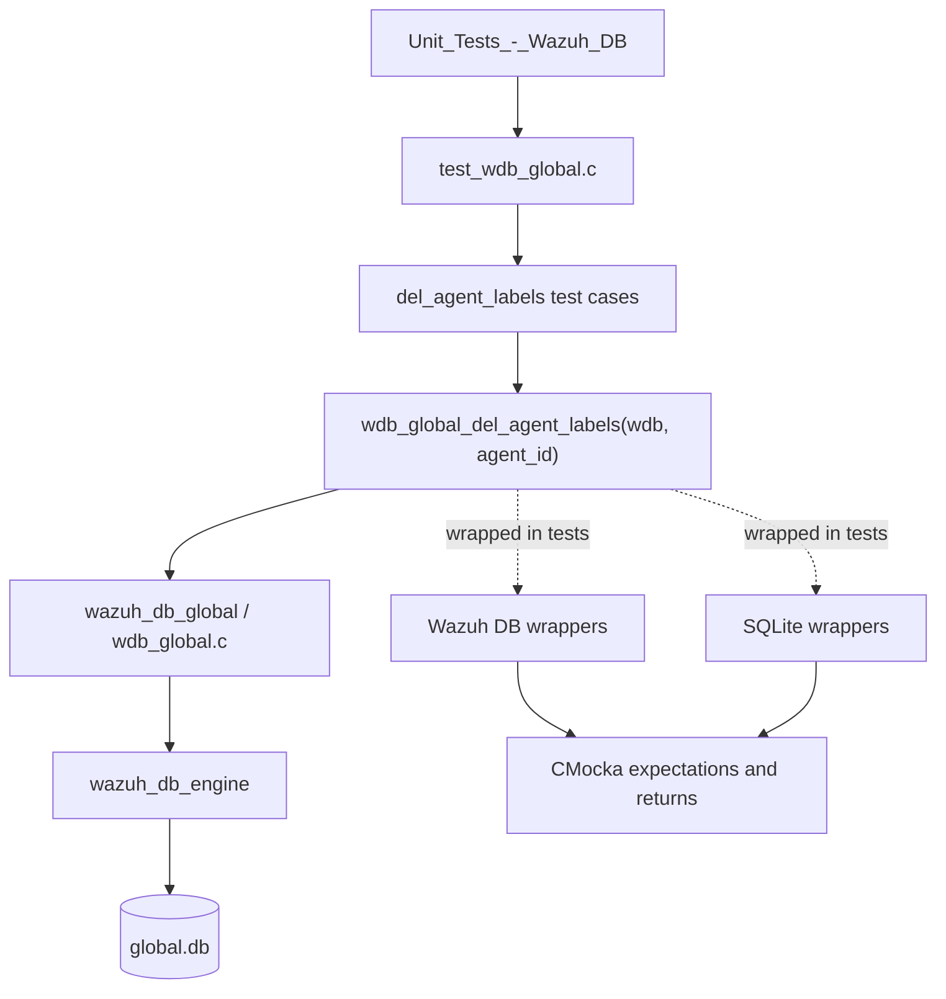
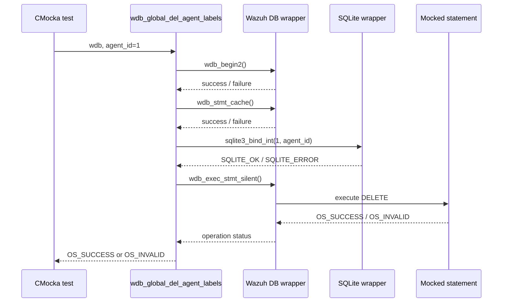
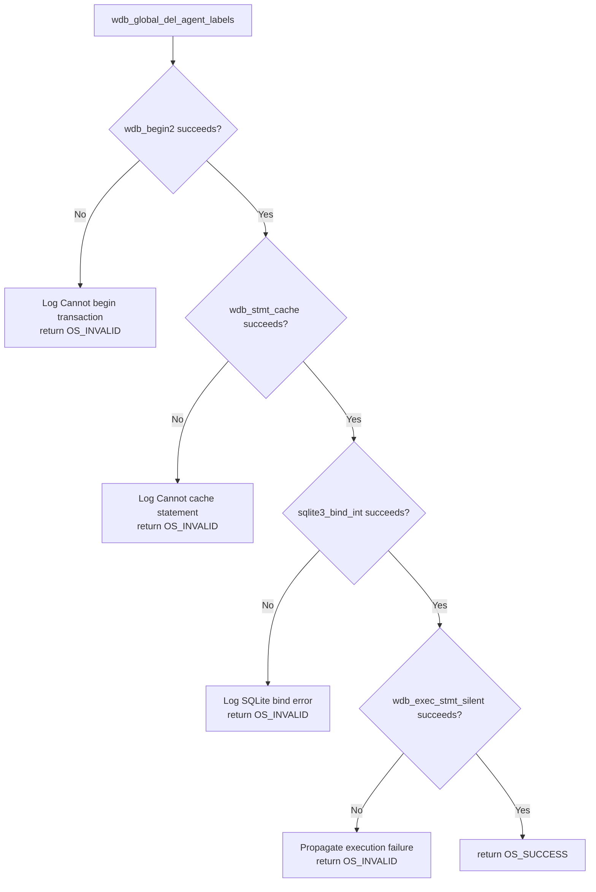
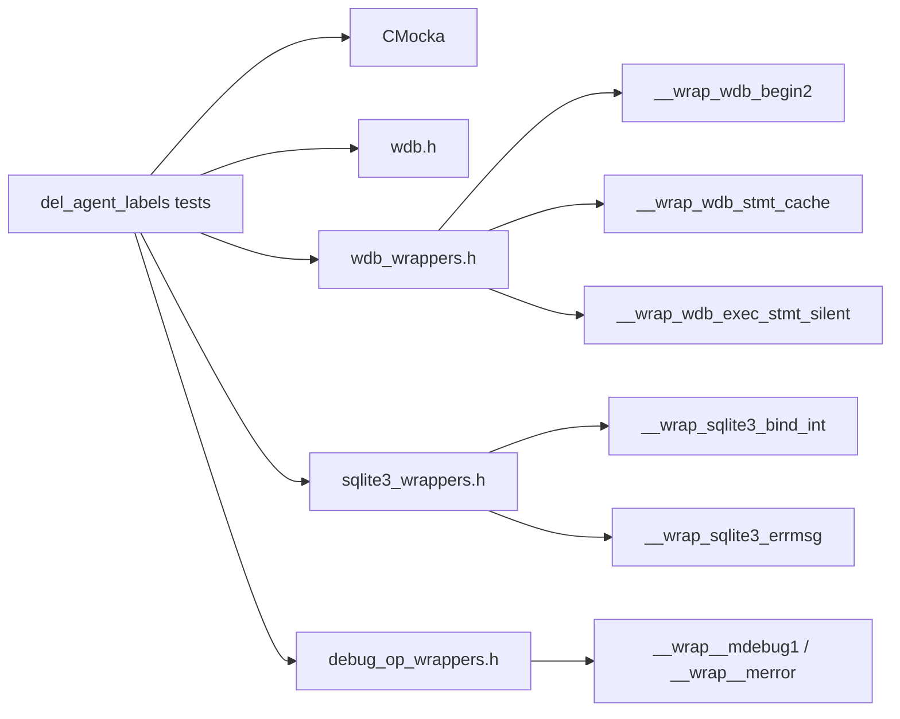

# `del_agent_labels_tests`

## Introduction

`del_agent_labels_tests` documents the CMocka tests for `wdb_global_del_agent_labels()`, the Wazuh DB operation that removes all labels associated with one agent from the global database. The tests are implemented in `src/unit_tests/wazuh_db/test_wdb_global.c` and use linker-wrapped Wazuh DB and SQLite functions; no real SQLite database is opened.

The module verifies the operation's standard database lifecycle: begin a transaction, obtain the cached delete statement, bind the agent ID, execute it silently, and return an operation status. It also verifies that each failure is converted to `OS_INVALID` and that the relevant diagnostic is emitted.

The shared fixture and wrapper conventions are documented in [`test_wdb_global_test_infrastructure.md`](test_wdb_global_test_infrastructure.md). The production database primitives are described in [`wazuh_db_engine.md`](wazuh_db_engine.md), while the broader global-database behavior belongs to the sibling `wazuh_db_global` module.

## Scope and system position

The tests belong to the `Unit_Tests_-_Wazuh_DB` suite and exercise one narrow mutation in the global database layer. In the running system, callers reach the global database through `wazuh-db`; the test substitutes the lower-level transaction, statement-cache, binding, and execution boundaries with deterministic mocks.

## Test fixture

Each case is registered with `cmocka_unit_test_setup_teardown`. The common fixture allocates a minimal `wdb_t`, sets its ID to `"global"`, allocates storage for the synthetic SQLite handle, and initializes Wazuh DB configuration. Teardown releases those allocations and frees the configuration.

The fixture behavior is intentionally shared and is not repeated here; see [`test_wdb_global_test_infrastructure.md`](test_wdb_global_test_infrastructure.md).

## Operation under test

The tested API accepts a `wdb_t *` and an integer `agent_id`. Based on the expectations in this module, its normal path is:

1. Call `wdb_begin2()` to ensure a transaction exists.
2. Call `wdb_stmt_cache()` to prepare/cache the delete statement.
3. Bind `agent_id` as parameter 1 with `sqlite3_bind_int()`.
4. Execute the prepared statement with `wdb_exec_stmt_silent()`.
5. Return `OS_SUCCESS` when execution succeeds; otherwise return `OS_INVALID`.

The source does not expose a result set for this operation. Consequently, successful execution is represented only by the status code; the tests do not construct or inspect cJSON output for these five cases.

## Test cases

| Test | Injected failure or condition | Expected result | Diagnostic asserted |
|---|---|---:|---|
| `test_wdb_global_del_agent_labels_transaction_fail` | `wdb_begin2()` returns `-1` | `OS_INVALID` | `Cannot begin transaction` via debug logging |
| `test_wdb_global_del_agent_labels_cache_fail` | `wdb_stmt_cache()` returns `-1` | `OS_INVALID` | `Cannot cache statement` via debug logging |
| `test_wdb_global_del_agent_labels_bind_fail` | Binding parameter 1 to agent `1` returns `SQLITE_ERROR` | `OS_INVALID` | `DB(global) sqlite3_bind_int(): ERROR MESSAGE` |
| `test_wdb_global_del_agent_labels_step_fail` | `wdb_exec_stmt_silent()` returns `OS_INVALID` | `OS_INVALID` | No additional log expectation; execution failure is propagated |
| `test_wdb_global_del_agent_labels_success` | Transaction, cache, bind, and execution all succeed | `OS_SUCCESS` | None |

The tests deliberately stop at the first failed stage. For example, the cache-failure case does not configure an integer bind, proving that the production function returns before attempting later work.

## Failure and success matrix

This matrix covers transaction acquisition, statement preparation, parameter binding, and statement execution—the four externally observable failure boundaries of the delete operation.

## Dependencies and mocking boundary

The relevant mocked seams are:

- `__wrap_wdb_begin2`: controls transaction acquisition.
- `__wrap_wdb_stmt_cache`: controls statement-cache preparation.
- `__wrap_sqlite3_bind_int`: verifies parameter index `1`, agent ID `1`, and SQLite status.
- `__wrap_wdb_exec_stmt_silent`: represents the DELETE execution and returns `OS_SUCCESS` or `OS_INVALID`.
- `__wrap_sqlite3_errmsg`: supplies the deterministic `ERROR MESSAGE` used in bind-error assertions.
- `__wrap__mdebug1` and `__wrap__merror`: verify the diagnostic selected for each failure class.

The tests include the production headers and wrapper headers directly, but use no live database, socket, filesystem, or cJSON result path for this operation.

## Execution contract

The test suite establishes the following contract for maintainers:

- A transaction failure is fatal and returns `OS_INVALID`.
- Statement-cache failure is fatal and returns `OS_INVALID`.
- The agent ID must be bound as the first SQLite parameter.
- Any SQLite bind error is logged with the global database identifier and returns `OS_INVALID`.
- Silent statement execution must return `OS_SUCCESS` for the delete to succeed.
- The operation has no success payload and does not distinguish “labels existed” from “no labels existed”; both are represented by successful statement execution.

## Maintenance guidance

When changing `wdb_global_del_agent_labels()` or its SQL statement, update this test group if any of the following change:

- transaction or statement-cache ordering;
- the bound parameter index or type;
- the execution helper used for the DELETE;
- status-code mapping;
- error messages asserted by the tests.

If the operation gains a response payload or size-bounded behavior, add coverage patterned after the response-size tests in the shared global test infrastructure rather than extending this status-only matrix.

## Source reference

- `src/unit_tests/wazuh_db/test_wdb_global.c`
- Production entry point: `wdb_global_del_agent_labels()`
- Related test infrastructure: [`test_wdb_global_test_infrastructure.md`](test_wdb_global_test_infrastructure.md)
- Database engine context: [`wazuh_db_engine.md`](wazuh_db_engine.md)
