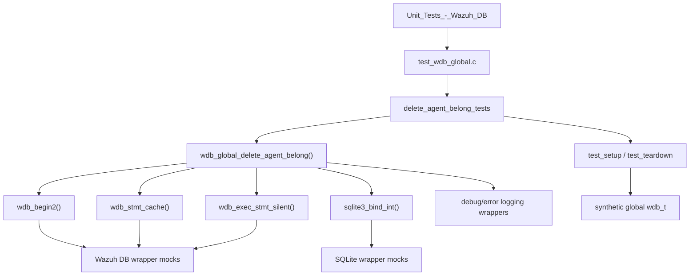
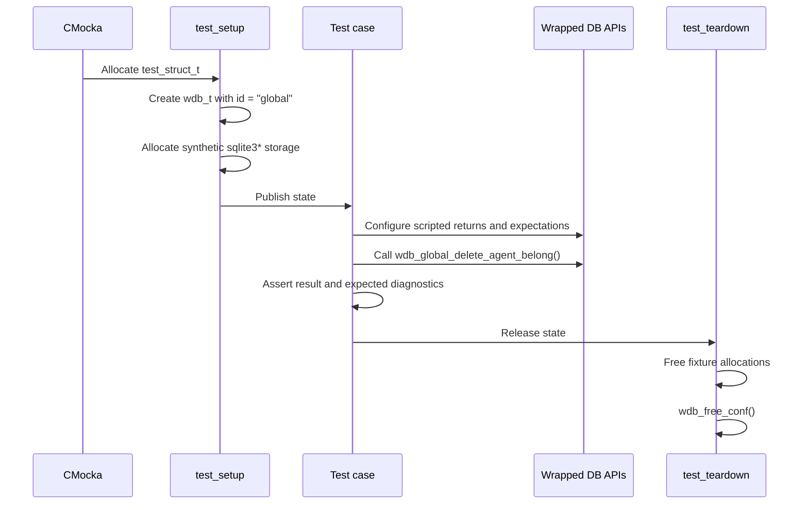
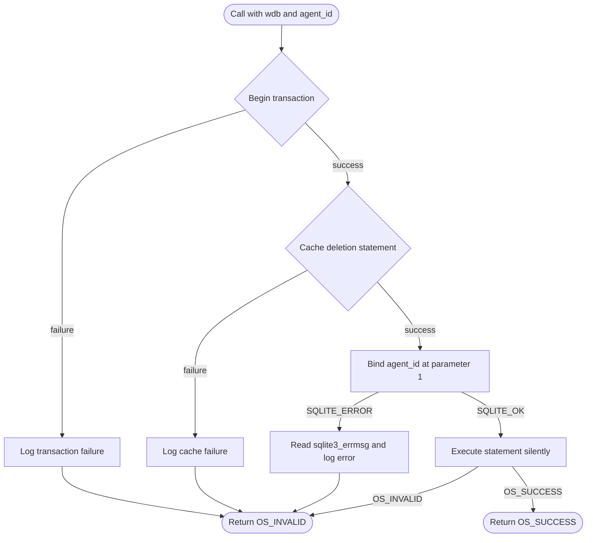
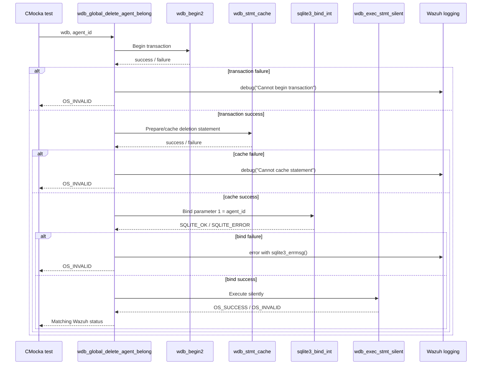

# `delete_agent_belong_tests`

## Introduction

`delete_agent_belong_tests` documents the CMocka tests for
`wdb_global_delete_agent_belong()`, the Wazuh DB operation that removes every
agent-to-group membership for a specified agent from the global database.
The tests are defined in `src/unit_tests/wazuh_db/test_wdb_global.c` and are
registered in the `test_wdb_global` executable.

This is a focused test module inside the broader global-database test suite.
For the suite-wide architecture and neighboring agent/group workflows, see
[`test_wdb_global.md`](test_wdb_global.md). The reusable fixture and wrapper
contracts are described in
[`test_wdb_global_test_infrastructure.md`](test_wdb_global_test_infrastructure.md),
and the production database layer is documented in
[`wazuh_db_global.md`](wazuh_db_global.md).

## Purpose and scope

The module verifies that `wdb_global_delete_agent_belong(wdb, agent_id)`:

1. Starts the required database transaction.
2. Obtains or caches the prepared deletion statement.
3. Binds the supplied agent ID as the statement's first integer parameter.
4. Executes the statement without returning a result set.
5. Propagates success or failure using the Wazuh status codes expected by the
   global database layer.

The tests do not use a real SQLite database. They validate control flow and
error handling by scripting linker-wrapped Wazuh DB, SQLite, and logging
functions.

## Module position and dependencies

The target is part of the group-membership area of `wdb_global.c`. It is the
agent-wide counterpart to the tuple-level deletion operation tested elsewhere
in `test_wdb_global.c`: `wdb_global_delete_agent_belong()` receives only an
agent ID, while tuple deletion receives both a group ID and an agent ID. The
broader relationship-management behavior is covered by the group-management
sections of [`test_wdb_global.md`](test_wdb_global.md).

## Test fixture and isolation

Each test is registered with `cmocka_unit_test_setup_teardown`, so every case
gets a fresh fixture:

`test_setup()` initializes Wazuh DB configuration with `wdb_init_conf()` and
creates a structurally valid `wdb_t`; it does not open a database. The target
function therefore runs against deterministic mocks. `test_teardown()` frees
the output buffer, database ID, synthetic database handle, and fixture, then
resets configuration with `wdb_free_conf()`.

## Covered test cases

| Test | Simulated condition | Expected result |
|---|---|---|
| `test_wdb_global_delete_agent_belong_transaction_fail` | `wdb_begin2()` returns `-1` | `OS_INVALID`; logs `Cannot begin transaction` |
| `test_wdb_global_delete_agent_belong_cache_fail` | `wdb_stmt_cache()` returns `-1` after transaction start | `OS_INVALID`; logs `Cannot cache statement` |
| `test_wdb_global_delete_agent_belong_bind_fail` | Binding agent ID `1` returns `SQLITE_ERROR` | `OS_INVALID`; logs the SQLite error through `_merror` |
| `test_wdb_global_delete_agent_belong_step_fail` | Binding succeeds, silent execution returns `OS_INVALID` | `OS_INVALID` |
| `test_wdb_global_delete_agent_belong_success` | Transaction, cache, bind, and execution all succeed | `OS_SUCCESS` |

The test names describe the failure boundary. In particular, the bind test
asserts both the parameter position (`index == 1`) and the value (`agent_id ==
1`), while the execution tests distinguish a successful `OS_SUCCESS` from a
failed `OS_INVALID` silent statement execution.

## Normal execution flow

The tests establish the expected short-circuit behavior: once a prerequisite
fails, later wrapper calls are not configured because the production function
should return immediately. This makes the CMocka expectations useful for
detecting incorrect ordering as well as incorrect return values.

## Component interaction contract

The operation is intentionally modeled as a silent write: deleting
memberships produces no JSON result set. The relevant observable outputs are
the status code and, for setup/bind failures, the diagnostic message.

## Wrapper behavior used by the tests

The test cases use the following mock seams, whose broader definitions are
maintained in [`wazuh_db_wrappers_global.md`](wazuh_db_wrappers_global.md):

| Wrapper | Role in this module |
|---|---|
| `__wrap_wdb_begin2` | Controls transaction-start success or failure. |
| `__wrap_wdb_stmt_cache` | Controls prepared-statement cache success or failure. |
| `__wrap_sqlite3_bind_int` | Verifies parameter index/value and returns `SQLITE_OK` or `SQLITE_ERROR`. |
| `__wrap_sqlite3_errmsg` | Supplies deterministic SQLite error text. |
| `__wrap_wdb_exec_stmt_silent` | Simulates the write execution result. |
| `__wrap__mdebug1` | Verifies transaction/cache diagnostics. |
| `__wrap__merror` | Verifies SQLite binding diagnostics. |

No cJSON wrapper is needed by these five tests because the operation neither
consumes nor returns JSON.

## Relationship to adjacent tests

The target operation participates in larger workflows that are tested in the
same parent source file:

- `wdb_global_delete_agent()` removes the agent record itself and is tested by
  the neighboring delete-agent cases.
- `wdb_global_delete_tuple_belong()` removes one `(group, agent)` pair and is
  used by group unassignment flows.
- `wdb_global_unassign_agent_group()` resolves group names, deletes tuples,
  and may restore the default group.
- `wdb_global_set_agent_groups()` composes delete/assign operations according
  to override, append, empty-only, or remove modes.

These workflows are documented at the suite and production-module levels in
[`test_wdb_global.md`](test_wdb_global.md) and
[`wazuh_db_global.md`](wazuh_db_global.md); this module documents only the
agent-wide deletion primitive and its direct unit-test contract.

## Maintenance guidance

When changing `wdb_global_delete_agent_belong()` or its prepared statement,
update this test group if any of the following changes:

- transaction or statement-cache ordering;
- the bound parameter count, type, position, or value;
- the write execution helper or its success/error status;
- the diagnostic message emitted at a failure boundary;
- the public return-code contract.

Keep the tests isolated from real SQLite and preserve the setup/teardown
registration pattern. If the operation begins returning structured data or
acquires response-size behavior, add the appropriate cJSON or sized-execution
wrapper coverage and cross-reference the shared infrastructure documentation.

## Source references

- Test implementation: `src/unit_tests/wazuh_db/test_wdb_global.c`
- Production implementation: `src/wazuh_db/wdb_global.c`, documented in
  [`wazuh_db_global.md`](wazuh_db_global.md)
- Test suite overview: [`test_wdb_global.md`](test_wdb_global.md)
- Fixture and wrapper infrastructure:
  [`test_wdb_global_test_infrastructure.md`](test_wdb_global_test_infrastructure.md)
- Wrapper contracts: [`wazuh_db_wrappers_global.md`](wazuh_db_wrappers_global.md)
- Wazuh DB command dispatch: [`wazuh_db_command_parser.md`](wazuh_db_command_parser.md)
