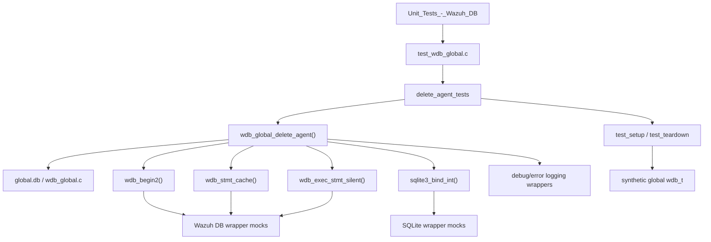
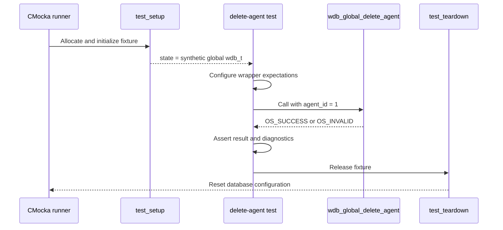
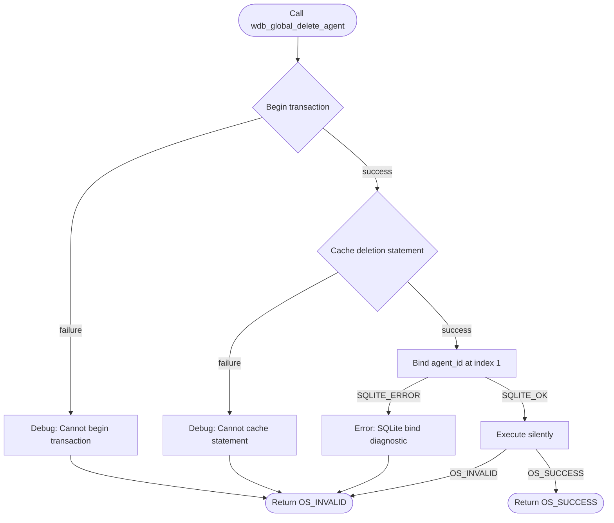
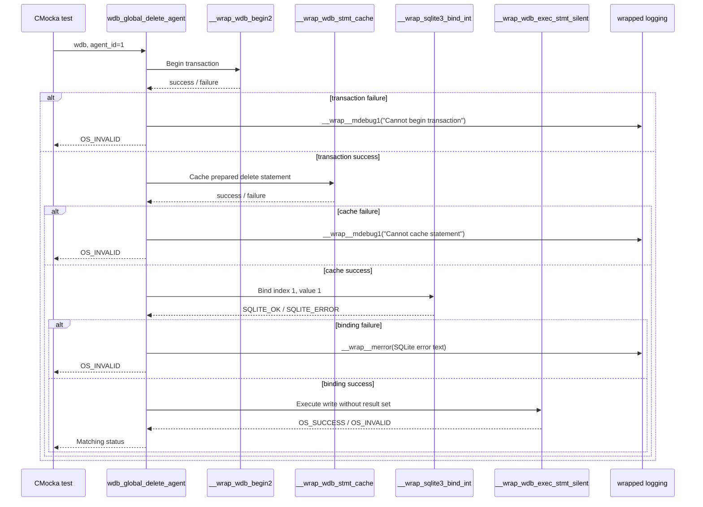

# `delete_agent_tests`

## Introduction

`delete_agent_tests` documents the CMocka coverage for
`wdb_global_delete_agent()`, the global Wazuh DB operation that removes an
agent record from `global.db`. The five tests are implemented in
`src/unit_tests/wazuh_db/test_wdb_global.c` and registered in the
`test_wdb_global` test executable.

This is a focused unit-test module. It validates the operation's transaction,
prepared-statement, SQLite binding, execution, and return-code behavior
without opening a real SQLite database. The shared fixture and wrapper
contracts are described in
[`test_wdb_global_test_infrastructure.md`](test_wdb_global_test_infrastructure.md);
the parent test suite is documented in [`test_wdb_global.md`](test_wdb_global.md).

## Purpose and scope

The target function is called with a `wdb_t *` representing the global
database and an integer `agent_id`:

```text
wdb_global_delete_agent(wdb, agent_id) -> OS_SUCCESS | OS_INVALID
```

The tests establish that the implementation:

1. Begins a database transaction.
2. Caches or obtains the deletion statement.
3. Binds `agent_id` as SQLite parameter 1.
4. Executes the write through the silent statement helper.
5. Stops immediately and returns `OS_INVALID` when any prerequisite fails.
6. Returns `OS_SUCCESS` only when the complete write succeeds.

The module tests the low-level global-database primitive, not the higher-level
agent-management command path. The production database architecture and
schema should be consulted through [`wazuh_db_global.md`](wazuh_db_global.md)
and [`wazuh_db.md`](wazuh_db.md) rather than duplicated here.

## Position in the system



At runtime, `wdb_global_delete_agent()` belongs to the Wazuh DB global-data
layer and operates on the manager's global agent registry. In this unit test,
the database, statement cache, SQLite API, and logging side effects are
replaced by deterministic linker-wrapped functions.

## Test fixture and isolation

Every case is registered with `cmocka_unit_test_setup_teardown`, so each test
receives an independent `test_struct_t` fixture.

`test_setup()` allocates:

- a `test_struct_t` state object;
- a `wdb_t` instance with the identifier `"global"`;
- storage for a synthetic `sqlite3 *` member; and
- a 256-byte output buffer shared with other test groups in the source file.

It also calls `wdb_init_conf()`. No real database connection is opened.

`test_teardown()` releases the fixture allocations and calls `wdb_free_conf()`.
This prevents global Wazuh DB configuration or heap state from leaking into
the next CMocka case.



## Covered test cases

| Test | Mocked condition | Expected behavior |
|---|---|---|
| `test_wdb_global_delete_agent_transaction_fail` | `__wrap_wdb_begin2` returns `-1` | Logs `Cannot begin transaction`; returns `OS_INVALID`. |
| `test_wdb_global_delete_agent_cache_fail` | Transaction succeeds, then `__wrap_wdb_stmt_cache` returns `-1` | Logs `Cannot cache statement`; returns `OS_INVALID`. |
| `test_wdb_global_delete_agent_bind_fail` | Statement cache succeeds, but binding parameter 1 to agent ID `1` returns `SQLITE_ERROR` | Reads the scripted SQLite message, logs `DB(global) sqlite3_bind_int(): ERROR MESSAGE`, and returns `OS_INVALID`. |
| `test_wdb_global_delete_agent_step_fail` | Binding succeeds, but `__wrap_wdb_exec_stmt_silent` returns `OS_INVALID` | Propagates the execution failure as `OS_INVALID`. |
| `test_wdb_global_delete_agent_success` | Transaction, cache, bind, and execution all succeed | Returns `OS_SUCCESS`. |

The bind case verifies both the parameter position and value. Consequently,
the tests detect changes to the SQL contract even if the final return code
would otherwise remain unchanged.

## Normal and failure flow



The expected call ordering is significant. Each failure test configures only
the calls needed to reach its failure boundary; an unexpected later call
causes CMocka expectation failure. This makes the suite verify short-circuit
behavior as well as result values.

## Component interaction



Because deletion is a write operation, the target does not return cJSON. Its
observable contract is the status code and the diagnostics emitted at the
transaction, statement-cache, and binding boundaries.

## Mocked dependencies

| Dependency | Use in these tests |
|---|---|
| `__wrap_wdb_begin2` | Controls transaction-start success or failure. |
| `__wrap_wdb_stmt_cache` | Controls prepared-statement acquisition. |
| `__wrap_sqlite3_bind_int` | Verifies parameter index/value and returns `SQLITE_OK` or `SQLITE_ERROR`. |
| `__wrap_sqlite3_errmsg` | Supplies deterministic SQLite error text for the bind-failure case. |
| `__wrap_wdb_exec_stmt_silent` | Models the final deletion statement's success or failure. |
| `__wrap__mdebug1` | Verifies transaction and cache diagnostics. |
| `__wrap__merror` | Verifies the SQLite binding diagnostic. |

The test includes the Wazuh DB, SQLite, debug, file, time, cluster, POSIX,
cJSON, and `wazuhdb_op` wrapper headers because the source file contains many
other global-database test groups. The five delete-agent cases directly
exercise only the transaction, statement-cache, integer-bind, silent-exec,
and logging seams listed above.

## Relationship to adjacent modules

The parent source file contains related operations, but they have separate
contracts:

- [`delete_agent_belong_tests.md`](delete_agent_belong_tests.md) covers removal
  of all group memberships for an agent.
- `delete_tuple_belong_tests.md` covers removal of one `(group_id, agent_id)`
  relationship when that focused documentation is available.
- The neighboring delete-agent cases in `test_wdb_global.c` cover deletion of
  the agent row itself; this document describes that focused group.
- Group assignment, unassignment, and default-group recovery compose several
  lower-level operations and are documented by the parent suite rather than
  repeated here.

These distinctions matter when modifying deletion behavior: removing an agent
record, removing its memberships, and removing one membership may use
different prepared statements and transaction boundaries.

## Maintenance guidance

Update this test module when changing any of the following in
`wdb_global_delete_agent()` or its prepared statement:

- transaction-start or statement-cache ordering;
- the bound parameter count, type, position, or agent-ID value;
- the silent execution helper;
- failure diagnostics; or
- the `OS_SUCCESS` / `OS_INVALID` return contract.

When adding cases, follow the existing pattern: configure wrapper expectations
before the production call, assert the public result, verify important logs,
and register the case in `main()` with both `test_setup` and `test_teardown`.
