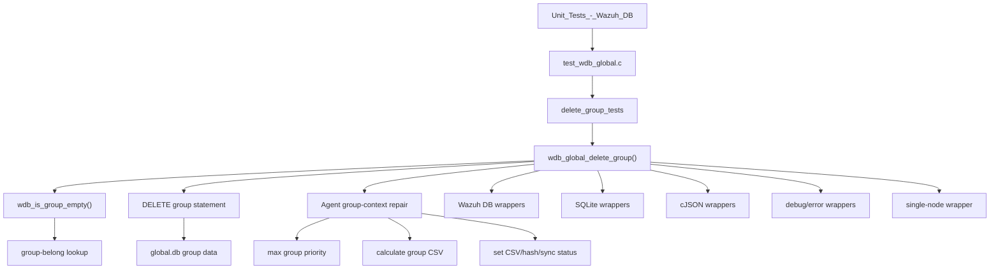
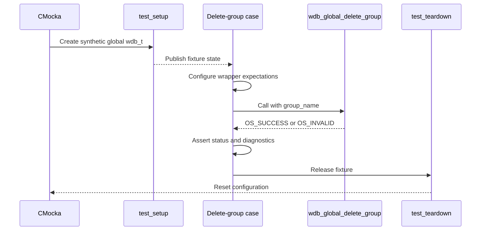
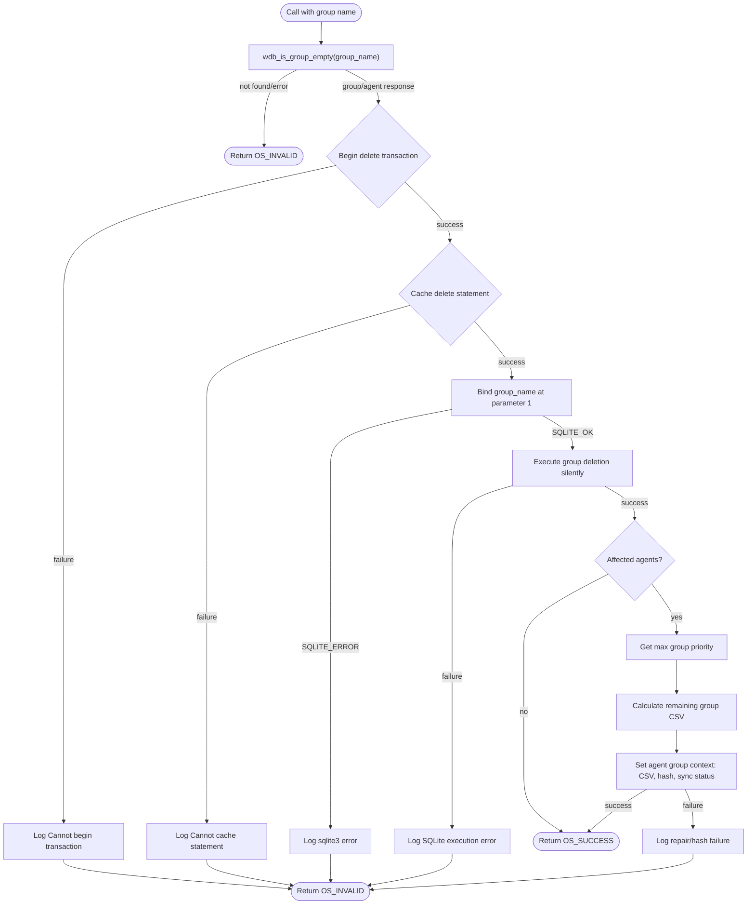
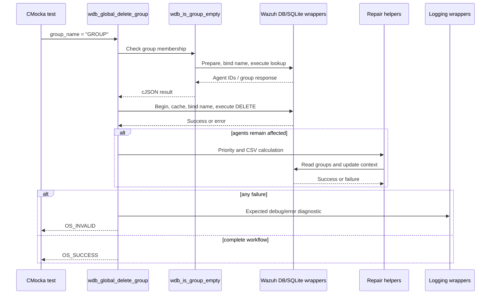

# `delete_group_tests`

## Introduction

`delete_group_tests` documents the CMocka coverage for
`wdb_global_delete_group()`, the global-database operation that removes a
group and repairs the affected agents' group context. The tests are defined in
`src/unit_tests/wazuh_db/test_wdb_global.c`; this page isolates the six
delete-group cases from the larger `test_wdb_global` executable.

The operation is more than a single SQL delete. It first checks whether the
group exists, deletes the group row, and—when agents were associated with the
group—recalculates their group CSV, priority-related state, hash, and sync
status. The common fixture and wrapper behavior are documented in
[`test_wdb_global_test_infrastructure.md`](test_wdb_global_test_infrastructure.md).
The parent suite is described in [`test_wdb_global.md`](test_wdb_global.md).

## Purpose and scope

The focused tests verify that `wdb_global_delete_group(wdb, group_name)`:

1. Checks the group through `wdb_is_group_empty()`.
2. Starts a transaction and obtains the group-delete statement.
3. Binds the group name as SQLite parameter 1.
4. Executes the delete as a silent write.
5. Recalculates affected agents' group context after deletion.
6. Propagates failures as `OS_INVALID` and returns `OS_SUCCESS` only when the
   complete workflow succeeds.

The tests use wrapped Wazuh DB, SQLite, cJSON, logging, and cluster helpers;
no real database is opened.

## Position in the system

The production implementation belongs to the global Wazuh DB layer. Related
primitives are covered beside it in the same source file: agent-membership
deletion is documented in [`delete_agent_belong_tests.md`](delete_agent_belong_tests.md),
while the parent suite covers assignment, unassignment, tuple deletion, and
group synchronization without repeating those contracts here.

## Test fixture and isolation

Every case is registered with `cmocka_unit_test_setup_teardown`. `test_setup()`
allocates a synthetic `wdb_t`, sets its ID to `"global"`, allocates a database
pointer slot, creates an output buffer, and initializes Wazuh DB configuration.
`test_teardown()` frees those allocations and calls `wdb_free_conf()`.

## Covered test cases

| Test | Scenario | Expected contract |
|---|---|---|
| `test_wdb_global_delete_group_transaction_fail` | Group lookup succeeds, transaction start fails | `OS_INVALID`; logs `Cannot begin transaction` |
| `test_wdb_global_delete_group_cache_fail` | Delete transaction starts, statement cache fails | `OS_INVALID`; logs `Cannot cache statement` |
| `test_wdb_global_delete_group_bind_fail` | Delete statement binding returns `SQLITE_ERROR` | `OS_INVALID`; logs the SQLite bind error |
| `test_wdb_global_delete_group_step_fail` | Binding succeeds, silent delete execution fails | `OS_INVALID`; logs `SQLite: ERROR MESSAGE` |
| `test_wdb_global_delete_group_recalculate_fail` | Delete succeeds but post-delete agent repair fails | `OS_INVALID`; logs failed default-group recovery and hash recalculation |
| `test_wdb_global_delete_group_success` | Lookup, delete, and agent repair all succeed | `OS_SUCCESS` |

The first four cases establish short-circuit behavior. The last two cover the
important multi-step distinction between deleting the group row and repairing
the remaining agent state.

## Deletion and repair flow

The success fixture models one affected agent. It supplies an agent ID from
the group-belong query, returns priority `0`, recalculates the remaining group
CSV, reads the remaining group name, and updates the agent context with the
group name, its hash (`19dcd0dd` in the fixture), and `syncreq`.

## Component interaction

## Mocked dependencies

| Dependency | Role in these tests |
|---|---|
| `__wrap_wdb_init_stmt_in_cache` | Provides the group-belong lookup and priority statement handles. |
| `__wrap_wdb_begin2` | Controls transaction success/failure for lookup, delete, and repair operations. |
| `__wrap_wdb_stmt_cache` | Controls prepared-statement caching. |
| `__wrap_sqlite3_bind_text` | Verifies `group_name` is bound at position 1 and can fail deterministically. |
| `__wrap_wdb_exec_stmt` / `__wrap_wdb_exec_stmt_silent` | Supplies lookup JSON or models delete/update execution. |
| `__wrap_wdb_step` and `__wrap_sqlite3_column_text` | Model reading the remaining group for CSV reconstruction. |
| `__wrap_cJSON_Delete` / cJSON constructors | Track ownership and provide real JSON fixtures. |
| `__wrap_w_is_single_node` | Selects the cluster-dependent repair path. |
| `__wrap__mdebug1`, `__wrap__merror`, `__wrap__mwarn` | Assert failure and recovery diagnostics. |

The complete wrapper contracts are maintained by the shared infrastructure
documentation rather than duplicated in this focused page.

## Maintenance guidance

Update this module's tests when changing any of the following:

- group-existence or membership lookup behavior;
- transaction/cache/bind/execute ordering;
- the delete statement's parameter contract;
- default-group recovery or agent group-context recalculation;
- group-hash or synchronization-status updates;
- return codes or diagnostic messages.

When adding a new case, keep the scenario focused on one boundary, configure
only the wrapper calls needed to reach it, assert both the return code and
important logs, and release every real cJSON object created by the test.
