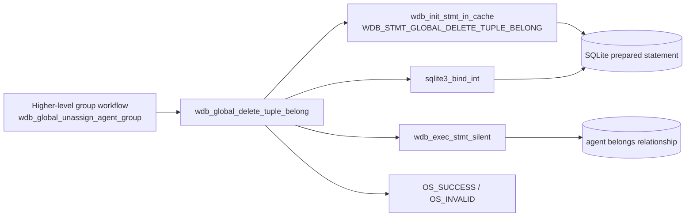
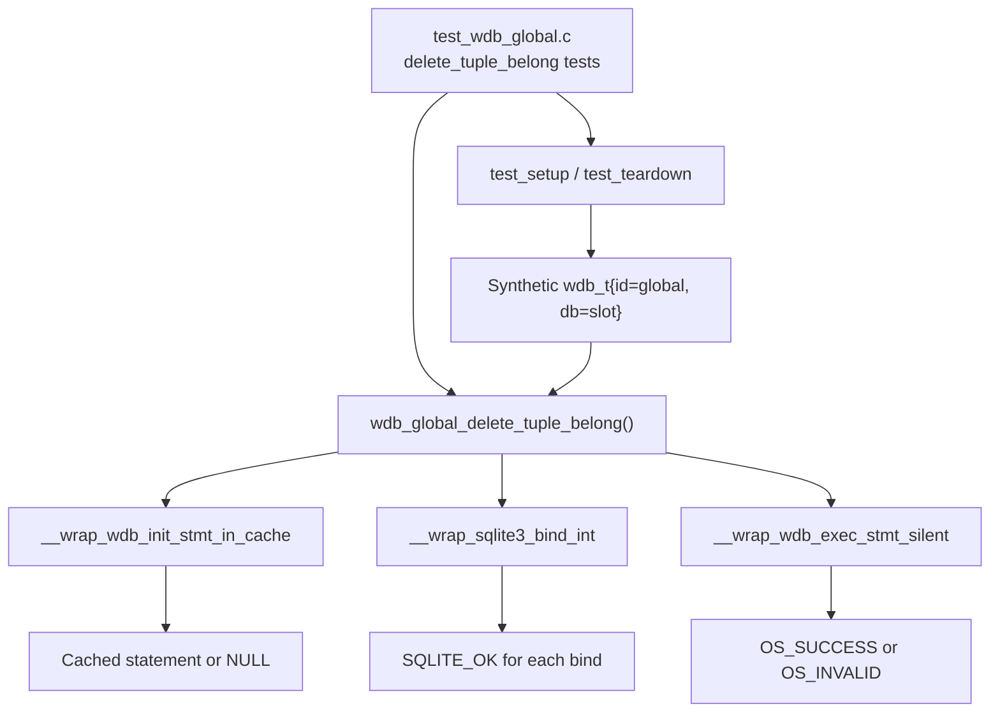
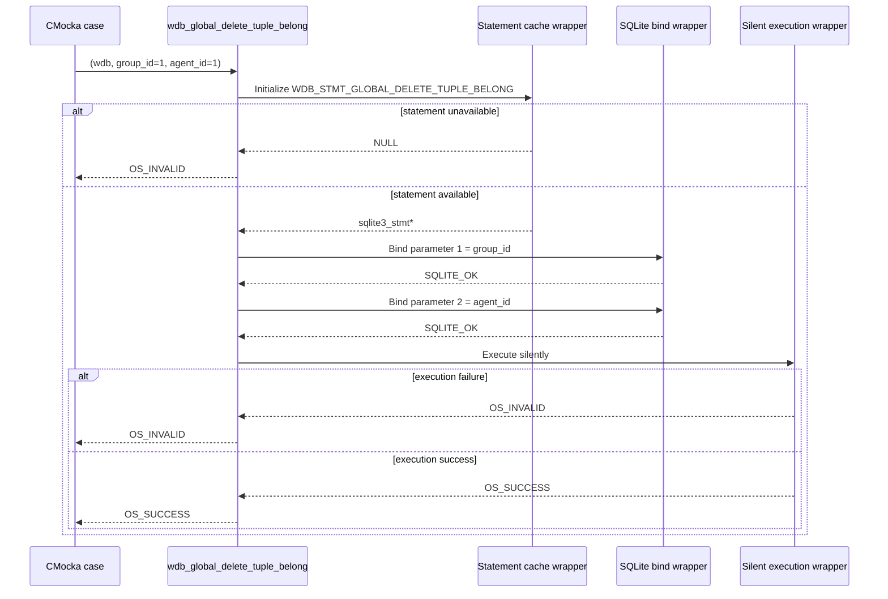
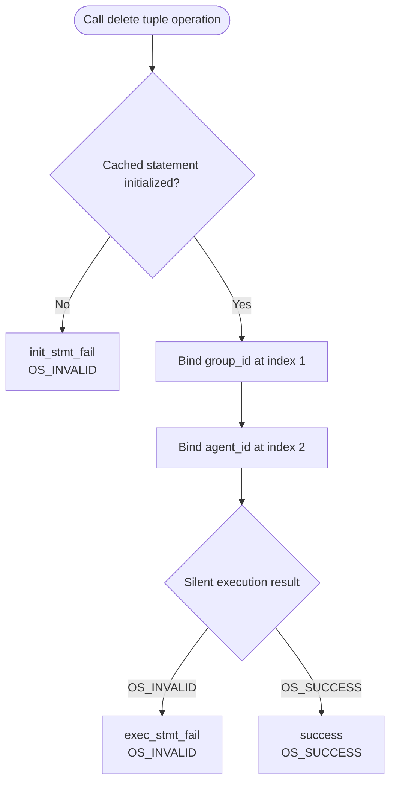
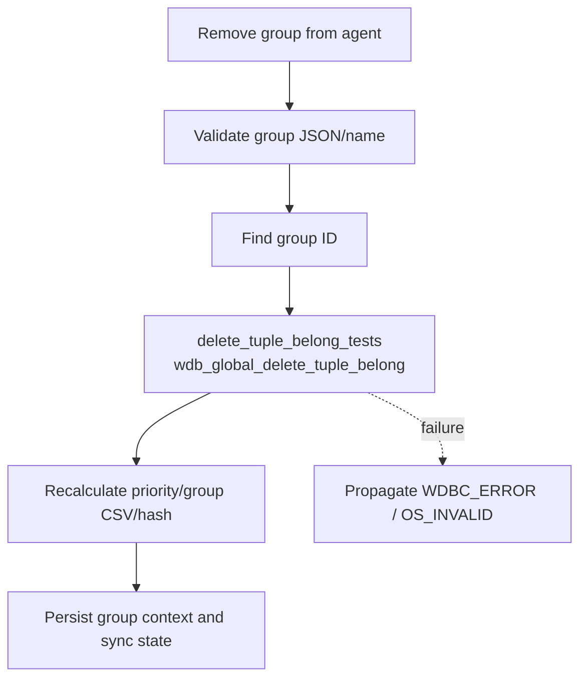

# `delete_tuple_belong_tests`

## Introduction

`delete_tuple_belong_tests` is the focused CMocka test group for `wdb_global_delete_tuple_belong()`, the Wazuh DB operation that removes one agent–group membership row from the global database. The tests are implemented in `src/unit_tests/wazuh_db/test_wdb_global.c` and are registered in that file’s `main()` test list.

The group verifies the two essential execution branches: failure to initialize the cached delete statement and failure/success while executing the prepared statement after both identifiers have been bound. The production operation and its place in global group management are documented in [`wazuh_db_global.md`](wazuh_db_global.md); the shared fixture and wrapper conventions are documented in [`test_wdb_global_test_infrastructure.md`](test_wdb_global_test_infrastructure.md).

## Purpose and scope

The test group protects the smallest database primitive used when an individual agent is removed from an individual group. It does not test group-name lookup, default-group reassignment, priority recalculation, or group-context hashing directly. Those higher-level workflows call this primitive and are covered by the broader `test_wdb_global` group; see [`test_wdb_global.md`](test_wdb_global.md).

The tested contract is:

| Input | Meaning |
|---|---|
| `wdb_t *wdb` | Global Wazuh DB context supplied by the fixture |
| `group_id` | Numeric identifier of the group to remove |
| `agent_id` | Numeric identifier of the agent to remove from that group |

| Result | Meaning |
|---|---|
| `OS_SUCCESS` | The delete statement executed successfully |
| `OS_INVALID` | Statement initialization or execution failed |

The test inputs use `group_id = 1` and `agent_id = 1`. The values are representative; the important assertions are statement identity, bind order, bind values, and result propagation.

## Position in the Wazuh DB architecture

Conceptually, the prepared statement targets the relationship represented by the global database’s belongs table and identifies a row using the pair `(id_group, id_agent)`. The exact SQL/schema ownership remains in the production global DB documentation and source references linked from [`wazuh_db_global.md`](wazuh_db_global.md).

## Components and dependencies

### Test fixture

Each case is registered with `cmocka_unit_test_setup_teardown`, so it receives a fresh fixture:

1. `test_setup()` allocates `test_struct_t`, a `wdb_t`, the `"global"` database identifier, a 256-byte output buffer, and storage for the synthetic SQLite handle.
2. `wdb_init_conf()` initializes global Wazuh DB configuration.
3. The test scripts wrapper behavior, invokes the production function, and checks the result.
4. `test_teardown()` frees all fixture allocations and calls `wdb_free_conf()`.

The output buffer is not used by this operation, but it is part of the shared fixture used by the surrounding tests in `test_wdb_global.c`. See [`test_wdb_global_test_infrastructure.md`](test_wdb_global_test_infrastructure.md) for the complete fixture lifecycle.

### Wrapped dependency boundaries

The three focused tests use these linker-wrapped seams:

| Wrapper | Role in this test group |
|---|---|
| `__wrap_wdb_init_stmt_in_cache` | Simulates lookup of the cached `WDB_STMT_GLOBAL_DELETE_TUPLE_BELONG` statement |
| `__wrap_sqlite3_bind_int` | Verifies and controls binding of group and agent IDs |
| `__wrap_wdb_exec_stmt_silent` | Simulates the write execution result without returning a JSON result |

SQLite error-message wrappers and logging wrappers are not needed by the three focused cases because the assertions validate the returned status rather than a diagnostic string. The complete wrapper inventory is maintained in [`wazuh_db_wrappers_global.md`](wazuh_db_wrappers_global.md).

## Operation flow

The tests establish that statement initialization precedes binding, binding occurs in the expected group-then-agent order, and execution is reached only after both binds succeed.

## Test cases

### `test_wdb_global_delete_tuple_belong_init_stmt_fail`

This case configures `__wrap_wdb_init_stmt_in_cache` to return `NULL` for `WDB_STMT_GLOBAL_DELETE_TUPLE_BELONG`. It then calls the production function and asserts `OS_INVALID`.

What it verifies:

- The correct statement-cache index is requested.
- A missing cached statement is treated as an operation failure.
- No bind or execution interaction is expected after initialization fails.

### `test_wdb_global_delete_tuple_belong_exec_stmt_fail`

This case returns a synthetic statement, accepts both integer bindings, and makes `__wrap_wdb_exec_stmt_silent` return `OS_INVALID`. The test asserts that the production function propagates `OS_INVALID`.

Expected interactions:

| Order | Wrapper call | Expected values |
|---:|---|---|
| 1 | `__wrap_wdb_init_stmt_in_cache` | `WDB_STMT_GLOBAL_DELETE_TUPLE_BELONG` → non-null statement |
| 2 | `__wrap_sqlite3_bind_int` | index `1`, value `group_id` (`1`) → `SQLITE_OK` |
| 3 | `__wrap_sqlite3_bind_int` | index `2`, value `agent_id` (`1`) → `SQLITE_OK` |
| 4 | `__wrap_wdb_exec_stmt_silent` | `OS_INVALID` |

### `test_wdb_global_delete_tuple_belong_success`

This case uses the same statement and binding expectations as the execution-failure case, but returns `OS_SUCCESS` from the silent execution wrapper. The production result must be `OS_SUCCESS`.

This is the nominal contract for removing the selected relationship row. The test intentionally checks the database interaction boundary rather than inspecting a real SQLite file.

## Coverage matrix

| Branch | Covered by |
|---|---|
| Statement-cache initialization failure | `test_wdb_global_delete_tuple_belong_init_stmt_fail` |
| Successful statement initialization and both binds | Execution-failure and success cases |
| Silent execution failure | `test_wdb_global_delete_tuple_belong_exec_stmt_fail` |
| Silent execution success | `test_wdb_global_delete_tuple_belong_success` |
| Bind failure at either parameter | Not covered by this focused group; analogous binding-failure patterns are covered elsewhere in `test_wdb_global.c` and the shared Wazuh DB test infrastructure |

## Interaction with higher-level workflows

The primitive is used by group-removal workflows that first resolve a group name to an ID and may subsequently recalculate agent group priority/context. In the surrounding test file, `wdb_global_unassign_agent_group()` tests configure this primitive through the same statement index and bind order. Group deletion and group-setting flows also exercise it indirectly. The broader relationship and synchronization behavior is described in [`wazuh_db_global.md`](wazuh_db_global.md).

The focused unit tests stop at the tuple-delete boundary. They do not assert the follow-up recalculation or synchronization steps; those are responsibilities of the parent workflow tests.

## Maintenance notes

- Keep the statement enum assertion aligned with `WDB_STMT_GLOBAL_DELETE_TUPLE_BELONG` if the statement-cache table changes.
- Preserve the bind-order assertions when the SQL statement or schema evolves; callers and wrappers rely on group ID being parameter 1 and agent ID being parameter 2.
- If the production function begins reporting SQLite diagnostics, add wrapper expectations for `sqlite3_errmsg` and logging in the focused failure cases.
- If bind failures become part of this module’s explicit contract, add separate tests for the first and second `sqlite3_bind_int` calls, following the patterns used by neighboring tests in `test_wdb_global.c`.

## Source and related documentation

- Test implementation: `src/unit_tests/wazuh_db/test_wdb_global.c`
- Production global DB layer and relationship-management architecture: [`wazuh_db_global.md`](wazuh_db_global.md)
- Parent test module: [`test_wdb_global.md`](test_wdb_global.md)
- Shared fixture and wrapper behavior: [`test_wdb_global_test_infrastructure.md`](test_wdb_global_test_infrastructure.md)
- Global Wazuh DB wrapper contracts: [`wazuh_db_wrappers_global.md`](wazuh_db_wrappers_global.md)
- Wazuh DB engine primitives: [`wazuh_db_engine.md`](wazuh_db_engine.md)
