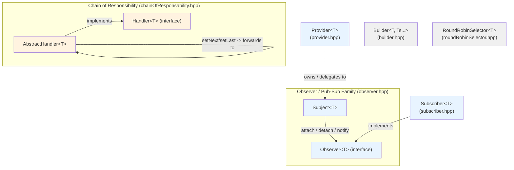
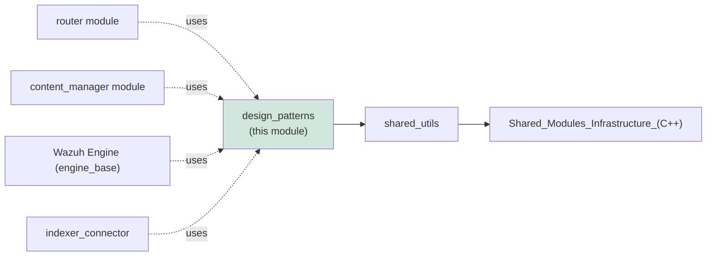
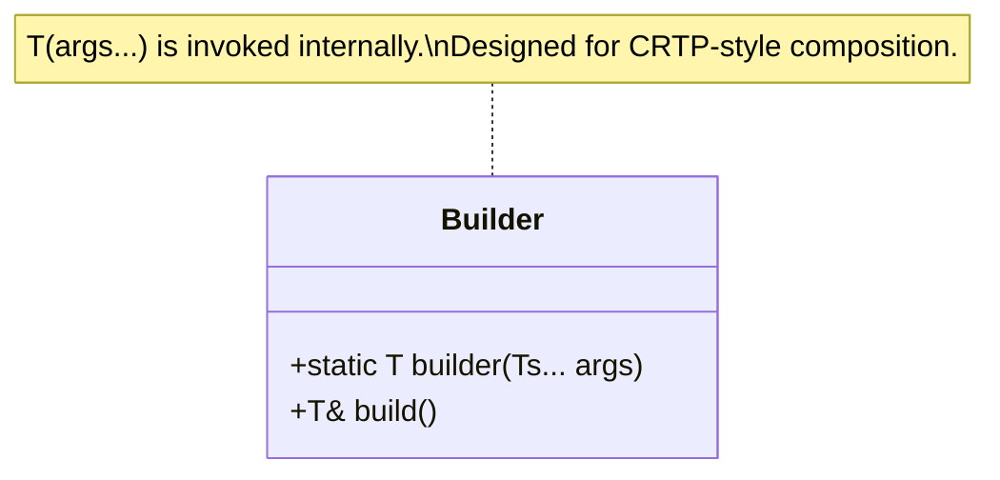
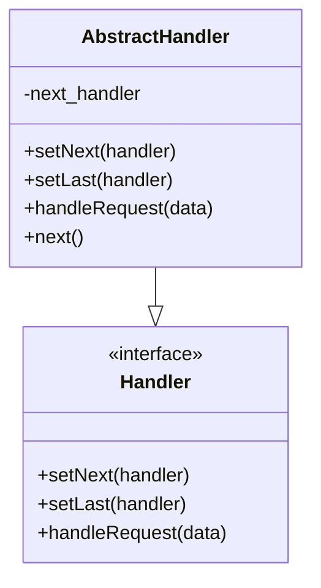
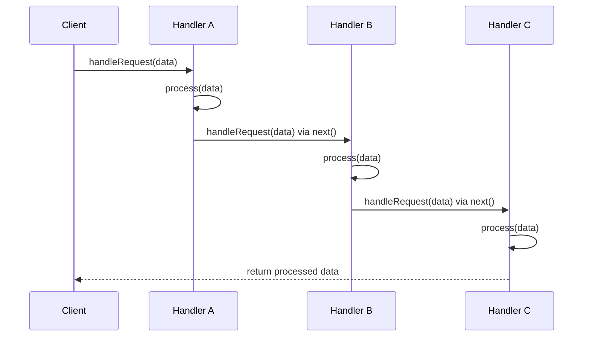
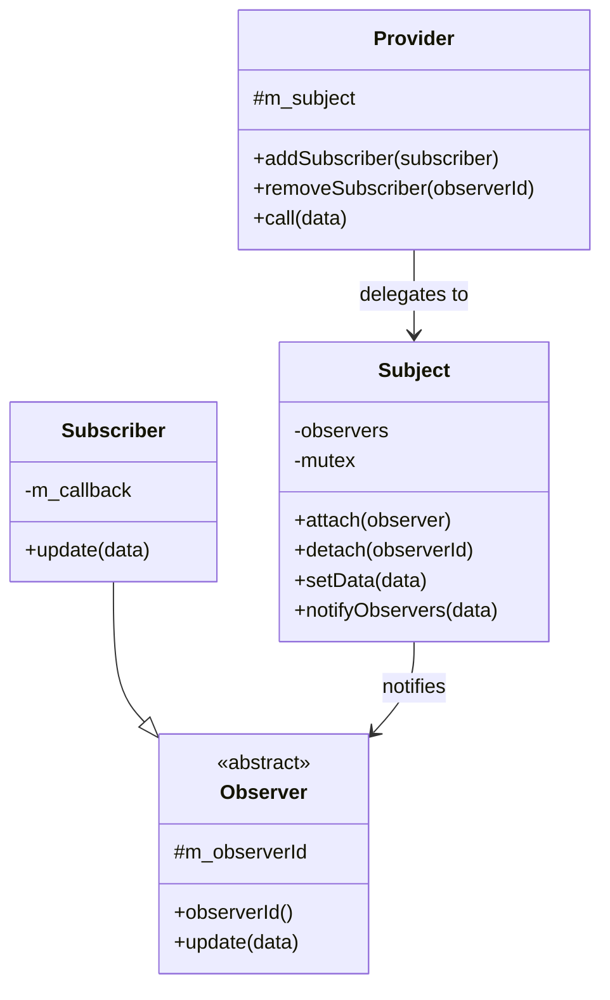
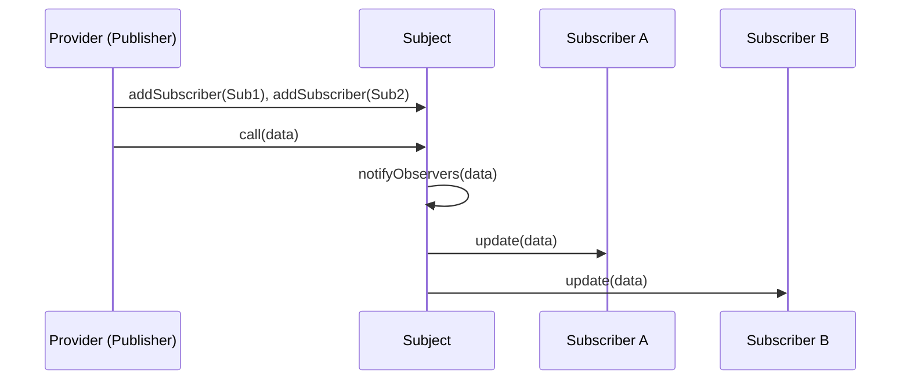
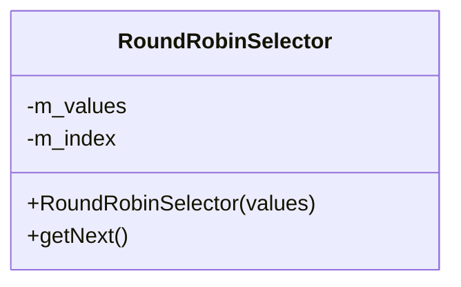

# Design Patterns Module

## 1. Introduction and Purpose

The **Design Patterns** module is a small, header-only C++ utility library that provides generic, reusable implementations of classic software design patterns for use throughout the Wazuh C++ codebase. Rather than being a functional subsystem on its own, it acts as a **foundational toolkit** — a set of templated building blocks that other modules (the [Router](router.md), [Content Manager](content_manager.md), [DBSync](dbsync.md), [RSync](rsync.md), the [Wazuh Engine](engine_base.md), and various daemons) compose into their own architectures.

All components live under `src/shared_modules/utils/` and are part of the broader [Shared Utilities](shared_utils.md) collection (itself a child of the [Shared Modules Infrastructure](Shared_Modules_Infrastructure_(C++).md) top-level module). Because every component is a self-contained template header with no `.cpp` counterpart, the module has no build/link dependency of its own — it is consumed purely at compile time via `#include`.

The module implements two related pattern families:

1. **Structural/Creational helpers** — `Builder` (Builder pattern) and `RoundRobinSelector` (a simple load-balancing/rotation utility often paired with the Strategy pattern).
2. **Behavioral patterns** — `Handler`/`AbstractHandler` (Chain of Responsibility) and the `Subject`/`Observer`/`Subscriber`/`Provider` family (Observer/Publish-Subscribe pattern).

## 2. Architecture Overview

The six core components are organized into two independent pattern families plus two standalone utilities. There is a compile-time (template) dependency of `Subscriber` and `Provider` on `Subject`/`Observer` (defined in `observer.hpp`), which is the only inter-component relationship in the module.



### Placement in the overall system



Consumers typically use `Subject`/`Observer`/`Subscriber` for internal event dispatch (e.g., the [Router](router.md) `Publisher`/`Subscriber` classes build on the same conceptual model), `Provider` for components that publish data to multiple listeners, `AbstractHandler` for staged/pipeline processing (comparable in spirit to the `EnvironmentBuilder`/orchestrator pipelines in [Router_orchestrator](Router_orchestrator.md)), and `RoundRobinSelector` for simple load distribution across a fixed set of endpoints (e.g., cycling through indexer or proxy hosts, similar in purpose to server-selection logic in [content_manager_components](content_manager_components.md) and the indexer connector's server selector).

## 3. Component Reference

### 3.1 Builder (`builder.hpp`)

Implements the **Builder pattern** as a minimal templated helper (`Utils::Builder<T, Ts...>`).

- `static T builder(Ts... args)` — a static factory method that forwards its arguments to `T`'s constructor and returns a fully constructed value of type `T`. This centralizes object construction, allowing calling code to depend on a uniform `Builder::builder(...)` call site rather than directly invoking varied constructors.
- `T& build()` — an instance method that returns a reference to `*this` cast to `T&`. This is intended to be used via CRTP-style inheritance, where a class derives from `Builder<Derived>` to expose a fluent `build()` accessor.



**Typical usage pattern:** a class that needs a standard construction entry point derives from `Builder<MyClass, Args...>`, gaining both a static factory (`MyClass::builder(args)`) and a self-referencing `build()` accessor without hand-writing boilerplate.

### 3.2 Chain of Responsibility (`chainOfResponsability.hpp`)

Provides `Handler<T>` (abstract interface) and `AbstractHandler<T>` (default implementation) to build linked processing pipelines where each link may either process a piece of data of type `T` and pass it on, or terminate the chain.

- **`Handler<T>`** — pure virtual interface declaring:
  - `setNext(handler)` — link the next handler in the chain.
  - `setLast(handler)` — recursively find the end of the chain and attach a handler there.
  - `handleRequest(data)` — process and/or forward the request.
- **`AbstractHandler<T>`** — concrete base class implementing the linking logic (`m_next` pointer) and default forwarding behavior. Subclasses override `handleRequest` to add processing logic and typically call `AbstractHandler<T>::handleRequest(data)` (via `next()`) to continue the chain.





This pattern mirrors the same concept used elsewhere in the codebase — e.g., `AbstractHandler`/`Handler` in [engine_base_patterns](engine_base_patterns.md) is a near-identical construct used inside the Wazuh Engine, and multi-stage processing pipelines such as [Router_orchestrator](Router_orchestrator.md) or the content-manager's `ActionOrchestrator` (see [content_manager_orchestration](content_manager_orchestration.md)) apply the same staged-forwarding idea, though with bespoke implementations.

### 3.3 Observer Family (`observer.hpp`, `subscriber.hpp`, `provider.hpp`)

Implements the **Observer / Publish-Subscribe pattern**, split across three cooperating headers.

#### `Observer<T>` and `Subject<T>` (`observer.hpp`)

- **`Observer<T>`** — abstract base identified by a string `m_observerId`. Subclasses implement `update(T data)` to react to notifications.
- **`Subject<T>`** — the notification hub. Maintains a thread-safe (`std::mutex`-guarded) vector of `shared_ptr<Observer<T>>`.
  - `attach(observer)` — registers an observer, replacing any existing observer with the same `observerId()`.
  - `detach(observerId)` — removes an observer by id; throws `std::runtime_error` if not found.
  - `setData(data)` / `notifyObservers(data)` — pushes `data` to every attached observer synchronously.

#### `Subscriber<T>` (`subscriber.hpp`)

A concrete, ready-to-use `Observer<T>` implementation that wraps a `std::function<void(T)>` callback, letting callers register lambdas/functions as observers without writing a dedicated subclass:

```cpp
Subscriber<MyEvent>([](MyEvent& e) { /* handle event */ });
```

#### `Provider<T>` (`provider.hpp`)

A convenience wrapper around `Subject<T>` intended for classes that need to expose publish/subscribe semantics without inheriting from `Subject` directly (composition over inheritance):
- `addSubscriber(subscriber)` / `removeSubscriber(id)` — proxy to the internal `Subject`'s `attach`/`detach`.
- `call(data)` — proxy to `Subject::setData`, triggering notification of all subscribers.





**Relation to other modules:** This Observer trio is a lightweight, generic counterpart to the more specialized publish/subscribe machinery found in the [router module](router.md) (`Publisher`, `Subscriber`, `RemoteSubscriptionManager` in `router_pubsub`) and the [Metrics manager](engine_metrics.md)/[Content Manager](content_manager.md) update-notification flows. Modules needing simple in-process fan-out notification (without the network/IPC concerns of the router) can use `Subject`/`Provider`/`Subscriber` directly instead of re-implementing observer bookkeeping.

### 3.4 RoundRobinSelector (`roundRobinSelector.hpp`)

A minimal, thread-safe round-robin selection utility:

- Constructed with a `std::vector<T>` of candidate values (e.g., server addresses, endpoints, backend handles).
- `getNext()` — atomically increments an internal index (`std::atomic<std::size_t>`) and returns `values[index % values.size()]`, cycling through the collection indefinitely.



This is a concurrency-safe alternative to manually cycling through a list with a mutex, useful for load-balancing across multiple backend targets — a need shared by components such as the server/proxy selection logic in [content_manager_components](content_manager_components.md) (`CtiSnapshotDownloader`) and the indexer connector's `ServerSelector`/`TServerSelector` classes.

## 4. Design Rationale

| Pattern | Component(s) | Problem Solved |
|---|---|---|
| Builder | `Builder<T, Ts...>` | Uniform, centralized object construction/fluent access without repetitive boilerplate constructors. |
| Chain of Responsibility | `Handler<T>`, `AbstractHandler<T>` | Decouples a sequence of processing steps so each step can be added, removed, or reordered independently, and can choose to short-circuit or forward. |
| Observer / Pub-Sub | `Subject<T>`, `Observer<T>`, `Subscriber<T>`, `Provider<T>` | Decouples data producers from consumers; supports multiple listeners reacting to state changes without producers knowing consumer details; thread-safe via mutex. |
| Strategy-like Rotation | `RoundRobinSelector<T>` | Simple, lock-free (atomic-based), fair distribution across a fixed pool of resources. |

All components are:
- **Header-only templates** — zero compiled translation units, included directly where needed.
- **Generic (`T`, `Ts...`)** — reusable across unrelated domains (network endpoints, events, configuration objects, etc.).
- **Free of module-specific dependencies** — they depend only on the C++ standard library (`<memory>`, `<mutex>`, `<atomic>`, `<vector>`, `<functional>`), making them safe to include from any part of the codebase (daemons, engine, shared modules) without introducing coupling.

## 5. Related Documentation

- [Shared Utilities](shared_utils.md) — parent module grouping this and other utility categories (smart pointers/RAII, sockets, JSON helpers, RocksDB/SQLite wrappers, etc.).
- [Shared Modules Infrastructure (C++)](Shared_Modules_Infrastructure_(C++).md) — top-level module containing `content_manager`, `dbsync`, `router`, `rsync`, `indexer_connector`, `keystore`, and `shared_utils`.
- [Router module](router.md) — a consumer-style publish/subscribe subsystem (`Publisher`/`Subscriber`/`RemoteSubscriptionManager`) conceptually related to the Observer family documented here.
- [Content Manager](content_manager.md) — uses staged/orchestrated processing (`ActionOrchestrator`) comparable to the Chain of Responsibility pattern.
- [Wazuh Engine — Base](engine_base.md) — contains an equivalent `AbstractHandler`/`Handler` pair (`engine_base_patterns`) used internally by the engine's build pipeline.
