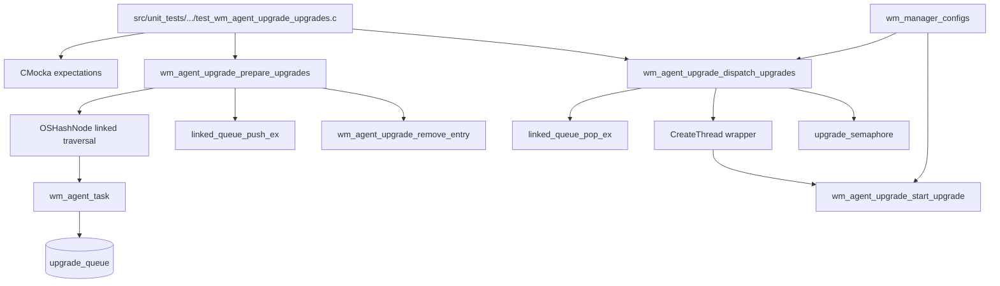
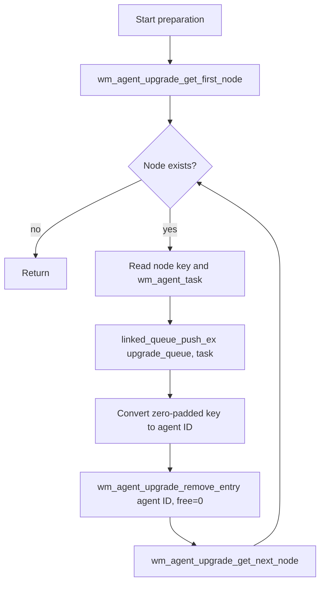
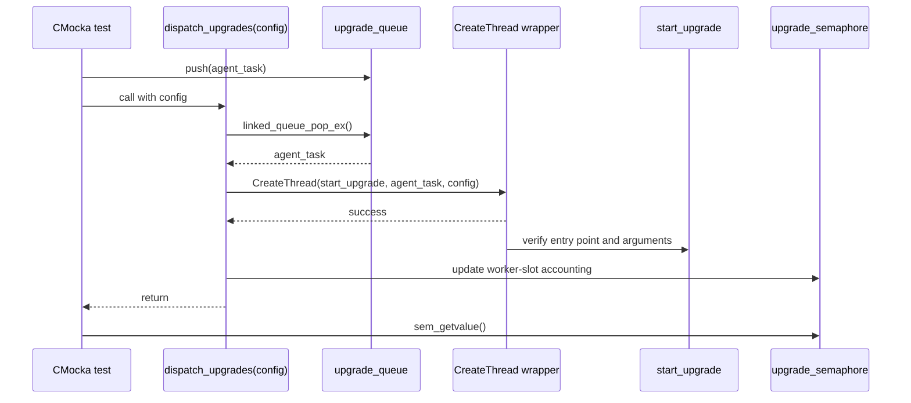
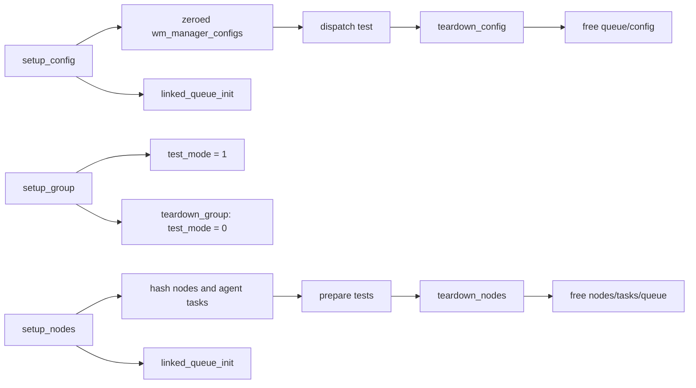

# dispatch_prepare_upgrades_tests

## Introduction

`dispatch_prepare_upgrades_tests` documents the three CMocka tests that verify the manager-side handoff between pending agent-upgrade tasks and upgrade worker threads. The tests exercise `wm_agent_upgrade_prepare_upgrades()` and `wm_agent_upgrade_dispatch_upgrades()` without running a real worker, socket, or agent.

The production upgrade lifecycle is described in [agent_upgrade_module](agent_upgrade_module.md). Shared fixtures, wrapper conventions, and the complete test runner are documented in [agent_upgrade_upgrades_test_infrastructure](agent_upgrade_upgrades_test_infrastructure.md). This page focuses only on queue preparation, queue consumption, thread creation, and the ownership assertions specific to this test subset.

## Scope and location

The tests are implemented in:

`src/unit_tests/wazuh_modules/agent_upgrade/test_wm_agent_upgrade_upgrades.c`

| Test | Contract verified |
| --- | --- |
| `test_wm_agent_upgrade_prepare_upgrades_ok` | One pending hash entry is moved to `upgrade_queue`, then removed from the pending registry. |
| `test_wm_agent_upgrade_prepare_upgrades_multiple` | Multiple linked hash entries are processed in traversal order, with one queue insertion and removal per agent. |
| `test_wm_agent_upgrade_dispatch_upgrades` | One queued task is popped and passed, with the manager configuration, to `wm_agent_upgrade_start_upgrade` through `CreateThread`. |

These tests validate orchestration boundaries. They do not validate package transfer, SHA-1 comparison, installer selection, or agent-side command handling; those behaviors belong to the sibling upgrade tests and the broader [agent upgrade module](agent_upgrade_module.md) documentation.

## Position in the upgrade architecture

The tested functions form a short pipeline inside the manager-side upgrade module:

```mermaid
flowchart LR
    Requests[Upgrade requests] --> Pending[(Pending task hash)]
    Pending -->|enumerate first/next node| Prepare[wm_agent_upgrade_prepare_upgrades]
    Prepare -->|push wm_agent_task| Queue[(upgrade_queue)]
    Prepare -->|remove entry, free=0| Pending
    Queue -->|pop task| Dispatch[wm_agent_upgrade_dispatch_upgrades]
    Dispatch -->|CreateThread| Worker[wm_agent_upgrade_start_upgrade]
    Worker --> Transfer[WPK validation and agent transfer]
    Transfer --> Status[Task status/result]
```



The pending hash is the registry of work awaiting scheduling. The linked queue is the handoff buffer between scheduling and execution. The dispatcher is responsible for converting a queued task into a worker invocation; it does not perform the upgrade protocol itself.

## Component relationships



The test uses real orchestration functions but replaces the observable external seams with wrappers. In particular, `linked_queue_push_ex`, `linked_queue_pop_ex`, and `CreateThread` are expected calls rather than real concurrent scheduling operations.

## Data and ownership contracts

| Value | Role in this test subset | Observable expectation |
| --- | --- | --- |
| `OSHashNode` | Pending-task registry node | Keys such as `"025"` and `"035"` identify agent IDs 25 and 35; `next` drives traversal. |
| `wm_agent_task *` | Per-agent upgrade work item | The same task pointer is pushed into `upgrade_queue`, then supplied to the worker boundary. |
| `upgrade_queue` | Scheduling handoff | Preparation inserts tasks; dispatch consumes them. |
| `wm_manager_configs *` | Dispatcher/worker configuration | The exact configuration pointer is passed to `CreateThread` and the worker entry point. |
| `CreateThread` entry point | Worker boundary | Must be `wm_agent_upgrade_start_upgrade`; the test does not create an OS thread. |
| `upgrade_semaphore` | Concurrency accounting | The dispatcher test checks its post-dispatch value, which detects incorrect worker-slot accounting. |

The preparation tests expect `wm_agent_upgrade_remove_entry(agent_id, 0)`. The `free=0` argument is important: the task has just been transferred to the queue and must remain available for the queued consumer. Cleanup is handled by the test fixture after the queue has been drained or released, as described in [agent_upgrade_upgrades_test_infrastructure](agent_upgrade_upgrades_test_infrastructure.md).

## Preparation flow

`wm_agent_upgrade_prepare_upgrades()` walks the pending hash and schedules each task exactly once.



### Single-entry test

`test_wm_agent_upgrade_prepare_upgrades_ok` supplies one node with key `"025"`. It expects:

1. The first-node lookup to return the fixture node.
2. The next-node lookup to return `NULL`.
3. The fixture task to be pushed to `upgrade_queue`.
4. Agent ID `25` to be removed from the pending registry with `free=0`.

This isolates the normal termination path and confirms that a task is not left in both the pending hash and the queue.

### Multiple-entry test

`test_wm_agent_upgrade_prepare_upgrades_multiple` links two nodes with keys `"025"` and `"035"`. The expected sequence is:

```text
node("025") -> queue push(task_25) -> remove(25, free=0)
node("035") -> queue push(task_35) -> remove(35, free=0)
NULL         -> return
```

The test therefore checks both iteration continuity and ordering. A regression that stops after the first node, skips the second node, queues the wrong payload, or removes the wrong ID will violate the CMocka expectations.

## Dispatch flow

`wm_agent_upgrade_dispatch_upgrades(config)` consumes queued work and starts a worker for each item while respecting the module’s concurrency accounting.



`test_wm_agent_upgrade_dispatch_upgrades` configures `max_threads` to `8`, queues one task, and expects `CreateThread` to receive:

- `wm_agent_upgrade_start_upgrade` as the function pointer;
- the exact queued `wm_agent_task *`;
- the exact `wm_manager_configs *` passed to the dispatcher.

After dispatch, the test asserts that the semaphore value is `7`. This is the observable accounting contract for the fixture’s configured semaphore state: consuming one available worker slot must produce the expected post-dispatch count.

## Test isolation and fixtures

The three tests use two fixture families:



`setup_config` creates the manager configuration and queue used by the dispatcher test. `setup_nodes` creates two linked hash nodes and agent-task payloads, allowing the single- and multiple-entry preparation tests to share a deterministic topology. The fixture teardown releases node payloads and queue storage so the tests do not leak transferred tasks across cases.

## Coverage boundaries and maintenance notes

- The tests verify scheduling decisions and argument ownership, not worker internals. Follow [agent_upgrade_upgrades_test_infrastructure](agent_upgrade_upgrades_test_infrastructure.md) and [agent_upgrade_tasks](agent_upgrade_tasks.md) for adjacent task/status behavior.
- The preparation cases cover one and multiple nodes, but the supplied tests do not independently force queue insertion failure or removal failure.
- The dispatch case covers one queued task and successful thread creation. It does not model an empty queue, thread-creation failure, or a multi-worker dispatch loop.
- Keep the exact task pointer and configuration pointer expectations when changing signatures. They document the handoff contract between the scheduler and `wm_agent_upgrade_start_upgrade`.
- Preserve the `free=0` expectation unless ownership semantics change in the production hash-removal path; changing it can cause queued tasks to be freed before execution.

## Related documentation

- [agent_upgrade_module](agent_upgrade_module.md) — end-to-end manager and agent upgrade architecture.
- [agent_upgrade_tasks](agent_upgrade_tasks.md) — pending task registry, task bookkeeping, and task-manager integration.
- [agent_upgrade_manager](agent_upgrade_manager.md) — manager-side IPC boundary that receives upgrade requests.
- [agent_upgrade_upgrades_test_infrastructure](agent_upgrade_upgrades_test_infrastructure.md) — shared fixtures, wrappers, and complete CMocka suite.
- [Agent & Manager Native Daemons](Agent_&_Manager_Native_Daemons_(C).md) — native daemon context for the manager-side upgrade module.
