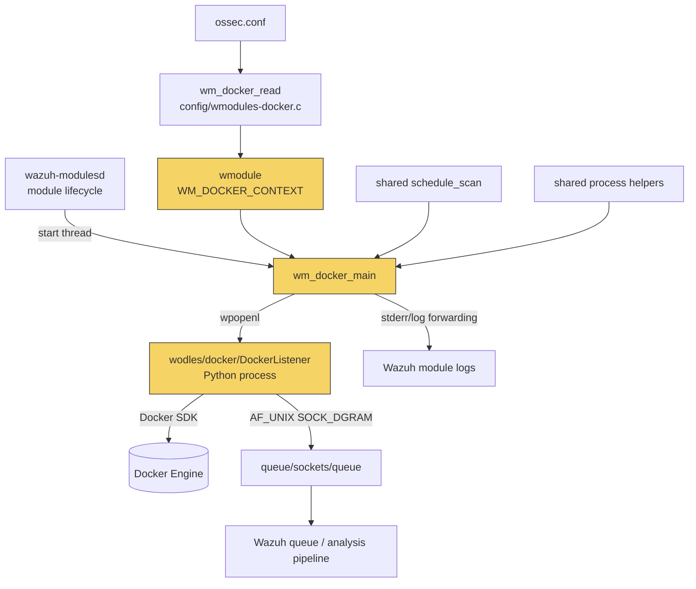
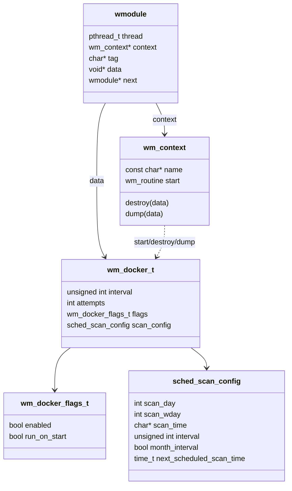

# Docker listener module

The Docker listener module (`wm_docker`) integrates Docker Engine events with Wazuh. It is a Unix-only `wazuh-modulesd` plugin that supervises the installed `DockerListener` Python process. The C module owns configuration, scheduling, child-process tracking, retry limits, and shutdown cleanup; the Python listener owns Docker API connectivity, event conversion, and delivery to the Wazuh local queue.

This document focuses on Docker-specific behavior. The common `wm_context` contract and daemon thread orchestration are documented in [wazuh_modules_core_lifecycle.md](wazuh_modules_core_lifecycle.md), while the shared process-integration pattern is covered in [wazuh_modules_core_system_management_process_integrations.md](wazuh_modules_core_system_management_process_integrations.md).

## Position in Wazuh

The module is registered as the `docker-listener` context within `wazuh-modulesd`. It runs alongside other system-management integrations, but it does not query Wazuh DB or the API directly. Its output enters the normal local queue and is subsequently handled by the Wazuh analysis pipeline.



## Responsibilities and boundaries

| Component | Responsibility |
|---|---|
| `src/config/wmodules-docker.c` | Creates and validates `wm_docker_t`, assigns the `docker-listener` context, and delegates schedule tags to the shared scheduler. |
| `src/wazuh_modules/wm_docker.h` | Defines the module name, listener path, flags, and configuration structure. |
| `src/wazuh_modules/wm_docker.c` | Starts the scheduled supervisor loop, launches the listener, tracks the child, handles exit codes, dumps configuration, and frees module data. |
| `wodles/docker-listener/DockerListener.py` | Connects to Docker, consumes the Docker event stream, wraps events as Wazuh integration JSON, and sends them to the local Unix queue. |
| `src/unit_tests/wazuh_modules/docker/test_wm_docker.c` | Verifies configuration parsing, schedule normalization, unknown-tag rejection, and the execution/retry loop with mocked process and time functions. |

The C layer is deliberately not a Docker client. It only launches `wodles/docker/DockerListener`; this path is installed from `DockerListener.py` by the packaging scripts. The listener is unavailable on Windows and the C implementation is compiled out under `WIN32`.

## Configuration model

The configuration parser recognizes the following module:

```xml
<wodle name="docker-listener">
  <interval>10m</interval>
  <attempts>5</attempts>
  <run_on_start>no</run_on_start>
  <disabled>no</disabled>
</wodle>
```

`wm_docker_read()` initializes defaults before parsing:

| Field | Default / meaning |
|---|---|
| `enabled` | Enabled by default; `<disabled>yes</disabled>` disables the thread at startup. |
| `run_on_start` | Disabled by default; when enabled, the first listener launch bypasses the initial wait. |
| `attempts` | `5`; positive integer and less than `INT_MAX`. It limits unexpected listener terminations. |
| `interval` | 60 seconds at the Docker-specific level; schedule parsing can normalize configured units. |
| `scan_config` | Initialized by `sched_scan_init()` and populated from `<interval>`, `<time>`, `<day>`, and `<wday>`. |

Only `attempts`, `run_on_start`, `disabled`, and shared scheduling tags are accepted. An unknown tag causes an error such as `No such tag 'extra-tag' at module 'docker-listener'.` Invalid boolean values and invalid attempt counts also reject the configuration.

Scheduling semantics are shared across Wazuh modules; see [shared_lib_system_utils_config_scheduling.md](shared_lib_system_utils_config_scheduling.md). Docker-specific tests demonstrate these normalized modes:

| Input | Result asserted by tests |
|---|---|
| `<interval>1d</interval>` | One-day default interval, no day/week/month selector. |
| `<time>17:20</time>` | Daily schedule; interval is normalized to the default day interval. |
| `<wday>Thursday</wday><time>18:55</time>` | Thursday schedule; interval normalized to one week and `scan_wday = 4`. |
| `<day>10</day><time>19:55</time>` | Monthly schedule on day 10; interval normalized to one month and `month_interval = true`. |

The module dump serializes the active schedule plus `disabled`, `run_on_start`, and `attempts` under the `docker-listener` JSON key. This makes the effective configuration observable through the generic module configuration facilities.

## Component architecture



`WM_DOCKER_CONTEXT` exposes `wm_docker_main` as `start`, `wm_docker_destroy` as `destroy`, and `wm_docker_dump` as `dump`. `sync`, `stop`, and `query` are not provided. The module stores a process-wide static configuration pointer for the setup/check/cleanup path; the active configuration object itself is freed by `wm_docker_destroy()`.

## Runtime data flow

```mermaid
sequenceDiagram
    participant D as wazuh-modulesd
    participant C as wm_docker_main
    participant S as schedule_scan
    participant P as DockerListener
    participant E as Docker Engine
    participant Q as Wazuh Unix queue
    participant A as Analysis pipeline

    D->>C: start(WM_DOCKER_CONTEXT)
    C->>C: wm_docker_setup() / wm_docker_check()
    loop until fatal error or attempts exhausted
        C->>S: sched_scan_get_time_until_next_scan()
        alt delay required
            S-->>C: next scan time
            C->>C: w_sleep_until(next scan)
        end
        C->>P: wpopenl("wodles/docker/DockerListener")
        P->>E: docker.from_env(); ping(); events()
        E-->>P: Docker event bytes
        P->>P: format as {integration:"docker", docker:event}
        P->>Q: "1:Wazuh-Docker:" + JSON datagram
        Q->>A: normal Wazuh event processing
        P-->>C: stderr lines through child pipe
        C->>C: log child lines as module errors
        P-->>C: process termination
        C->>C: wpclose() and inspect exit code
    end
```

### Listener delivery contract

`DockerListener` derives the Wazuh installation path and connects to `queue/sockets/queue` using an AF_UNIX datagram socket. Each event is wrapped as:

```json
{
  "integration": "docker",
  "docker": { "action": "...", "Actor": {}, "Type": "..." }
}
```

The serialized payload is prefixed with `1:Wazuh-Docker:` before it is sent. Listener status messages such as startup, connection, disconnection, and Docker-service availability use the same integration envelope. Events larger than `MAX_EVENT_SIZE` produce a warning; socket failures terminate the listener with a nonzero status so the C supervisor can apply its retry policy.

## Supervisor process flow

```mermaid
flowchart TD
    START([module thread starts]) --> SETUP[wm_docker_setup]
    SETUP --> ENABLED{enabled?}
    ENABLED -->|no| DISABLE[log disabled and pthread_exit]
    ENABLED -->|yes| SLEEP[sched_scan_get_time_until_next_scan]
    SLEEP --> WAIT{time to wait?}
    WAIT -->|yes| SLEEPUNTIL[w_sleep_until(next scan)]
    WAIT -->|no| LAUNCH[wpopenl listener]
    SLEEPUNTIL --> LAUNCH
    LAUNCH --> CREATED{child created?}
    CREATED -->|no| FATAL[log internal launch error; exit thread]
    CREATED -->|yes| TRACK[append child SID / handle]
    TRACK --> READ[read child output with fgets]
    READ --> EXIT[wpclose and WEXITSTATUS]
    EXIT --> CODE{exit code}
    CODE -->|127| BADPATH[log missing/unlaunchable listener; exit]
    CODE -->|other| COUNT[increment attempts]
    COUNT --> LIMIT{attempts >= configured limit?}
    LIMIT -->|yes| GIVEUP[log maximum attempts; exit]
    LIMIT -->|no| RETRY[warn and retry at next schedule]
    RETRY --> SLEEP
```

Important behavior:

1. `run_on_start` affects the first scheduling decision only; subsequent launches use the configured schedule.
2. `wpopenl()` starts the listener with stderr bound to the module's readable stream. The C loop logs each line; Docker event delivery itself happens through the listener's Unix socket.
3. The child PID/session is registered with the shared process manager and removed after termination, allowing daemon shutdown handling to clean up descendants.
4. Exit status `127` is treated as a launch/path failure and is fatal. Other exit codes are retried until `attempts` is reached.
5. A disabled module exits during setup without launching a child. An `atexit()` callback logs the module-finished message.

## Testing and verification

The unit test file `src/unit_tests/wazuh_modules/docker/test_wm_docker.c` uses CMocka and shared wrappers. It covers:

- default module setup and teardown;
- interval execution with mocked `wpopenl`, `wpclose`, `fgets`, and `FOREVER`;
- rejection of an unknown XML tag;
- daily, weekly, and monthly schedule normalization;
- cleanup of schedule strings and module allocations.

The tests intentionally isolate scheduler and supervisor behavior from the real Docker daemon. They do not validate Docker SDK behavior or live event delivery; those responsibilities belong to [DockerListener.py](https://github.com/wazuh/wazuh/blob/master/wodles/docker-listener/DockerListener.py) and require an integration environment with Docker and the Python `docker` package.

## Operational considerations

- The listener requires access to the Docker Engine endpoint recognized by `docker.from_env()` and permission to read Docker events.
- The Python `docker` package must be installed; otherwise the listener writes an error to stderr and exits, normally causing the C module to retry until its attempt limit.
- The module is not compiled for Windows. The listener also explicitly exits on Windows.
- Review module logs under the `wazuh-modulesd:docker-listener` tag when diagnosing launch failures, missing Docker connectivity, repeated restarts, or oversized events.
- For shared scheduling, process tracking, and queue primitives, consult [wazuh_modules_core_system_management_process_integrations.md](wazuh_modules_core_system_management_process_integrations.md), [shared_lib_system_utils_config_scheduling.md](shared_lib_system_utils_config_scheduling.md), and [shared_lib_networking.md](shared_lib_networking.md).

## Related documentation

- [wazuh_modules_core_system_management.md](wazuh_modules_core_system_management.md) — parent system-management module and sibling integrations.
- [wazuh_modules_core_system_management_process_integrations.md](wazuh_modules_core_system_management_process_integrations.md) — shared command, Docker, and osquery process-integration architecture.
- [wazuh_modules_core_lifecycle.md](wazuh_modules_core_lifecycle.md) — `wazuh-modulesd` lifecycle and `wm_context` dispatch.
- [shared_lib_system_utils_config_scheduling.md](shared_lib_system_utils_config_scheduling.md) — canonical schedule parser and next-run calculation.
- [shared_lib_networking.md](shared_lib_networking.md) — shared socket and queue-facing communication primitives.
