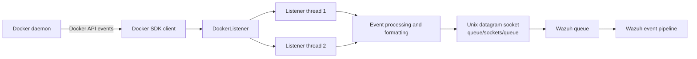
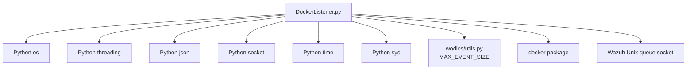
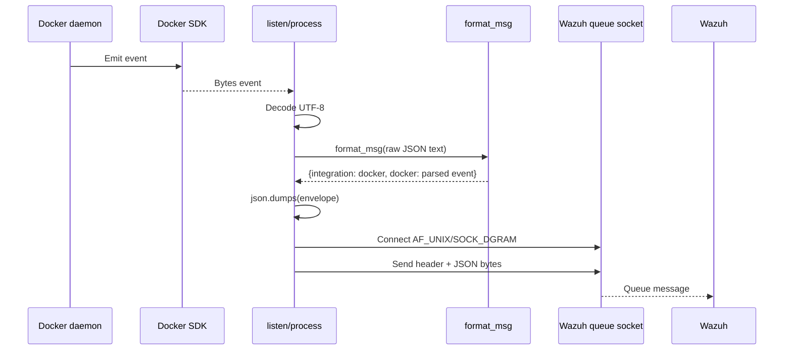
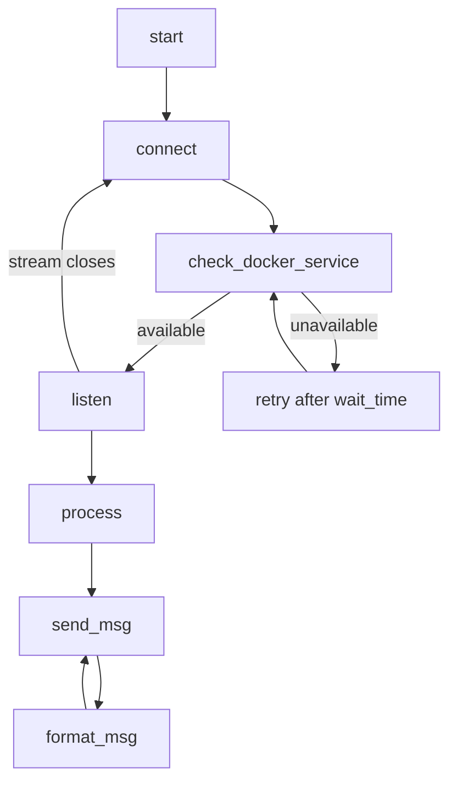

# Docker listener

The Docker listener is a Linux-only Python wodle that streams events from the Docker daemon and injects them into Wazuh’s local event queue. It wraps each event as a Docker integration event, prefixes it with the Wazuh queue protocol header, and sends it through a Unix datagram socket. It also reports startup, connection, and disconnection state as regular Wazuh events.

The implementation is centered on `wodles/docker-listener/DockerListener.py::DockerListener`. Native Wazuh queue behavior is outside this module; see [shared_lib.md](shared_lib.md) for the shared communication and utility layer.

## Purpose and scope

The listener provides a bridge between:

- Docker’s event stream, obtained through the Docker SDK for Python.
- Wazuh’s local queue socket, located at `<WAZUH_HOME>/queue/sockets/queue`.
- Wazuh event processing, which receives events under the `integration: docker` envelope.

It does not parse or enrich individual Docker event fields. Docker supplies the event payload; the listener decodes it from bytes and serializes it into the Wazuh integration format.

## Architecture



### Component responsibilities

| Component | Responsibility |
| --- | --- |
| `DockerListener` | Owns configuration, Docker client state, worker threads, reconnection, formatting, and queue delivery. |
| `docker.from_env()` | Creates a client from the host Docker environment. |
| `client.ping()` | Verifies that the Docker service is reachable. |
| `client.events()` | Provides the long-lived Docker event iterator. |
| `utils.MAX_EVENT_SIZE` | Defines the maximum event size used for a warning check. |
| Unix datagram socket | Transfers the encoded event to the Wazuh queue. |
| Wazuh queue | Accepts the `1:Wazuh-Docker:`-prefixed payload for downstream processing. |

## Dependencies



The external Python dependency is the `docker` package. If it cannot be imported, the process writes an installation message to standard error and exits immediately. The listener also exits during construction on Windows because this wodle is explicitly unsupported there.

## Runtime state

`DockerListener` initializes the following state:

- `wait_time = 5`: seconds between Docker availability checks.
- `field_debug_name = "Wodle event"`: field used for lifecycle messages.
- `wazuh_path`: calculated Wazuh installation root.
- `wazuh_queue`: `<wazuh_path>/queue/sockets/queue`.
- `msg_header = "1:Wazuh-Docker:"`: transport header prepended to every queue message.
- `client`: current Docker SDK client, initially `None`.
- `thread1` and `thread2`: worker references used by reconnect logic.

The two thread slots allow a replacement listener to be started while the other thread reference is still being inspected. In normal operation the initial start launches one worker; the second slot is used when reconnecting after a worker terminates.

## Lifecycle and process flow

```mermaid
flowchart TD
    S[Process starts] --> I[DockerListener.__init__]
    I --> OSCHK{Running on Windows?}
    OSCHK -->|Yes| X1[Write error and exit]
    OSCHK -->|No| ST[start]
    ST --> MSG1[Send Started event]
    MSG1 --> THREADS[Create two thread objects]
    THREADS --> CONN[connect(first_time=True)]
    CONN --> CHECK[check_docker_service]
    CHECK -->|Success| RUN[Start listener thread]
    CHECK -->|Failure| WAIT[Log state, sleep 5 seconds]
    WAIT --> CHECK
    RUN --> STREAM[listen]
    STREAM --> EVENTS[Iterate client.events]
    EVENTS --> PROC[process each event]
    PROC --> SEND[send_msg]
    STREAM -->|Iterator ends or raises| DISC[Send disconnected event]
    DISC --> RECON[connect]
    RECON --> CHECK
```

### Startup

`start()` first sends a lifecycle event with the value `Started`, creates two `threading.Thread` objects targeting `listen`, and calls `connect(first_time=True)`. The first connection attempt is synchronous from the caller’s perspective, but the actual event stream runs in `thread1`.

### Docker availability and reconnection

`check_docker_service()` creates a client with `docker.from_env()` and calls `ping()`. Any exception is treated as unavailable. On the first failure, the listener reports that Docker is not running, then repeatedly waits five seconds and checks again. Once available, it starts a listener thread and reports `Connected to Docker service`.

When `listen()` stops receiving events, it reports `Disconnected from the Docker service` and invokes `connect()` again. Reconnection therefore preserves the long-running behavior across Docker daemon restarts or broken event streams.

## Event data flow



The transformation is:

```text
Docker bytes
  -> UTF-8 text
  -> json.loads(text)
  -> {"integration": "docker", "docker": <parsed object>}
  -> json.dumps(envelope)
  -> "1:Wazuh-Docker:" + encoded envelope
```

Lifecycle messages use the same path. For example, the logical payload for a connection message is equivalent to:

```json
{
  "integration": "docker",
  "docker": {"Wodle event": "Connected to Docker service"}
}
```

## Component interaction



The key interaction is intentionally one-way for event delivery: Docker events enter `process()`, are passed to `send_msg()`, and are not acknowledged by this module. Delivery success is represented by the socket send completing without an exception.

## Queue delivery and error behavior

`send_msg()` performs these operations for every message:

1. Wrap the supplied JSON string with `format_msg()`.
2. Serialize the wrapper with `json.dumps()`.
3. Print the serialized event to standard output.
4. Open an AF_UNIX datagram socket and connect to the Wazuh queue path.
5. Prefix the serialized bytes with `1:Wazuh-Docker:`.
6. Warn on standard error if the encoded payload exceeds `MAX_EVENT_SIZE`.
7. Send the datagram and close the socket.

Oversized events are warned about but are still sent. Socket failures are fatal:

- Error number `111` writes `Wazuh must be running.` and exits with status `11`.
- Other socket errors and all other exceptions write an error and exit with status `13`.

This means a missing or unavailable Wazuh queue does not enter the Docker retry loop; it terminates the listener and leaves process supervision to the surrounding Wazuh service.

## Operational considerations

- The Docker SDK must be installed in the Python environment used to launch the wodle.
- The process must run on a Unix-like host; Windows is rejected explicitly.
- The Wazuh queue socket must exist and be reachable by the listener process.
- Docker API access is inherited from `docker.from_env()`, so the runtime needs the appropriate Docker socket or environment configuration.
- Docker event JSON must be valid because `format_msg()` calls `json.loads()` without a recovery path.
- A Docker daemon outage is recoverable through five-second polling; a malformed event or queue delivery failure is not handled locally.
- Each event creates and closes a Unix socket, which keeps socket lifetime simple but adds per-event connection overhead.

## Testing and maintenance notes

The module tree identifies Docker wodle tests under `src/unit_tests/wazuh_modules/docker/test_wm_docker.c`. Those tests exercise the common wodle scheduling and lifecycle contract. The Python listener itself is responsible for Docker SDK interaction, event conversion, reconnection, and queue transport; changes to those behaviors should be tested independently with mocked Docker clients and Unix sockets.

When modifying this module, preserve these integration contracts:

- The envelope keys remain `integration` and `docker`.
- The queue header remains `1:Wazuh-Docker:` unless the receiving queue protocol changes with it.
- Lifecycle messages continue through `send_msg()` so they have the same routing and formatting as Docker events.
- Reconnection must not create uncontrolled worker-thread growth.

## Reference implementation

- `wodles/docker-listener/DockerListener.py`: `DockerListener`, including startup, Docker health checks, event streaming, formatting, and queue delivery.
- [shared_lib.md](shared_lib.md): shared Wazuh communication and utility concepts used by the broader system.
