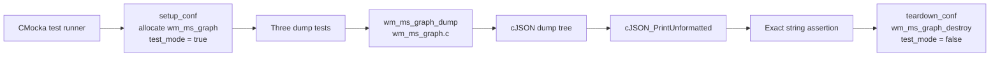
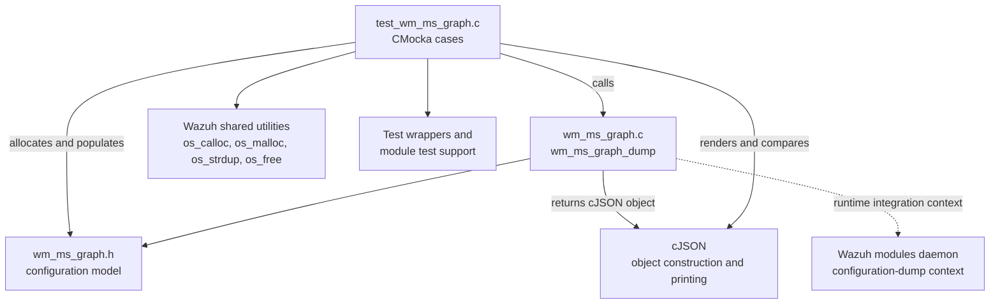
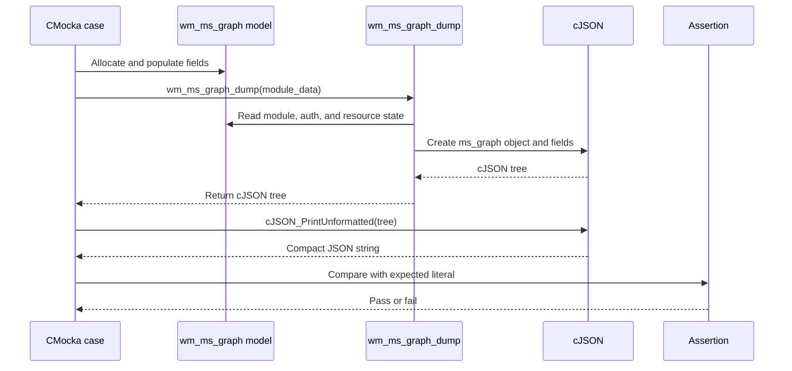
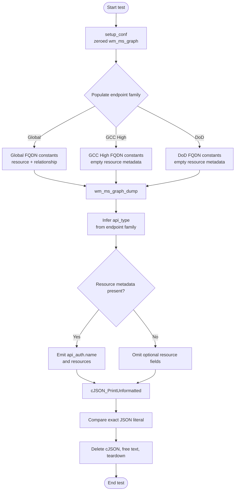

# `dump_tests`

The `dump_tests` module verifies the JSON serialization produced by
`wm_ms_graph_dump()` for the Microsoft Graph Wazuh module. It exercises the
configuration-dump path with the three supported API environments—Global,
GCC High, and DoD—and checks both the serialized values and the presence or
absence of optional fields.

This document focuses on the three dump tests in
`src/unit_tests/wazuh_modules/ms_graph/test_wm_ms_graph.c`. Broader module
startup, token, pagination, relationship-scan, and queue behavior belongs to
the surrounding Microsoft Graph test suite. Shared CMocka setup conventions
are described in [`wm_ms_graph_tests_test_infrastructure.md`](wm_ms_graph_tests_test_infrastructure.md),
while daemon-level context is covered by
[`Wazuh_Modules_Daemon_(C).md`](Wazuh_Modules_Daemon_(C).md).

## Scope and purpose

The tests protect a compact, human-readable diagnostic representation of the
runtime `wm_ms_graph` configuration. The serializer converts boolean values to
`"yes"`/`"no"`, retains numeric tuning values as JSON numbers, infers the API
type from the configured Microsoft Graph endpoints, and conditionally emits
resource information.

The tests are deliberately isolated from external systems. They do not make
HTTP requests, acquire tokens, scan Microsoft Graph, or send events to a Wazuh
queue. Those behaviors are covered by sibling tests in the same source file.

## Module location and test boundary

| Layer | Component | Responsibility in these tests |
|---|---|---|
| Test | `src/unit_tests/wazuh_modules/ms_graph/test_wm_ms_graph.c` | Allocates representative module state, calls the serializer, and compares exact JSON text. |
| System under test | `src/wazuh_modules/wm_ms_graph.c` | Implements `wm_ms_graph_dump()` and the cleanup routine used by teardown. |
| Model | `src/wazuh_modules/wm_ms_graph.h` | Defines `wm_ms_graph`, authentication state, resources, and relationships. |
| JSON library | `cJSON` | Builds the dump tree and renders it with `cJSON_PrintUnformatted()`. |
| Test framework | CMocka | Registers tests and invokes setup/teardown callbacks. |
| Test utilities | Wazuh shared headers and wrappers | Provide allocation, string, lifecycle, and test-mode support. |



## Architecture and dependencies

The test file directly exercises the production serializer. The test harness
constructs the input model in memory; no configuration file parser is needed
for this scope. The endpoint constants supplied by the production module are
used to select the expected API type.



### Harness lifecycle

The three cases are registered in the `tests_with_startup` CMocka group with
`setup_conf` and `teardown_conf` callbacks:

1. `setup_conf` allocates a zeroed `wm_ms_graph` structure and enables the
   module's test mode.
2. The individual test fills only the fields required for its serialization
   scenario. Nested authentication, resource, and relationship allocations
   are performed explicitly.
3. `wm_ms_graph_dump()` returns a `cJSON` object.
4. `cJSON_PrintUnformatted()` converts that object to the exact string checked
   by the test.
5. The test deletes the cJSON tree and frees the rendered string.
6. `teardown_conf` disables test mode and calls `wm_ms_graph_destroy()`.

This lifecycle makes each case independent and ensures the serializer sees a
fresh zero-initialized model. The tests use direct object construction rather
than the XML/configuration parser, so parser validation is outside their
boundary.

## Serialization data flow

```mermaid
flowchart LR
    Fields[wm_ms_graph fields\nenabled, only_future_events\ncurl_max_size, page_size\ntime_delay, run_on_start\nversion]
    Auth[wm_ms_graph_auth\nclient_id, tenant_id, secret_value\nlogin_fqdn, query_fqdn]
    Resources[wm_ms_graph_resource[]\nname and relationships]
    Dump[wm_ms_graph_dump]
    Tree[cJSON object\nms_graph]
    Text[cJSON_PrintUnformatted\ncompact JSON text]
    Compare[assert_string_equal]

    Fields --> Dump
    Auth --> Dump
    Resources --> Dump
    Dump --> Tree --> Text --> Compare
```

The exact string comparison means the following are part of the tested
contract:

- JSON key names and nesting under the top-level `ms_graph` object.
- Key serialization order as emitted by the current cJSON construction.
- Compact rendering without whitespace.
- Boolean spelling as `yes` or `no`, represented as JSON strings.
- Numeric values such as `curl_max_size`, `page_size`, and `time_delay` as
  JSON numbers.
- Default schedule output of `"wday":"sunday"` for the zero-initialized test
  model.
- API-type inference from the configured endpoint family.
- Conditional omission of empty resource data.

## Component interaction



The serializer is read-only from the test's perspective: the input model is
prepared before invocation and the returned cJSON tree is owned and released
by the test. The test does not assert internal allocation details; it asserts
the externally observable dump representation.

## Test scenarios and expected behavior

| Test | Endpoint family | Input resource state | Expected API type | Expected optional output |
|---|---|---|---|---|
| `test_dump` | Global constants | Resource `security` with relationship `alerts_v2` | `global` | Includes `api_auth.name` as `security` and a `resources` array containing the relationship. |
| `test_dump_gcc_configuration` | GCC High constants | One resource slot whose name is `NULL`; no relationship data | `gcc-high` | Omits `api_auth.name` and omits `resources`. |
| `test_dump_dod_configuration` | DoD constants | Same empty resource shape as GCC High | `dod` | Omits `api_auth.name` and omits `resources`. |

All three cases use the same scalar values except for the enabled flags,
`only_future_events`, `run_on_start`, and endpoint family:

| Field | Global case | GCC High / DoD cases |
|---|---:|---:|
| `enabled` | `"yes"` | `"no"` |
| `only_future_events` | `"no"` | `"yes"` |
| `curl_max_size` | `1024` | `1024` |
| `page_size` | `100` | `100` |
| `time_delay` | `10` | `10` |
| `run_on_start` | `"yes"` | `"no"` |
| `version` | `"v1.0"` | `"v1.0"` |
| `wday` | `"sunday"` | `"sunday"` |

### Global configuration

The populated Global case expects:

```json
{"ms_graph":{"enabled":"yes","only_future_events":"no","curl_max_size":1024,"page_size":100,"time_delay":10,"run_on_start":"yes","version":"v1.0","wday":"sunday","api_auth":{"client_id":"example_string","tenant_id":"example_string","secret_value":"example_string","api_type":"global","name":"security"},"resources":[{"relationship":"alerts_v2"}]}}
```

This case is the positive coverage for resource serialization. It confirms
that a configured resource relationship is represented and that the resource
name is also reflected in the authentication section's `name` field.

### GCC High configuration

The GCC High case expects:

```json
{"ms_graph":{"enabled":"no","only_future_events":"yes","curl_max_size":1024,"page_size":100,"time_delay":10,"run_on_start":"no","version":"v1.0","wday":"sunday","api_auth":{"client_id":"example_string","tenant_id":"example_string","secret_value":"example_string","api_type":"gcc-high"}}}
```

The endpoint constants are the discriminator for `gcc-high`. Because the test
resource has no name and no relationship, the dump contains neither the
authentication `name` field nor a `resources` array.

### DoD configuration

The DoD case expects the same scalar shape as GCC High, with only the inferred
API type changing:

```json
{"ms_graph":{"enabled":"no","only_future_events":"yes","curl_max_size":1024,"page_size":100,"time_delay":10,"run_on_start":"no","version":"v1.0","wday":"sunday","api_auth":{"client_id":"example_string","tenant_id":"example_string","secret_value":"example_string","api_type":"dod"}}}
```

This prevents endpoint-family handling from collapsing DoD into the default or
GCC High representation.

## Process flow and decision points



## Maintenance guidance

When changing `wm_ms_graph_dump()` or the `wm_ms_graph` model, update these
tests when any of the following changes intentionally:

- a field is renamed, added, removed, or moved;
- boolean or numeric formatting changes;
- default schedule values change;
- endpoint constants or API-type inference changes;
- empty resources begin producing output, or populated resources change shape;
- cJSON insertion order changes.

Because the assertions compare full compact strings, even a deliberate field
ordering change requires updating the expected literal. If the intended
contract is semantic JSON equality rather than byte-for-byte compatibility,
the test design should be revisited explicitly; do not weaken the assertion
accidentally while making an unrelated serializer change.

## Related documentation

- [`wm_ms_graph_tests_test_infrastructure.md`](wm_ms_graph_tests_test_infrastructure.md) — shared fixtures, wrappers, and conventions for the Microsoft Graph unit tests.
- [`Wazuh_Modules_Daemon_(C).md`](Wazuh_Modules_Daemon_(C).md) — broader daemon/module lifecycle context.

