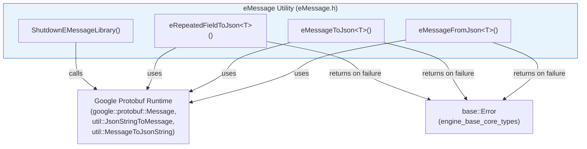
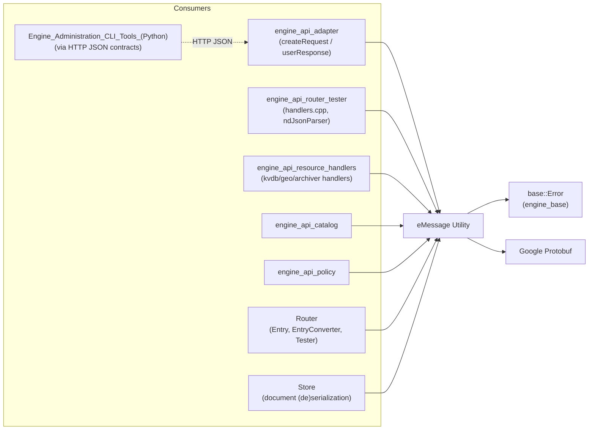
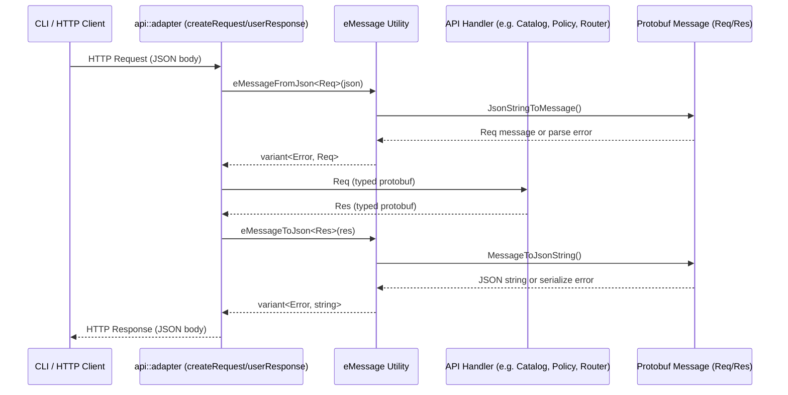
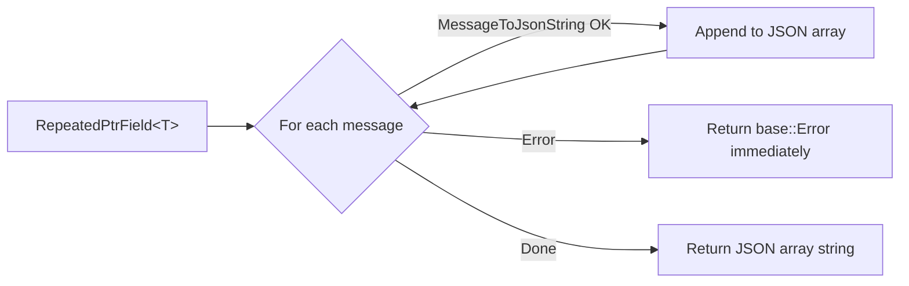
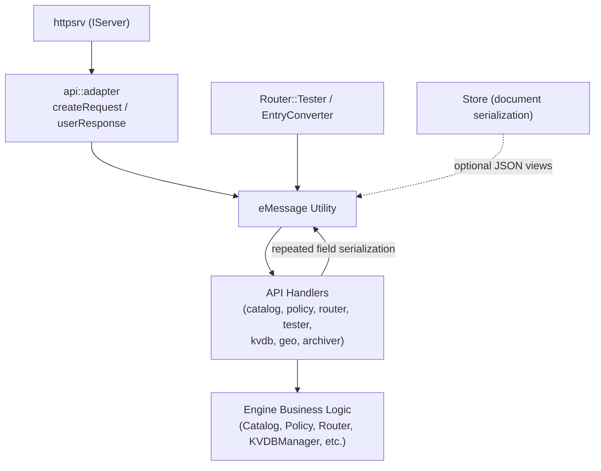
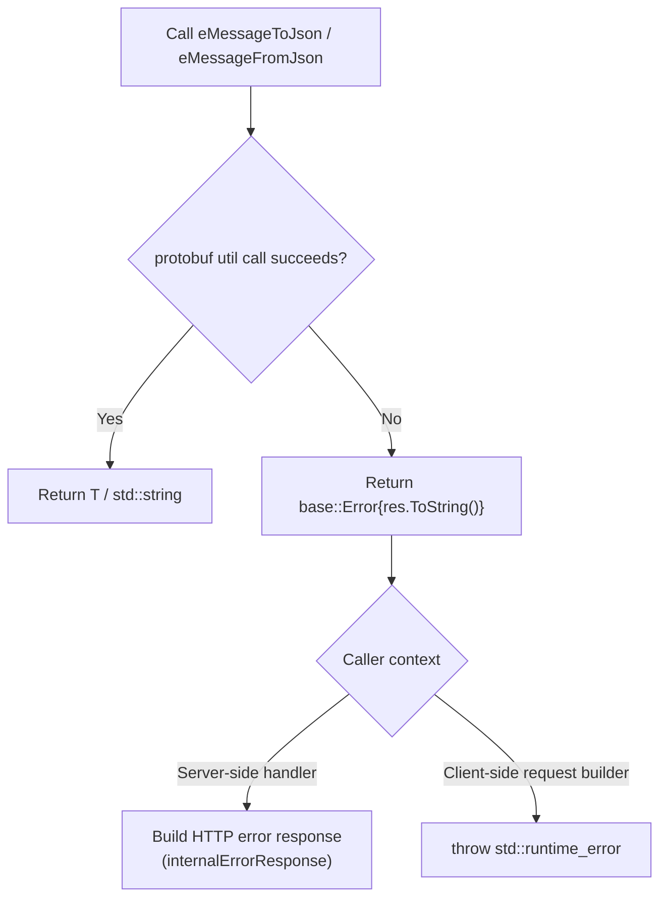

# eMessage Utility

## Introduction

The **eMessage Utility** is a small but foundational C++ header-only library within the [Wazuh Engine Core](Wazuh_Engine_Core_(C++).md). It provides a thin, type-safe bridge between **Google Protocol Buffers (protobuf) messages** and **JSON strings**, which is the wire format used throughout the Wazuh Engine's internal and external APIs (HTTP-based control plane, Router entries, Store documents, and CLI tool responses).

Despite its small size (a single header, `eMessage.h`), this utility is a critical dependency for nearly every component that exposes or consumes a protobuf-defined API contract in the engine, because it standardizes:

1. **Serialization** — converting a protobuf `Message` (or a repeated field of messages) into a JSON string suitable for HTTP responses or storage.
2. **Deserialization** — parsing an incoming JSON payload into a strongly-typed protobuf `Message`, tolerating unknown fields for forward compatibility.
3. **Graceful shutdown** — releasing global protobuf library resources cleanly at process exit.

Because all functions are template-based, compile-time (`static_assert`) checks guarantee that only genuine protobuf-derived types can be passed, preventing misuse at the API boundary.

## Purpose and Core Functionality

| Function | Responsibility |
|---|---|
| `eMessage::eMessageFromJson<T>(json)` | Parses a JSON string into a protobuf message of type `T`. Returns `std::variant<base::Error, T>`. Unknown JSON fields are ignored to support schema evolution. |
| `eMessage::eMessageToJson<T>(message, printPrimitiveFields=true)` | Serializes a single protobuf message into a JSON string. Returns `std::variant<base::Error, std::string>`. |
| `eMessage::eRepeatedFieldToJson<T>(repeatedPtrField, printPrimitiveFields=true)` | Serializes a `google::protobuf::RepeatedPtrField<T>` (i.e., a protobuf `repeated` message field) into a JSON **array** string, handling comma-joining and error propagation for each element. |
| `eMessage::ShutdownEMessageLibrary()` | Wraps `google::protobuf::ShutdownProtobufLibrary()` for a clean, leak-free process shutdown. |

All conversion functions use `google::protobuf::util::JsonParseOptions` / `JsonPrintOptions` with sensible defaults for the Engine's needs:
- **Parsing**: `ignore_unknown_fields = true`, `case_insensitive_enum_parsing = false` — lenient towards additive schema changes, strict about enum casing.
- **Printing**: `preserve_proto_field_names = true` (keeps snake_case field names instead of camelCase), `add_whitespace = false` (compact JSON), `always_print_enums_as_ints = false` (human-readable enum names).

The library relies on the shared error type `base::Error` (from [Wazuh_Engine_Core_(C++)](Wazuh_Engine_Core_(C++).md) → `engine_base` → `engine_base_core_types`) as the uniform failure channel, returned via `std::variant` instead of exceptions — aligning with the Engine's general error-handling convention of avoiding exceptions on the hot path.

## Architecture

The module is a **header-only utility library** with zero internal state; every function is either a free template function or an `inline` function. It has a single external dependency surface: Google Protobuf's runtime (`google/protobuf/message.h`, `google/protobuf/util/json_util.h`) and the Engine's shared `base::Error` type.



## Dependency Relationships

`eMessage.h` sits at a low level of the Engine's dependency graph: it depends only on `base/error.hpp` and the protobuf runtime, but is **depended upon** by nearly every component that speaks JSON-over-HTTP or persists protobuf-defined documents.



See also:
- [Wazuh_Engine_Core_(C++)](Wazuh_Engine_Core_(C++).md) for the parent module and sibling components (`engine_api`, `Router`, `Store`, `engine_base`).
- [Engine_Administration_CLI_Tools_(Python)](Engine_Administration_CLI_Tools_(Python).md) for the Python-side clients (`engine-suite`, `api-communication`) that exchange JSON payloads produced/consumed via this utility on the server side.

## Data Flow: JSON ⇄ Protobuf

The typical data flow through the eMessage utility occurs at the boundary between the Engine's internal protobuf-typed domain objects and the external JSON wire format used by the HTTP API (`engine_api`) and CLI tools.



For collections (e.g., listing catalog assets, router entries), `eRepeatedFieldToJson` is used to convert a `RepeatedPtrField<T>` into a JSON array in a single call, iterating each element and aggregating results with `,` separators while short-circuiting on the first serialization error.



## Component Interaction

Within the broader [Wazuh_Engine_Core_(C++)](Wazuh_Engine_Core_(C++).md) module, `eMessage` is invoked primarily by the **adapter layer** (`engine_api_adapter`) that translates HTTP requests/responses to/from protobuf, and by handler implementations in `engine_api_resource_handlers`, `engine_api_catalog`, `engine_api_policy`, and `engine_api_router_tester` that need ad-hoc JSON conversion for logging, tracing, or ND-JSON event ingestion.



## Error Handling Model

All functions return a `std::variant<base::Error, T>` (or `std::variant<base::Error, std::string>`), never throwing exceptions for expected failure modes (malformed JSON, schema mismatch, protobuf serialization failure). The only exception path is in `createRequest()` (in the `engine_api_adapter` component, a *consumer* of this utility), which converts a `base::Error` from `eMessageToJson` into a thrown `std::runtime_error` — a deliberate design choice for client-side request construction where failure indicates a programming error rather than a runtime condition.



## Usage Patterns

### 1. Building an outbound HTTP request (client side)

Consumers such as `api::adapter::createRequest` (in `engine_api_adapter`) wrap `eMessageToJson` to build an `httplib::Request`:

```cpp
inline httplib::Request createRequest(const Req& req)
{
    static_assert(std::is_base_of_v<google::protobuf::Message, Req>, "Request must be a protobuf message");
    const auto result = eMessage::eMessageToJson<Req>(req);
    if (std::holds_alternative<base::Error>(result))
    {
        throw std::runtime_error{
            fmt::format("Failed to serialize request: {}", std::get<base::Error>(result).message)};
    }

    httplib::Request request;
    request.body = std::get<std::string>(result);
    request.set_header("Content-Type", "plain/text");
    return request;
}
```

### 2. Building an HTTP response (server side)

Similarly, `api::adapter::userResponse` wraps `eMessageToJson` to build an `httplib::Response`, converting a serialization failure into an internal-error HTTP response instead of throwing:

```cpp
httplib::Response userResponse(const Res& res)
{
    static_assert(std::is_base_of_v<google::protobuf::Message, Res>, "Response must be a protobuf message");
    const auto result = eMessage::eMessageToJson<Res>(res);

    if (std::holds_alternative<base::Error>(result))
    {
        const auto& error = std::get<base::Error>(result);
        return internalErrorResponse<Res>(error.message);
    }

    httplib::Response response;
    response.status = httplib::StatusCode::OK_200;
    response.set_content(std::get<std::string>(result), "plain/text");
    return response;
}
```

### 3. Parsing an inbound JSON payload

```cpp
auto result = eMessage::eMessageFromJson<MyProtoRequest>(rawJsonBody);
if (std::holds_alternative<base::Error>(result)) {
    // handle parse error, e.g. return HTTP 400
}
auto& request = std::get<MyProtoRequest>(result);
```

### 4. Serializing a response with a repeated field (e.g., a list endpoint)

```cpp
auto jsonArray = eMessage::eRepeatedFieldToJson(response.items());
if (std::holds_alternative<base::Error>(jsonArray)) {
    // handle serialization error
}
```

### 5. Clean shutdown

```cpp
// At the very end of main(), after all protobuf usage has ceased:
eMessage::ShutdownEMessageLibrary();
```

## Design Rationale

- **Header-only / templated**: avoids per-message-type boilerplate; any protobuf `Message` subtype automatically gains JSON conversion capability without additional generated code.
- **`static_assert` type guards**: enforce at compile time that only protobuf `Message`-derived types are used, catching integration mistakes early.
- **Lenient parsing, strict printing**: `ignore_unknown_fields = true` allows the Engine to tolerate newer client schemas without breaking older servers (and vice versa), while `preserve_proto_field_names` keeps API JSON stable and predictable (snake_case) regardless of internal protobuf naming conventions.
- **No exceptions in the core API**: keeps the utility usable in performance-sensitive paths (e.g., Router's per-event or per-request handling) without exception-related overhead; callers decide how to escalate failures.

## Related Modules

- [Wazuh_Engine_Core_(C++)](Wazuh_Engine_Core_(C++).md) — parent module; see `engine_api` (adapter, catalog, policy, router/tester, resource handlers) for the primary consumers of this utility, and `engine_base` for the shared `base::Error` type.
- [Engine_Administration_CLI_Tools_(Python)](Engine_Administration_CLI_Tools_(Python).md) — Python CLI tools (`engine-suite`, `api-communication`) that communicate with the Engine's HTTP API using the JSON contracts produced/consumed via this utility.
- `Router` and `Store` (siblings under Wazuh_Engine_Core_(C++)) — use protobuf-defined types (e.g., `router::Entry`, `router::types::Options`) whose JSON views can be produced through this utility for tracing, API responses, and persistence.
