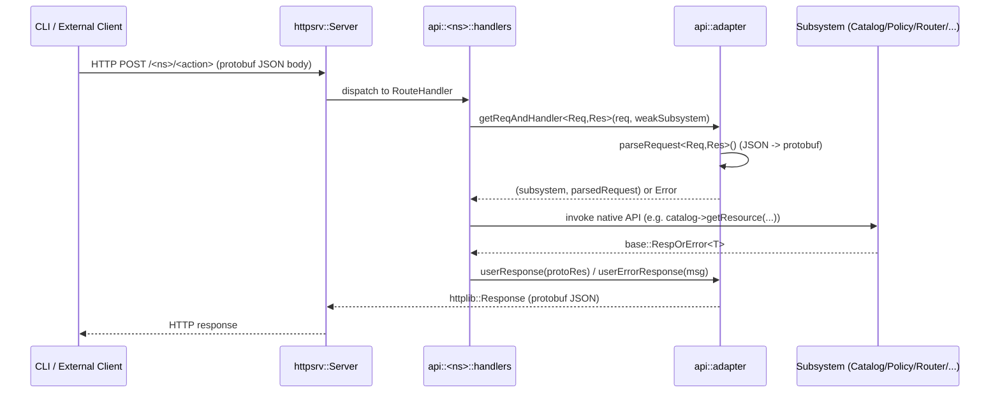

# Engine API Module

## 1. Introduction and Purpose

The **Engine API** module is the HTTP-facing control plane of the Wazuh **Engine** (`src/engine`), the high-performance C++ event-processing core that replaces/complements the classic analysisd pipeline. While the [Wazuh Engine Core](Wazuh_Engine_Core_(C++).md) is responsible for actually building and running decoding/rule pipelines, the Engine API module is the thin adapter layer that:

- Exposes the Engine's internal subsystems (Catalog, Policy, Router, Tester, KVDB, Geo, Archiver, Event ingestion) as a set of **HTTP/protobuf routes** served over a local Unix socket via the embedded [`httpsrv`](engine_httpsrv.md) server.
- Translates between **protobuf request/response messages** (defined in `eMessages/*.proto`, compiled via the [eMessage Utility](eMessage_Utility.md)) and the **native C++ interfaces** of each subsystem (`ICatalog`, `IPolicy`, `IRouterAPI`, `ITesterAPI`, `IKVDBManager`, `IManager` (geo), `IArchiver`).
- Provides consistent error handling, request parsing and response building so that every route handler follows the same conventions.

This module is consumed exclusively by the [engine_main](engine_main.md) executable, which wires together the various managers (`Catalog`, `Policy`, `KVDBManager`, `geo::Manager`, `router::Orchestrator`, `archiver::Archiver`) and registers all HTTP routes through `registerHandlers()` calls exposed by each API sub-namespace. End users interact with these routes indirectly through the [Engine Administration CLI Tools](Engine_Administration_CLI_Tools_(Python).md) (`engine-suite` Python tools: `engine_catalog`, `engine_kvdb`, `engine_policy`, `engine_router`, `engine_test`, `engine_geo`, `engine_archiver`), which call this API over HTTP using the shared `api_communication` client.

## 2. Architecture Overview

The module follows a **Handler-per-Resource** pattern: for every Engine subsystem there is a dedicated C++ namespace (`api::catalog`, `api::policy`, `api::router`, `api::tester`, `api::kvdb`, `api::geo`, `api::archiver`) containing a `handlers.hpp/cpp` pair that:

1. Declares one `adapter::RouteHandler` factory function per HTTP endpoint.
2. Provides a `registerHandlers(...)` inline function that mounts all its routes onto a shared `httpsrv::Server` instance.

All of these handler factories are built on top of the common **`api::adapter`** utilities, which standardize protobuf (de)serialization, error propagation and HTTP response construction.

```mermaid
graph TB
    subgraph "Engine Process (engine_main)"
        MAIN[engine_main] --> SRV[httpsrv::Server]
        MAIN --> CAT[Catalog]
        MAIN --> POL[Policy]
        MAIN --> RTR[router::Orchestrator]
        MAIN --> KVM[KVDBManager]
        MAIN --> GEOM[geo::Manager]
        MAIN --> ARCH[archiver::Archiver]

        SRV --> CATH[catalog::handlers]
        SRV --> POLH[policy::handlers]
        SRV --> RTRH[router::handlers]
        SRV --> TSTH[tester::handlers]
        SRV --> KVDH[kvdb::handlers]
        SRV --> GEOH[geo::handlers]
        SRV --> ARCH_H[archiver::handlers]

        CATH -.uses.-> CAT
        POLH -.uses.-> POL
        RTRH -.uses.-> RTR
        TSTH -.uses.-> RTR
        KVDH -.uses.-> KVM
        GEOH -.uses.-> GEOM
        ARCH_H -.uses.-> ARCH

        CATH --> ADAPT[api::adapter]
        POLH --> ADAPT
        RTRH --> ADAPT
        TSTH --> ADAPT
        KVDH --> ADAPT
        GEOH --> ADAPT
        ARCH_H --> ADAPT

        TSTH --> NDJ[event::ndJsonParser]
    end

    CLI[Engine Administration CLI Tools\n(engine-suite Python)] -- HTTP/protobuf --> SRV
```

### Request Lifecycle



## 3. Sub-modules

The Engine API core components are organized into the following documented sub-modules:

| Sub-module | Description | Doc |
|---|---|---|
| **Adapter** | Common request/response adapter utilities (protobuf⇄JSON, error handling) shared by every handler namespace. | [engine_api_adapter.md](engine_api_adapter.md) |
| **Catalog API** | HTTP handlers and the `Catalog` façade for CRUD/validation over Assets, Decoders, Rules, Outputs, Schemas and Namespaces. | [engine_api_catalog.md](engine_api_catalog.md) |
| **Policy API** | HTTP handlers and the `Policy`/`PolicyRep` implementation for managing policies: assets, default parents, namespaces, hashing. | [engine_api_policy.md](engine_api_policy.md) |
| **Router & Tester API** | HTTP handlers for the production `Router` (route CRUD, EPS limiting) and the `Tester` (ephemeral test sessions, event injection/tracing), plus the NDJSON event-batch parser used by the ingest/test endpoints. | [engine_api_router_tester.md](engine_api_router_tester.md) |
| **Resource Handlers (KVDB, Geo, Archiver)** | HTTP handlers exposing the KVDB manager, the GeoIP database manager and the Archiver toggle/status endpoints. | [engine_api_resource_handlers.md](engine_api_resource_handlers.md) |

## 4. Relationship to Other Modules

- **[Wazuh Engine Core (C++)](Wazuh_Engine_Core_(C++).md)** — parent module tree; the Engine API is one of its children and depends on nearly all of its siblings:
  - **[engine_builder](engine_builder.md)** provides `IValidator`, consumed by `Catalog` and `Policy` to validate assets/policies.
  - **[Store](Store.md)** provides `IStore`/`IStoreReader`, the persistence backend queried/mutated by `Catalog` and `Policy`.
  - **[Router](Router.md)** provides `IRouterAPI` and `ITesterAPI`, the interfaces implemented by the production `router::Orchestrator` and exposed here as HTTP routes.
  - **[engine_kvdb](engine_kvdb.md)** provides `IKVDBManager`, wrapped by `api::kvdb::handlers`.
  - **[engine_geo](engine_geo.md)** provides `IManager` (`geo::IManager`), wrapped by `api::geo::handlers`.
  - **[engine_httpsrv](engine_httpsrv.md)** supplies the `httpsrv::Server`/`IServer` abstraction that all `registerHandlers()` functions attach routes to.
  - **[eMessage Utility](eMessage_Utility.md)** supplies `eMessage::eMessageToJson`/`eMessageFromJson`, used pervasively by `api::adapter` to convert between protobuf messages and the JSON wire format.
  - **[engine_base](engine_base.md)** supplies shared primitives (`base::Name`, `base::Error`, `base::RespOrError`, event types) used throughout.
- **[engine_main](engine_main.md)** is the sole consumer that instantiates every subsystem and calls each namespace's `registerHandlers()` to build the final HTTP route table served by the engine daemon.
- **[Engine Administration CLI Tools (Python)](Engine_Administration_CLI_Tools_(Python).md)** — the external client side of this API. Tools such as `engine_catalog`, `engine_policy`, `engine_router`, `engine_test`, `engine_kvdb`, `engine_geo`, and `engine_archiver` issue HTTP requests (via `api-communication`'s `APIClient`) that are handled by the routes documented here.
