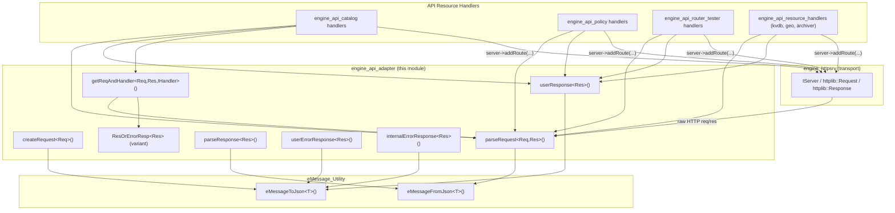
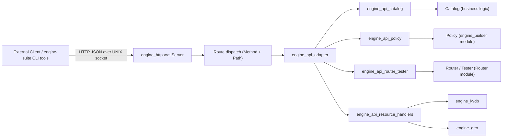
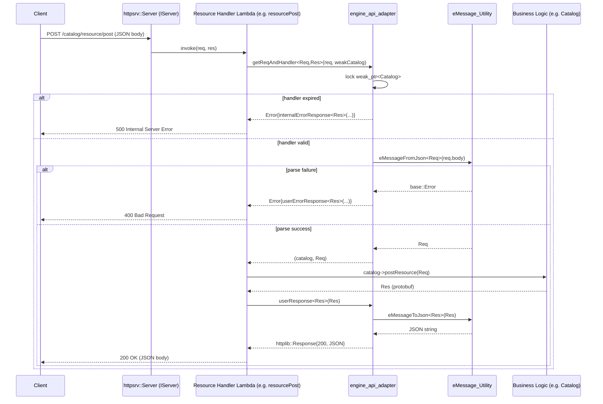
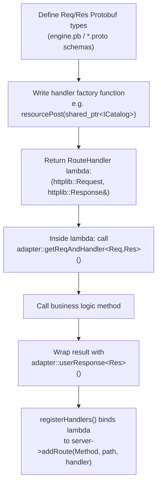

# Engine API Adapter

## Introduction

The **engine_api_adapter** module is a small but foundational C++ header-only library located at
`src/engine/source/api/adapter/include/api/adapter/adapter.hpp`. It provides the **glue layer** between the
Wazuh Engine's internal Protobuf-based API messages (`com::wazuh::api::engine::*`) and the HTTP transport layer
implemented by [engine_httpsrv](engine_httpsrv.md) (`httplib::Request` / `httplib::Response`).

Every HTTP endpoint exposed by the engine (catalog, policy, router, tester, kvdb, geo, archiver, etc.) uses this
adapter to:

1. **Deserialize** incoming HTTP request bodies (JSON) into strongly-typed Protobuf request messages.
2. **Invoke** the appropriate business-logic handler with the parsed request.
3. **Serialize** the resulting Protobuf response message back into an HTTP response (JSON body + status code).
4. **Normalize error handling** so that parsing errors, handler/business errors, and internal serialization
   failures are all converted into consistent HTTP responses (`400 Bad Request` or `500 Internal Server Error`).

Because this module is header-only and template-based, it introduces **no runtime dependency** of its own; instead
it is compiled directly into every API sub-module that needs to expose HTTP endpoints backed by Protobuf messages.

---

## Purpose and Core Functionality

The adapter solves a recurring problem: every API handler needs to go through the same
"HTTP request → Protobuf request → business logic → Protobuf response → HTTP response" pipeline. Rather than
duplicating this boilerplate in each handler (catalog, policy, router, tester, kvdb, geo, archiver — see
[engine_api](engine_api.md)), the adapter centralizes it as a set of reusable, type-safe templates.

### Key responsibilities

| Responsibility | Function(s) |
|---|---|
| Convert a Protobuf response into an `httplib::Response` (JSON, status 200) | `userResponse<Res>()` |
| Convert a Protobuf request into an `httplib::Request` (JSON body) — mainly used for internal/test clients | `createRequest<Req>()` |
| Parse an incoming `httplib::Request` body into a Protobuf request, or return a structured error | `parseRequest<Req, Res>()` |
| Parse an `httplib::Response` body back into a Protobuf response (client-side use) | `parseResponse<Res>()` |
| Build a `400 Bad Request` response carrying a Protobuf-encoded error message | `userErrorResponse<Res>()` |
| Build a `500 Internal Server Error` response carrying a Protobuf-encoded error message | `internalErrorResponse<Res>()` |
| Resolve a weak handler reference and parse the request in one step (avoids dangling handler use) | `getReqAndHandler<Req, Res, IHandler>()` |
| Represent a "value or HTTP error" result without exceptions | `ResOrErrorResp<Res>` (`std::variant<Res, Error>`), plus `isError()`, `getError()`, `getErrorResp()`, `getRes()` |

All of these are C++ templates constrained via `static_assert` to only accept types derived from
`google::protobuf::Message`, guaranteeing compile-time safety across the whole API surface.

---

## Architecture

### Component Relationships



### Position in the System

The adapter sits between the generic HTTP server abstraction ([engine_httpsrv](engine_httpsrv.md)) and every
concrete API resource module inside [engine_api](engine_api.md):



---

## Core Types and Functions

### `Error` and `ResOrErrorResp<Res>`

```cpp
struct Error { httplib::Response res; };

template<typename Res>
using ResOrErrorResp = std::variant<Res, Error>;
```

This is the central **fallible-operation abstraction** used throughout the adapter (and, by extension, throughout
every engine API handler). Instead of throwing exceptions or using output parameters for error signaling, functions
return a `std::variant` that is either:
- the successful result (`Res`, typically a parsed Protobuf request), or
- an `Error` wrapping a fully-formed `httplib::Response` ready to be sent back to the client.

Helper functions operate on this variant:
- `isError(res)` — `true` if the variant holds an `Error`.
- `getError(res)` / `getErrorResp(res)` — extract the `Error` object or its underlying `httplib::Response`.
- `getRes(res)` — extract the successful value (only valid when `isError()` is `false`).

### `userResponse<Res>(const Res& res)`

Converts any Protobuf response message into a ready-to-send `httplib::Response`:
- Serializes `res` to JSON using `eMessage::eMessageToJson<Res>()` (see [eMessage_Utility](eMessage_Utility.md)).
- On serialization failure, delegates to `internalErrorResponse<Res>()` to produce a `500` response.
- On success, returns an HTTP `200 OK` response with `Content-Type: plain/text` and the JSON body.

This is the **standard "success" exit point** used by nearly every handler in
[engine_api_catalog](engine_api_catalog.md), [engine_api_policy](engine_api_policy.md), and
[engine_api_router_tester](engine_api_router_tester.md).

### `userErrorResponse<Res>(const std::string& message)`

Builds a `400 Bad Request` response. It creates a `Res` message, sets `status = ERROR` and `error = message`
(both fields are part of the common Protobuf response contract defined in the `engine.pb` schema), serializes it,
and returns the response. Used whenever the **client's request is malformed or invalid** (e.g., failed JSON→Protobuf
parsing, missing required fields, semantic validation errors surfaced by business logic).

### `internalErrorResponse<Res>(const std::string& message)`

Same pattern as `userErrorResponse`, but returns HTTP `500 Internal Server Error`. Used when the **server itself**
fails unexpectedly — e.g., a handler is no longer available (`weak_ptr` expired) or a message fails to serialize.

### `parseRequest<Req, Res>(const httplib::Request& req)`

```cpp
template<typename Req, typename Res>
ResOrErrorResp<Req> parseRequest(const httplib::Request& req);
```

The primary **deserialization entry point**. If the HTTP request body is non-empty, it is parsed via
`eMessage::eMessageFromJson<Req>()`. On failure, a `400` error response (built via `userErrorResponse<Res>()`) is
returned wrapped in `Error`. On success, the populated `Req` object is returned. An empty body yields a
default-constructed `Req{}` (many engine API requests have all-optional fields).

### `createRequest<Req>(const Req& req)`

The inverse operation of `parseRequest`, used to build an `httplib::Request` from a Protobuf message — primarily
for **outgoing** calls (e.g., internal API clients such as `api-communication` in
[engine_misc_tools](engine_misc_tools.md), or test harnesses). Throws `std::runtime_error` on serialization failure
since this path is typically driven by trusted, internally-constructed messages.

### `parseResponse<Res>(const httplib::Response& res)`

Client-side counterpart to `userResponse`: parses an HTTP response body back into a Protobuf response object.
Throws on failure. Used by API clients consuming the engine's HTTP API.

### `getReqAndHandler<Req, Res, IHandler>(...)`

```cpp
template<typename Req, typename Res, typename IHandler>
ResOrErrorResp<ReqAndHandler<Req, IHandler>>
getReqAndHandler(const httplib::Request& req, const std::weak_ptr<IHandler>& weakHandler);
```

A convenience combinator used by handler factory functions (the lambdas returned by functions like `resourcePost`,
`routePost`, etc., in the various `handlers.hpp` files). It:
1. Locks the `weak_ptr<IHandler>` to obtain a `shared_ptr`. If the handler has been destroyed, returns a `500`
   error immediately (protects against dangling references when the server outlives its business-logic objects).
2. Parses the request body via `parseRequest<Req, Res>()`.
3. On success, returns a tuple `(handler, request)` ready to be used directly by the calling lambda.

This pattern significantly reduces boilerplate in every `handlers.hpp` file across the API sub-modules.

---

## Data Flow: A Typical API Request

The following sequence illustrates how a client request to an endpoint like `/catalog/resource/post` flows through
the adapter (see [engine_api_catalog](engine_api_catalog.md) for the concrete `Catalog` business logic):



---

## Usage Pattern Across the Engine API

Every concrete handler module under [engine_api](engine_api.md) follows the same construction pattern, built on
top of this adapter:



Concrete consumers of this pattern include:

- [engine_api_catalog](engine_api_catalog.md) — `Catalog` CRUD and validation endpoints.
- [engine_api_policy](engine_api_policy.md) — Policy store, asset, and namespace management endpoints.
- [engine_api_router_tester](engine_api_router_tester.md) — Router route management, EPS settings, and the
  tester subsystem (including NDJSON event ingestion via
  `src/engine/source/api/event/include/api/event/ndJsonParser.hpp`).
- [engine_api_resource_handlers](engine_api_resource_handlers.md) — KVDB, Geo, and Archiver endpoint registration.

All of these depend on:
- [engine_httpsrv](engine_httpsrv.md) for the `IServer` interface, `Method` enum, and the raw
  `httplib::Request`/`httplib::Response` types.
- [eMessage_Utility](eMessage_Utility.md) for the actual Protobuf ⇄ JSON conversion (`eMessageToJson`,
  `eMessageFromJson`).
- The Protobuf-generated `engine.pb` message definitions (`com::wazuh::api::engine::*`), which define the common
  `ReturnStatus` (`OK`/`ERROR`) and `error` fields relied upon by `userErrorResponse` and `internalErrorResponse`.

---

## Design Notes

- **Header-only, template-based**: No `.cpp` file exists for this module; all logic lives in the header and is
  instantiated per Protobuf message type at each call site. This keeps the module dependency-free and easy to
  reuse, at the cost of some compile-time overhead (mitigated by the small size of each template).
- **No exceptions on the request-parsing hot path**: `parseRequest` and `getReqAndHandler` return
  `ResOrErrorResp` rather than throwing, so handler lambdas can cleanly branch on `isError()` without try/catch
  blocks. Exceptions are reserved for `createRequest`/`parseResponse`, which are used in client-side/test code
  where failures are truly exceptional.
- **Uniform error contract**: Both `400` and `500` responses reuse the same Protobuf response type as success
  responses (`Res`), just with `status = ERROR` and a populated `error` string. This means API clients always
  parse the same message shape, only checking `status`/`error` fields to detect failure, regardless of HTTP status
  code.
- **Weak handler references**: `getReqAndHandler` accepts a `std::weak_ptr<IHandler>` rather than a raw or shared
  pointer, protecting against use-after-free scenarios if the server's lifetime configuration allows the handler
  object (e.g., `Catalog`, `Policy`, `IRouterAPI`) to be destroyed while the HTTP server (which may run on a
  separate thread — see `IServer::start(..., useThread)`) is still active.

---

## Related Modules

| Module | Relationship |
|---|---|
| [engine_api](engine_api.md) | Parent module; groups all HTTP API sub-modules that use this adapter. |
| [engine_api_catalog](engine_api_catalog.md) | Sibling — Catalog resource endpoints built on this adapter. |
| [engine_api_policy](engine_api_policy.md) | Sibling — Policy management endpoints built on this adapter. |
| [engine_api_router_tester](engine_api_router_tester.md) | Sibling — Router/Tester endpoints built on this adapter. |
| [engine_api_resource_handlers](engine_api_resource_handlers.md) | Sibling — KVDB/Geo/Archiver endpoint registration built on this adapter. |
| [engine_httpsrv](engine_httpsrv.md) | Provides `IServer`, `Method`, and the underlying `httplib::Request`/`Response` types consumed/produced by the adapter. |
| [eMessage_Utility](eMessage_Utility.md) | Provides the actual Protobuf↔JSON marshalling (`eMessageToJson`/`eMessageFromJson`) used internally by every adapter function. |
| [engine_base](engine_base.md) | Provides `base::Error`, the common error type returned by `eMessage` conversions and checked throughout this module. |
