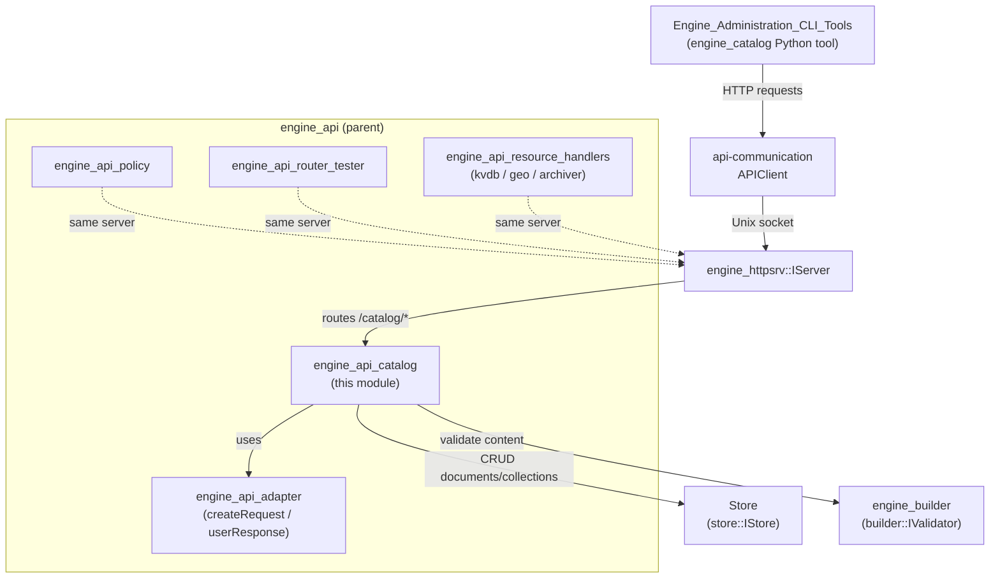
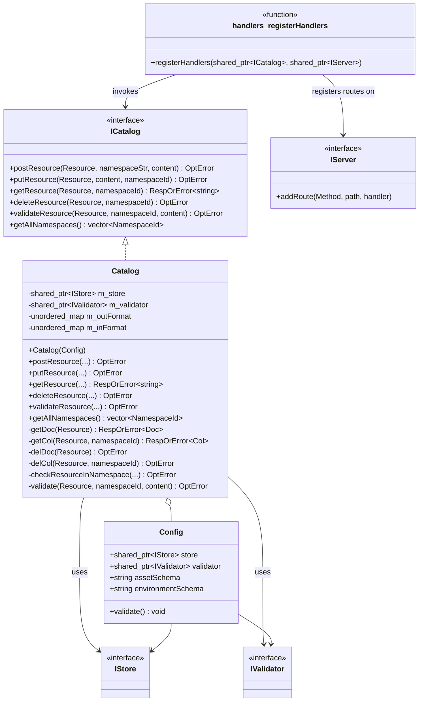
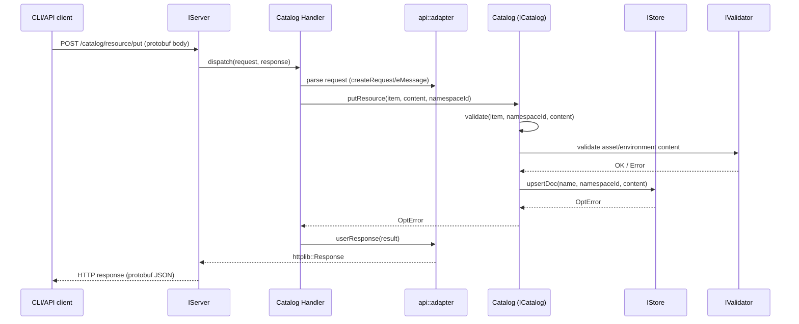
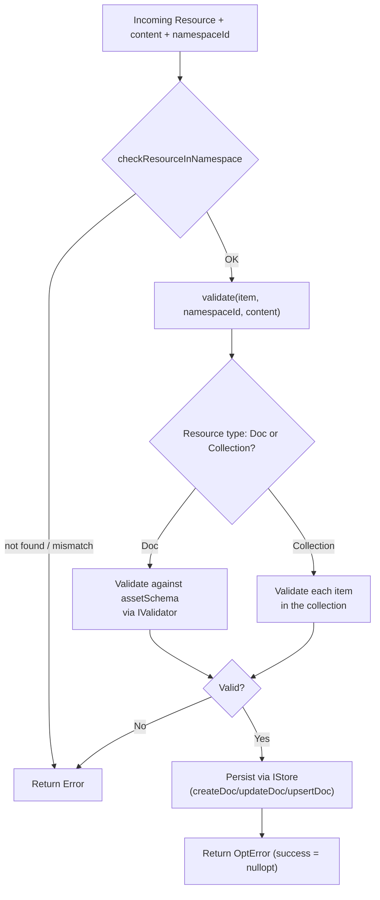
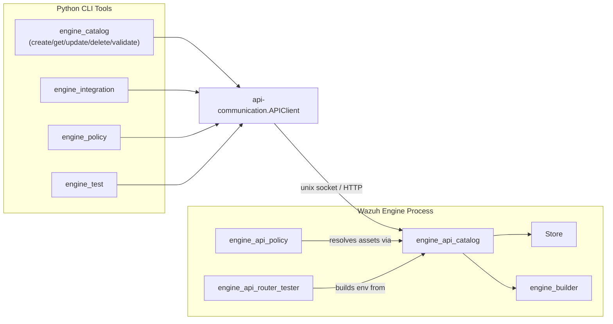

# Engine API Catalog Module

## Introduction

The **`engine_api_catalog`** module implements the HTTP API surface for the Wazuh Engine's **Catalog** subsystem. The Catalog is the component responsible for managing the lifecycle (create, read, update, delete, validate) of all the *content* artifacts that drive the engine's detection and processing logic — decoders, rules, outputs, filters, integrations, schemas, and policies. This module does **not** implement the storage or validation logic itself; instead it exposes the `ICatalog` interface (implemented by the `Catalog` class) through a set of HTTP route handlers that are registered on the engine's internal HTTP server.

This module is a thin, focused layer in the Wazuh Engine's API stack: it translates protobuf-based HTTP requests/responses into calls against the `Catalog`/`ICatalog` interface, delegating the actual persistence to the Store module and content validation to the Builder module's `IValidator` interface.

## Purpose and Core Functionality

The module provides:

1. **`Catalog` class** — the concrete implementation of `ICatalog` that:
   - Manages CRUD operations for catalog **resources** (a `Resource` identifies a document or a collection, e.g., a decoder, a rule, a schema, scoped to a namespace).
   - Delegates persistence to an injected `IStore` implementation (see [Wazuh_Engine_Core_(C++).md](Wazuh_Engine_Core_(C++).md), `Store` component).
   - Delegates content validation to an injected `IValidator` implementation (see `engine_builder` sub-module in [Wazuh_Engine_Core_(C++).md](Wazuh_Engine_Core_(C++).md)).
   - Converts between different content formats (JSON, YAML) using format converter maps (`m_inFormat` / `m_outFormat`).
   - Enumerates available namespaces.

2. **`Config` struct** — the dependency-injection configuration object used to construct a `Catalog` instance. It bundles:
   - A `store::IStore` shared pointer (storage backend).
   - A `builder::IValidator` shared pointer (asset/environment validator).
   - The schema names used to validate assets and environments.

3. **`registerHandlers` function** — wires up the Catalog's HTTP API by registering a fixed set of POST routes on an `httpsrv::IServer` instance. Each route handler adapts an incoming protobuf request into a call on the `ICatalog` interface and serializes the result back into a protobuf-based HTTP response.

## Architecture Overview

The module sits inside `engine_api`, a child of the broader `engine_api` API layer within the [Wazuh_Engine_Core_(C++)](Wazuh_Engine_Core_(C++).md) module. It has three primary axes of interaction:

- **Upstream**: HTTP requests arrive via the engine's `IServer` (see `engine_httpsrv`), routed to Catalog handlers.
- **Downstream — Storage**: `Catalog` reads/writes documents and collections through `store::IStore` (implemented by `Store`, see `Store` sub-module in [Wazuh_Engine_Core_(C++).md](Wazuh_Engine_Core_(C++).md)).
- **Downstream — Validation**: `Catalog` validates asset/environment content through `builder::IValidator` (see `engine_builder` sub-module in [Wazuh_Engine_Core_(C++).md](Wazuh_Engine_Core_(C++).md)).
- **Sibling modules**: Other API sub-modules such as `engine_api_policy`, `engine_api_router_tester`, and `engine_api_resource_handlers` follow the identical handler-registration pattern using the shared `api/adapter` utilities (`createRequest`/`userResponse`), documented in `engine_api_adapter` (part of [Wazuh_Engine_Core_(C++).md](Wazuh_Engine_Core_(C++).md)).

## Component Relationships

## Registered API Routes

`registerHandlers` binds six POST endpoints on the injected `IServer`. Every handler is created via a factory function (`resourcePost`, `resourceGet`, etc.) that closes over the shared `ICatalog` instance, decodes the protobuf request body, invokes the corresponding `ICatalog` method, and encodes the protobuf response.

| Route | Handler factory | ICatalog operation |
|---|---|---|
| `POST /catalog/resource/post` | `resourcePost` | `postResource` — create a new resource inside a collection |
| `POST /catalog/resource/get` | `resourceGet` | `getResource` — read a document or collection |
| `POST /catalog/resource/delete` | `resourceDelete` | `deleteResource` — remove a document or collection |
| `POST /catalog/resource/put` | `resourcePut` | `putResource` — update an existing resource |
| `POST /catalog/resource/validate` | `resourceValidate` | `validateResource` — validate content without persisting |
| `POST /catalog/namespaces/get` | `getNamespaces` | `getAllNamespaces` — list all known namespaces |

## Data Flow: Resource Validation and Persistence

The `Catalog::putResource` / `postResource` / `validateResource` operations follow a common internal flow, centered on the private `validate` method and namespace-aware helpers:

## Key Types

### `Config`
Dependency bundle required to construct a `Catalog`:
- `store` — pointer to the storage backend (`store::IStore`).
- `validator` — pointer to the content validator (`builder::IValidator`).
- `assetSchema` / `environmentSchema` — schema names used during validation.
- `validate()` — asserts that the configuration itself is well-formed (non-null pointers, non-empty schema names) before being used to construct a `Catalog`.

### `Catalog`
Concrete `ICatalog` implementation. Internally maintains two format-conversion maps (`m_inFormat`, `m_outFormat`) keyed by `Resource::Format` (e.g., JSON, YAML) that convert between the wire format and the internal `json::Json` representation used by the store. Private helpers (`getDoc`, `getCol`, `delDoc`, `delCol`, `checkResourceInNamespace`) centralize namespace-aware resource resolution and error handling, which are reused across the public `ICatalog` methods.

### `registerHandlers`
A free function template that takes a `shared_ptr<ICatalog>` and a `shared_ptr<httpsrv::Server>` and registers the six catalog routes described above. This function is invoked once during engine API server bootstrap (alongside sibling `registerHandlers` calls from `engine_api_policy`, `engine_api_router_tester`, and `engine_api_resource_handlers`).

## How This Module Fits Into the Overall System

- **Parent context**: `engine_api_catalog` is a child of `engine_api`, which aggregates all HTTP-facing API sub-modules of the Wazuh Engine (`engine_api_adapter`, `engine_api_policy`, `engine_api_router_tester`, `engine_api_resource_handlers`). See [Wazuh_Engine_Core_(C++).md](Wazuh_Engine_Core_(C++).md) for the full engine architecture.
- **Serialization/adapter layer**: Request/response (de)serialization relies on the shared adapter utilities (`createRequest`, `userResponse`) documented under `engine_api_adapter`, part of the same parent module.
- **Storage backend**: All persistence operations delegate to the `Store` class (`store::IStore`), documented in the `Store` sub-module of [Wazuh_Engine_Core_(C++).md](Wazuh_Engine_Core_(C++).md). The `Store` also manages namespace-to-real-name translation, which underlies the Catalog's namespace-scoped operations.
- **Validation backend**: Content validation is delegated to `builder::IValidator`, implemented within the `engine_builder` sub-module of [Wazuh_Engine_Core_(C++).md](Wazuh_Engine_Core_(C++).md) (specifically the `builder_core` component group, e.g., `Builder`, `IBuildCtx`, `Registry`).
- **HTTP transport**: Routes are served by `IServer`, defined in the `engine_httpsrv` sub-module of [Wazuh_Engine_Core_(C++).md](Wazuh_Engine_Core_(C++).md).
- **CLI consumers**: The Catalog HTTP API is the backend for the `engine_catalog` command-line tool (see [Engine_Administration_CLI_Tools_(Python).md](Engine_Administration_CLI_Tools_(Python).md)), which exposes `create`, `delete`, `get`, `update`, and `validate` sub-commands that map 1:1 onto the routes registered by this module. It is also consumed indirectly by higher-level tools such as `engine_integration`, `engine_policy`, and `engine_test` (also documented in [Engine_Administration_CLI_Tools_(Python).md](Engine_Administration_CLI_Tools_(Python).md)) via the shared `api-communication` `APIClient`.
- **Sibling API modules**: `engine_api_policy` manages policy documents (which reference catalog assets), and `engine_api_router_tester` uses catalog-validated assets when building test environments — both rely on the Catalog being available and consistent.

## Related Documentation

- [Wazuh_Engine_Core_(C++).md](Wazuh_Engine_Core_(C++).md) — parent module tree, including `engine_api_adapter`, `engine_api_policy`, `engine_api_router_tester`, `engine_api_resource_handlers`, `engine_builder`, `Store`, and `engine_httpsrv`.
- [Engine_Administration_CLI_Tools_(Python).md](Engine_Administration_CLI_Tools_(Python).md) — Python CLI tools (`engine_catalog`, `engine_integration`, `engine_policy`, `engine_test`) that consume this module's HTTP API.
