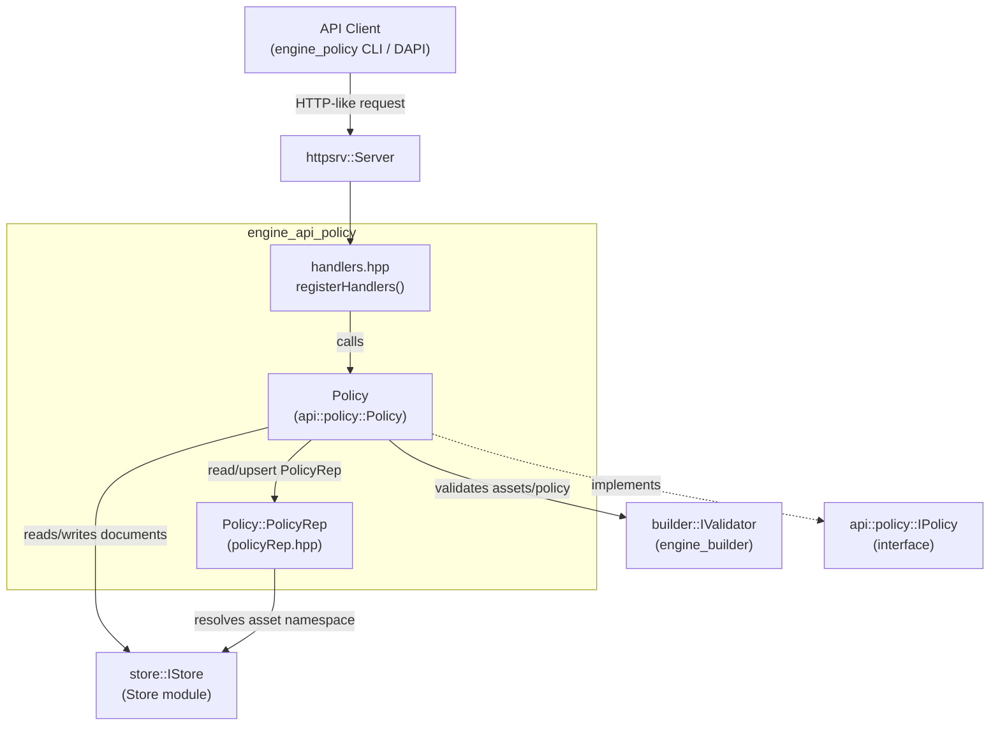
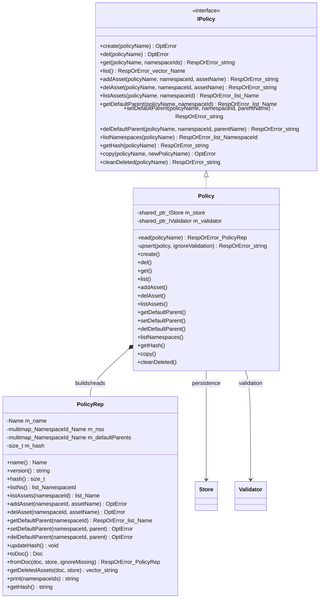
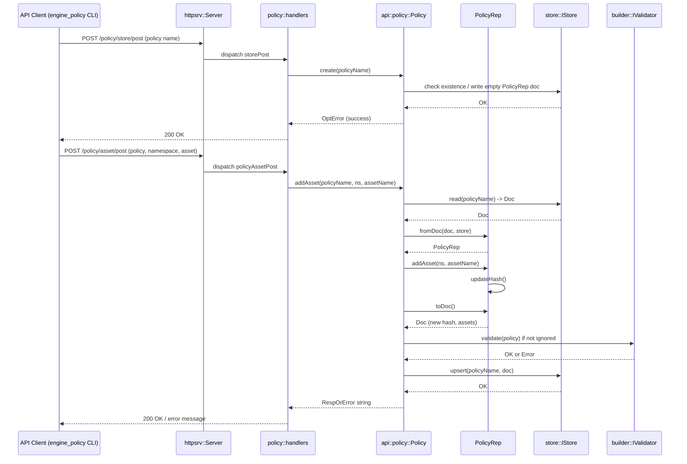
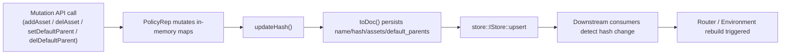

# Engine API Policy Module

## Introduction

The **`engine_api_policy`** module implements the HTTP/RPC-style API surface that exposes **Policy management** capabilities for the Wazuh Engine. A *Policy* is the top-level artifact the engine uses to describe **which assets (decoders, rules, outputs, filters, etc.) are active, in which namespaces, and how they relate to each other** (via default parents). This module is the bridge between the engine's internal `builder`/`store` subsystems and the external tooling (CLI `engine-policy` tool, orchestration scripts, or any API client) that needs to create, inspect, or mutate policies at runtime.

Concretely, the module:

- Registers a set of HTTP-like **route handlers** (`registerHandlers`) that the engine's `httpsrv::Server` dispatches incoming API requests to.
- Implements the **`Policy`** class, which is the concrete implementation of the `api::policy::IPolicy` interface used by those handlers.
- Implements the **`PolicyRep`** PIMPL class, an internal representation of a policy document that knows how to (de)serialize itself to/from the underlying `store::Doc` JSON representation, compute content hashes, and answer namespace/asset/default-parent queries.

This module is a child of [engine_api](engine_api.md) (sibling to `engine_api_catalog`, `engine_api_router_tester`, and `engine_api_resource_handlers`), and it depends heavily on the [engine_builder](engine_builder.md) (for validation and the runtime `IPolicy` used by the router) and on [Store](Store.md) (for persistence of policy documents).

---

## 1. Purpose and Core Functionality

| Capability | Description |
|---|---|
| **Policy CRUD** | Create, delete, copy and list policy documents in the store. |
| **Asset management** | Add/remove assets (by `base::Name`) to/from a policy, scoped to a namespace. |
| **Default parent management** | Configure which asset(s) act as the default parent for a given namespace within a policy (used by the builder to link decoders/rules automatically). |
| **Namespace introspection** | List the namespaces defined inside a policy, and the assets/parents scoped to each. |
| **Hashing** | Every mutation recomputes a content hash of the policy (namespace+asset+default-parent tuples) so that consumers (e.g., the [Router](Router.md) module) can detect changes and trigger reloads. |
| **Cleanup** | `cleanDeleted` removes references to assets that no longer exist in the store (e.g., because the underlying decoder/rule document was deleted from the [engine_api_catalog](engine_api_catalog.md)). |
| **HTTP exposure** | `registerHandlers` wires all the above operations to concrete REST-like routes consumed by the `engine_policy` CLI tool ([Engine_Administration_CLI_Tools_(Python)](Engine_Administration_CLI_Tools_(Python).md)) and other API clients. |

---

## 2. Architecture Overview

The module follows a classic **Handler → Service → Repository (PIMPL)** layering, typical of the other `engine_api_*` sub-modules (see [engine_api_catalog](engine_api_catalog.md) for a very similar pattern):



### Key design points

1. **`Policy` implements `api::policy::IPolicy`**, the abstract interface consumed by the HTTP handlers. This indirection allows the handlers to be unit-tested against a mock implementation.
2. **`PolicyRep` is a private nested class** (`Policy::PolicyRep`) — a PIMPL that encapsulates the actual policy document model:
   - `m_name`: the policy's `base::Name` (includes the version as its last name segment, see `version()`).
   - `m_nss`: a `std::multimap<NamespaceId, base::Name>` mapping each namespace to its member assets.
   - `m_defaultParents`: a `std::multimap<NamespaceId, base::Name>` mapping each namespace to its default parent asset(s).
   - `m_hash`: a `size_t` hash computed over the serialized namespace/asset/parent tuples, used for change detection.
3. **Persistence format**: `PolicyRep::toDoc()` / `PolicyRep::fromDoc()` convert between the in-memory representation and the JSON-like `store::Doc` structure that is actually saved by the [Store](Store.md) module, with the following schema:
   ```yaml
   name: <policy_name>
   hash: <policy_hash>
   assets: [<asset_name>, ...]
   default_parents:
     <namespace_id>: [<parent_name>, ...]
   ```
4. Every mutating operation on `PolicyRep` (`addAsset`, `delAsset`, `setDefaultParent`, `delDefaultParent`) calls `updateHash()` to keep the content hash consistent, which is later exposed via `Policy::getHash()`.

---

## 3. Component Relationships



- **`IPolicy`** (declared in `builder/interface/builder/ipolicy.hpp`, part of [engine_builder](engine_builder.md)) is a *different* interface from the runtime policy expression object used by the [Router](Router.md) (that one exposes `expression()`, `assets()`, etc., for execution). The `api::policy::IPolicy` interface (used by this module's handlers) is the **management-plane** interface — CRUD over policy *definitions*, not the compiled runtime graph.
- **`store::IStore`** and **`store::IStoreReader`** (from the [Store](Store.md) module) are used to load/save policy documents and to resolve which namespace an asset belongs to (`store->getNamespace(assetName)`).
- **`builder::IValidator`** (from [engine_builder](engine_builder.md)) is used by `Policy::upsert` to validate that a modified policy still compiles/validates correctly before persisting it.

---

## 4. HTTP Route Registration

`registerHandlers` (in `handlers.hpp`) is invoked once at engine startup (see [engine_main](engine_main.md) / server bootstrap) to bind all policy-related endpoints onto the shared `httpsrv::Server` instance:

| Route | Handler factory | Purpose |
|---|---|---|
| `POST /policy/store/post` | `storePost` | Create a new policy (`IPolicy::create`) |
| `POST /policy/store/delete` | `storeDelete` | Delete a policy (`IPolicy::del`) |
| `POST /policy/store/get` | `storeGet` | Retrieve a policy's human-readable representation (`IPolicy::get`) |
| `POST /policy/asset/post` | `policyAssetPost` | Add an asset to a policy/namespace (`IPolicy::addAsset`) |
| `POST /policy/asset/delete` | `policyAssetDelete` | Remove an asset from a policy/namespace (`IPolicy::delAsset`) |
| `POST /policy/asset/get` | `policyAssetGet` | List assets in a policy/namespace (`IPolicy::listAssets`) |
| `POST /policy/asset/clean_deleted` | `policyCleanDeleted` | Remove stale/deleted asset references (`IPolicy::cleanDeleted`) |
| `POST /policy/default_parent/get` | `policyDefaultParentGet` | Get default parent(s) for a namespace (`IPolicy::getDefaultParent`) |
| `POST /policy/default_parent/post` | `policyDefaultParentPost` | Set a default parent (`IPolicy::setDefaultParent`) |
| `POST /policy/default_parent/delete` | `policyDefaultParentDelete` | Remove a default parent (`IPolicy::delDefaultParent`) |
| `POST /policy/list` | `policiesGet` | List all policies (`IPolicy::list`) |
| `POST /policy/namespaces/list` | `policyNamespacesGet` | List namespaces in a policy (`IPolicy::listNamespaces`) |

Each `handler factory` (e.g., `storePost(policyManager)`) is a function that captures the shared `IPolicy` instance and returns an `adapter::RouteHandler` — a callable compatible with the generic request/response adapter defined in [engine_api_adapter](engine_api_adapter.md) (`api/adapter/adapter.hpp`, functions `createRequest` / `userResponse`). This keeps `engine_api_policy` decoupled from the low-level HTTP/serialization details, which are handled uniformly across all `engine_api_*` sub-modules.

---

## 5. Data Flow: Creating and Populating a Policy

The following sequence illustrates the typical flow of a client creating a policy and adding an asset to it, showing the interaction across layers:



Key points:
- `Policy::read` internally calls `PolicyRep::fromDoc`, which resolves the namespace of every asset referenced by the policy through `store->getNamespace(assetName)`. If an asset is missing from the store and `ignoreMissing=false`, the whole read fails with a descriptive error listing missing assets — this is what forces users to run `cleanDeleted` after removing catalog items.
- `Policy::upsert` re-validates the policy (unless `ignoreValidation=true`, used internally by `cleanDeleted`) via the `builder::IValidator` before persisting, guaranteeing that only buildable policies are stored.

---

## 6. Policy Document Hashing & Change Detection

Every structural change to a policy (`addAsset`, `delAsset`, `setDefaultParent`, `delDefaultParent`) triggers `PolicyRep::updateHash()`, which:

1. Serializes `namespace:asset;` pairs from `m_nss`.
2. Appends `namespace:parent;` pairs from `m_defaultParents`.
3. Hashes the resulting string with `std::hash<std::string>`.

The resulting hash is:
- Persisted alongside the policy document (`/hash` JSON path).
- Exposed through `Policy::getHash()` / the `/policy/store/get` and dedicated hash queries.
- Used by consumers such as the [Router](Router.md) (`RulesetReloadResponse` in `framework/wazuh/core/analysis.py` on the Python side, or the C++ `EnvironmentBuilder`) to decide whether a policy needs to be recompiled and reloaded into a running environment.



---

## 7. Cleanup Flow (`cleanDeleted`)

Because policies reference assets by name without owning them, an asset can be deleted from the [engine_api_catalog](engine_api_catalog.md) while still being referenced by one or more policies. `Policy::cleanDeleted`:

1. Reads the raw policy `Doc` (bypassing strict validation).
2. Calls `PolicyRep::getDeletedAssets(doc, store)` — a **static** helper that scans the `assets` array and returns the names of assets whose namespace can no longer be resolved (i.e., they no longer exist in the store).
3. Rebuilds the policy with `PolicyRep::fromDoc(doc, store, /*ignoreMissing=*/true)`, which silently skips those broken references.
4. Persists the cleaned policy via `upsert(..., ignoreValidation=true)`.

This is the recommended operational recovery path after deleting decoders/rules that were still wired into an active policy.

---

## 8. Relationship to Other Modules

| Module | Relationship |
|---|---|
| [engine_api](engine_api.md) | Parent module; groups all `engine_api_*` sub-modules including this one, `engine_api_catalog`, `engine_api_router_tester`, `engine_api_adapter`, and `engine_api_resource_handlers`. |
| [engine_api_adapter](engine_api_adapter.md) | Supplies `adapter::RouteHandler`, `createRequest`, `userResponse` used to translate raw HTTP requests into typed calls against `IPolicy`. |
| [engine_builder](engine_builder.md) | Supplies `builder::IValidator` (policy validation) and the *runtime* `IPolicy`/`Policy` classes (`builder/src/policy/policy.hpp`) used to actually compile and execute a policy — distinct from, but built from, the definitions managed here. |
| [Store](Store.md) | Supplies `store::IStore` / `store::IStoreReader` / `store::Doc`, the persistence layer where policy documents (and all other engine artifacts) live. |
| [Router](Router.md) | Consumes compiled policies (built via `engine_builder`, informed by the definitions managed here) to route events through the correct decoder/rule pipeline; policy hash changes managed by this module are a key signal for the Router to reload environments. |
| [Engine_Administration_CLI_Tools_(Python)](Engine_Administration_CLI_Tools_(Python).md) (`engine_policy` tool) | The primary external consumer of the routes registered by this module, providing `create`, `delete`, `get`, `list`, `asset_add`, `asset_delete`, `asset_list`, `asset_clean`, `namespace_get`, `parent_set`, `parent_remove` CLI subcommands that map 1:1 to the handlers described in section 4. |
| [engine_api_catalog](engine_api_catalog.md) | Sibling module managing the individual asset documents (decoders, rules, outputs) referenced by policies; deletions there are the reason `cleanDeleted` exists in this module. |

---

## 9. Summary

`engine_api_policy` is the **management API for policy definitions** in the Wazuh Engine. It cleanly separates:
- **Transport/handler concerns** (`handlers.hpp`, delegated to [engine_api_adapter](engine_api_adapter.md) and `httpsrv`),
- **Business logic** (`Policy` class implementing `api::policy::IPolicy`), and
- **Data modeling/persistence** (`PolicyRep`, backed by [Store](Store.md)),

while integrating with [engine_builder](engine_builder.md) for validation and ultimately feeding the [Router](Router.md) with the policy definitions it needs to build and execute runtime environments.
