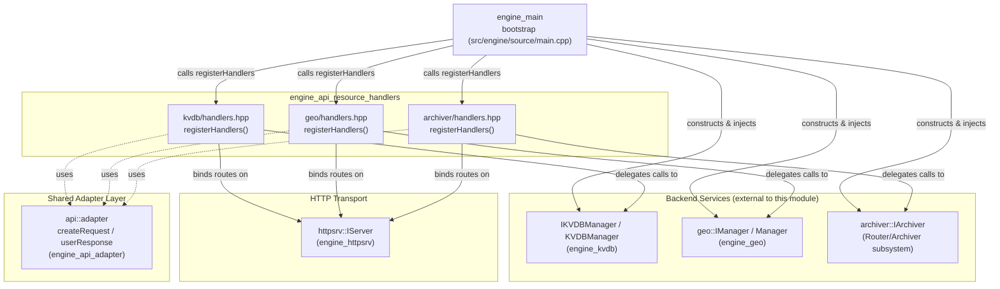
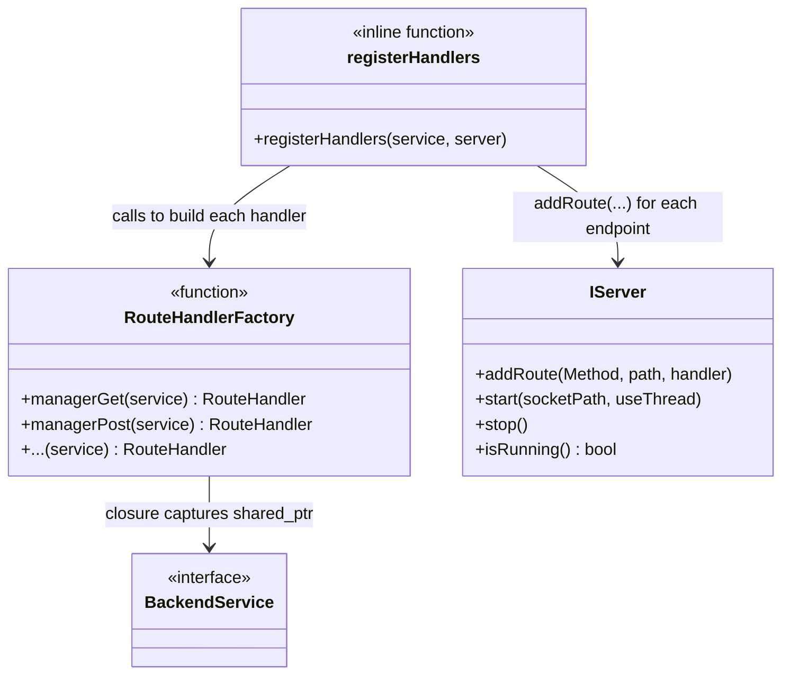
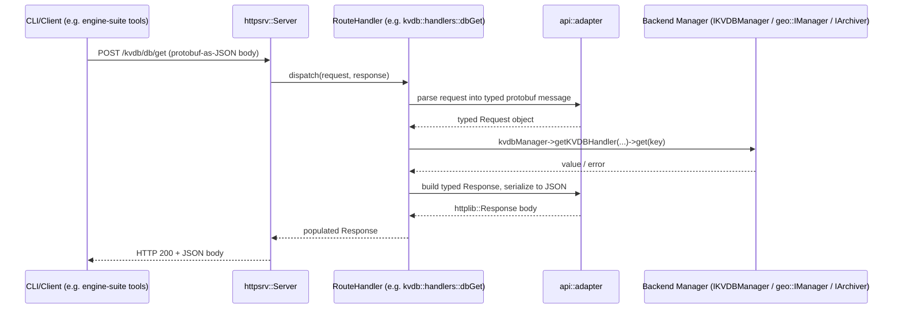
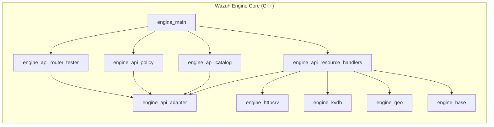
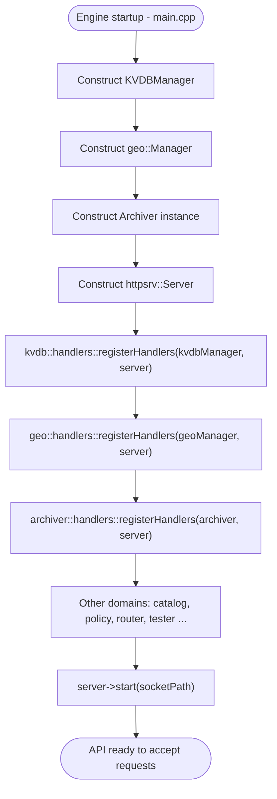

# Engine API Resource Handlers

## Introduction

The **Engine API Resource Handlers** module is a thin, focused integration layer inside the Wazuh Engine (C++) that exposes three independent backend subsystems — the **Key-Value Database (KVDB) manager**, the **GeoIP database manager**, and the **Event Archiver** — as HTTP/Unix-socket API routes. It does not implement business logic itself; instead, it wires together already-existing manager/service interfaces (`IKVDBManager`, `geo::IManager`, `archiver::IArchiver`) with the Engine's generic HTTP server (`IServer`) through a common `registerHandlers()` convention shared across all Engine API sub-modules.

This module is one of several sibling "resource handler" registration units under [engine_api](engine_api.md) (the parent grouping that also includes `engine_api_catalog`, `engine_api_policy`, and `engine_api_router_tester`). Each sibling follows the identical pattern: define route handler factory functions that close over a shared backend service pointer, and expose a single `registerHandlers(...)` inline function that mounts those routes onto the server.

## Purpose and Scope

| Concern | Description |
|---|---|
| **What it does** | Registers HTTP POST routes for KVDB CRUD/search operations, GeoIP database management operations, and Archiver activate/deactivate/status operations. |
| **What it does NOT do** | Implement KVDB storage (see [engine_kvdb](engine_kvdb.md)), GeoIP database resolution (see [engine_geo](engine_geo.md)), or event archiving logic — those live in their own modules. |
| **Consumers** | The Engine's main process bootstrap (`engine_main`), which constructs the manager instances and calls `registerHandlers` for every API sub-domain to build the full HTTP API surface. |
| **Protocol** | All routes are `POST`, request/response bodies are Protobuf messages serialized to/from JSON via the shared `api::adapter` utilities. |

## Architecture Overview

## Component Breakdown

### 1. KVDB Handlers (`api/kvdb/handlers.hpp`)

Registers two families of routes against a shared `IKVDBManager`:

- **Manager-level routes** (database lifecycle):
  - `POST /kvdb/manager/get` — `managerGet`: list/query available KVDB databases.
  - `POST /kvdb/manager/post` — `managerPost`: create a new database.
  - `POST /kvdb/manager/delete` — `managerDelete`: delete a database.
  - `POST /kvdb/manager/dump` — `managerDump`: dump contents of a database bound to the default `"kvdb"` scope.
- **DB-level routes** (key/value record operations, all bound to the `"kvdb"` scope):
  - `POST /kvdb/db/get` — `dbGet`: retrieve a key's value.
  - `POST /kvdb/db/delete` — `dbDelete`: remove a key.
  - `POST /kvdb/db/put` — `dbPut`: insert/update a key-value pair.
  - `POST /kvdb/db/search` — `dbSearch`: prefix/pattern search over keys.

Pagination defaults are defined here as module-level constants: `DEFAULT_HANDLER_PAGE = 1` and `DEFAULT_HANDLER_RECORDS = 50`, used by list/search handlers.

The actual manager implementation (`KVDBManager`, backed by RocksDB column families) lives in [engine_kvdb](engine_kvdb.md); this module only adapts its public `IKVDBManager` interface to HTTP.

### 2. Geo Handlers (`api/geo/handlers.hpp`)

Registers routes against a shared `geo::IManager`:

- `POST /geo/db/add` — `addDb`: register a local MaxMind-format GeoIP database file with the manager.
- `POST /geo/db/del` — `delDb`: remove a registered database.
- `POST /geo/db/list` — `listDb`: list all registered databases and their types (ASN, City, etc.).
- `POST /geo/db/remoteUpsert` — `remoteUpsertDb`: download a database (and its hash) from a remote URL and upsert it into the manager, verifying integrity.

The underlying `Manager` (implementing `geo::IManager`) tracks databases in an in-memory map guarded by a `shared_mutex`, persists metadata through an `IStoreInternal` store, and delegates downloads to an `IDownloader`. Full details are in [engine_geo](engine_geo.md).

### 3. Archiver Handlers (`api/archiver/handlers.hpp`)

Registers routes against a shared `archiver::IArchiver`:

- `POST /archiver/activate` — `activateArchiver`: enable raw event archiving.
- `POST /archiver/deactivate` — `deactivateArchiver`: disable raw event archiving.
- `POST /archiver/status` — `getArchiverStatus`: query whether archiving is currently active.

This is the smallest of the three handler sets, reflecting the simple on/off/status nature of the Archiver component.

## Common Design Pattern

All three files follow an identical structural convention, which is a convention shared with sibling registration modules (`engine_api_catalog`, `engine_api_policy`, `engine_api_router_tester`):

1. **Factory functions** (`managerGet`, `addDb`, `activateArchiver`, etc.) each return an `adapter::RouteHandler` — effectively a closure binding the shared backend service pointer (`std::shared_ptr<IKVDBManager>`, `std::shared_ptr<geo::IManager>`, `std::shared_ptr<archiver::IArchiver>`) to a request/response handling function.
2. **`registerHandlers(...)`** is the single public entry point per file. It is declared `inline` (header-only) and simply calls `server->addRoute(httpsrv::Method::POST, "<path>", <factoryCall>)` for every endpoint in that domain.
3. The actual request parsing/response serialization is delegated to `api::adapter` (see `engine_api_adapter`), specifically the `createRequest`/`userResponse` helpers that convert between Protobuf messages and the wire JSON format used over the Engine's HTTP/Unix-socket transport (`engine_httpsrv`).

## Data Flow: Request Lifecycle

## Integration with the Wider Engine

- **Parent module**: [engine_api](engine_api.md) — groups all API resource registration sub-modules (adapter, catalog, policy, router/tester, and this module).
- **Direct dependencies**:
  - [engine_api_adapter](engine_api_adapter.md) — shared request/response (de)serialization helpers (`createRequest`, `userResponse`).
  - [engine_httpsrv](engine_httpsrv.md) — the `IServer` abstraction that this module's handlers are mounted onto.
  - [engine_kvdb](engine_kvdb.md) — provides `IKVDBManager`/`KVDBManager`, the backend for all `/kvdb/*` routes.
  - [engine_geo](engine_geo.md) — provides `geo::IManager`/`Manager`, the backend for all `/geo/*` routes.
  - [engine_base](engine_base.md) — common utilities (`base::Error`, `base::OptError`, `base::RespOrError`) used throughout the backend interfaces.
- **Sibling modules** (same parent, same registration pattern): [engine_api_catalog](engine_api_catalog.md), [engine_api_policy](engine_api_policy.md), [engine_api_router_tester](engine_api_router_tester.md).
- **CLI tooling that consumes these routes**: the Python `engine-suite` tools (`engine_kvdb`, `engine_geo`) documented in [Engine_Administration_CLI_Tools_(Python)](Engine_Administration_CLI_Tools_(Python).md) issue HTTP requests to exactly these endpoints via `api-communication`'s `APIClient`.

## API Route Reference

| Domain | Method | Route | Handler Function | Backend Call |
|---|---|---|---|---|
| KVDB | POST | `/kvdb/manager/get` | `managerGet` | `IKVDBManager::listDBs` |
| KVDB | POST | `/kvdb/manager/post` | `managerPost` | `IKVDBManager::createDB` |
| KVDB | POST | `/kvdb/manager/delete` | `managerDelete` | `IKVDBManager::deleteDB` |
| KVDB | POST | `/kvdb/manager/dump` | `managerDump` | `IKVDBManager::getKVDBHandler` + dump |
| KVDB | POST | `/kvdb/db/get` | `dbGet` | `IKVDBHandler::get` |
| KVDB | POST | `/kvdb/db/delete` | `dbDelete` | `IKVDBHandler::delete` |
| KVDB | POST | `/kvdb/db/put` | `dbPut` | `IKVDBHandler::set` |
| KVDB | POST | `/kvdb/db/search` | `dbSearch` | `IKVDBHandler::search`-like operation |
| Geo | POST | `/geo/db/add` | `addDb` | `geo::IManager::addDb` |
| Geo | POST | `/geo/db/del` | `delDb` | `geo::IManager::removeDb` |
| Geo | POST | `/geo/db/list` | `listDb` | `geo::IManager::listDbs` |
| Geo | POST | `/geo/db/remoteUpsert` | `remoteUpsertDb` | `geo::IManager::remoteUpsertDb` |
| Archiver | POST | `/archiver/activate` | `activateArchiver` | `IArchiver` activate |
| Archiver | POST | `/archiver/deactivate` | `deactivateArchiver` | `IArchiver` deactivate |
| Archiver | POST | `/archiver/status` | `getArchiverStatus` | `IArchiver` status query |

## Registration Process Flow

## Key Design Notes

- **Header-only registration**: All `registerHandlers` functions are declared `inline` inside headers, allowing them to be included and invoked directly from the Engine's single bootstrap translation unit (`main.cpp`) without requiring separate compilation units per domain.
- **Dependency inversion via interfaces**: Handlers depend only on abstract interfaces (`IKVDBManager`, `geo::IManager`, `archiver::IArchiver`), not concrete implementations, making the handler logic independently testable with mocks.
- **Uniform transport contract**: Every route uses `httpsrv::Method::POST`, even for read-only operations (e.g., `get`, `list`), consistent with the Engine API's convention of always sending structured Protobuf-JSON payloads in the request body rather than using query parameters.
- **Scope binding for KVDB**: All `/kvdb/db/*` routes are pre-bound to a single scope name (`"kvdb"`), simplifying handler signatures — the manager's scope concept (see [engine_kvdb](engine_kvdb.md)) is an internal implementation detail not exposed via distinct routes.

## Related Documentation

- [engine_api](engine_api.md) — parent module and shared API registration conventions.
- [engine_api_adapter](engine_api_adapter.md) — request/response adaptation helpers used by all handlers.
- [engine_api_catalog](engine_api_catalog.md), [engine_api_policy](engine_api_policy.md), [engine_api_router_tester](engine_api_router_tester.md) — sibling resource handler modules following the same pattern.
- [engine_kvdb](engine_kvdb.md) — KVDB manager and handler implementation details.
- [engine_geo](engine_geo.md) — GeoIP manager, downloader, and locator implementation details.
- [engine_httpsrv](engine_httpsrv.md) — the underlying HTTP/Unix-socket server abstraction.
- [engine_base](engine_base.md) — shared error-handling and result types (`base::OptError`, `base::RespOrError`).
- [Engine_Administration_CLI_Tools_(Python)](Engine_Administration_CLI_Tools_(Python).md) — `engine_kvdb` and `engine_geo` CLI tools that act as clients of these routes.
